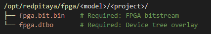
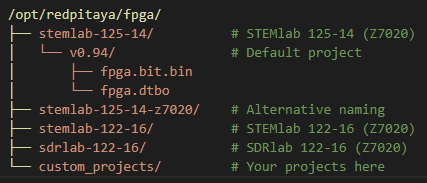

.. _fpga_advanced_loading:

##################################
高级 FPGA 加载
##################################

本指南介绍高级 FPGA 加载场景，包括自定义比特流、设备树覆盖、部分重配置、实用工作流和故障排除。

当前 ``RedPitaya-FPGA`` master（Vivado 2025.1 + Vitis/XSCT 设备树流程）生成的构建输出如下：

- 比特流产物：``prj/<PRJ>/out/red_pitaya.bin``
- 设备树覆盖产物：``prj/<PRJ>/out/fpga.dtbo``

在 Red Pitaya 上加载时，请使用 ``overlay.sh`` 所要求的项目文件名：

- ``fpga.bit.bin``
- ``fpga.dtbo``

.. seealso::

    **前置条件:**
    
    开始高级主题之前，请先熟悉：
    
    - :ref:`fpga_reprogramming` - FPGA 基础加载
    - :ref:`fpga_boot_loading` - 使 FPGA 在启动时加载
    - :ref:`device_tree` - 设备树配置
    - :ref:`signal_mapping` - 硬件信号连接

.. contents:: 目录
    :local:
    :depth: 2
    :backlinks: top

|

**********************************
自定义 FPGA 加载
**********************************

除了加载 Red Pitaya 内置的 FPGA 项目外，还可以使用自定义比特流、设备树覆盖和硬件配置加载完整的自定义 FPGA 镜像。

仅加载自定义比特流
==============================

如果有自定义比特流但希望使用 Red Pitaya 的标准设备树：

.. tabs::

    .. tab:: OS 2.07-43 或更新版本

        .. code-block:: bash

            # Load bitstream only (keeps current device tree)
            redpitaya> fpgautil -b /path/to/your/custom.bit.bin

    .. tab:: OS 2.00 至 2.05-37

        .. code-block:: bash

            # Load using fpgautil (requires .bin format)
            redpitaya> fpgautil -b /path/to/your/custom.bit.bin
    
    .. tab:: OS 1.04 或更早版本

        .. code-block:: bash

            # Direct bitstream loading to configuration device
            redpitaya> cat /path/to/your/custom.bit > /dev/xdevcfg

.. note::

    **对于 OS 2.07+:**
    
    - 使用 ``fpgautil -b`` 加载比特流而不更改设备树
    - 使用 ``overlay.sh`` 同时加载比特流和设备树
    - 当硬件连接保持不变时，仅加载比特流很有用

|

使用设备树加载自定义比特流
==========================================

当自定义 FPGA 的硬件配置不同于标准 v0.94 设计时：

**前置条件:**

- 自定义比特流文件（``fpga.bit.bin``）
- 自定义设备树覆盖（``fpga.dtbo``）
- 了解硬件修改

|

**选项 1: 使用 overlay.sh (OS 2.07+)**

.. code-block:: bash

    # Step 1: Create project directory
    redpitaya> mkdir -p /opt/redpitaya/fpga/$(monitor -f)/my_custom_project
    
    # Step 2: Copy files with exact names
    redpitaya> cp /path/to/custom_bitstream.bit.bin \
                  /opt/redpitaya/fpga/$(monitor -f)/my_custom_project/fpga.bit.bin
    redpitaya> cp /path/to/custom_devicetree.dtbo \
                  /opt/redpitaya/fpga/$(monitor -f)/my_custom_project/fpga.dtbo
    
    # Step 3: Load both together
    redpitaya> /opt/redpitaya/sbin/overlay.sh v0.94 my_custom_project

.. important::

    文件**必须**命名为：
    
    - ``fpga.bit.bin`` - FPGA bitstream
    - ``fpga.dtbo`` - 设备树覆盖层
    
    ``overlay.sh`` 脚本要求使用这些确切名称。

|

**选项 2：手动加载（OS 2.00 至 2.05-37）**

.. code-block:: bash

    # Step 1: Load bitstream
    redpitaya> fpgautil -b /path/to/custom_bitstream.bit.bin
    
    # Step 2: Load device tree overlay
    redpitaya> mkdir -p /sys/kernel/config/device-tree/overlays/my_custom
    redpitaya> cat /path/to/custom_devicetree.dtbo > \
                   /sys/kernel/config/device-tree/overlays/my_custom/dtbo

|

**选项 3：直接加载（OS 1.04 或更早版本）**

.. code-block:: bash

    # Load bitstream directly
    redpitaya> cat /path/to/custom_bitstream.bit > /dev/xdevcfg

.. note::

    OS 1.04 及更早版本不支持运行时加载设备树覆盖层。修改设备树需要重新编译设备树或使用自定义内核。

|

FPGA 部分重配置
=============================

部分重配置允许在不重新加载整个设计的情况下更新 FPGA 的部分区域。

.. note::

    是否支持部分重配置取决于 FPGA 设计。Red Pitaya 默认设计不支持部分重配置。
    必须使用 Vivado 的 PR 流程专门设计 FPGA 项目以支持部分重配置。

**能力:**

- 更新特定 FPGA 区域中的逻辑
- 保持未更改区域中的状态
- 配置速度比完整重新加载更快
- 动态适应硬件

**限制:**

- 需要支持 PR 的 Vivado 许可证
- 复杂的设计约束
- 并非所有设计都能使用 PR
- Red Pitaya 默认设计不支持 PR

有关实现 partial reconfiguration, 请参阅：

* **当前工作流** - `Vivado 2025.1 Design Suite User Guide: Dynamic Function eXchange (UG909) <https://docs.amd.com/r/en-US/ug909-vivado-partial-reconfiguration>`_
* **旧版工作流** - `Vivado 2020.1 Design Suite User Guide: Dynamic Function eXchange (UG909) <https://docs.amd.com/v/u/2020.1-English/ug909-vivado-partial-reconfiguration>`_

|

**********************************
实用示例和工作流
**********************************

本节演示各种场景下 FPGA 加载的实际工作流。

示例 1: 快速切换 FPGA 项目
========================================

Rapidly switch between multiple pre-built FPGA 项目 during development:

**设置:**

.. code-block:: bash

    # Organize projects in directories
    redpitaya> mkdir -p /root/fpga_projects/{adc_dac,scope,signal_gen}
    
    # Copy project files
    redpitaya> cp adc_dac_design/* /root/fpga_projects/adc_dac/
    redpitaya> cp scope_design/* /root/fpga_projects/scope/
    redpitaya> cp signal_gen_design/* /root/fpga_projects/signal_gen/

**切换脚本:**

.. code-block:: bash

    #!/bin/bash
    # save as /root/switch_fpga.sh
    
    PROJECT=$1
    MODEL=$(/opt/redpitaya/bin/monitor -f)
    
    if [ -z "$PROJECT" ]; then
        echo "Usage: $0 <project_name>"
        echo "Available projects:"
        ls -1 /root/fpga_projects/
        exit 1
    fi
    
    PROJ_DIR="/root/fpga_projects/$PROJECT"
    
    if [ ! -d "$PROJ_DIR" ]; then
        echo "Project not found: $PROJECT"
        exit 1
    fi
    
    # Load the project (OS 2.07+)
    /opt/redpitaya/sbin/overlay.sh v0.94 "../../root/fpga_projects/$PROJECT"
    
    # Verify
    echo "Loaded FPGA project: $PROJECT"
    cat /tmp/loaded_fpga.inf

**用法:**

.. code-block:: bash

    # Make executable
    redpitaya> chmod +x /root/switch_fpga.sh
    
    # Switch to scope project
    redpitaya> ./switch_fpga.sh scope
    
    # Switch to signal generator
    redpitaya> ./switch_fpga.sh signal_gen

|

示例 2: 开发迭代工作流
==========================================

频繁更新和测试 FPGA 设计时，可简化开发周期：

**开发脚本:**

.. code-block:: bash

    #!/bin/bash
    # save as /root/upload_fpga.sh
    
    # Configuration
    DEV_HOST="developer-pc"
    DEV_USER="username"
    DEV_PATH="/home/username/RedPitaya-FPGA/prj/v0.94/out"
    RP_PATH="/root/test_fpga"
    
    # Create directory if needed
    mkdir -p $RP_PATH
    
    # Download latest bitstream from development PC
    echo "Downloading latest FPGA files from $DEV_HOST..."
    scp ${DEV_USER}@${DEV_HOST}:${DEV_PATH}/red_pitaya.bin \
        $RP_PATH/fpga.bit.bin
    
    scp ${DEV_USER}@${DEV_HOST}:${DEV_PATH}/fpga.dtbo \
        $RP_PATH/fpga.dtbo
    
    # Load the new FPGA
    echo "Loading FPGA..."
    /opt/redpitaya/sbin/overlay.sh v0.94 "../../root/test_fpga"
    
    # Verify
    echo "FPGA loaded successfully:"
    cat /tmp/loaded_fpga.inf
    
    # Optional: Run automatic tests
    if [ -f "/root/test_fpga.sh" ]; then
        echo "Running automated tests..."
        /root/test_fpga.sh
    fi

**用法:**

.. code-block:: bash

    # Make executable
    redpitaya> chmod +x /root/upload_fpga.sh
    
    # Run after each Vivado build
    redpitaya> ./upload_fpga.sh

**开发流程:**

1. 在 Vivado 中修改 FPGA 设计
2. 构建比特流
3. 运行 ``upload_fpga.sh`` 在 Red Pitaya 上
4. 测试功能
5. 重复

|

示例 3: 测试自定义 FPGA 设计
======================================

使用自动验证系统地测试自定义 FPGA 设计：

**测试脚本:**

.. code-block:: bash

    #!/bin/bash
    # save as /root/test_custom_fpga.sh
    
    echo "======================================"
    echo "Custom FPGA Testing Script"
    echo "======================================"
    
    # Load custom FPGA
    echo "Loading custom FPGA..."
    /opt/redpitaya/sbin/overlay.sh v0.94 my_custom_project
    
    if [ $? -ne 0 ]; then
        echo "ERROR: FPGA loading failed"
        exit 1
    fi
    
    sleep 2
    
    # Verify device tree loaded
    echo "Checking device tree..."
    if [ ! -d "/sys/kernel/config/device-tree/overlays/my_custom_project" ]; then
        echo "ERROR: Device tree overlay not found"
        exit 1
    fi
    
    # Test memory-mapped registers
    echo "Testing register access..."
    /opt/redpitaya/bin/monitor 0x40000000
    
    if [ $? -ne 0 ]; then
        echo "ERROR: Cannot access FPGA registers"
        exit 1
    fi
    
    # Test specific functionality
    echo "Running functional tests..."
    
    # Example: Test LED control
    /opt/redpitaya/bin/monitor 0x40000030 0xFF  # Turn on LEDs
    sleep 1
    /opt/redpitaya/bin/monitor 0x40000030 0x00  # Turn off LEDs
    
    # Example: Test ADC/DAC loopback
    # (add your specific tests here)
    
    echo "======================================"
    echo "All tests passed!"
    echo "======================================"

|

示例 4: 管理多个配置
============================================

维护多个 FPGA 配置并提供简便选择：

**配置管理器:**

.. code-block:: bash

    #!/bin/bash
    # save as /root/fpga_manager.sh
    
    CONFIG_DIR="/opt/redpitaya/fpga/$(monitor -f)"
    
    case "$1" in
        list)
            echo "Available FPGA configurations:"
            ls -1 $CONFIG_DIR | grep -v "v0.94"
            ;;
        
        load)
            if [ -z "$2" ]; then
                echo "Usage: $0 load <config_name>"
                exit 1
            fi
            echo "Loading configuration: $2"
            /opt/redpitaya/sbin/overlay.sh v0.94 "$2"
            ;;
        
        info)
            echo "Currently loaded FPGA:"
            cat /tmp/loaded_fpga.inf
            echo ""
            echo "Available configurations:"
            ls -1 $CONFIG_DIR | grep -v "v0.94"
            ;;
        
        backup)
            if [ -z "$2" ]; then
                echo "Usage: $0 backup <config_name>"
                exit 1
            fi
            BACKUP_DIR="/root/fpga_backups/$(date +%Y%m%d_%H%M%S)_$2"
            mkdir -p "$BACKUP_DIR"
            cp -r "$CONFIG_DIR/$2"/* "$BACKUP_DIR/"
            echo "Backup created: $BACKUP_DIR"
            ;;
        
        *)
            echo "FPGA Configuration Manager"
            echo "Usage: $0 {list|load|info|backup} [config_name]"
            echo ""
            echo "Commands:"
            echo "  list           - List available configurations"
            echo "  load <name>    - Load a configuration"
            echo "  info           - Show current configuration and available options"
            echo "  backup <name>  - Backup a configuration"
            ;;
    esac

**用法:**

.. code-block:: bash

    redpitaya> ./fpga_manager.sh list
    redpitaya> ./fpga_manager.sh load my_project
    redpitaya> ./fpga_manager.sh info
    redpitaya> ./fpga_manager.sh backup my_project

|

示例 5: 自定义设备树工作流
=======================================

开发并测试自定义设备树覆盖：

**步骤 1: 创建设备树源文件 (.dts)**

.. code-block:: bash

    redpitaya> nano my_custom_overlay.dts

示例 device tree source:

.. code-block:: dts

    /dts-v1/;
    /plugin/;
    
    / {
        fragment@0 {
            target = <&fpga_full>;
            __overlay__ {
                firmware-name = "my_custom_project/fpga.bit.bin";
            };
        };
        
        fragment@1 {
            target = <&amba>;
            __overlay__ {
                my_custom_device@40000000 {
                    compatible = "my-company,my-device";
                    reg = <0x40000000 0x10000>;
                    interrupt-parent = <&intc>;
                    interrupts = <0 29 4>;
                };
            };
        };
    };

**步骤 2: 编译设备树覆盖**

.. code-block:: bash

    # Install device tree compiler if needed
    redpitaya> apt-get update
    redpitaya> apt-get install device-tree-compiler
    
    # Compile .dts to .dtbo
    redpitaya> dtc -@ -I dts -O dtb -o my_custom_overlay.dtbo my_custom_overlay.dts

**步骤 3: 测试覆盖**

.. code-block:: bash

    # Copy to project directory
    redpitaya> cp my_custom_overlay.dtbo \
                  /opt/redpitaya/fpga/$(monitor -f)/my_project/fpga.dtbo
    
    # Load with overlay.sh
    redpitaya> /opt/redpitaya/sbin/overlay.sh v0.94 my_project
    
    # Verify device tree changes
    redpitaya> ls /sys/kernel/config/device-tree/overlays/

**步骤 4: 验证硬件注册**

.. code-block:: bash

    # Check if device registered
    redpitaya> ls /sys/bus/platform/devices/
    
    # Check kernel messages
    redpitaya> dmesg | tail -20

|

示例 6: 自动化 CI/CD 集成
=======================================

将 FPGA 测试集成到持续集成/部署流水线：

**CI 测试脚本（用于 Jenkins、GitLab CI 等）：**

.. code-block:: bash

    #!/bin/bash
    # ci_test_fpga.sh - Run on Red Pitaya hardware test station
    
    set -e  # Exit on any error
    
    # Configuration
    BITSTREAM_URL="$1"
    DEVICETREE_URL="$2"
    TEST_DIR="/root/ci_test_$$"
    
    echo "CI/CD FPGA Test Pipeline"
    echo "========================"
    
    # Cleanup function
    cleanup() {
        rm -rf "$TEST_DIR"
    }
    trap cleanup EXIT
    
    # Download artifacts
    echo "Downloading build artifacts..."
    mkdir -p "$TEST_DIR"
    wget -q "$BITSTREAM_URL" -O "$TEST_DIR/fpga.bit.bin"
    wget -q "$DEVICETREE_URL" -O "$TEST_DIR/fpga.dtbo"
    
    # Load FPGA
    echo "Loading FPGA..."
    /opt/redpitaya/sbin/overlay.sh v0.94 "../../root/ci_test_$$"
    
    # Verify loading
    if ! grep -q "ci_test_$$" /tmp/loaded_fpga.inf; then
        echo "FAIL: FPGA did not load correctly"
        exit 1
    fi
    
    # Run hardware tests
    echo "Running hardware tests..."
    python3 /root/hardware_tests.py
    
    # Check test results
    if [ $? -eq 0 ]; then
        echo "PASS: All tests successful"
        exit 0
    else
        echo "FAIL: Tests failed"
        exit 1
    fi

**GitLab CI 配置 (.gitlab-ci.yml):**

.. code-block:: yaml

    stages:
      - build
      - test
    
    build_fpga:
      stage: build
      script:
          - make PRJ=v0.94 MODEL=Z10
      artifacts:
        paths:
          - prj/v0.94/out/red_pitaya.bin
          - prj/v0.94/out/fpga.dtbo
    
    test_hardware:
      stage: test
      script:
        - ssh root@redpitaya "bash ci_test_fpga.sh 
          http://ci-server/artifacts/fpga.bit.bin
          http://ci-server/artifacts/fpga.dtbo"
      dependencies:
        - build_fpga

.. note::

    For other 项目, 调整 the ``PRJ`` and ``MODEL`` 参数 in the 构建阶段. 确保 the Red Pitaya test station is 可通过 :ref:`SSH <ssh>`
    并拥有硬件测试所需脚本。

对于完全自定义的项目，请确保比特流和设备树覆盖的路径正确，并且测试脚本与硬件设计兼容。

|

示例 7: 多区域部分重配置
================================================

适用于包含多个可重配置区域设计的高级工作流：

.. note::

    此示例要求使用 Vivado 的部分重配置流程专门创建 FPGA 设计。标准 Red Pitaya 设计不支持此功能。

**部分重配置管理器:**

.. code-block:: bash

    #!/bin/bash
    # pr_manager.sh - Manage partial reconfiguration
    
    BASE_DIR="/root/pr_designs"
    STATIC_BIT="$BASE_DIR/static.bit.bin"
    
    load_static() {
        echo "Loading static design..."
        fpgautil -b "$STATIC_BIT"
        sleep 1
    }
    
    load_partial() {
        REGION=$1
        MODULE=$2
        PARTIAL_BIT="$BASE_DIR/partials/${REGION}_${MODULE}.bit.bin"
        
        if [ ! -f "$PARTIAL_BIT" ]; then
            echo "ERROR: Partial bitstream not found: $PARTIAL_BIT"
            return 1
        fi
        
        echo "Loading $MODULE into region $REGION..."
        fpgautil -b "$PARTIAL_BIT" -f Partial
        echo "Partial reconfiguration complete"
    }
    
    case "$1" in
        init)
            load_static
            ;;
        load)
            load_partial "$2" "$3"
            ;;
        *)
            echo "Usage: $0 {init|load <region> <module>}"
            echo ""
            echo "Examples:"
            echo "  $0 init              # Load static design"
            echo "  $0 load region0 fir  # Load FIR filter into region 0"
            echo "  $0 load region1 dds  # Load DDS into region 1"
            ;;
    esac

**用法:**

.. code-block:: bash

    # Load static design first
    redpitaya> ./pr_manager.sh init
    
    # Dynamically load modules
    redpitaya> ./pr_manager.sh load region0 fir_filter
    redpitaya> ./pr_manager.sh load region0 iir_filter  # Replace FIR with IIR
    redpitaya> ./pr_manager.sh load region1 signal_gen

|

**********************************
高级主题
**********************************

使用 overlay.sh Script
========================

The ``overlay.sh`` script (OS 2.07+) is Red Pitaya's primary tool for loading FPGA 项目 with device tree overlays.

**命令语法:**

.. code-block:: bash

    /opt/redpitaya/sbin/overlay.sh <fpga_name> [custom_fpga] [custom_devicetree] [overlay_name]

**参数:**

- ``fpga_name`` - Project 加载 from ``/opt/redpitaya/fpga/<model>/``
- ``custom_fpga`` - 选项al full path to a custom ``fpga.bit.bin`` file
- ``custom_devicetree`` - 选项al full path to a custom ``fpga.dtbo`` file
- ``overlay_name`` - 选项al target overlay region name, default ``Full``

**overlay.sh 的作用:**

1. 检测当前 Red Pitaya 板卡配置
2. 删除现有覆盖区域，但保留预留的 ``Led`` region
3. 选择标准文件 from ``/opt/redpitaya/fpga/<model>/<fpga_name>/`` 除非提供自定义路径
4. 加载选定的 FPGA 比特流 with ``fpgautil``
5. 应用选定的设备树覆盖
6. 记录已加载配置 in ``/tmp/loaded_fpga.inf``

**Common 用法 Patterns:**

.. code-block:: bash

    # Load built-in project
    overlay.sh v0.94
    
    # Load custom bitstream with standard device tree
    overlay.sh v0.94 /root/my_custom.bit.bin
    
    # Load custom bitstream and custom device tree
    overlay.sh v0.94 /root/my_custom.bit.bin /root/my_custom.dtbo
    
    # Load into a specific reconfigurable region
    overlay.sh v0.94 /root/my_custom.bit.bin /root/my_custom.dtbo Region0

**项目目录结构:**

**overlay.sh 故障排除:**

.. code-block:: bash

    # Check script location
    ls -l /opt/redpitaya/sbin/overlay.sh
    
    # Run with verbose output
    bash -x /opt/redpitaya/sbin/overlay.sh v0.94 /root/my_custom.bit.bin /root/my_custom.dtbo
    
    # Check kernel messages
    dmesg | tail -20

|

文件位置和目录结构
=======================================

了解 Red Pitaya 的 FPGA 文件组织方式:

**标准 FPGA 目录:**

**型号检测:**

.. code-block:: bash

    # Get current model automatically
    MODEL=$(/opt/redpitaya/bin/monitor -f)
    echo $MODEL  # Example: stemlab-125-14

**重要文件:**

.. code-block:: console

    /tmp/loaded_fpga.inf                        # Currently loaded project name
    /dev/xdevcfg                                # FPGA configuration device (OS 1.04)
    /sys/class/fpga_manager/                    # FPGA manager interface (OS 2.00+)
    /sys/kernel/config/device-tree/overlays/    # Device tree overlays

**配置文件:**

.. code-block:: console

    /boot/config.txt             # Boot configuration
    /boot/devicetree.dtb         # Base device tree
    /etc/profile.d/              # Login scripts
    /etc/systemd/system/         # systemd services

|

FPGA 内部加载操作
================================

了解 FPGA 加载的内部工作原理:

**OS 2.07+ - FPGA Manager + Device Tree Overlay:**

.. code-block:: bash

    # Load both bitstream and device tree
    overlay.sh v0.94 project_name

**过程:**

1. overlay.sh removes old device tree overlay
2. FPGA configuration cleared
3. New bitstream loaded via fpgautil
4. New device tree overlay applied
5. Kernel drivers probe new hardware
6. Project name recorded in /tmp/loaded_fpga.inf

|

**OS 2.00 至 2.05-37 - FPGA 管理器：**

.. code-block:: bash

    # Load via FPGA manager framework
    fpgautil -b bitstream.bit.bin

**过程:**

1. fpgautil 工具与 FPGA 管理器内核框架通信
2. FPGA manager validates bitstream
3. FPGA manager loads bitstream via appropriate driver
4. Configuration status available through sysfs

|

**OS 1.04 及更早版本 - 直接加载：**

.. code-block:: bash

    # Direct write to configuration device
    cat bitstream.bit > /dev/xdevcfg

**过程:**

1. Kernel driver (xdevcfg) receives bitstream data
2. FPGA configuration engine processes bitstream
3. FPGA hardware reconfigures
4. Configuration complete when write finishes

|

**Device Tree Overlay Loading:**

.. code-block:: bash

    # Manual overlay loading
    mkdir /sys/kernel/config/device-tree/overlays/my_overlay
    cat my_overlay.dtbo > /sys/kernel/config/device-tree/overlays/my_overlay/dtbo

**过程:**

1. Create overlay directory in configfs
2. 将覆盖二进制写入 dtbo 文件
3. 内核将覆盖应用到正在运行的设备树
4. New devices appear in /sys/bus/platform/devices/
5. 匹配的驱动进行探测和初始化

**验证:**

.. code-block:: bash

    # Check FPGA manager status
    cat /sys/class/fpga_manager/fpga0/state
    
    # Check loaded overlays
    ls /sys/kernel/config/device-tree/overlays/
    
    # Check registered devices
    ls /sys/bus/platform/devices/

|

最佳实践
==============

**开发:**

- Keep FPGA source 项目 version controlled
- Document hardware mod如果ications in device tree
- Test each change incrementally
- Maintain backup of working configurations
- 使用 meaningful project names
- 将比特流和设备树放在一起

**文件管理:**

- Store custom 项目 in ``/opt/redpitaya/fpga/<model>/``
- 使用 consistent naming: ``fpga.bit.bin`` and ``fpga.dtbo``
- Backup original v0.94 project before mod如果ications
- 将开发项目与生产项目分开
- 记录项目依赖和要求

**安全性:**

- Always backup before replacing system files
- Test new FPGA designs thoroughly before production
- Ver如果y device tree matches hardware configuration
- 检查资源冲突（内存地址、中断）
- 验证比特流与硬件型号的兼容性
- 使用 read-only filesystem (``ro``) when not making changes

**生产部署:**

- 使用 startup.sh 进行启动加载（最可靠）
- Test boot loading thoroughly before deployment
- Document custom FPGA functionality
- Provide rollback procedure
- Monitor FPGA loading in system logs
- Keep factory FPGA backup available

**性能:**

- 使用 overlay.sh 实现最快加载（OS 2.07+）
- Minimize device tree overlay complexity
- Cache frequently used bitstreams locally
- Avoid unnecessary FPGA reloads
- Profile loading times in production systems

|

**********************************
常见问题
**********************************

一般问题
=================

**Q: 应使用哪种 FPGA 加载方法？**

A: 这取决于 OS 版本:

- **OS 2.07+**: 使用 ``overlay.sh v0.94 project_name`` (recommended)
- **OS 2.00 to 2.05-37**: 使用 ``fpgautil -b bitstream.bit.bin``
- **OS 1.04 or older**: 使用 ``cat bitstream.bit > /dev/xdevcfg``

对于大多数使用较新 OS 版本的用户, ``overlay.sh`` is the simplest and most complete method.

**问：.bit 和 .bit.bin 文件有什么区别？**

A: 两者都包含 FPGA 配置数据，但格式不同:

- ``.bit`` - Vivado's 默认输出格式（包含头部）
- ``.bit.bin`` - 不含头部的二进制格式 (required for OS 2.00+)

请使用 Vivado's ``write_cfgmem`` command (recommended) or use ``dd`` to skip the header:

.. code-block:: bash

    dd if=input.bit of=output.bit.bin bs=1 skip=120

**Q: 可以从 Windows 或 Linux 桌面加载 FPGA 吗？**

答：可以，使用 SCP 将文件复制到 Red Pitaya，然后通过 SSH 加载：

.. code-block:: bash

    # Copy files (from desktop)
    scp my_fpga.bit.bin root@redpitaya-ip:/root/
    
    # Load FPGA (SSH session)
    ssh root@redpitaya-ip
    redpitaya> /opt/redpitaya/sbin/overlay.sh v0.94 my_project

或使用单条命令:

.. code-block:: bash

    ssh root@redpitaya-ip "fpgautil -b /root/my_fpga.bit.bin"

**Q: FPGA 加载需要多长时间？**

A: 典型加载时间:

- Bitstream loading: 1-2 seconds
- Device tree overlay: < 1 second
- 使用 overlay.sh 的总耗时：2-3 秒

Large bitstreams (multi-region PR) 可能需要更长时间. 远程加载时网络传输时间通常是瓶颈.

**问：可以在 Red Pitaya 上使用自己的 Vivado 项目吗？**

A: 可以，但必须:

1. 使用 正确 FPGA part number (XC7Z010 or XC7Z020)
2. 将所需信号连接到正确的 FPGA 引脚
3. 创建兼容的设备树覆盖
4. 在目标硬件上彻底测试

有关引脚和约束请参阅 Red Pitaya FPGA 开发者指南.

**Q: 加载 FPGA 后需要重启吗？**

A: No, FPGA loading 会立即生效. 仅在以下情况下需要重启:

- 设置启动加载 (to test it works)
- 修改系统文件
- 安装新的内核模块

**Q: 如何验证当前加载的是哪个 FPGA？**

A: 检查已加载项目:

.. code-block:: bash

    redpitaya> cat /tmp/loaded_fpga.inf

这会显示项目名称 (e.g., "v0.94" or "my_custom_project").

|

故障排除问题
==========================

**Q: FPGA 加载失败并显示 "No such file or directory"**

A: 检查以下常见问题:

.. code-block:: bash

    # Verify file exists
    ls -l /path/to/your/fpga.bit.bin
    
    # Check file permissions
    chmod 644 /path/to/your/fpga.bit.bin
    
    # Verify full path is correct
    realpath /path/to/your/fpga.bit.bin
    
    # For overlay.sh, check project directory structure
    ls -l /opt/redpitaya/fpga/$(monitor -f)/my_project/

**Q: FPGA loads but device doesn't work 正确ly**

A: 按以下步骤系统调试:

.. code-block:: bash

    # 1. Verify FPGA actually loaded
    cat /tmp/loaded_fpga.inf
    
    # 2. Check for kernel errors
    dmesg | grep -i fpga
    
    # 3. Verify device tree loaded
    ls /sys/kernel/config/device-tree/overlays/
    
    # 4. Check if devices registered
    ls /sys/bus/platform/devices/
    
    # 5. Test memory-mapped register access
    /opt/redpitaya/bin/monitor 0x40000000

常见问题:

- Device tree 不匹配 FPGA design
- Memory address 冲突
- In正确 pin assignments
- 缺少内核驱动

**Q: "Device or resource busy" 加载时错误**

A: 当前 FPGA 正被某程序使用，请尝试:

.. code-block:: bash

    # Stop Red Pitaya services
    systemctl stop redpitaya_nginx
    
    # Check for running applications
    ps aux | grep monitor
    
    # Kill processes using FPGA
    killall monitor
    
    # Try loading again
    /opt/redpitaya/sbin/overlay.sh v0.94 my_project

|

设备树问题
=====================

**Q: 自定义 FPGA 需要设备树覆盖吗？**

A: 这取决于具体情况:

- **不需要设备树** 如果:

  - FPGA 使用与其相同的硬件配置 v0.94
  - 仅逻辑变化，没有新增硬件接口
  - 内存地址和中断未改变

- **需要设备树** 如果:

  - 添加新的硬件外设
  - 更改内存地址
  - 添加中断处理程序
  - Mod如果ying pin assignments
  - 添加内核驱动

**Q: 如何创建设备树覆盖？**

A: 请参阅完整指南 :ref:`device_tree`. 基本步骤:

1. 编写设备树源文件 (.dts)
2. 编译为覆盖二进制文件 (.dtbo)
3. 以该名称放入项目目录 ``fpga.dtbo``
4. 使用 overlay.sh 加载

**Q: Can I mod如果y device tree without reloading FPGA?**

A: Yes, on OS 2.07+:

.. code-block:: bash

    # Load new overlay only
    mkdir /sys/kernel/config/device-tree/overlays/my_overlay
    cat new_overlay.dtbo > /sys/kernel/config/device-tree/overlays/my_overlay/dtbo

但通常使用 overlay.sh 同时重新加载两者更简单。

**Q: 在哪里可以找到设备树示例？**

A: Look at Red Pitaya's 内置 overlays:

.. code-block:: bash

    # View compiled overlays
    ls -l /opt/redpitaya/fpga/*/v0.94/fpga.dtbo
    
    # Decompile to source for reference
    dtc -I dtb -O dts -o example.dts fpga.dtbo

|

持久化问题
=====================

**Q: 我的自定义 FPGA 没有在启动时加载，为什么？**

A: 检查启动加载配置:

.. code-block:: bash

    # Verify startup.sh has your command
    grep -i fpga /opt/redpitaya/sbin/startup.sh
    
    # Check for syntax errors
    bash -n /opt/redpitaya/sbin/startup.sh
    
    # View boot logs
    journalctl -b | grep -i fpga
    
    # Test command manually
    /opt/redpitaya/sbin/overlay.sh v0.94 my_project

See :ref:`fpga_boot_loading` 有关详细启动加载设置.

**Q: Can I make d如果ferent FPGAs load at each boot?**

A: Yes, 在 startup.sh 中使用条件逻辑:

.. code-block:: bash

    #!/bin/bash
    # In /opt/redpitaya/sbin/startup.sh
    
    # Load different FPGA based on external condition
    if [ -f "/root/use_project_a" ]; then
        /opt/redpitaya/sbin/overlay.sh v0.94 project_a
    else
        /opt/redpitaya/sbin/overlay.sh v0.94 project_b
    fi

也可以使用环境变量、配置文件或网络检查.

**Q: 设置启动加载后如何恢复出厂 FPGA？**

A: See :ref:`fpga_reprogramming` 有关恢复出厂 FPGA. 快速方法:

.. code-block:: bash

    # Edit startup.sh
    rw
    nano /opt/redpitaya/sbin/startup.sh
    # Comment out or remove your FPGA loading line
    ro
    reboot

|

高级问题
==================

**Q: 可以在 Red Pitaya 上使用部分重配置吗？**

A: 从技术上说可以，但:

- Red Pitaya default designs don't support it
- You must create a PR-capable design in Vivado
- 需要 Vivado paid license (not available in WebPACK)
- 复杂的设计约束 and flow
- Limited use cases for Red Pitaya

大多数用户应改用完整重配置.

**Q: 如何从自定义引导加载程序加载 FPGA？**

A: Advanced topic. 需要:

1. Mod如果y U-Boot or create custom first-stage bootloader
2. 从引导加载程序访问 FPGA 配置设备
3. 在 Linux 内核启动前加载比特流
4. 处理设备树初始化

这超出了 Red Pitaya 的常规使用范围. 如有自定义引导加载程序需求，请联系 Red Pitaya 支持.

**Q: 可以保护 FPGA 比特流不被提取吗？**

A: 有以下几种方法:

- **Xilinx Bitstream Encryption**：在 Vivado 中加密 bitstream（需要对 eFUSE 密钥进行编程）
- **Obfuscation**：增加逆向工程难度（保护能力有限）
- **Readback Protection**：在 Vivado 中禁用回读（防止读取 FPGA 配置）
- **Legal Protection**: 许可协议、保密协议、专利

.. note::

    Red Pitaya 的 FPGA 基于 SRAM（断电后配置会丢失），因此难以进行物理提取。

|

**********************************
相关文档
**********************************

**FPGA 文档:**

- :ref:`fpga_reprogramming` - FPGA 基础加载 guide
- :ref:`fpga_boot_loading` - 使 FPGA 在启动时加载
- :ref:`device_tree` - 设备树配置
- :ref:`signal_mapping` - 硬件信号连接

**开发者指南:**

- :ref:`Red Pitaya FPGA Developer Guide <fpga_top>` - FPGA 开发概览
- :ref:`C++ and Python API <C&Py_API>` - 软件接口
- :ref:`Vivado Installation Guide <FPGA_install_vivado>`- Xilinx FPGA 开发

**Application 示例s:**

- :rp-github:`Red Pitaya GitHub repository <RedPitaya>` - 示例 designs
- :rp-forum:`Red Pitaya forum <>` - Community 项目
