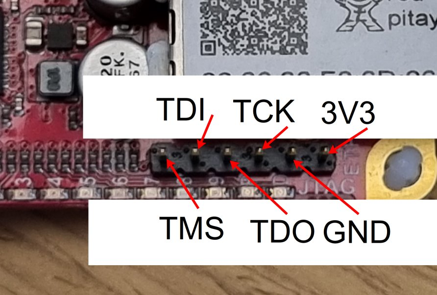

.. _fpga_jtag_programming:

.. !! CHECK AND VERIFY THIS, ADD PICTURES

################################
通过 JTAG 对 Red Pitaya 编程
################################

JTAG（联合测试行动组）编程允许直接从 Xilinx Vivado 配置 FPGA，无需使用 SSH 文件传输和命令行工具。
该方法特别适用于快速原型设计、调试和开发工作流。

.. contents:: 目录
    :local:
    :depth: 2
    :backlinks: top

|

**********************************
1. 概述
**********************************

何时使用 JTAG 编程
=================================

JTAG 编程适用于以下场景：

**开发与调试：**

- 即时更新 FPGA 的快速原型设计
- 使用集成逻辑分析仪（ILA）调试 FPGA 设计
- 在部署到生产环境前测试比特流
- 无需 SSH 开销的迭代开发

**恢复场景：**

- 从损坏的 SD 卡或启动失败中恢复
- 在 Linux 系统不可用时测试 FPGA
- 网络不可用时直接访问硬件
- 绕过软件层进行纯 FPGA 测试

**生产与测试：**

- 制造测试和质量控制
- 批量编程多块板卡
- 使用 Vivado TCL 脚本自动化测试
- 板卡初始 bring-up 与验证

|

相对于 SSH 上传的优势
=============================

**JTAG 编程：**

- 直接从 Vivado IDE 编程（单击即可）
- 与调试工具（ILA、VIO）集成
- 更适合迭代开发
- 无需可用的 OS 即可工作
- 使用 Vivado 实时监测信号

**SSH 上传：**

- 无需特殊硬件
- 可以通过脚本自动化
- 可通过网络远程工作
- 包含设备树加载
- 编程后仍然保留

.. important::

    **JTAG 编程是易失的** —— 以下情况会导致 FPGA 配置丢失：
    
    - Red Pitaya 断电
    - 通过 SSH 重新对 FPGA 编程
    - 系统重启
    
    如需持久化配置，请使用 :ref:`带启动加载的 SSH 上传 <fpga_boot_loading>`。

|

**********************************
2. 硬件要求
**********************************

JTAG 电缆选择
========================

Red Pitaya 需要使用兼容 Xilinx Zynq-7000 器件的 JTAG 电缆。以下电缆已通过测试并受支持：

推荐电缆
------------------

.. list-table::
    :header-rows: 1
    :widths: 30 35 35

    * - 电缆型号
      - 连接方式
      - 备注
    * - **Digilent JTAG-HS3**
      - 需要 14 针连接器和 14 针转 6 针适配器
      - 高速，最常用
    * - **Digilent JTAG-HS2**
      - 6 针连接器（直接连接）
      - 更方便（无需适配器）
    * - **Xilinx Platform Cable USB II**
      - 14-pin connector + adapter
      - Xilinx 官方电缆

|

其他兼容电缆
------------------------

任何兼容 Xilinx 的 JTAG 电缆都应当可以使用。完整列表请参见：

- `Xilinx UG908 - Programming and Debugging <https://www.xilinx.com/support/documents/sw_manuals/xilinx2021_2/ug908-vivado-programming-debugging.pdf>`_ (Appendix D)

|

所需适配器
-----------------

如果使用 JTAG-HS3 或类似的 14 针电缆：

- **14 针转 6 针适配器** —— 将标准 14 针 JTAG 转换为 Red Pitaya 的 6 针排针
- 可从 Digilent 或第三方供应商处获得
- 确保引脚映射正确（见下方引脚定义部分）

|

物理连接
=======================

JTAG 连接器位置
-----------------------

JTAG 连接器是位于 Red Pitaya PCB 上的 **6 针排针**：

- **顶面：** 无标记
- **底面：** 引脚带有清晰标签

    
    Red Pitaya PCB 底面的 JTAG 连接器引脚标记

JTAG 引脚定义
----------------

Red Pitaya 的 6 针 JTAG 排针遵循标准 ARM JTAG 引脚定义：

+------------+----------------------------+
| 引脚编号   | 信号名称                   |
+============+============================+
| 1          | VCC (3.3V)                 |
+------------+----------------------------+
| 2          | GND                        |
+------------+----------------------------+
| 3          | TDI (Test Data In)         |
+------------+----------------------------+
| 4          | TMS (Test Mode Select)     |
+------------+----------------------------+
| 5          | TCK (Test Clock)           |
+------------+----------------------------+
| 6          | TDO (Test Data Out)        |
+------------+----------------------------+

**引脚 1 方向：** 查看 PCB 底面的方形焊盘或标记。

连接步骤
--------------------

1. **确保 Red Pitaya 已断电**
2. **正确确定电缆方向** —— 引脚 1（VCC）应对准方形焊盘
3. **牢固插入电缆** —— 确保全部 6 个引脚接触
4. **将 USB 连接到计算机**
5. **为 Red Pitaya 通电**

.. warning::

    **极性错误可能损坏 JTAG 接口！**
    
    - 连接前务必再次确认引脚 1 的方向
    - 如有疑问，请与 PCB 标记进行比对
    - 某些电缆带有防呆缺口——不要强行插入

|

**********************************
3. 软件安装
**********************************

前置条件
==================

开始前请确保具备：

- 已安装 Xilinx Vivado（2020.1 或更新版本）
- 计算机上有可用的 USB 端口
- 安装驱动程序所需的管理员/sudo 权限

.. seealso::

    需要安装 Vivado？请参见 :ref:`Vivado 安装指南 <FPGA_install_vivado>`

|

步骤 1：安装 Digilent Adept 2
=================================

Digilent Adept 为 Digilent JTAG 电缆提供驱动程序和实用工具。

下载 Adept 2
----------------

访问：https://digilent.com/reference/software/adept/start

下载两个软件包：

1. **Adept 2 Runtime** —— 核心驱动
2. **Adept 2 Utilities** —— 配置工具

安装
---------------

.. tabs::

    .. group-tab:: Linux

        **下载 Ubuntu/Debian 的 .deb 软件包：**

        .. code-block:: bash

            # Install Runtime
            sudo dpkg -i digilent.adept.runtime_<version>_amd64.deb
            
            # Install Utilities
            sudo dpkg -i digilent.adept.utilities_<version>_amd64.deb
            
            # If dependency errors occur, fix them
            sudo apt-get install -f

        **Verify installation:**

        .. code-block:: bash

            # Check if Adept utilities are available
            djtgcfg --version

    .. group-tab:: Windows

        **Run installers:**

        1. Double-click ``AdeptRuntime_<version>.msi``
        2. Follow installation wizard
        3. Restart if prompted
        4. Double-click ``AdeptUtilities_<version>.msi``
        5. Follow installation wizard

        **Verify installation:**

        Open Command Prompt and run:

        .. code-block:: batch

            djtgcfg enum

|

步骤 2：验证 JTAG 电缆检测
====================================

.. tabs::

    .. group-tab:: Linux

        **检查 USB 设备：**

        .. code-block:: bash

            lsusb | grep -i ftdi

        **Expected output for JTAG-HS3:**

        .. code-block:: text

            Bus 001 Device 005: ID 0403:6014 Future Technology Devices International, Ltd FT232H Single HS USB-UART/FIFO IC

        .. figure:: img/JTAG-tutorial/JTAG-tutorial-lsusb.jpg
            :width: 800
            :align: center
            
            JTAG-HS3 appears as FTDI device in lsusb output

        **Check Digilent driver detection:**

        .. code-block:: bash

            djtgcfg enum

        **Expected output:**

        .. code-block:: text

            Found 1 device(s)
            
            Device: JtagHs3
                Product Name:   Digilent JTAG-HS3
                User Name:      JtagHs3
                Serial Number:  210299123456

        .. figure:: img/JTAG-tutorial/JTAG-tutorial-driver-check.jpg
            :width: 800
            :align: center
            
            Digilent driver successfully detects JTAG cable

    .. group-tab:: Windows

        **Check Device Manager:**

        1. Open Device Manager (devmgmt.msc)
        2. Look under "Universal Serial Bus controllers"
        3. Find "Digilent USB Device" or similar

        **Check with Adept:**

        Open Command Prompt:

        .. code-block:: batch

            djtgcfg enum

        Should list connected Digilent devices.

|

检测问题故障排除
=================================

未检测到电缆
------------------

.. tabs::

    .. group-tab:: Linux

        .. code-block:: bash

            # Check if device appears in kernel messages
            dmesg | grep -i ftdi
            dmesg | grep -i usb
            
            # Check USB permissions
            ls -l /dev/bus/usb/*/*
            
            # Add user to dialout group for USB access
            sudo usermod -aG dialout $USER
            # Log out and log back in

    .. group-tab:: Windows

        **Check Device Manager:**

        - Look for yellow exclamation marks
        - Reinstall Adept 2 Runtime
        - Try different USB port
        - Check USB cable quality

驱动问题
-------------

.. tabs::

    .. group-tab:: Linux

        **缺少库：**

        .. code-block:: bash

            # Install required libraries
            sudo apt-get install libusb-1.0-0 libftdi1

    .. group-tab:: Windows

        **Driver conflicts:**

        - Uninstall conflicting FTDI drivers
        - Use Zadig tool to reinstall WinUSB driver
        - Reboot after driver changes

|

**********************************
4. Vivado 配置
**********************************

步骤 1：打开 Hardware Manager
==============================

在 Vivado IDE 中：

1.  点击 **Flow Navigator** → **Program and Debug** → **Open Hardware Manager**

    或从菜单选择：**Tools** → **Open Hardware Manager**

#.  Hardware Manager 窗口打开

|

步骤 2：自动连接电缆
==============================

在 Hardware Manager 中：

1.  点击 **Open Target** → **Auto Connect**

    .. figure:: img/JTAG-tutorial/JTAG-tutorial-program-menu.jpg
        :width: 800
        :align: center
        
        打开 Hardware Manager 并自动连接 JTAG 电缆

#.  Vivado 搜索 JTAG 电缆

#.  如果成功，电缆会显示在 Hardware 窗口的 **localhost** 下

    .. figure:: img/JTAG-tutorial/JTAG-tutorial-cable.jpg
        :width: 500
        :align: center
        
        检测到 JTAG 电缆，并将其列在 localhost 下

|

步骤 3：连接 Red Pitaya
===========================

1.  **确保 Red Pitaya 已通电**

#.  **将 JTAG 电缆** 连接到 Red Pitaya 的 6 针排针

#.  如果设备未自动出现，**在 Vivado 中点击刷新**

#.  Hardware 窗口中会出现 **Zynq 设备**：

    - **Zynq-7010:** ``xc7z010_1`` (STEMlab 125-14, STEMlab 125-10, ...)
    - **Zynq-7020:** ``xc7z020_1`` (SIGNALlab 250-12, SDRlab 122-16, ...)

    .. figure:: img/JTAG-tutorial/JTAG-tutorial-program.jpg
        :width: 400
        :align: center
        
        通过 JTAG 检测到 Zynq 设备（xc7z010）

|

手动连接（替代方式）
================================

如果自动连接失败：

1.  点击 **Open Target** → **Open New Target**
#.  按照向导操作：

    - 选择 **Local server**
    - 选择检测到的硬件服务器
    - 选择 JTAG 电缆
    - 点击 **Finish**

|

**********************************
5. 编程流程
**********************************

步骤 1：选择设备
=====================

在 Hardware 窗口中：

1.  右键点击 Zynq 设备（例如 ``xc7z010_1``）
#.  选择 **Program Device...**

    .. figure:: img/JTAG-tutorial/JTAG-tutorial-connected.jpg
        :width: 600
        :align: center
        
        显示 “Program Device” 选项的右键菜单

|

步骤 2：选择比特流文件
==============================

出现 Program Device 对话框：

1.  **Bitstream file** 字段：
   
    - 点击 **Browse** 按钮（📁）
    - 导航到 ``.bit`` 文件所在位置
    - 选择比特流：``red_pitaya_top.bit``

    .. figure:: img/JTAG-tutorial/JTAG-tutorial-file-select.jpg
        :width: 600
        :align: center
        
        比特流文件选择对话框

#.  **Debug probes file** （可选）：
   
    - 除非使用集成逻辑分析仪（ILA），否则留空
    - 如果使用 ILA，请选择对应的 ``.ltx`` 文件

.. note::

    **构建后的比特流位置：**
    
    .. code-block:: text
    
        fpga/prj/<project_name>/out/red_pitaya_top.bit
    
    Or within Vivado project:
    
    .. code-block:: text
    
        fpga/prj/<project_name>/project/redpitaya.runs/impl_1/red_pitaya_top.bit

|

步骤 3：对 FPGA 编程
====================

1.  点击 **Program** 按钮

#.  **Progress 窗口** 显示编程状态：
   
    .. code-block:: text
    
        Programming device...
        Loading configuration data...
        Bitstream loaded successfully
        Configuration complete

#.  TCL 控制台中出现 **成功消息**：

    .. code-block:: text

        INFO: [Labtools 27-3164] End of startup status: HIGH
        INFO: [Labtoolstcl 44-377] Flash programming completed successfully

#.  **FPGA 现已完成配置** —— Red Pitaya 开始使用新的 FPGA 设计运行

|

步骤 4：验证编程
===========================

**目视验证：**

- 检查 Red Pitaya 上的 LED 模式（应与设计一致）
- 观察预期行为

**寄存器验证：**

如果 Red Pitaya Linux 正在运行，可通过 SSH 检查：

.. code-block:: bash

    # Read a known register to verify FPGA is responding
    ssh root@rp-xxxxxx.local
    redpitaya> /opt/redpitaya/bin/monitor 0x40000000

**Vivado 验证：**

在 Hardware 窗口中，设备状态应显示：

- **DONE:** True
- **Status:** Configuration successful

|

**********************************
6. 高级用法
**********************************

通过 TCL 脚本编程
==========================

使用 Vivado TCL 命令自动执行 JTAG 编程：

**创建脚本：** ``program_jtag.tcl``

.. code-block:: tcl

    # Open hardware manager
    open_hw_manager
    
    # Connect to local hardware server
    connect_hw_server -url localhost:3121
    
    # Open target
    current_hw_target [get_hw_targets */xilinx_tcf/Digilent/*]
    set_property PARAM.FREQUENCY 15000000 [get_hw_targets */xilinx_tcf/Digilent/*]
    open_hw_target
    
    # Set bitstream file
    current_hw_device [get_hw_devices xc7z010_1]
    set_property PROGRAM.FILE {/path/to/red_pitaya_top.bit} [get_hw_devices xc7z010_1]
    
    # Program device
    program_hw_devices [get_hw_devices xc7z010_1]
    
    # Verify
    refresh_hw_device [get_hw_devices xc7z010_1]
    
    # Close connections
    close_hw_target
    close_hw_manager

**运行脚本：**

.. code-block:: bash

    vivado -mode batch -source program_jtag.tcl

|

调整 JTAG 时钟频率
===============================

默认 JTAG 时钟为 10 MHz。可根据稳定性或速度需求进行调整：

**在 Vivado GUI 中：**

1. 在 Hardware 窗口中右键点击 JTAG 电缆
2. 选择 **Properties**
3. 更改 **Frequency** 参数
4. 点击 **OK**

**推荐频率：**

- **稳定连接：** 10 MHz（默认）
- **电缆较长或存在噪声：** 5 MHz 或更低
- **电缆较短、需要高速：** 15-20 MHz

**通过 TCL：**

.. code-block:: tcl

    set_property PARAM.FREQUENCY 10000000 [get_hw_targets */xilinx_tcf/Digilent/*]

|

使用集成逻辑分析仪（ILA）
======================================

使用 Vivado 的 ILA 调试 FPGA 内部信号：

**前置条件：**

- 已将 ILA IP 核添加到 FPGA 设计
- 综合期间生成了 ``.ltx`` 调试探针文件

**使用 ILA 编程：**

1. 在 Program Device 对话框中浏览并选择 ``.ltx`` 文件
2. 对设备编程
3. ILA 核出现在 Hardware 窗口中
4. 配置触发条件
5. 运行 ILA 捕获波形

**ILA 文件位置：**

.. code-block:: text

    fpga/prj/<project_name>/project/redpitaya.runs/impl_1/red_pitaya_top.ltx

完整的 ILA 用法请参见 `Xilinx UG908 <https://www.xilinx.com/support/documents/sw_manuals/xilinx2021_2/ug908-vivado-programming-debugging.pdf>`_ 第 8 章。

|

批量编程多块板卡
==================================

对于生产或测试中的多块 Red Pitaya：

**设置：**

1. 使用 USB 集线器连接多条 JTAG 电缆
2. 为每条电缆分配唯一序列号
3. 为每块板卡创建一个 TCL 脚本

**脚本模板：**

.. code-block:: tcl

    # Target specific cable by serial number
    current_hw_target [get_hw_targets */xilinx_tcf/Digilent/210299123456]
    open_hw_target
    
    # Program
    current_hw_device [get_hw_devices xc7z010_1]
    set_property PROGRAM.FILE {red_pitaya_top.bit} [get_hw_devices xc7z010_1]
    program_hw_devices [get_hw_devices xc7z010_1]
    
    close_hw_target

|

远程 JTAG 编程
========================

使用 Vivado Hardware Server 通过网络对 Red Pitaya 编程：

**在远程计算机上（连接 Red Pitaya 的计算机）：**

.. code-block:: bash

    # Start hardware server
    hw_server

**在本地计算机上（运行 Vivado 的计算机）：**

1. 在 Hardware Manager 中点击 **Open New Target**
2. 选择 **Remote server**
3. 输入远程计算机的 IP 地址和端口（默认：3121）
4. 继续执行常规编程流程

|

**********************************
7. 故障排除
**********************************

Vivado 未检测到电缆
=============================

**问题：** JTAG 电缆未出现在 Hardware Manager 中

**解决方案：**

1.  **验证 USB 连接：**

    .. tabs::

        .. group-tab:: Linux

            .. code-block:: bash
            
                lsusb | grep -i ftdi
        
        .. group-tab:: Windows

            1. Open Device Manager
            2. Look for "Digilent USB Device" under "Universal Serial Bus controllers"

#.  **检查 Digilent 驱动：**

    .. code-block:: bash

        djtgcfg enum
   
    If cable not listed, reinstall Adept 2

#.  **重启 Hardware Server：**
   
    .. tabs::

        .. group-tab:: Linux

            .. code-block:: bash
            
                killall hw_server
                hw_server &

        .. group-tab:: Windows

            1. Open Task Manager
            2. End process "hw_server.exe"
            3. Restart hardware server

    In Vivado, reconnect to server

#. **检查 Vivado 电缆驱动：**
   
    .. code-block:: bash
    
        cd $XILINX_VIVADO/data/xicom/cable_drivers/lin64/install_script/install_drivers
        sudo ./install_drivers

|

连接电缆后设备未出现
============================================

**问题：** 已检测到 JTAG 电缆，但 Zynq 设备未出现

**检查：**

1.  **Red Pitaya 已通电：**
   
    - LED 应亮起
    - 电源已连接
    - 检查电源 LED

2.  **JTAG 电缆已正确连接：**
   
    - 引脚正确对齐
    - 引脚 1（VCC）对准方形焊盘
    - 全部 6 个引脚均接触
    - 电缆已牢固插入

3.  **在 Vivado 中刷新：**
   
    - 在 Hardware 窗口中右键点击电缆
    - 选择 **Refresh Device**

4.  **检查 JTAG 链：**

    在 TCL 控制台中：

    .. code-block:: tcl
   
        get_hw_devices
   
    Should return ``xc7z010_1`` or ``xc7z020_1``

|

编程因错误失败
=============================

**问题：** 编程开始后因错误失败

**常见错误和解决方案：**

**“DONE pin did not go high”**

- FPGA 配置失败
- 检查比特流是否适用于板卡型号（Z10 或 Z20）
- 验证比特流文件未损坏
- 尝试在 Vivado 中重新生成比特流

**“Failed to program device”**

- 检查 JTAG 连接质量
- 降低 JTAG 时钟频率
- 检查 JTAG 排针是否存在焊点不良
- 尝试使用其他 JTAG 电缆

**“Device not in chain”**

- 编程期间 JTAG 连接丢失
- 检查电缆连接
- 确保电源稳定
- 检查 USB 集线器问题（尝试直接连接）

|

FPGA 编程成功但无法工作
===============================

**问题：** 编程成功，但 Red Pitaya 行为不符合预期

**调试步骤：**

1.  **验证比特流正确：**
   
    - 检查 Vivado 项目中的板卡型号与硬件一致
    - Z10 板卡需要 Z10 比特流
    - Z20 板卡需要 Z20 比特流

2.  **检查 Linux 是否造成干扰：**
   
    JTAG 编程不会加载设备树，这可能导致冲突：
    
    .. code-block:: bash
    
        # Stop Red Pitaya services that access FPGA
        ssh root@rp-xxxxxx.local
        redpitaya> systemctl stop redpitaya_*

3.  **使用简单设计测试：**
   
    - 使用已知良好的比特流编程（例如出厂 v0.94）
    - 如果成功，问题出在自定义设计
    - 如果失败，问题出在硬件或连接

4.  **检查时钟配置：**

    - 确保 PS（ARM）时钟已配置
    - 验证 FPGA 设计中已启用 PL 时钟
    - 检查时钟频率符合约束

5.  **使用 ILA 调试：**

    - 添加 ILA 核监测内部信号
    - 检查预期信号是否在翻转
    - 验证 AXI 总线事务

|

JTAG 编程后 Linux 对 XADC/GPIO 的访问
==============================================

**问题：** JTAG 编程后，Linux 驱动无法访问 FPGA 外设

**原因：** 未加载设备树（JTAG 只对 FPGA 编程，不处理设备树）

**解决方案：**

选项 1——手动重新加载设备树：

.. code-block:: bash

    # Load device tree overlay for your project
    ssh root@rp-xxxxxx.local
    redpitaya> overlay.sh v0.94

选项 2——改用 SSH 编程：

用于生产时，:ref:`使用 overlay.sh 的 SSH 上传 <fpga_reprogramming>` 会同时加载 FPGA 和设备树。

|

权限被拒绝错误（Linux）
=================================

**问题：** USB 访问被拒绝或出现权限错误

**Solution:**

.. code-block:: bash

    # Add user to dialout group
    sudo usermod -aG dialout $USER
    
    # Add udev rules for FTDI devices
    echo 'SUBSYSTEM=="usb", ATTRS{idVendor}=="0403", MODE="0666"' | \
        sudo tee /etc/udev/rules.d/52-ftdi.rules
    
    # Reload udev rules
    sudo udevadm control --reload-rules
    sudo udevadm trigger
    
    # Log out and log back in for group changes to take effect

|

**********************************
8. 最佳实践
**********************************

开发工作流
====================

**高效 FPGA 开发的推荐工作流：**

1.  **初始设置：**
   
    - 连接一次 JTAG 电缆
    - 在整个开发会话期间保持连接
    - 保持 Hardware Manager 打开

2.  **设计迭代：**
   
    - 在 Vivado 中进行更改
    - 运行综合和实现
    - 通过 JTAG 编程（单击即可）
    - 在硬件上测试
    - 重复上述步骤

3.  **最终部署：**

    - 设计稳定后切换到 SSH 上传
    - 如有需要，配置启动加载
    - 测试完整启动序列

|

电缆管理
================

- 开发期间保持 JTAG 电缆连接
- 使用扎带防止连接器受力
- 避免在连接器附近弯折电缆
- 不使用时妥善存放电缆
- 使用多块板卡时为电缆贴标签

|

安全注意事项
=====================

- **连接/断开 JTAG 前务必断电**
- 连接前再次确认引脚方向
- 操作电缆时采取适当的 ESD 防护措施
- 保持 JTAG 连接器清洁、无杂物
- 不要强行连接——引脚应自然对齐

|

版本控制
===============

使用 JTAG 进行开发时：

- 将 **比特流文件提交** 到版本控制
- 为 **可用版本打标签**，便于回滚
- 在日志中 **记录编程日期/时间**
- **记录笔记**，说明哪些内容有效、哪些无效

|

生产注意事项
=========================

用于制造或批量编程时：

- 生产运行前 **彻底测试 JTAG 设置**
- 创建 **自动化 TCL 脚本** 以保持一致性
- 编程后 **执行验证步骤**
- **记录编程结果** 以便追溯
- 准备 **备用电缆**

|

**********************************
9. 相关文档
**********************************

**FPGA 编程：**

- :ref:`fpga_reprogramming`——通过 SSH 加载 FPGA 的基础方法
- :ref:`fpga_boot_loading`——使 FPGA 在启动时加载
- :ref:`fpga_advanced_loading`——高级配置和工作流

**FPGA 开发：**

- :ref:`fpga_create_project`——在 Vivado 中创建 FPGA 项目
- :ref:`device_tree`——设备树配置
- :ref:`signal_mapping`——硬件信号连接

**外部资源：**

- `Xilinx UG908 - Programming and Debugging <https://www.xilinx.com/support/documents/sw_manuals/xilinx2021_2/ug908-vivado-programming-debugging.pdf>`_
- `Digilent Adept Documentation <https://digilent.com/reference/software/adept/start>`_
- `Vivado Design Suite User Guide <https://www.xilinx.com/support/documents/sw_manuals/xilinx2020_1/ug893-vivado-ide.pdf>`_
