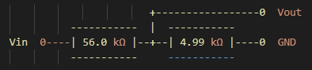
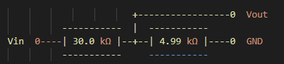

.. _signal_mapping:

###################
信号映射
###################

本节介绍 Red Pitaya FPGA 管脚与外部连接器之间的物理连接，包括 XADC 模拟输入、GPIO 管脚和 LED。
这些映射在设备树中定义，对于理解如何与 Red Pitaya 硬件进行接口连接至关重要。

.. seealso::

    有关设备树配置和加载的信息，请参阅 :ref:`device_tree`。

.. contents:: Table of Contents
    :local:
    :depth: 1
    :backlinks: top

|

**********************************
1. XADC 模拟输入
**********************************

Red Pitaya 提供四个通过 XADC（Xilinx 模数转换器）映射的模拟输入（AI0-AI3）。
这些输入可通过 Linux IIO（工业 I/O）子系统访问。

物理连接
==========================

+--------+----------+---------+-----------------------+--------------------+------------------+
| E2     | ZYNQ p/n | XADC 输入 | IIO 文件名          | 测量目标           | 满量程范围       |
+========+==========+=========+=======================+====================+==================+
| AI0    | B19/A20  | AD8     | in_voltage11_raw      | 通用               | 7.00 V           |
+--------+----------+---------+-----------------------+--------------------+------------------+
| AI1    | C20/B20  | AD0     | in_voltage9_raw       | 通用               | 7.00 V           |
+--------+----------+---------+-----------------------+--------------------+------------------+
| AI2    | E17/D18  | AD1     | in_voltage10_raw      | 通用               | 7.00 V           |
+--------+----------+---------+-----------------------+--------------------+------------------+
| AI3    | E18/E19  | AD9     | in_voltage12_raw      | 通用               | 7.00 V           |
+--------+----------+---------+-----------------------+--------------------+------------------+
|        | K9 /L10  | AD      | in_voltage8_vpvn_raw  | 5V 电源            | 6.10 V           |
+--------+----------+---------+-----------------------+--------------------+------------------+

默认输入范围为 0 - 7.0 V（单极性模式）。

|

双极性模式配置
============================

.. tabs::

    .. group-tab:: Gen 2

        要使用双极性工作模式（±3.5 V），必须移除电阻 R255，并将 **Ext. com. mode** 管脚连接到 0.5-1 V 电压基准。

        .. figure:: ../getting_started/img/device_tree/XADC_R255.png
            :align: center
            :width: 800

        随后打开 Red Pitaya v0.94（对于 SIGNALlab 250-12，则打开 v0.94_250）FPGA 项目。在框图中，XADC 向导的
        Channel Sequencer 页面有一个设置，可将 XADC 切换到双极性模式。重新构建 FPGA 后，读取的值为 12 位二进制补码值。

    .. group-tab:: Original Generation

        要使用双极性工作模式（±3.5 V），必须移除电阻 R273，并将 **Ext. com. mode** 管脚连接到 0.5-1 V 电压基准。

        .. figure:: ../getting_started/img/device_tree/XADC_R273.png
            :align: center
            :width: 800
        
        随后打开 Red Pitaya v0.94（对于 SIGNALlab 250-12，则打开 v0.94_250）FPGA 项目。在框图中，XADC 向导的
        Channel Sequencer 页面有一个设置，可将 XADC 切换到双极性模式。重新构建 FPGA 后，读取的值为 12 位二进制补码值。

|

分压器
==========================

XADC 输入使用分压器将输入电压缩放到 ADC 的安全范围内。

5V 电源
--------------------

第四个 XADC 输入（AD）连接到一个分压器，用于测量内部 5V 电源电压：

.. math::

    ratio = \frac{4.99 k\Omega}{56.0 k\Omega +4.99 k\Omega} = 0.0818

    range = \frac{0.5 V}{ratio} = 6.11 V

慢速模拟输入
------------------------------------

连接到慢速模拟输入的 XADC 辅助输入工作在单极性模式，输入电压范围为 0-1 V。使用电阻分压器将外部输入电压范围
缩放到 0-7.0 V：

.. math::

    ratio = \frac{4.99 k\Omega}{30.0 k\Omega + 4.99 k\Omega} = 0.143

    range = \frac{1.0 V}{ratio} = 7.00 V

.. seealso::

    分压器最初基于对 XADC 单极性输入范围的错误假设，按照 0-3.5 V 范围设计。
    完整背景请参阅 :ref:`slow_analog_voltage_note_orig_gen` （初代板卡）和 :ref:`slow_analog_voltage_note_gen2` （第 2 代板卡）。

|

读取 XADC 值
==========================

可以通过 IIO 接口从 Linux 用户空间读取 XADC 值：

.. code-block:: bash

    # Read raw ADC value
    cat /sys/bus/iio/devices/iio:device0/in_voltage9_raw
    
    # Read voltage scale
    cat /sys/bus/iio/devices/iio:device0/in_voltage9_scale
    
    # Calculate actual voltage: raw_value * scale

.. note::

    缩放因子将 ADC 原始读数转换为毫伏。计算实际输入电压时，请记得考虑分压器比例。

|

**********************************
2. GPIO 与 LED
**********************************

Red Pitaya 的 GPIO 管脚和 LED 可通过 ``sysfs`` 从 Linux 用户空间控制。具体处理方式取决于管脚连接到 PS
（处理系统）还是 PL（可编程逻辑）。设备树定义哪些管脚由 PS 管理，哪些位于 PL 中。

MIO 与 PL/EMIO
==========================

- **MIO（复用 I/O）**：由 PS 直接控制的管脚，通过标准 GPIO ``sysfs`` 接口访问。每个管脚有若干复用功能，
  可通过 pinctrl overlay 选择。Linux 驱动由 AMD/Xilinx 提供。

- **PL/EMIO**：由 FPGA 逻辑控制的管脚，需要由 FPGA 设计定义访问方法（例如自定义 AXI GPIO 外设）。访问方法取决于
  FPGA 实现。如果 FPGA 源码中的管脚信号连接到 EMIO，则可以通过 PS GPIO 接口访问。

.. warning::

    直接连接到 PS 的 LED 和 GPIO 只有在未加载 FPGA，或 FPGA 代码不改变信号状态时才可访问。
    请注意，在加载 FPGA 时更改这些信号可能导致不可预测的行为。

|

GPIO 管脚分配
==========================

以下表格显示 Red Pitaya 的完整 GPIO 管脚映射。

PL/EMIO 管脚
--------------------

+---------+------------+--------------------+------------------+------------------------------+-------------------------------------------+
| FPGA    | Connector  | GPIO               | MIO/EMIO index   | ``sysfs`` index              | Comments, LED color, dedicated meaning    |
+=========+============+====================+==================+==============================+===========================================+
|         |            |                    |                  |                              | Green = *Power Good* status               |
+---------+------------+--------------------+------------------+------------------------------+-------------------------------------------+
|         |            |                    |                  |                              | Blue = FPGA programming *DONE*            |
+---------+------------+--------------------+------------------+------------------------------+-------------------------------------------+
| ``M15`` | E1         | ``exp_n_io [7]``   | ``EMIO[23]``     | ``906+54+[23] = 983``        | DIO7_N                                    |
+---------+------------+--------------------+------------------+------------------------------+-------------------------------------------+
| ``J16`` | E1         | ``exp_n_io [6]``   | ``EMIO[22]``     | ``906+54+[22] = 982``        | DIO6_N                                    |
+---------+------------+--------------------+------------------+------------------------------+-------------------------------------------+
| ``L17`` | E1         | ``exp_n_io [5]``   | ``EMIO[21]``     | ``906+54+[21] = 981``        | DIO5_N                                    |
+---------+------------+--------------------+------------------+------------------------------+-------------------------------------------+
| ``L15`` | E1         | ``exp_n_io [4]``   | ``EMIO[20]``     | ``906+54+[20] = 980``        | DIO4_N                                    |
+---------+------------+--------------------+------------------+------------------------------+-------------------------------------------+
| ``K18`` | E1         | ``exp_n_io [3]``   | ``EMIO[19]``     | ``906+54+[19] = 979``        | DIO3_N                                    |
+---------+------------+--------------------+------------------+------------------------------+-------------------------------------------+
| ``H18`` | E1         | ``exp_n_io [2]``   | ``EMIO[18]``     | ``906+54+[18] = 978``        | DIO2_N                                    |
+---------+------------+--------------------+------------------+------------------------------+-------------------------------------------+
| ``H17`` | E1         | ``exp_n_io [1]``   | ``EMIO[17]``     | ``906+54+[17] = 977``        | DIO1_N                                    |
+---------+------------+--------------------+------------------+------------------------------+-------------------------------------------+
| ``G18`` | E1         | ``exp_n_io [0]``   | ``EMIO[16]``     | ``906+54+[16] = 976``        | DIO0_N                                    |
+---------+------------+--------------------+------------------+------------------------------+-------------------------------------------+
| ``M14`` | E1         | ``exp_p_io [7]``   | ``EMIO[15]``     | ``906+54+[15] = 975``        | DIO7_P                                    |
+---------+------------+--------------------+------------------+------------------------------+-------------------------------------------+
| ``K16`` | E1         | ``exp_p_io [6]``   | ``EMIO[14]``     | ``906+54+[14] = 974``        | DIO6_P                                    |
+---------+------------+--------------------+------------------+------------------------------+-------------------------------------------+
| ``L16`` | E1         | ``exp_p_io [5]``   | ``EMIO[13]``     | ``906+54+[13] = 973``        | DIO5_P                                    |
+---------+------------+--------------------+------------------+------------------------------+-------------------------------------------+
| ``L14`` | E1         | ``exp_p_io [4]``   | ``EMIO[12]``     | ``906+54+[12] = 972``        | DIO4_P                                    |
+---------+------------+--------------------+------------------+------------------------------+-------------------------------------------+
| ``K17`` | E1         | ``exp_p_io [3]``   | ``EMIO[11]``     | ``906+54+[11] = 971``        | DIO3_P                                    |
+---------+------------+--------------------+------------------+------------------------------+-------------------------------------------+
| ``J18`` | E1         | ``exp_p_io [2]``   | ``EMIO[10]``     | ``906+54+[10] = 970``        | DIO2_P                                    |
+---------+------------+--------------------+------------------+------------------------------+-------------------------------------------+
| ``H16`` | E1         | ``exp_p_io [1]``   | ``EMIO[9]``      | ``906+54+[ 9] = 969``        | DIO1_P                                    |
+---------+------------+--------------------+------------------+------------------------------+-------------------------------------------+
| ``G17`` | E1         | ``exp_p_io [0]``   | ``EMIO[8]``      | ``906+54+[ 8] = 968``        | DIO0_P                                    |
+---------+------------+--------------------+------------------+------------------------------+-------------------------------------------+
| ``J14`` |            | LED ``[7]``        | ``EMIO[7]``      | ``906+54+[ 7] = 967``        | Orange LED7                               |
+---------+------------+--------------------+------------------+------------------------------+-------------------------------------------+
| ``J15`` |            | LED ``[6]``        | ``EMIO[6]``      | ``906+54+[ 6] = 966``        | Orange LED6                               |
+---------+------------+--------------------+------------------+------------------------------+-------------------------------------------+
| ``G14`` |            | LED ``[5]``        | ``EMIO[5]``      | ``906+54+[ 5] = 965``        | Orange LED5                               |
+---------+------------+--------------------+------------------+------------------------------+-------------------------------------------+
| ``K14`` |            | LED ``[4]``        | ``EMIO[4]``      | ``906+54+[ 4] = 964``        | Orange LED4                               |
+---------+------------+--------------------+------------------+------------------------------+-------------------------------------------+
| ``H15`` |            | LED ``[3]``        | ``EMIO[3]``      | ``906+54+[ 3] = 963``        | Orange LED3                               |
+---------+------------+--------------------+------------------+------------------------------+-------------------------------------------+
| ``G15`` |            | LED ``[2]``        | ``EMIO[2]``      | ``906+54+[ 2] = 962``        | Orange LED2                               |
+---------+------------+--------------------+------------------+------------------------------+-------------------------------------------+
| ``F17`` |            | LED ``[1]``        | ``EMIO[1]``      | ``906+54+[ 1] = 961``        | Orange LED1                               |
+---------+------------+--------------------+------------------+------------------------------+-------------------------------------------+
| ``F16`` |            | LED ``[0]``        | ``EMIO[0]``      | ``906+54+[ 0] = 960``        | Orange LED0                               |
+---------+------------+--------------------+------------------+------------------------------+-------------------------------------------+

|

PS MIO 管脚
--------------------

+---------+------------+--------------------+------------------+------------------------------+-------------------------------------------+
| FPGA    | Connector  | GPIO               | MIO/EMIO index   | ``sysfs`` index              | Comments, LED color, dedicated meaning    |
+=========+============+====================+==================+==============================+===========================================+
|         |            | LED ``[8]``        |  ``MIO[ 0]``     | ``906+   [ 0]   = 906``      | Orange = SD card access                   |
+---------+------------+--------------------+------------------+------------------------------+-------------------------------------------+
|         |            | LED ``[9]``        |  ``MIO[ 7]``     | ``906+   [ 7]   = 913``      | Red    = CPU heartbeat                    |
+---------+------------+--------------------+------------------+------------------------------+-------------------------------------------+
| ``D5``  | ``E2[ 7]`` | UART1_TX           |  ``MIO[ 8]``     | ``906+   [ 8]   = 914``      | Output only                               |
+---------+------------+--------------------+------------------+------------------------------+-------------------------------------------+
| ``B5``  | ``E2[ 8]`` | UART1_RX           |  ``MIO[ 9]``     | ``906+   [ 9]   = 915``      | [#f1]_                                    |
+---------+------------+--------------------+------------------+------------------------------+-------------------------------------------+
| ``E9``  | ``E2[ 3]`` | SPI1_MOSI          |  ``MIO[10]``     | ``906+   [10]   = 916``      | [#f1]_                                    |
+---------+------------+--------------------+------------------+------------------------------+-------------------------------------------+
| ``C6``  | ``E2[ 4]`` | SPI1_MISO          |  ``MIO[11]``     | ``906+   [11]   = 917``      | [#f1]_                                    |
+---------+------------+--------------------+------------------+------------------------------+-------------------------------------------+
| ``D9``  | ``E2[ 5]`` | SPI1_SCK           |  ``MIO[12]``     | ``906+   [12]   = 918``      | [#f1]_                                    |
+---------+------------+--------------------+------------------+------------------------------+-------------------------------------------+
| ``E8``  | ``E2[ 6]`` | SPI1_CS#           |  ``MIO[13]``     | ``906+   [13]   = 919``      | [#f1]_                                    |
+---------+------------+--------------------+------------------+------------------------------+-------------------------------------------+
| ``B13`` | ``E2[ 9]`` | I2C0_SCL           |  ``MIO[50]``     | ``906+   [50]   = 956``      | [#f1]_                                    |
+---------+------------+--------------------+------------------+------------------------------+-------------------------------------------+
| ``B9``  | ``E2[10]`` | I2C0_SDA           |  ``MIO[51]``     | ``906+   [51]   = 957``      | [#f1]_                                    |
+---------+------------+--------------------+------------------+------------------------------+-------------------------------------------+

.. [#f1] 需要修改 ``pinctrl`` 后才能生效。

|

Linux Sysfs 访问
==========================

可以使用 sysfs 接口从 Linux 用户空间控制 LED：

.. code-block:: bash

    # Enable LED heartbeat trigger
    echo heartbeat > /sys/class/leds/led0/trigger
    
    # Set LED brightness (0 = off, 1 = on)
    echo 1 > /sys/class/leds/led0/brightness
    
    # Turn off LED
    echo 0 > /sys/class/leds/led0/brightness

对于 GPIO 管脚，请使用 GPIO sysfs 接口：

.. code-block:: bash

    # Export GPIO pin
    echo 960 > /sys/class/gpio/export
    
    # Set direction (out or in)
    echo out > /sys/class/gpio/gpio960/direction
    
    # Set value (0 or 1)
    echo 1 > /sys/class/gpio/gpio960/value
    
    # Read value
    cat /sys/class/gpio/gpio960/value
    
    # Unexport when done
    echo 960 > /sys/class/gpio/unexport

|

**********************************
3. PS Pinctrl Overlay
**********************************

Red Pitaya 提供设备树 overlay 文件，允许重新利用 PS MIO 信号。这些 overlay 会修改 pinctrl 配置，
将管脚从默认功能（SPI、I2C、UART）重新分配为 GPIO。

可用的 Overlay
==========================

.. table:: PS Pinctrl Overlay 文件
    :widths: 30 70

    +-------------------+------------------------------------------------------------------+
    | Overlay 文件      | 描述                                                             |
    +===================+==================================================================+
    | spi2gpio.dtsi     | 将 SPI1 信号重新分配为 GPIO（MOSI、MISO、SCLK、CS）              |
    +-------------------+------------------------------------------------------------------+
    | i2c2gpio.dtsi     | 将 I2C0 信号重新分配为 GPIO（SDA、SCL）                          |
    +-------------------+------------------------------------------------------------------+
    | uart2gpio.dtsi    | 将 UART1 信号重新分配为 GPIO（TX、RX）                           |
    +-------------------+------------------------------------------------------------------+
    | miso2gpio.dtsi    | 仅将 MISO 信号重新分配为 GPIO（保留其他 SPI1 管脚）              |
    +-------------------+------------------------------------------------------------------+

需要特定信号配置时，通常会将这些 overlay 文件包含在项目的设备树源文件中。

|

**********************************
4. SPI 配置示例
**********************************

Red Pitaya 上的 SPI 接口可以通过设备树配置。一个常见示例是更改 CS（片选）极性。

默认情况下，所有 Red Pitaya 板卡的 CS 状态均为 HIGH（非活动）。要将默认值设置为 LOW（活动），请修改设备树：

1.  **打开设备树源文件：**

    .. code-block:: console

        root@rp-f01c3d:~# rw
        root@rp-f01c3d:~# nano /opt/redpitaya/dts/$(monitor -f)/dtraw.dts

2.  **找到 SPI 设备** 节点 ``spidev@0``，并添加 ``spi-cs-high`` 属性：

    .. code-block:: dts

        spidev@0 {
            compatible = "spidev";
            reg = <0>;
            spi-max-frequency = <50000000>;
            spi-cs-high;  /* Add this line */
        };

3.  **重新编译并重启：**

    .. code-block:: console

        root@rp-f01c3d:~# cd /opt/redpitaya/dts/$(monitor -f)/
        root@rp-f01c3d:~# dtc -I dts -O dtb ./dtraw.dts -o devicetree.dtb
        root@rp-f01c3d:~# reboot

.. note::

    这些设置只有在加载设备树后才会生效。板卡启动时 CS 值处于 HIGH 状态，但启动完成后会变为 LOW。

.. note::

    也可以通过 Red Pitaya API 在运行时切换 SPI CS 模式：
    
    * ``rp_SPI_GetCSMode``
    * ``rp_SPI_SetCSMode``
    
    更多详情请参阅 :ref:`硬件 API <command_list>` 命令参考。

|

**********************************
5. 故障排除
**********************************

GPIO/LED 访问问题
================================

**错误：访问 sysfs 时权限被拒绝**

- **原因**：权限不足或受到 SELinux 限制
- **解决方案**：

    - 以 root 身份或使用 sudo 运行命令
    - 检查 /sys/class/gpio/ 或 /sys/class/leds/ 中的文件权限

**错误：GPIO 已导出**

- **原因**：GPIO 管脚已被其他进程或之前的会话导出
- **解决方案**：

    - 取消导出 GPIO：``echo <pin_number> > /sys/class/gpio/unexport``
    - 检查使用该 GPIO 的其他进程：``lsof | grep gpio``

**现象：GPIO 更改不影响硬件**

- **原因**：FPGA 已加载并正在控制这些管脚
- **解决方案**：

    - 卸载 FPGA，或使用不控制这些管脚的 FPGA
    - 如果需要由 PS 控制，请使用合适的 MIO 管脚而不是 EMIO 管脚

|

XADC 读取问题
================================

**错误：找不到 IIO 设备**

- **原因**：设备树中未启用 XADC，或驱动未加载
- **解决方案**：

    - 确认设备树中存在 xadc 节点
    - 检查 IIO 驱动是否已加载：``lsmod | grep xilinx``
    - 确认设备出现在 /sys/bus/iio/devices/ 中

**现象：电压读数不正确**

- **原因**：缩放因子或分压器计算错误
- **解决方案**：

    - 确认根据输入类型使用了正确公式（5V 电源或通用输入）
    - 检查双极性模式电阻 R273（初代）或 R255（第 2 代）是否按预期安装/移除
    - 使用已知参考电压校准读数

|

**********************************
6. 其他资源
**********************************

- :ref:`device_tree` - 设备树配置与编译
- :ref:`fpga_install_sdk` - SDK 安装与 HSI 工具使用
- :ref:`overlay_util` - Overlay 脚本速查
- :ref:`fpga_advanced_loading` - Overlay 脚本完整指南
- `Linux IIO Documentation <https://www.kernel.org/doc/html/latest/driver-api/iio/index.html>`_ - 工业 I/O 子系统文档
- `GPIO Sysfs Interface <https://www.kernel.org/doc/Documentation/gpio/sysfs.txt>`_ - 内核 GPIO 接口文档
