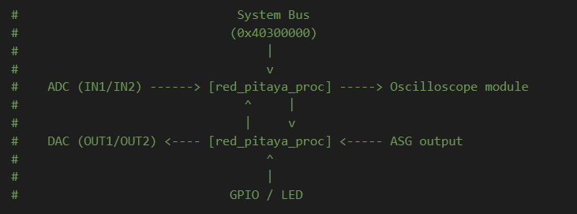

.. _fpga_tutrials_base_project:

##########################
FPGA 基础项目
##########################

FPGA 基础项目是 FPGA 系列所有教程的基础。本教程将指导你设置一个基于 Red Pitaya v0.94 项目的自定义 FPGA 组件，
通过移除不必要的复杂性来简化设计，同时保留学习 FPGA 开发所需的核心功能。

.. contents:: Table of Contents
    :local:
    :depth: 2
    :backlinks: top

|

概述
========

本系列教程基于一个**自定义处理组件**（``red_pitaya_proc``）构建，该组件替代了标准 v0.94 FPGA 项目中的 PID 控制器。
该组件以**串接**方式位于两条信号链中，旨在尽可能灵活：

* **ADC 信号链** — ADC 数据在到达示波器模块前会经过 ``red_pitaya_proc``。默认情况下这是直通连接，但你可以插入自己的处理逻辑。
* **DAC 信号链** — ASG（任意信号发生器）的输出在到达物理 DAC 前会经过 ``red_pitaya_proc``。默认情况下同样是直通连接。
* **系统总线接口** — 从 Linux 进行基于寄存器的控制
* **GPIO 控制** — 完整访问扩展连接器的数字 I/O
* **LED 控制** — 状态指示与调试

这种设计允许你在不改变顶层连线的情况下截取并修改 ADC 和 DAC 信号路径，从而可以在后续教程中直接添加处理逻辑。
如果不添加任何逻辑，所有信号都会未经修改地通过，板卡的行为与标准 v0.94 项目完全相同。

|

前置条件
=============

开始本教程前，你应当：

1. 完成 :ref:`在 Vivado 中创建 FPGA 项目 <fpga_create_project>` 教程
2. 拥有可正常工作的 Vivado 安装及 v0.94 项目
3. 理解基本的 Verilog 或 VHDL 语法
4. 熟悉 :ref:`v0.94 FPGA 项目结构 <fpga_project_v0_94>`

**板卡兼容性：**

* 所有 Red Pitaya 板卡型号

|

此基础项目包含的内容
=================================

与用于生产的 v0.94 FPGA 相比，本教程的基础项目采用了**简化的信号路径**：

**包含：**

* 来自 IN1/IN2 的直接 ADC 数据（14 位有符号采样值）
* 对 OUT1/OUT2 的直接 DAC 控制（14 位有符号输出）
* 用于寄存器访问的系统总线接口
* GPIO 和 LED 控制
* 时钟与复位信号

**不包含（有意简化）：**

* **板卡校准电路** - 用于生产的示波器和 ASG 模块包含频率均衡滤波器以及增益/偏移校准。为简化教程，这些功能被旁路。
* **抽取与平均滤波器** - 示波器模块内置的滤波功能
* **触发逻辑** - 示波器触发机制
* **DMA 与深度存储器** - 高级数据采集功能

当然，我们将在后续教程中介绍如何实现这些功能的简化版本，但基础项目专注于 FPGA 核心概念，
不引入完整生产设计的额外复杂性。

.. warning::

    **重要：校准影响**
    
    教程会旁路 v0.94 项目的校准系统，该系统由以下部分组成：
    
    * **示波器模块（i_scope）**：数字均衡滤波器 + 增益/偏移校正
    * **信号发生器模块（i_asg）**：输出增益/偏移校准
    
    这意味着教程项目将**不具备**与生产应用相同的测量精度。系统会直接使用原始 ADC/DAC 信号。
    这是有意为之，以便教程专注于 FPGA 基础概念。
    
    对于生产应用，你应当选择以下方式之一：
    
    * 基于 EEPROM 值实现自己的校准（可以复制现有的 v0.94 方法）- **推荐**
    * 使用带校准功能的现有 Scope/ASG 模块
    * 对于非关键应用接受降低后的精度

|

创建自定义组件
==============================

自定义 ``red_pitaya_proc`` 组件在入门指南的 :ref:`添加自定义组件 <fpga_tutorial_cust_comp>` 部分有完整说明。

**创建基础项目：**

1. 按照 :ref:`fpga_tutorial_cust_comp` 中的完整教程操作
2. 该教程将指导你完成以下步骤：
   
   * 从 v0.94 中移除 PID 控制器
   * 使用 VHDL 或 Verilog 创建自定义组件
   * 直接连接 ADC/DAC 信号
   * 连接 GPIO 和 LED 控制
   * 实现系统总线接口

最终项目中的自定义组件将连接到：

* 系统总线第 3 段（地址 ``0x40300000`` 至 ``0x403FFFFF``）
* ADC 数据总线 — 组件位于 ADC 与示波器模块之间
* DAC 数据总线 — 组件位于 ASG 与物理 DAC 输出之间
* GPIO 扩展连接器引脚
* LED 输出

.. note::

    **串接信号路径**

    ``red_pitaya_proc`` 以串接方式位于两条信号链中。默认实现是纯直通::

        // ADC passthrough (Verilog)
        assign adc_a_out = adc_a_in;
        assign adc_b_out = adc_b_in;

        // DAC passthrough — ASG signal passes through unchanged
        assign dac_a_out = dac_a_in;
        assign dac_b_out = dac_b_in;

    在教程中，你将使用自己的逻辑替换这些赋值，以处理或生成信号。由于组件已经连接到两条信号链中，
    开始处理时无需修改顶层设计，只需替换直通赋值即可。

|

自定义组件寄存器映射
==============================

``red_pitaya_proc`` 组件在基地址 ``0x40300000`` 处实现以下寄存器接口：

.. list-table::
   :widths: 15 30 15 40
   :header-rows: 1

   * - 地址
     - 寄存器
     - 访问
     - 描述
   * - 0x00000
     - ID
     - R
     - 组件 ID（0xFEEDBACC）
   * - 0x00010
     - GPIO_P_DIR
     - R/W
     - GPIO P 行方向（0=输入，1=输出）
   * - 0x00014
     - GPIO_N_DIR
     - R/W
     - GPIO N 行方向（0=输入，1=输出）
   * - 0x00018
     - GPIO_P_OUT
     - R/W
     - GPIO P 行输出数据
   * - 0x0001C
     - GPIO_N_OUT
     - R/W
     - GPIO N 行输出数据
   * - 0x00020
     - GPIO_P_IN
     - R
     - GPIO P 行输入数据
   * - 0x00024
     - GPIO_N_IN
     - R
     - GPIO N 行输入数据
   * - 0x00030
     - LED
     - R/W
     - LED 控制（8 位）

使用 ``monitor`` 工具从 Linux 访问这些寄存器：

.. code-block:: bash

    # Read component ID
    monitor 0x40300000

    # Set LED pattern
    monitor 0x40300030 0xFF

|

信号流图
===================

理解基础项目中的信号路径：

``red_pitaya_proc`` 以串接方式位于两条信号链中。默认情况下信号直接通过。
你可以在组件内部添加处理逻辑，无需修改顶层连线。

与用于生产的 v0.94 项目的主要区别：

* **生产路径**：ADC → 增益/偏移校准 → 均衡滤波器 → 平均与抽取 → 示波器缓冲区
* **教程路径**：ADC → 直接进入自定义组件

|

后续步骤
==========

使用自定义组件创建基础项目后：

1. **验证构建** - 确保综合、实现和比特流生成均成功完成
2. **测试组件** - 加载比特流并验证寄存器访问
3. **探索教程** - 继续学习具体的 FPGA 课程

每个教程都建立在此基础项目之上，为自定义组件添加功能，或创建与其交互的新模块。

|

故障排除
===============

**添加自定义组件后出现综合错误：**

* 确认 ``red_pitaya_top`` 与 ``red_pitaya_proc`` 之间的所有端口宽度匹配
* 检查 ``DWE`` 参数是否正确传递（GPIO 宽度因板卡型号而异）
* 确保自定义组件文件未在 Design Sources 中被禁用

**DAC 无输出：**

* 默认情况下，DAC 输出是未经修改直通的 ASG 信号。如果 ASG 被禁用，且直通赋值未替换为你自己的逻辑，则 DAC 输出将为零。
* 确认输出值处于 14 位有符号范围内
* 检查寄存器写入是否已到达组件

**GPIO 无响应：**

* GPIO 方向必须设置为输出（1），引脚才能驱动信号
* 通过 SCPI/API 进行 LED 和 GPIO 控制将无法工作（与 housekeeping 断开）

|

其他资源
====================

* 自定义组件完整实现：:ref:`fpga_tutorial_cust_comp`
* v0.94 项目详情：:ref:`fpga_project_v0_94`
* 系统总线架构：:ref:`系统总线 <fpga_sys_bus>`
* 板卡特定差异：请查看你的 :ref:`板卡型号文档 <developerGuide>`
