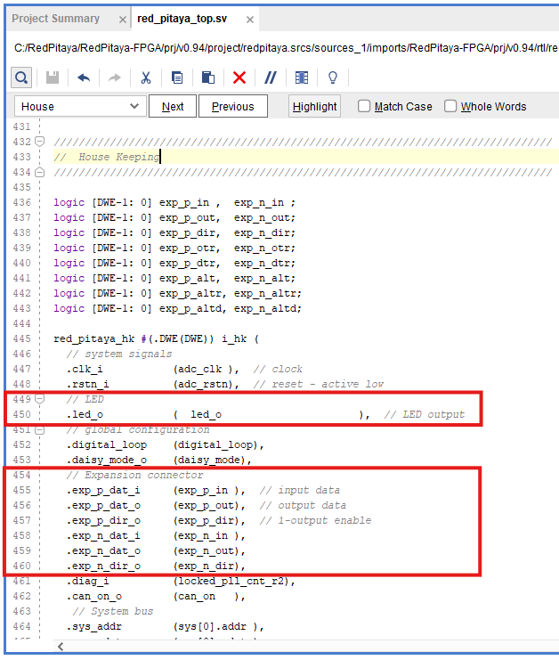

.. _fpga_modify_project:

###########################
修改 FPGA 项目
###########################

项目修改可以包括更改设计功能、添加新特性或修复错误。本指南将重点介绍如何修改现有的 v0.94 FPGA 项目以改变 LED 输出行为，并添加自定义组件。
这两项修改将帮助你了解 FPGA 项目的工作流程，以及如何根据需求进行调整。

.. contents:: 目录
    :local:
    :depth: 2
    :backlinks: top

|

前置条件
==================

本示例项目没有特定的前置条件，但熟悉 Verilog 和 FPGA 设计概念会有所帮助。

**兼容的板卡型号：**

* 所有 Red Pitaya 板卡

**基于：**

* :ref:`v0.94 FPGA project <fpga_project_v0_94>`

如果需要了解 v0.94 FPGA 项目的详细说明，请点击上面的链接。

.. note::

    由于硬件特性，不同 Red Pitaya 板卡型号的 v0.94 FPGA 项目略有差异，因此教程中提到的确切代码行可能会略有不同。

|

删除多余的设计源文件
===================================

在此步骤中，我们将从项目中删除不必要的设计源文件，使项目保持整洁有序。

1.  **定位设计源**：在 Vivado 的 **Sources** 面板中找到 **Design Sources** 目录。

    .. figure:: img/Vivado-design-sources.png
        :width: 500
        :align: center

#.  **禁用不必要的文件**：可以看到，**Design Sources** 中包含许多不同的 Verilog 文件，其中大多数并不用于 v0.94 项目（多数文件包含旧功能，或针对不同板卡型号的 v0.94 项目替代功能）。与本项目相关的唯一文件树位于列表顶部，以**粗体**显示，旁边有一个小金字塔图标。按住 **Shift** 选中其他所有文件，**右键单击**并选择 **Disable file**，将它们从项目中“排除”。

    .. figure:: img/Vivado-design-sources-disable.png
        :width: 500
        :align: center

#.  **对树状结构重复操作**：由于大多数被禁用文件采用树状文件结构，请重复第 2 步，直到只剩下 **red_pitaya_top** 文件树。

    .. figure:: img/Vivado-design-sources-disable-step2.png
        :width: 500
        :align: center

    .. figure:: img/Vivado-design-sources-disable-finish.png
        :width: 500
        :align: center

|

.. _fpga_tutorial_led_blink:

简单 LED 闪烁
==================

在本次项目修改中，我们将选取一个现有信号（具体是 LED）并修改其行为。

首先打开上一节创建的 Vivado 项目。如果尚未创建项目，请参阅 :ref:`在 Vivado 中创建 FPGA 项目 <fpga_create_project>` 一节。

为简化操作，我们只编辑顶层模块 **red_pitaya_top.sv**，并使用已有信号。

1.  **打开顶层模块**：打开 **red_pitaya_top.sv** 文件。在 Vivado 的 **Sources** 面板中，于 **Design Sources** 目录下找到 **red_pitaya_top.sv** 文件。双击文件名，在编辑器中打开。

    .. figure:: img/Tutorial_blink/Vivado-redpitaya-top.png
        :width: 1200
        :align: center

#.  **修改 LED 端口**：将顶层模块/实体第 119 行的 **led_o** 端口从 **inout logic** 改为 **output logic**。这样便可直接从 FPGA 设计控制 LED 输出，跳过复杂的三态逻辑。

    .. figure:: img/Tutorial_blink/Vivado-tutorial-led-logic-change.png
        :width: 800
        :align: center

#.  **在 House Keeping 部分注释 LED 端口**：向下滚动到 **House Keeping** 部分，也可以使用 *Ctrl+F* 搜索关键词 **House Keeping**。该部分包含管理 LED 和 GPIO 的代码。将 **led_o** 端口注释掉。

    .. figure:: img/Tutorial_blink/Vivado-tutorial-comment-led.png
        :width: 800
        :align: center

#.  **插入 LED 闪烁代码**：继续向下滚动到空的 **LED** 部分。插入以下代码，使 LED 0 闪烁。

    .. code-block:: Verilog

        reg [27:0]counter = 28'd0;
        reg led = 1'b0;

        always @ (posedge adc_clk) begin
            counter = counter+1;
            if (counter == 28'd256000000) begin      // 256e6 periods of adc_clock (core clock frequency)
                led = ~led;                          // led will blink with a period of aprox. 2 sec
                counter = 28'd0;                     // reset the counter
            end 
        end

        assign led_o[0] = led;                       // assign the register value to the led output

    由于计数器以 Red Pitaya 单元的核心时钟频率递增，闪烁周期会因板卡型号而异：

    * 2.083 秒（122.88 MHz）
    * 2.048 秒（125 MHz）
    * 1.024 秒（250 MHz）

    若要调整闪烁周期，请修改 **if (counter == 28'd256000000)** 行中的数值。

    .. figure:: img/Tutorial_blink/Vivado-tutorial-led-blink.png
       :width: 800
       :align: center

#.  **保存更改**：点击工具栏中的 **Save** 图标，或使用快捷键 *Ctrl+S* 保存更改。

#.  **综合设计**：修改代码后，需要综合设计以检查错误。点击工具栏中的 **Run ==> Synthesis** 按钮（绿色播放按钮），或点击最左侧 **Flow Navigator** 面板中的 **Run Synthesis** 选项。

    .. figure:: img/Tutorial_blink/Vivado-tutorial-run-synthesis.png
        :width: 1200
        :align: center

    .. figure:: img/Tutorial_blink/Vivado-tutorial-run-synthesis-popup.png
       :width: 500
       :align: center

#.  **查看综合结果（可选）**：综合完成后，Vivado 会显示综合结果摘要。如果没有错误，可以继续下一步。如果有错误，请查看 **Synthesis** 面板中的消息并进行修复。构建过程中，Vivado 还会检查代码中的警告或错误；如有问题，会显示在 Vivado 窗口底部的 **Messages** 面板中。构建 v0.94 项目时，Vivado 会报告一些可以安全忽略的警告。

#.  **打开综合后的设计**：综合完成后，会弹出包含综合结果及继续实现选项的窗口。如果想查看，可点击 **Open Synthesized Design** 按钮，在 Vivado 编辑器中打开综合后的设计。

    .. figure:: img/Tutorial_blink/Vivado-tutorial-run-synthesis-finish.png
        :width: 400
        :align: center

#.  **运行实现**：接下来进行实现步骤。与启动综合类似，点击工具栏中的 **Run ==> Implementation** 按钮（绿色播放按钮），点击最左侧 **Flow Navigator** 面板中的 **Run Implementation** 选项，或在综合结果弹窗中选择 **Run implementation**。

    .. figure:: img/Tutorial_blink/Vivado-tutorial-run-implementation.png
        :width: 1200
        :align: center

    .. figure:: img/Tutorial_blink/Vivado-tutorial-run-implementation-popup.png
       :width: 500
       :align: center

#.  **查看实现结果（可选）**：实现完成后，Vivado 会显示实现结果摘要。如果没有错误，可以继续下一步。如果有错误，请查看 **Implementation** 面板中的消息并进行修复。构建过程中 Vivado 还会检查代码中的警告或错误；如有问题，会显示在 Vivado 窗口底部的 **Messages** 面板中。构建 v0.94 项目时，Vivado 会报告一些可以安全忽略的警告。

    .. figure:: img/Tutorial_blink/Vivado-tutorial-run-implementation-finish.png
        :width: 400
        :align: center

#.  **生成比特流**：这是最后一步，可在 Vivado 的流程导航器中启动：进入 **Program and Debug** 部分，或点击工具栏中的 **Generate Bitstream** 按钮。

    .. figure:: img/Tutorial_blink/Vivado-tutorial-generate-bitstream.png
        :width: 1200
        :align: center

    .. note::
        
        **直接生成比特流**：还可以从一开始就直接生成比特流文件。此时 Vivado 会自动依次执行综合、实现和比特流生成，并提示需要采取的其他步骤。

#.  **查看比特流生成结果**：比特流生成完成后会出现以下弹窗。可以自行探索其中的不同选项，但现在请关闭弹窗。

    .. figure:: img/Tutorial_blink/Vivado-tutorial-generate-bitstream-finish.png
        :width: 400
        :align: center

#.  **定位比特流文件**：比特流文件以顶层模块命名为 **red_pitaya_top.bit**，位于下载的 Red Pitaya FPGA Repository 的 **/prj/v0.94/project/repitaya.runs/impl_1** 目录中。

下一步是将比特流传输到 Red Pitaya 板卡并加载到 FPGA。相关说明请参阅 :ref:`重新编程 FPGA <fpga_reprogramming>` 一节。

|

.. _fpga_tutorial_cust_comp:

添加自定义组件
==========================

首先打开在 :ref:`上一节 <fpga_create_project>` 创建的 Vivado 项目。如果尚未创建项目，请参阅 :ref:`在 Vivado 中创建 FPGA 项目 <fpga_create_project>` 一节。

这里将重点介绍如何向现有 v0.94 FPGA 项目添加名为 **red_pitaya_proc** 的自定义组件/模块，并将现有信号重新路由到该组件。这有助于理解如何将自定义设计集成到 Red Pitaya FPGA 项目结构中。
描述自定义组件所使用的源文件和 HDL 语言并不重要，因为 HDL 语言的特性允许我们将每个模块视为具有明确输入、输出端口的黑盒。只要“黑盒”具有预期端口（名称、宽度和方向匹配），就可以集成到现有设计中。

自定义组件将具有以下功能：

* **系统总线连接**：使组件能够与 Red Pitaya 系统总线通信并接收主机命令。
* **ADC**：连接 ADC，接收来自 IN1 和 IN2 的输入信号进行处理。
* **DAC**：连接 DAC，将处理后的输出信号发送到 OUT1 和 OUT2。
* **GPIO**：使用 GPIO 执行通用输入/输出操作。
* **LED**：控制 LED，用于状态指示和调试。

如 :ref:`v0.94 FPGA 项目说明 <fpga_project_v0_94>` 所述，Red Pitaya 的系统总线分为八个区段。通常可以将自定义组件连接到空闲区段之一，但在本示例中，我们将替换现有的 **PID** 组件。

|

对 red_pitaya_top 的修改
--------------------------

1.  **移除现有组件**：移除现有组件很简单，只需删除将不需要的组件连接到顶层模块的代码。在 **red_pitaya_top.sv** 文件中找到 **MIMO PID controller** 部分，并将整个部分注释掉。

    .. figure:: img/Tutorial_custom_comp/Vivado-tutorial-mimo-pid.png
        :width: 800
        :align: center

    在某些项目中（例如面向 *SIGNALlab 250-12* 的 *v0.94_250*），PID 组件已经被注释掉，但仍有几行代码用于确保系统总线正常工作。请将与系统总线相关的行注释掉，但保留 *pid_dat* 信号。仔细观察连接到 PID 组件的信号，就可以推断出需要连接到自定义组件的信号。

    .. figure:: img/Tutorial_custom_comp/Vivado-tutorial-mimo-pid-250.png
        :width: 800
        :align: center

    .. figure:: img/Tutorial_custom_comp/Vivado-tutorial-mimo-pid-250-comment.png
        :width: 800
        :align: center

#.  **添加自定义组件连接**：我们将在 **red_pitaya_top.sv** 文件最末尾、最终 `endmodule` 语句之前添加自定义组件连接。首先复制现有的 **PID component** 实例化代码，再逐步修改，使其匹配自定义组件接口。

    .. code-block:: Verilog

        red_pitaya_proc #(
            // Generic parameters

        )
        i_proc(
            // Signals
            .clk_i          (adc_clk         ), // clock
            .rstn_i         (adc_rstn        ), // reset - active low
            
            // ADC
            .dat_a_in       (                ), // IN 1
            .dat_b_in       (                ), // IN 2

            // DAC
            .dat_a_out      (                ), // OUT 1
            .dat_b_out      (                ), // OUT 2

            // System bus
            .sys_addr       (sys[3].addr     ), // System address
            .sys_wdata      (sys[3].wdata    ), // Write data
            .sys_wen        (sys[3].wen      ), // Write enable
            .sys_ren        (sys[3].ren      ), // Read enable
            .sys_rdata      (sys[3].rdata    ), // Read data
            .sys_err        (sys[3].err      ), // Error
            .sys_ack        (sys[3].ack      ), // Acknowledge
        );

由于需要进行多项修改，下面将逐步完成这些操作。

|

GPIO 和 LED
~~~~~~~~~~~~~~~

默认情况下，GPIO 和 LED 连接到 **House Keeping module (red_pitaya_hk)**。我们需要断开这些连接，并改为连接到自定义组件。

:ref:`E1 连接器 <E1>` 上的数字引脚直接连接到 FPGA。在 FPGA 内部，它们首先连接到输入输出缓冲器，该缓冲器将每个引脚的信号拆分为三个数字信号：

* 输入数据
* 输出数据
* 方向控制（0 = 输入，1 = 输出）

此外，GPIO 引脚有两排，可视为差分对（标记为 P 和 N），因此总共有 6 个 GPIO 信号：

* ``exp_p_in`` - P 排输入数据
* ``exp_p_out`` - P 排输出数据
* ``exp_p_dir`` - P 排方向控制
* ``exp_n_in`` - N 排输入数据
* ``exp_n_out`` - N 排输出数据
* ``exp_n_dir`` - N 排方向控制

这些信号的宽度对应 E1 连接器上的 GPIO 引脚数量（通常为 8 或 11）。每一位代表对应排中的一个 GPIO 引脚（LSB 为引脚 0）。

#.  **将 GPIO 和 LED 信号复制到自定义组件**：从 **House Keeping** 部分复制 GPIO 和 LED 信号连接，并粘贴到自定义组件实例化代码中。GPIO 将连接到 **exp_p_in**、**exp_p_out**、**exp_p_dir**、**exp_n_in**、**exp_n_out** 和 **exp_n_dir** 信号，LED 将连接到 **led_o** 信号。然后注释掉 **House Keeping** 部分中的原始连接。

    .. figure:: img/Tutorial_custom_comp/Vivado-tutorial-housekeeping-comment.png
        :width: 800
        :align: center

#.  **添加 GPIO 宽度通用参数**：我们还将添加通用参数 DW（digital width，数字宽度）来确定 GPIO 信号宽度。这样可以轻松适配 GPIO 引脚数量不同的板卡型号。

    此时自定义组件实例化代码应如下所示：

    .. code-block:: Verilog

        red_pitaya_proc #(
            // Generic parameters
            .DW             (DWE             )  // GPIO bus width
        )
        i_proc(
            // Signals
            .clk_i          (adc_clk         ), // clock
            .rstn_i         (adc_rstn        ), // reset - active low
            
            // ADC
            .dat_a_in       (                ), // IN 1
            .dat_b_in       (                ), // IN 2

            // DAC
            .dat_a_out      (                ), // OUT 1
            .dat_b_out      (                ), // OUT 2

            // GPIO + LED
            .led_o          (led_o           ), // LED output
            .gpio_p_i       (exp_p_in        ), // GPIO P row input
            .gpio_p_o       (exp_p_out       ), // GPIO P row output
            .gpio_p_dir     (exp_p_dir       ), // GPIO P row direction
            .gpio_n_i       (exp_n_in        ), // GPIO N row input
            .gpio_n_o       (exp_n_out       ), // GPIO N row output
            .gpio_n_dir     (exp_n_dir       ), // GPIO N row direction

            // System bus
            .sys_addr       (sys[3].addr     ), // System address
            .sys_wdata      (sys[3].wdata    ), // Write data
            .sys_wen        (sys[3].wen      ), // Write enable
            .sys_ren        (sys[3].ren      ), // Read enable
            .sys_rdata      (sys[3].rdata    ), // Read data
            .sys_err        (sys[3].err      ), // Error
            .sys_ack        (sys[3].ack      ), // Acknowledge
        );

|

ADC and DAC
~~~~~~~~~~~~~~~

现在配置 ADC 和 DAC 连接。ADC 和 DAC 信号已在顶层模块中定义，因此只需将它们连接到自定义组件。

.. note::

    某些 Red Pitaya 板卡型号（例如 :ref:`STEMlab 125-14 4-Input <top_125_14_4-IN>`）具有不同数量的 ADC 和 DAC 通道。本教程代码片段基于双通道配置，但只需相应修改信号名称和宽度即可轻松适配其他板卡型号。例如，对于四通道 ADC 配置，在自定义组件中创建 4 个输入端口，并将它们连接到顶层模块中对应的 ADC 信号。

#.  **添加新的 ADC 和 DAC 总线**：首先为 ADC 和 DAC 信号添加新总线，用它替换组件的 ``pid_dat`` 输出。在 *ASG* 和 *PID* 总线声明附近（约第 200 行）添加以下代码，同时注释掉原 PID 总线声明。

    .. code-block:: Verilog

        // CUSTOM
        SBG_T [2-1:0]            dac_proc_o;    //! Add Modified DAC signal
        SBA_T [MNA-1:0]          adc_proc_dat;  //! Add Modified ADC signal

        // PID
        //SBA_T [2-1:0]            pid_dat;    //! disable PID

    .. figure:: img/Tutorial_custom_comp/Vivado-tutorial-custom-buses.png
        :width: 800
        :align: center

#.  **移除 PID 信号**：接下来移除现有 PID 信号，并在其位置连接自定义 DAC 总线。这样即可将自定义组件处理后的输出信号发送到 DAC 输出。进入 **DAC IO** 部分并修改以下代码行。

    .. code-block:: Verilog

        // assign dac_a_sum = asg_dat[0] + pid_dat[0];      //! (disable PID)
        // assign dac_b_sum = asg_dat[1] + pid_dat[1];      //! (disable PID)

        assign dac_a_sum = dac_proc_o[0];   // Direct assign, to leave space for PID
        assign dac_b_sum = dac_proc_o[1];

    .. figure:: img/Tutorial_custom_comp/Vivado-tutorial-reconfigure-dac-sigs.png
        :width: 800
        :align: center

#.  **修改 ADC（示波器）连接**：将 **oscilloscope (rp_scope_com) component** 中的 ADC 连接改为连接新 ADC 总线，而不是原始 ADC 信号。这样便可使用示波器应用监测自定义组件处理后的输入信号。

    .. code-block:: Verilog

        // ADC
        .adc_dat_i     ({adc_proc_dat[1], adc_proc_dat[0]}  ),    //! adc_dat

    .. figure:: img/Tutorial_custom_comp/Vivado-tutorial-reconfigure-scope.png
        :width: 800
        :align: center

#.  **连接自定义组件**：最后，将 ``adc_dat``（SIGNALlab 250-12 使用 ``adc_dat_sw``）、``asg_dat`` 以及两个自定义总线（``adc_proc_dat`` 和 ``dac_proc_o``）连接到自定义组件。

    .. code-block:: Verilog

        ////////////////////////////////////////////////////
        // Custom processing component
        ////////////////////////////////////////////////////

        red_pitaya_proc #(
            .DW             (DWE             )  // GPIO bus width
        )
        i_proc(
            // Signals
            .clk_i          (adc_clk         ), // clock
            .rstn_i         (adc_rstn        ), // reset - active low

            // ADC
            .adc_a_in       (adc_dat[0]      ), // IN 1 - ADC input
            .adc_b_in       (adc_dat[1]      ), // IN 2 - ADC input
            .adc_a_out      (adc_proc_dat[0] ), // IN 1 - to scope
            .adc_b_out      (adc_proc_dat[1] ), // IN 2 - to scope

            // DAC
            .dac_a_in       (asg_dat[0]      ), // OUT 1 - from signal generator (ASG)
            .dac_b_in       (asg_dat[1]      ), // OUT 2 - from signal generator (ASG)
            .dac_a_out      (dac_proc_o[0]   ), // OUT 1 - DAC output
            .dac_b_out      (dac_proc_o[1]   ), // OUT 2 - DAC output
            
            // GPIO + LED
            .led_o          (led_o           ), // LED output
            .gpio_p_in      (exp_p_in        ), // GPIO P row input
            .gpio_p_out     (exp_p_out       ), // GPIO P row output
            .gpio_p_dir     (exp_p_dir       ), // GPIO P row direction
            .gpio_n_in      (exp_n_in        ), // GPIO N row input
            .gpio_n_out     (exp_n_out       ), // GPIO N row output
            .gpio_n_dir     (exp_n_dir       ), // GPIO N row direction

            // System bus
            .sys_addr       (sys[3].addr     ), // System address
            .sys_wdata      (sys[3].wdata    ), // Write data
            .sys_wen        (sys[3].wen      ), // Write enable
            .sys_ren        (sys[3].ren      ), // Read enable
            .sys_rdata      (sys[3].rdata    ), // Read data
            .sys_err        (sys[3].err      ), // Error
            .sys_ack        (sys[3].ack      )  // Acknowledge
        );

    .. note::

        * 由于已将 GPIO 和 LED 从 House Keeping 模块断开，用于控制它们的 SCPI 和 API 命令将无法工作。可以在自定义组件中添加用于控制 GPIO 和 LED 的自定义寄存器（另一个教程会介绍）。
        * 自定义组件的 DAC 信号会与现有信号发生器的输出（如果启用）相加。如果只想使用自定义组件的 DAC 输出，可以修改 **DAC IO** 部分以移除信号发生器的贡献，或从设计中排除 **ASG** 组件。

#.  **确认未知组件**：保存对 **red_pitaya_top.sv** 文件的更改后，会看到 Vivado 在 **Design Sources** 面板中添加一个未知组件。这是因为自定义组件尚未创建。

    .. figure:: img/Tutorial_custom_comp/Vivado-tutorial-custom-component-new.png
        :width: 500
        :align: center

|

设计新的自定义组件
---------------------------------

由于 HDL 语言具有“黑盒”特性，我们可以用任意 HDL 语言（Verilog、VHDL 等）编写自定义组件，只要输入和输出端口的名称、宽度及方向与预期匹配即可正常工作。下面将分别创建 Verilog 和 VHDL 版本的自定义组件。

#.  **添加新的设计源**：要向项目添加新的 *Design Source*，可以点击 **Sources** 面板中的 **+** 按钮，或右键单击 **Design Sources** 目录并选择 **Add Sources**。

    .. figure:: img/Tutorial_custom_comp/Vivado-tutorial-custom-add-sources.png
        :width: 500
        :align: center

#.  由于要添加新模块，需要选择 **Add or create design sources**。

    .. figure:: img/Tutorial_custom_comp/Vivado-tutorial-custom-add-sources-panel.png
        :width: 600
        :align: center

    如果已经有自定义组件的 HDL 代码，可以选择 **Add Files** 并浏览到文件位置。本例将创建新文件，因此请选择 **Create File**。

    .. figure:: img/Tutorial_custom_comp/Vivado-tutorial-custom-create-file.png
        :width: 600
        :align: center

#.  **选择文件类型**：选择 **File type**（Verilog 或 VHDL），并输入 **File name**（red_pitaya_proc）。点击 **OK** 创建新文件。

    .. figure:: img/Tutorial_custom_comp/Vivado-tutorial-custom-create-file-name.png
        :width: 400
        :align: center

#.  **完成新文件添加**：新文件会加入待添加到项目的文件列表。点击 **Finish** 完成操作。

    .. figure:: img/Tutorial_custom_comp/Vivado-tutorial-custom-create-file-finish.png
        :width: 600
        :align: center

#.  **定义模块**：文件创建后会弹出另一个窗口，要求设置 *Module definition* 参数，例如实体名称、架构名称和 I/O 端口。我们将点击 **OK**，因为直接在代码编辑器中编辑端口更方便。

    .. figure:: img/Tutorial_custom_comp/Vivado-tutorial-custom-define-module.png
        :width: 600
        :align: center

#.  **确认模块定义**：点击 **Yes**。

    .. figure:: img/Tutorial_custom_comp/Vivado-tutorial-custom-define-module-finish.png
        :width: 500
        :align: center

#.  **打开新文件**：Vivado 完成重新加载后，可以在 **Design Sources** 面板中看到新文件。双击文件名，在编辑器中打开。

    .. figure:: img/Tutorial_custom_comp/Vivado-tutorial-component-inserted.png
        :width: 1200
        :align: center

#.  **复制代码**：现在将以下代码复制到文件中。下面将逐步介绍其功能。

    .. tabs::

        .. tab:: VHDL

            .. code-block:: vhdl

                library IEEE;
                use IEEE.std_logic_1164.all;
                use IEEE.numeric_std.all;

                entity red_pitaya_proc is
                generic(
                  DW                      :       integer := 8                        -- GPIO width
                );
                port (
                  clk_i                   : in    std_logic;
                  rstn_i                  : in    std_logic;                          -- bus reset - active low

                  sys_addr                : in    std_logic_vector(31 downto 0);      -- bus address
                  sys_wdata               : in    std_logic_vector(31 downto 0);      -- bus write data
                  sys_wen                 : in    std_logic;                          -- bus write enable
                  sys_ren                 : in    std_logic;                          -- bus read enable
                  sys_rdata               : out   std_logic_vector(31 downto 0);      -- bus read data
                  sys_err                 : out   std_logic;                          -- bus error indicator
                  sys_ack                 : out   std_logic;                          -- bus acknowledge signal

                  adc_a_in, adc_b_in      : in    signed(13 downto 0);                -- ADC 1 & 2 input
                  adc_a_out, adc_b_out    : out   signed(13 downto 0);                -- to scope

                  dac_a_in, dac_b_in      : in    signed(13 downto 0);                -- from signal generator (ASG)
                  dac_a_out, dac_b_out    : out   signed(13 downto 0);                -- DAC 1 & 2 output

                  led_o                   : out   std_logic_vector(   7 downto 0);    -- LED output
                  gpio_p_in, gpio_n_in    : in    std_logic_vector(DW-1 downto 0);    -- GPIO input data
                  gpio_p_out, gpio_n_out  : out   std_logic_vector(DW-1 downto 0);    -- GPIO output data
                  gpio_p_dir, gpio_n_dir  : out   std_logic_vector(DW-1 downto 0)     -- GPIO direction 
                );
                end red_pitaya_proc;

                architecture RTL of red_pitaya_proc is

                -- ### SIGNALS ### --
                constant ZERO           : std_logic_vector(31 downto 0) := (others => '0');         -- Padding registers
                constant ID_REG         : std_logic_vector(31 downto 0) := X"FEEDBACC";             -- ID register
                
                -- LED & GPIO --
                
                signal diop_in,  dion_in    : std_logic_vector(DW-1 downto 0);                      -- GPIO input
                signal diop_out, dion_out   : std_logic_vector(DW-1 downto 0) := (others => '0');   -- GPIO output
                signal diop_dir, dion_dir   : std_logic_vector(DW-1 downto 0) := (others => '0');   -- Direction in == 0, out == 1
                
                signal led                  : std_logic_vector(   7 downto 0) := (others => '0');   -- LED status

                begin

                -- ### Registers, write & control logic ### --
                -- Red Pitaya core clock frequency
                pbus: process(clk_i)
                begin
                  if rising_edge(clk_i) then
                    if rstn_i = '0' then
                      -- LED & GPIO --
                      diop_dir <= (others => '0');
                      dion_dir <= (others => '0');
                      diop_out <= (others => '0');
                      dion_out <= (others => '0');
                      led <= (others => '0');

                    else
                      sys_ack <= sys_wen or sys_ren;                      -- acknowledge transactions
                        
                      -- decode address & write registers
                      if sys_wen='1' then
                        if    sys_addr(19 downto 0) = X"00010" then
                          diop_dir <= sys_wdata(DW-1 downto 0);           -- Change direction P

                        elsif sys_addr(19 downto 0) = X"00014" then
                          dion_dir <= sys_wdata(DW-1 downto 0);           -- Change direction N

                        elsif sys_addr(19 downto 0) = X"00018" then
                          diop_out <= sys_wdata(DW-1 downto 0);           -- Change output P

                        elsif sys_addr(19 downto 0) = X"0001C" then
                          dion_out <= sys_wdata(DW-1 downto 0);           -- Change output N

                        elsif sys_addr(19 downto 0) = X"00030" then
                          led <= sys_wdata(7 downto 0);                   -- Change LEDs

                        end if;
                      end if;
                    end if;
                  end if;
                end process pbus;

                sys_err <= '0';

                -- ADC & DAC processing --
                adc_a_out <= adc_a_in;
                adc_b_out <= adc_b_in;
                dac_a_out <= dac_a_in;
                dac_b_out <= dac_b_in;

                -- GPIO I/O assignment --
                gpio_p_out <= diop_out;
                gpio_n_out <= dion_out;
                gpio_p_dir <= diop_dir;
                gpio_n_dir <= dion_dir;
                diop_in <= gpio_p_in;
                dion_in <= gpio_n_in;

                -- LED output assignment --
                led_o <= led;

                -- ### Decode address & read data ### --
                with sys_addr(19 downto 0) select
                  sys_rdata <=                          ID_REG              when x"00000",      -- ID register
                              ZERO(32-1 downto DW)    & diop_dir            when x"00010",      -- GPIO P direction
                              ZERO(32-1 downto DW)    & dion_dir            when x"00014",      -- GPIO N direction
                              ZERO(32-1 downto DW)    & diop_out            when x"00018",      -- GPIO P output
                              ZERO(32-1 downto DW)    & dion_out            when x"0001C",      -- GPIO N output
                              ZERO(32-1 downto DW)    & diop_in             when x"00020",      -- GPIO P inputs
                              ZERO(32-1 downto DW)    & dion_in             when x"00024",      -- GPIO N inputs
                              ZERO(32-1 downto  8)    & led                 when x"00030",      -- LEDs
                              ZERO when others;

                end RTL;

        .. tab:: Verilog

            .. code-block:: Verilog

                module red_pitaya_proc # (
                  parameter DW = 8                                // Digital width (number of GPIO pins)
                ) (
                  input                clk_i,                     // Clock input
                  input                rstn_i,                    // bus reset - active low

                  input       [  31:0] sys_addr,                  // bus address
                  input       [  31:0] sys_wdata,                 // bus write data
                  input                sys_wen,                   // bus write enable
                  input                sys_ren,                   // bus read enable
                  output reg  [  31:0] sys_rdata,                 // bus read data
                  output wire          sys_err,                   // bus error indicator
                  output reg           sys_ack,                   // bus acknowledge signal

                  input       [  13:0] adc_a_in, adc_b_in,        // ADC 1 & 2 input
                  output wire [  13:0] adc_a_out, adc_b_out,      // to scope

                  input       [  13:0] dac_a_in, dac_b_in,        // from signal generator (ASG)
                  output wire [  13:0] dac_a_out, dac_b_out,      // DAC 1 & 2 output

                  output wire [   7:0] led_o,                     // LED output
                  input       [DW-1:0] gpio_p_in, gpio_n_in,      // GPIO input data
                  output wire [DW-1:0] gpio_p_out, gpio_n_out,    // GPIO output data
                  output wire [DW-1:0] gpio_p_dir, gpio_n_dir     // GPIO direction
                );

                  // Internal signals
                  reg        [DW-1:0] diop_dir;
                  reg        [DW-1:0] dion_dir;
                  reg        [DW-1:0] diop_out;
                  reg        [DW-1:0] dion_out;
                  wire       [DW-1:0] diop_in;
                  wire       [DW-1:0] dion_in;
                  reg        [   7:0] led;

                  // ADC & DAC passthrough
                  assign adc_a_out = adc_a_in;
                  assign adc_b_out = adc_b_in;
                  assign dac_a_out = dac_a_in;
                  assign dac_b_out = dac_b_in;

                  // Bus process
                  always @(posedge clk_i) begin
                    if (!rstn_i) begin
                      diop_dir <= {DW{1'b0}};
                      dion_dir <= {DW{1'b0}};
                      diop_out <= {DW{1'b0}};
                      dion_out <= {DW{1'b0}};
                      led      <= 8'b0;
                    end else begin
                      sys_ack <= sys_wen | sys_ren;

                      if (sys_wen) begin
                        case (sys_addr[19:0])
                          20'h00010: diop_dir <= sys_wdata[DW-1:0];
                          20'h00014: dion_dir <= sys_wdata[DW-1:0];
                          20'h00018: diop_out <= sys_wdata[DW-1:0];
                          20'h0001C: dion_out <= sys_wdata[DW-1:0];
                          20'h00030: led      <= sys_wdata[7:0];
                        endcase
                      end
                    end
                  end

                  // Error handling
                  assign sys_err = 1'b0;

                  // Direct connections
                  assign gpio_p_dir = diop_dir;
                  assign gpio_n_dir = dion_dir;
                  assign gpio_p_out = diop_out;
                  assign gpio_n_out = dion_out;
                  assign diop_in    = gpio_p_in;
                  assign dion_in    = gpio_n_in;
                  assign led_o      = led;

                  // Read data
                  always @(*) begin
                    case (sys_addr[19:0])
                      20'h00000: sys_rdata = 32'hFEEDBACC;
                      20'h00010: sys_rdata = {{32-DW{1'b0}}, diop_dir};
                      20'h00014: sys_rdata = {{32-DW{1'b0}}, dion_dir};
                      20'h00018: sys_rdata = {{32-DW{1'b0}}, diop_out};
                      20'h0001C: sys_rdata = {{32-DW{1'b0}}, dion_out};
                      20'h00020: sys_rdata = {{32-DW{1'b0}}, diop_in};
                      20'h00024: sys_rdata = {{32-DW{1'b0}}, dion_in};
                      20'h00030: sys_rdata = {{32-8{1'b0}},  led};
                      default:   sys_rdata = 32'b0;
                    endcase
                  end
                endmodule

自定义组件的代码相对简单，具有以下功能：

* ID 寄存器。
* 通过系统总线控制 LED 和 GPIO。
* ADC 和 DAC 信号直通（输入信号发送到示波器，输出信号发送到 DAC）。

如 :ref:`v0.94 FPGA 项目说明 <fpga_project_v0_94>` 所述，Red Pitaya 的系统总线分为八个区段，每个区段拥有独立的 20 位地址空间。自定义组件连接到系统总线的第 3 区段，其基地址为 ``0x40300000``。高 12 位决定区段（第 3 区段为 ``0x403``），低 20 位用于寻址组件内部的寄存器。自定义组件包含以下寄存器：

* ``0x00000``：ID 寄存器
* ``0x00010``：数字输出方向（diop_dir）
* ``0x00014``：数字输入方向（dion_dir）
* ``0x00018``：数字输出数据（diop_out）
* ``0x0001C``：数字输入数据（dion_out）
* ``0x00030``：LED 控制（led）

在 Linux OS 中与自定义 FPGA 寄存器交互的最简单方式是使用 ``monitor`` 命令行工具。

|

#. **保存更改**：保存更改后，Vivado 会更新项目；自定义模块 ``red_pitaya_proc`` 将替换 ``red_pitaya_pid`` 模块，后者现在位于顶层模块之外。

    .. figure:: img/Tutorial_custom_comp/Vivado-tutorial-custom-component-finish.png
        :width: 500
        :align: center

#.  按照上面 `简单 LED 闪烁`_ 示例中的说明继续执行 **Synthesis, Implementation, and Bitstream Generation**。

下一章将介绍如何更改 Red Pitaya 板卡上的 FPGA 镜像。
