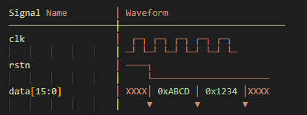

.. _fpga_simulation:

.. !! Verify and add pictures where needed

#############################
FPGA 仿真
#############################

仿真是 FPGA 开发的关键环节，可在部署到硬件之前验证设计功能。
本指南介绍如何使用 ModelSim 为 Red Pitaya FPGA 教程项目设置并运行仿真。

.. note::

    本指南将 ModelSim 作为 Red Pitaya FPGA 教程中使用的主要仿真工具。对于更复杂的设计，可以考虑 Vivado 内置的仿真器（XSIM），因为我们已经提供了一些 Red Pitaya 仿真脚本。

.. contents:: 目录
    :local:
    :depth: 1
    :backlinks: top

|

**********************************
概述
**********************************

为什么要仿真？
===============

**仿真的优势：**

- **更快调试** - 用几分钟而不是几小时发现并修复问题
- **硬件前验证** - 无需对 FPGA 编程即可测试功能
- **测试边界情况** - 仿真硬件上难以复现的条件
- **波形分析** - 观察硬件上无法访问的内部信号
- **回归测试** - 自动验证设计变更
- **文档记录** - 为技术文档生成波形

**何时进行仿真：**

- 首次硬件实现之前
- 每次重大设计变更之后
- 调试意外的硬件行为时
- 在 CI/CD 流程中进行自动化测试
- 验证时序和信号完整性

|

仿真与硬件测试对比
====================

.. list-table::
    :header-rows: 1
    :widths: 40 30 30

    * - 方面
      - 仿真
      - 硬件
    * - **速度**
      - 较慢（复杂设计可能需要数小时）
      - 实时运行
    * - **可见性**
      - 可查看所有内部信号
      - 只能访问外部引脚（除非使用 ILA）
    * - **成本**
      - 免费（仅需软件）
      - 需要硬件、电源和设备
    * - **设置**
      - 快速（编辑代码、运行仿真）
      - 较慢（构建、编程、连接）
    * - **准确性**
      - 取决于模型保真度
      - 真实世界行为
    * - **调试**
      - 容易（回退、检查任意信号）
      - 受限（只能实时查看）

**最佳实践：** 先进行仿真，再在硬件上验证。

|

**********************************
仿真工具
**********************************

本指南介绍本节 FPGA 教程推荐的仿真工具。由于使用的是简单代码和测试平台，我们将 ModelSim 作为主要仿真工具。对于更复杂的设计，可以考虑 Vivado 内置仿真器（XSIM），因为我们已经提供了一些 Red Pitaya 仿真脚本。

可用的仿真器
====================

Red Pitaya FPGA 项目支持多种仿真工具：

|

ModelSim（推荐）
----------------------

**ModelSim-Altera Starter Edition** - Intel/Altera 提供的免费版本

**优势：**

- 免费使用
- 编译和仿真速度快
- 优秀的波形查看器
- 文档完善
- 行业标准工具
- 安装轻量

**限制：**

- 代码限制为 10,000 行（足以满足大多数 Red Pitaya 模块）

**下载** `ModelSim-Altera Starter Edition 20.1.1 <https://www.intel.com/content/www/us/en/software-kit/750666/modelsim-intel-fpgas-standard-edition-software-version-20-1-1.html>`_

.. note::

    Red Pitaya FPGA 教程使用 ModelSim-Altera Starter Edition 20.1.1，因为这是最后一个仅包含仿真功能的独立 ModelSim 版本。较新的 ModelSim 已集成到 Intel Quartus Prime 中，并附带教程不需要的额外功能。

|

Vivado 仿真器（XSIM）
------------------------

**Vivado 内置** - 无需单独安装

**优势：**

- 与 Vivado IDE 集成
- 无需单独安装
- 可直接集成项目

**限制：**

- 复杂设计中比 ModelSim 慢
- 波形查看器功能较少
- 命令行使用不够方便

.. note::

    Red Pitaya FPGA 项目包含一些 XSIM 仿真脚本，可帮助仿真 Red Pitaya 板卡的复杂逻辑。

|

Questa Sim（商业版）
-----------------------

**专业版本** - 需要付费许可证

**优势：**

- 高级调试功能
- 大型设计中性能更好
- 完整支持 SystemVerilog

**使用场景：** 具有复杂验证需求的生产环境

|

**********************************
ModelSim 安装
**********************************

前置条件
=============

**系统要求：**

- **操作系统：** Ubuntu 18.04/20.04 或更高版本，Windows 10 或更高版本
- **内存：** 最低 4 GB，建议 8 GB
- **磁盘空间：** ModelSim 安装需要 2 GB
- **显示：** Windows 使用本地图形界面，Linux 使用 X11

|

步骤 1：下载 ModelSim
==========================

1. 访问 Intel FPGA 下载页面：
   
   https://www.intel.com/content/www/us/en/software-kit/750666/modelsim-intel-fpgas-standard-edition-software-version-20-1-1.html

2. 选择 **ModelSim-Intel® FPGAs Standard Edition Software Version 20.1.1**

3. 选择 **Individual Files** 选项卡

4. 下载 **ModelSim-Intel® FPGA Edition (includes Starter Edition)**

    - Linux installer: ``ModelSimSetup-20.1.1.720-linux.run``
    - Windows installer: ``ModelSimSetup-20.1.1.720-windows.exe``
    - 大小：约 1.5 GB（因平台略有差异）

.. note::

    可能需要注册账户。Starter Edition 免费。

|

步骤 2：安装
====================

Linux 安装
------------------

**使安装程序可执行：**

.. code-block:: bash

    chmod +x ModelSimSetup-20.1.1.720-linux.run

**运行安装程序：**

.. code-block:: bash

    ./ModelSimSetup-20.1.1.720-linux.run

**按照安装向导操作：**

1. 接受许可协议
2. 选择安装目录（默认：``$HOME/intelFPGA/20.1``）
3. 选择 **ModelSim - Intel FPGA Starter Edition**
4. 完成安装

**默认安装路径：**

.. code-block:: text

    $HOME/intelFPGA/20.1/modelsim_ase/

Windows 安装（原生）
-----------------------------

1. 运行 ``ModelSimSetup-20.1.1.720-windows.exe``
2. 接受许可协议
3. 选择安装目录（默认类似于 ``C:\intelFPGA\20.1``）
4. 选择 **ModelSim - Intel FPGA Starter Edition**
5. 完成安装

**Default installation path:**

.. code-block:: text

    C:\intelFPGA\20.1\modelsim_ase\

|

步骤 3：安装后设置
=========================================

Linux 安装后设置
-----------------------

**修复路径问题：**

Ubuntu 安装不会创建预期的 ``linux_rh60`` 符号链接。请手动创建：

.. code-block:: bash

    cd $HOME/intelFPGA/20.1/modelsim_ase/
    ln -s linux linux_rh60

**安装所需的 32 位库：**

.. code-block:: bash

    sudo dpkg --add-architecture i386
    sudo apt-get update
    sudo apt-get install libc6:i386 libncurses5:i386 libstdc++6:i386
    sudo apt-get install libxft2:i386 libxext6:i386 libxtst6:i386

**添加到 PATH（可选但推荐）：**

Edit ``~/.bashrc``:

.. code-block:: bash

    nano ~/.bashrc

在末尾添加：

.. code-block:: bash

    # ModelSim
    export PATH=$HOME/intelFPGA/20.1/modelsim_ase/bin:$PATH

保存并重新加载：

.. code-block:: bash

    source ~/.bashrc

Windows 安装后设置
-------------------------

将 ModelSim 添加到 PATH（可选但推荐）：

1. 打开 **System Properties** -> **Advanced** -> **Environment Variables**
2. 编辑用户变量或系统变量中的 **Path** 变量
3. 添加：

.. code-block:: text

    C:\intelFPGA\20.1\modelsim_ase\win32aloem

然后打开新的 PowerShell 窗口并验证：

.. code-block:: powershell

    vsim -version

|

步骤 4：验证安装
============================

**检查 ModelSim 版本：**

.. code-block:: bash

    vsim -version

**预期输出：**

.. code-block:: text

    Model Technology ModelSim - Intel FPGA Starter Edition vsim 2020.1 Simulator 2020.02 Feb 28 2020
    Linux 4.15.0-135-generic #139-Ubuntu SMP Mon Jan 18 17:38:24 UTC 2021 x86_64

在 Windows 上，第二行将显示 Windows 平台字符串，而不是 Linux。

**测试图形界面启动：**

.. code-block:: bash

    vsim &

ModelSim GUI 应打开；验证后将其关闭。

|

Windows 安装（WSL，可选）
======================================

如果希望在 WSL 中运行 Linux 版本，请使用下面的可选流程。

**安装 WSL2：**

.. code-block:: powershell

    # Run in PowerShell as Administrator
    wsl --install -d Ubuntu-20.04

**安装用于图形界面的 X Server：**

1. 下载并安装 **VcXsrv** 或 **Xming**
2. 使用默认设置启动 X Server
3. In WSL, set DISPLAY:

   .. code-block:: bash
   
       echo 'export DISPLAY=$(cat /etc/resolv.conf | grep nameserver | awk '"'"'{print $2}'"'"'):0' >> ~/.bashrc
       source ~/.bashrc

**按照上面的 Ubuntu 安装步骤操作**

|

安装故障排除
=============================

**"vsim: command not found"**

.. code-block:: bash

    # Add to PATH manually
    export PATH=$HOME/intelFPGA/20.1/modelsim_ase/bin:$PATH

**"libxft.so.2: cannot open shared object file"**

.. code-block:: bash

    sudo apt-get install libxft2:i386

**GUI doesn't appear (WSL)**

.. code-block:: bash

    # Check X Server is running on Windows
    # Verify DISPLAY variable
    echo $DISPLAY
    
    # Test with simple app
    sudo apt-get install x11-apps
    xeyes

**"License file not found"**

Starter Edition should work without license. If prompted:

.. code-block:: bash

    # Set license variable (Starter Edition uses built-in license)
    export LM_LICENSE_FILE=$HOME/intelFPGA/20.1/modelsim_ase/license.dat

|

**********************************
运行仿真
**********************************

仿真工作流
===================

**基本工作流：**

1. 进入仿真目录
2. 选择要运行的测试平台
3. 编译设计文件
4. 运行仿真
5. 查看波形
6. 分析结果

|

Red Pitaya 仿真结构
================================

仿真文件位于每个项目的 tbn 目录中。

**进入仿真目录：**

.. code-block:: bash

    cd RedPitaya-FPGA/prj/<project_name>/tbn/

|

基本仿真命令
==========================

**运行不带波形的仿真：**

.. code-block:: bash

    make top_tb

该命令会编译并运行仿真，在终端显示结果。

**运行并打开波形窗口：**

.. code-block:: bash

    make top_tb WAV=1

打开带波形查看器和预配置​​信号组的 ModelSim GUI。

**使用自定义仿真时间运行：**

.. code-block:: bash

    make top_tb SIM_TIME=1us

可以覆盖默认仿真时间。

**清理仿真文件：**

.. code-block:: bash

    make clean

删除已编译的库和仿真产物。

|

可用的测试平台
=====================

**Red Pitaya FPGA 中常见的测试平台：**

.. list-table::
    :header-rows: 1
    :widths: 30 70

    * - Testbench
      - Description
    * - ``top_tb``
      - Top-level system testbench (complete FPGA)
    * - ``axi4_slave_tb``
      - AXI4 slave interface testbench
    * - ``axi4_if``
      - AXI4 master/slave communication testbench
    * - ``red_pitaya_scope_tb``
      - Oscilloscope module testbench
    * - ``red_pitaya_asg_tb``
      - Arbitrary signal generator testbench

.. note::

    Available testbenches depend on your Red Pitaya FPGA version. Check ``fpga/sim/`` for complete list.

|

理解仿真输出
================================

**仿真期间的控制台输出：**

.. code-block:: console

    # Compilation phase
    vlog -work work ../rtl/red_pitaya_top.sv
    Model Technology ModelSim - Intel FPGA Starter Edition vlog 2020.1 Compiler 2020.02 Feb 28 2020
    -- Compiling module red_pitaya_top
    
    # Elaboration phase  
    vsim -t 1ps -L work work.top_tb
    
    # Simulation run
    # Time: 0 ns  Iteration: 0  Instance: /top_tb
    # ** Note: Reset asserted
    #    Time: 100 ns  Iteration: 0  Instance: /top_tb
    # ** Note: Data written: 0xDEADBEEF
    #    Time: 1000 ns  Iteration: 0  Instance: /top_tb

**成功的仿真以以下内容结束：**

.. code-block:: console

    # ** Note: Simulation finished
    #    Time: 10000 ns  Iteration: 0  Instance: /top_tb
    # Success: Simulation completed without errors

**错误表现为：**

.. code-block:: console

    # ** Error: Assertion failed at address 0x1000
    #    Time: 5000 ns  Iteration: 0  Instance: /top_tb
    # Break in Module top_tb at top_tb.sv line 123

|

**********************************
波形分析
**********************************

打开波形查看器
=======================

**自动打开（使用 WAV=1）：**

.. code-block:: bash

    make top_tb WAV=1

**在 ModelSim 中手动打开：**

1. Launch ModelSim: ``vsim &``
2. File → Open → Select workspace directory
3. View → Wave window

|

波形配置脚本
===============================

许多测试平台包含用于组织波形的 ``.tcl`` 脚本：

**示例：``top_tb.tcl``**

.. code-block:: tcl

    # Add clock and reset
    add wave -noupdate -divider {Clock and Reset}
    add wave -format Logic /top_tb/clk
    add wave -format Logic /top_tb/rstn
    
    # Add AXI signals
    add wave -noupdate -divider {AXI Interface}
    add wave -format Literal -radix hexadecimal /top_tb/axi_awaddr
    add wave -format Logic /top_tb/axi_awvalid
    add wave -format Logic /top_tb/axi_awready
    
    # Add ADC data
    add wave -noupdate -divider {ADC Data}
    add wave -format Literal -radix decimal /top_tb/adc_dat_a
    add wave -format Literal -radix decimal /top_tb/adc_dat_b

**使用** ``WAV=1`` **时这些脚本会自动运行**

|

读取波形
=================

**波形基本元素：**

**信号状态：**

- **High (1)：** 逻辑高
- **Low (0)：** 逻辑低
- **X：** 未知/未初始化
- **Z：** 高阻态（三态）
- **Transitions：** 上升沿/下降沿

**进制选项：**

- **二进制：** 0b1010_1100
- **十六进制：** 0xAC（最常用）
- **十进制：** 172
- **无符号/有符号：** 数值解释方式

|

波形导航
===================

**缩放控制：**

- **放大：** Ctrl + 加号或鼠标滚轮
- **缩小：** Ctrl + 减号
- **完整缩放：** F（适合全部时间范围）
- **缩放范围：** 选择时间范围后按 Z

**光标和测量：**

1. **Main cursor (yellow):** Click on waveform
2. **Add reference cursor:** Right-click → Insert Cursor
3. **Measure time delta:** Distance between cursors shows Δt

**信号分组：**

- 为相关信号创建分组（例如“AXI Bus”“ADC Interface”）
- 折叠/展开分组以管理可见性
- ``top_tb.tcl`` 等脚本会预先组织信号

|

导出波形
===================

**保存波形视图：**

.. code-block:: tcl

    # In ModelSim TCL console
    write format wave -window .main_pane.wave.interior.cs.body.pw.wf simulation.vcd

**导出为图像：**

1. View → Wave window
2. File → Print
3. Select "Print to File"
4. Choose format (PNG, PDF, PostScript)

|

**********************************
创建自定义测试平台
**********************************

测试平台结构
===================

**基本 SystemVerilog 测试平台模板：**

.. code-block:: systemverilog

    `timescale 1ns / 1ps
    
    module my_module_tb;
    
        //----------------------------------------------------------------------
        // Parameters
        //----------------------------------------------------------------------
        parameter CLK_PERIOD = 8;  // 125 MHz = 8 ns period
        parameter DATA_WIDTH = 14;
        
        //----------------------------------------------------------------------
        // Signals
        //----------------------------------------------------------------------
        logic                   clk;
        logic                   rstn;
        logic [DATA_WIDTH-1:0]  data_in;
        logic [DATA_WIDTH-1:0]  data_out;
        logic                   valid;
        
        //----------------------------------------------------------------------
        // DUT (Device Under Test) Instantiation
        //----------------------------------------------------------------------
        my_module #(
            .DATA_WIDTH (DATA_WIDTH)
        ) dut (
            .clk      (clk),
            .rstn     (rstn),
            .data_i   (data_in),
            .data_o   (data_out),
            .valid_o  (valid)
        );
        
        //----------------------------------------------------------------------
        // Clock Generation
        //----------------------------------------------------------------------
        initial begin
            clk = 1'b0;
            forever #(CLK_PERIOD/2) clk = ~clk;
        end
        
        //----------------------------------------------------------------------
        // Reset Generation
        //----------------------------------------------------------------------
        initial begin
            rstn = 1'b0;
            repeat(10) @(posedge clk);
            rstn = 1'b1;
        end
        
        //----------------------------------------------------------------------
        // Test Stimulus
        //----------------------------------------------------------------------
        initial begin
            // Initialize signals
            data_in = '0;
            
            // Wait for reset deassertion
            wait(rstn == 1'b1);
            @(posedge clk);
            
            // Apply test vectors
            for (int i = 0; i < 100; i++) begin
                @(posedge clk);
                data_in = $random;
            end
            
            // Wait some cycles
            repeat(10) @(posedge clk);
            
            // Finish simulation
            $display("Simulation completed successfully");
            $finish;
        end
        
        //----------------------------------------------------------------------
        // Waveform Dump (for viewing in ModelSim)
        //----------------------------------------------------------------------
        initial begin
            $dumpfile("my_module_tb.vcd");
            $dumpvars(0, my_module_tb);
        end
        
        //----------------------------------------------------------------------
        // Assertions and Checks
        //----------------------------------------------------------------------
        // Check that output never goes X
        always @(posedge clk) begin
            if (rstn && valid) begin
                if ($isunknown(data_out)) begin
                    $error("Output contains X values at time %t", $time);
                    $stop;
                end
            end
        end
        
    endmodule

|

测试平台的必要组件
===============================

时钟生成
----------------

**125 MHz 时钟（Red Pitaya 主时钟）：**

.. code-block:: systemverilog

    parameter CLK_PERIOD = 8;  // 8 ns = 125 MHz
    
    initial begin
        clk = 0;
        forever #(CLK_PERIOD/2) clk = ~clk;
    end

**多时钟：**

.. code-block:: systemverilog

    // Fast clock: 250 MHz
    initial begin
        clk_fast = 0;
        forever #2 clk_fast = ~clk_fast;  // 4 ns period
    end
    
    // Slow clock: 10 MHz
    initial begin
        clk_slow = 0;
        forever #50 clk_slow = ~clk_slow;  // 100 ns period
    end

|

复位处理
--------------

**正确的复位时序：**

.. code-block:: systemverilog

    initial begin
        rstn = 0;
        
        // Wait several clock cycles
        repeat(10) @(posedge clk);
        
        // Deassert reset
        rstn = 1;
        
        $display("Reset released at time %t", $time);
    end

**同时使用同步和异步复位：**

.. code-block:: systemverilog

    initial begin
        rst_async = 1;  // Active high
        rst_sync  = 1;
        
        #100;  // Async reset
        rst_async = 0;
        
        repeat(5) @(posedge clk);
        rst_sync = 0;  // Sync reset release
    end

|

激励生成
-------------------

**模式生成器：**

.. code-block:: systemverilog

    // Counter pattern
    initial begin
        wait(rstn);
        for (int i = 0; i < 256; i++) begin
            @(posedge clk);
            data_in = i;
        end
    end
    
    // Random pattern
    initial begin
        wait(rstn);
        repeat(1000) begin
            @(posedge clk);
            data_in = $random;
        end
    end
    
    // From file
    initial begin
        integer file;
        file = $fopen("test_vectors.txt", "r");
        while (!$feof(file)) begin
            @(posedge clk);
            $fscanf(file, "%h", data_in);
        end
        $fclose(file);
    end

|

结果检查
---------------

**断言：**

.. code-block:: systemverilog

    // Immediate assertion (combinational)
    assert (data_out <= MAX_VALUE) else
        $error("Output exceeded maximum at time %t", $time);
    
    // Concurrent assertion (sequential)
    property valid_data;
        @(posedge clk) disable iff (!rstn)
        valid |-> (data_out inside {[0:MAX_VALUE]});
    endproperty
    assert property (valid_data);

**自检测试平台：**

.. code-block:: systemverilog

    // Expected vs. actual comparison
    logic [15:0] expected;
    
    always @(posedge clk) begin
        if (valid) begin
            expected = calculate_expected(data_in);
            if (data_out !== expected) begin
                $error("Mismatch: expected=%h, got=%h at time=%t", 
                       expected, data_out, $time);
                error_count++;
            end
        end
    end
    
    // Final report
    final begin
        if (error_count == 0)
            $display("PASS: All tests passed");
        else
            $display("FAIL: %0d errors detected", error_count);
    end

|

将测试平台添加到 Makefile
=============================

**编辑 ``fpga/sim/Makefile``：**

.. code-block:: makefile

    # Add your testbench to TARGETS
    TARGETS = top_tb axi4_slave_tb my_module_tb
    
    # Add compilation rule
    my_module_tb: $(RTL_SRC) my_module_tb.sv
    	@echo "Compiling my_module_tb..."
    	vlog -work work ../rtl/my_module.sv
    	vlog -work work my_module_tb.sv
    	vsim -c -do "run -all; quit" work.my_module_tb

**运行测试平台：**

.. code-block:: bash

    make my_module_tb

|

**********************************
高级仿真技术
**********************************

使用任务和函数
==========================

**可复用的测试过程：**

.. code-block:: systemverilog

    // Task for AXI write transaction
    task automatic axi_write(
        input  [31:0] addr,
        input  [31:0] data
    );
        @(posedge clk);
        axi_awaddr  = addr;
        axi_wdata   = data;
        axi_awvalid = 1;
        axi_wvalid  = 1;
        
        wait(axi_awready && axi_wready);
        @(posedge clk);
        axi_awvalid = 0;
        axi_wvalid  = 0;
    endtask
    
    // Use in testbench
    initial begin
        wait(rstn);
        axi_write(32'h1000, 32'hDEADBEEF);
        axi_write(32'h1004, 32'hCAFEBABE);
    end

**计算函数：**

.. code-block:: systemverilog

    function automatic [15:0] calculate_crc(
        input [7:0] data
    );
        logic [15:0] crc;
        // CRC calculation logic
        return crc;
    endfunction

|

代码覆盖率
=============

**启用覆盖率收集：**

.. code-block:: bash

    # Compile with coverage
    vlog -cover sbceft my_module.sv
    
    # Simulate with coverage
    vsim -coverage my_module_tb
    
    # View coverage report
    coverage report -file coverage.txt

**覆盖率类型：**

- **语句：** 已执行的代码行
- **分支：** 已采用的决策路径
- **条件：** 已求值的布尔表达式
- **表达式：** 已求值的子表达式
- **FSM：** 状态机转换
- **翻转：** 信号位转换

|

约束随机测试
===========================

**SystemVerilog 随机化：**

.. code-block:: systemverilog

    class axi_transaction;
        rand bit [31:0] addr;
        rand bit [31:0] data;
        
        // Constraints
        constraint addr_range {
            addr inside {[32'h4000_0000:32'h4FFF_FFFF]};
            addr[1:0] == 2'b00;  // Word-aligned
        }
        
        constraint data_values {
            data dist {
                [0:100]       := 70,  // 70% in 0-100
                [101:1000]    := 20,  // 20% in 101-1000
                [1001:$]      := 10   // 10% above 1000
            };
        }
    endclass
    
    // Generate random transactions
    axi_transaction tr = new();
    repeat(100) begin
        assert(tr.randomize());
        axi_write(tr.addr, tr.data);
    end

|

性能分析
======================

**测量吞吐量：**

.. code-block:: systemverilog

    integer cycle_count = 0;
    integer data_count = 0;
    
    always @(posedge clk) begin
        cycle_count++;
        if (valid) data_count++;
    end
    
    final begin
        real throughput;
        throughput = real'(data_count) / real'(cycle_count) * 100.0;
        $display("Throughput: %0.2f%%", throughput);
    end

**时序测量：**

.. code-block:: systemverilog

    time start_time, end_time, delta_time;
    
    initial begin
        wait(start_event);
        start_time = $time;
        
        wait(end_event);
        end_time = $time;
        
        delta_time = end_time - start_time;
        $display("Latency: %0t", delta_time);
    end

|

**********************************
仿真故障排除
**********************************

常见编译错误
==========================

**"Module not found"**

.. code-block:: text

    ** Error: (vlog-2110) Illegal reference to module 'my_module'.

**解决方案：**

.. code-block:: bash

    # Ensure RTL file is compiled before testbench
    vlog -work work ../rtl/my_module.sv
    vlog -work work my_module_tb.sv

**"Undeclared identifier"**

.. code-block:: text

    ** Error: (vlog-2730) Undefined variable: 'signal_name'.

**Solution:** Check signal declarations, typos, or scope issues.

**"Syntax error"**

.. code-block:: text

    ** Error: (vlog-13069) Near ";": syntax error, unexpected ';'.

**解决方案：** 检查是否缺少分号、逗号或括号不匹配。

|

运行时错误
==============

**X（未知值）传播**

.. code-block:: text

    ** Warning: NUMERIC_STD."=": metavalue detected, returning FALSE

**原因：**

- Uninitialized registers
- Missing reset
- Combinational loops

**调试：**

.. code-block:: systemverilog

    // Add initialization
    initial begin
        my_signal = 0;
    end
    
    // Check for X values
    always @(posedge clk) begin
        if ($isunknown(my_signal)) begin
            $error("X detected in my_signal at time %t", $time);
        end
    end

**无限循环**

.. code-block:: text

    # ** Fatal: (vsim-3421) Value 0 is too small for time precision (1ps).

**Solution:** Add time delays in initial/always blocks:

.. code-block:: systemverilog

    // BAD - infinite zero-delay loop
    initial begin
        while (condition) begin
            // No time advance!
        end
    end
    
    // GOOD - proper time advance
    initial begin
        while (condition) begin
            #10;  // Or @(posedge clk)
        end
    end

|

内存问题
=============

**"Out of memory"**

**解决方案：**

- Reduce simulation time
- Limit waveform dump scope
- Increase system RAM
- Close unnecessary programs

**选择性转储波形：**

.. code-block:: systemverilog

    initial begin
        // Only dump specific module
        $dumpfile("waves.vcd");
        $dumpvars(1, my_module_tb.dut);  // Depth 1, only DUT
    end

|

断言失败
==================

**妥善处理断言失败：**

.. code-block:: systemverilog

    assert property (@(posedge clk) valid |-> data_ready) else
        $error("Data not ready when valid asserted at time %t", $time);
    
    // Continue simulation despite failures
    $assertkill;  // In initial block to prevent simulation stop

|

**********************************
最佳实践
**********************************

仿真策略
===================

**1. 从简单开始**

- Test individual modules before integrating
- Use simple stimulus first, then increase complexity
- Verify basic functionality before edge cases

**2. 模块化测试平台**

- 创建可复用的验证组件
- 使用任务/函数执行常见操作
- 将激励生成与检查分离

**3. 全面测试**

- 测试复位条件
- 测试边界值（最小值、最大值）
- 测试错误条件和边界情况
- 使用随机测试获取覆盖率

**4. 文档记录**

- 注释测试平台结构和用途
- 记录测试场景
- 保留波形配置脚本
- 维护预期结果文档

|

代码组织
=================

**推荐目录结构：**

.. code-block:: console

    fpga/
    └── sim/
        ├── Makefile              # Build automation
        ├── rtl_sim.tcl           # ModelSim config
        ├── tb/                   # Testbenches
        │   ├── top_tb.sv
        │   ├── module_tb.sv
        │   └── ...
        ├── waves/                # Waveform scripts
        │   ├── top_tb.tcl
        │   └── ...
        └── vectors/              # Test vectors
            ├── input_data.txt
            └── expected_output.txt

**命名约定：**

- Testbenches: ``<module>_tb.sv``
- Waveform scripts: ``<module>_tb.tcl``
- Test vectors: ``<module>_vectors.txt``

|

调试工作流
==================

**仿真失败时：**

1. **仔细阅读错误消息** - 行号和描述
2. **检查最近的更改** - 修改了什么？
3. **简化激励** - 缩减到最小失败案例
4. **添加调试打印** - $display 语句
5. **检查波形** - 查找异常信号值
6. **检查假设** - 验证复位、时钟和时序
7. **隔离问题** - 单独测试子模块

**调试打印：**

.. code-block:: systemverilog

    // Conditional debug messages
    `ifdef DEBUG
        $display("DEBUG: addr=%h data=%h at time=%t", addr, data, $time);
    `endif
    
    // Compile with: vlog +define+DEBUG

|

仿真性能
======================

**优化仿真速度：**

- Compile with optimization flags: ``vlog -O5``
- Limit waveform dump scope
- Use shorter simulation times during development
- Disable unnecessary assertions
- Use ``-novopt`` flag carefully (may slow down)

**并行仿真：**

.. code-block:: bash

    # Run multiple testbenches in parallel
    make top_tb &
    make axi4_tb &
    make scope_tb &
    wait

|

********************************************
与 Red Pitaya 开发集成
********************************************

仿真 Red Pitaya 模块
==============================

**示例：示波器模块**

.. code-block:: bash

    cd RedPitaya-FPGA/fpga/sim
    
    # Simulate oscilloscope with waveforms
    make red_pitaya_scope_tb WAV=1

**示例：信号发生器**

.. code-block:: bash

    make red_pitaya_asg_tb WAV=1

|

Vivado 集成
==================

**从 Vivado 运行仿真：**

1. 在 Vivado 中打开项目
2. Flow Navigator → Simulation → Run Simulation
3. 选择 **Run Behavioral Simulation**
4. Vivado 启动带波形的 XSIM

**注意：** Red Pitaya Makefile 默认使用 ModelSim。若要使用 XSIM，请修改仿真脚本。

|

CI/CD 集成
=================

**在 CI 流程中自动化测试：**

.. code-block:: bash

    #!/bin/bash
    # ci_test_simulation.sh
    
    cd fpga/sim
    
    # Run all testbenches
    for tb in top_tb axi4_slave_tb; do
        echo "Running $tb..."
        make $tb > ${tb}.log 2>&1
        
        if grep -q "Error" ${tb}.log; then
            echo "FAIL: $tb"
            exit 1
        else
            echo "PASS: $tb"
        fi
    done
    
    echo "All simulations passed"
    exit 0

**GitLab CI 示例：**

.. code-block:: yaml

    simulate:
      stage: test
      script:
        - source /opt/intelFPGA/20.1/modelsim_ase/settings.sh
        - cd fpga/sim
        - make top_tb
        - make axi4_slave_tb
      artifacts:
        when: always
        paths:
          - fpga/sim/*.log
          - fpga/sim/*.vcd

|

**********************************
相关文档
**********************************

**FPGA 开发：**

- :ref:`fpga_create_project` - Creating FPGA projects
- :ref:`fpga_modify_project` - Modifying existing projects
- :ref:`FPGA JTAG Programming <fpga_jtag_programming>` - Programming via JTAG
- :ref:`FPGA Reprogramming Guide <fpga_reprogramming>` - Programming via SSH

**高级主题：**

- :ref:`device_tree` - Device tree configuration
- :ref:`signal_mapping` - Hardware connections

**外部资源：**

- `ModelSim User Manual <https://ww1.microchip.com/downloads/aemdocuments/documents/fpga/ProductDocuments/UserGuides/modelsim_user_v11p7.pdf>`_
- `SystemVerilog for Verification <https://www.chipverify.com/systemverilog/systemverilog-tutorial>`_
- `Vivado Simulator User Guide (UG900) <https://www.xilinx.com/support/documents/sw_manuals/xilinx2022_1/ug900-vivado-logic-simulation.pdf>`_
