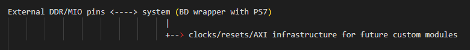

.. _fpga_project_barebones:

###########################
FPGA barebones 项目
###########################

``barebones`` 项目是一个面向 Linux 平台启动的最小 Red Pitaya FPGA 基础工程。
它保留各项目共享的通用处理系统配置以避免构建冲突，同时有意排除特定应用的 ADC/DAC 逻辑。

.. contents:: 目录
    :local:
    :depth: 1
    :backlinks: top

|

用途
----------

在以下情况下可以使用 ``barebones``：

* 从干净的基线开始自定义 FPGA 项目
* 复用整个项目生态中使用的通用 PS 配置
* 构建具备 Linux 能力的基础工程，只添加所需的自定义模块

|

包含的内容
-----------------

该项目包含构建和启动所需的基本组件：

* ``rtl/`` 中的项目顶层模块（包括特定型号的顶层模块）
* ``ip/system.tcl`` 中的块设计 Tcl
* ``ip/ps7_config.tcl`` 中的共享 PS 配置
* ``sdc/`` 中的基础约束
* 用于生成完整 Linux 设备树的设备树源文件

因此，``barebones`` 是 Linux 平台参考项目，而不是功能完整的应用设计。

|

设备树处理
---------------------

``barebones`` 构建 Linux 使用的完整设备树。

其他 FPGA 项目通常只生成项目 overlay，并将其应用在 Linux 基础设备树之上。
因此，``barebones`` 仍是完整平台级设备树定义的权威位置。

如果设计添加了 AXI 外设，请更新：

* ``prj/barebones/dts/fpga.dts``
* 所需的任何特定型号 DTS include 内容

|

FSBL 项目作用
------------------

面向 FSBL 的项目用于 FSBL 和 UBOOT 构建目标。
它在概念上类似于 ``barebones``，但启用的设置更少，因为 UBOOT 不需要 Linux 使用的全部外设。

|

推荐工作流
---------------------

1. 如果自定义设计将是系统中唯一的项目，请从 ``prj/barebones`` 开始，直接调整技术内容。
2. 如果项目必须与更大的生态共存，请以 ``v0.94`` 风格的项目为基础进行结构设计和集成。
3. 添加自定义 RTL/IP，并在需要时更新 ``ip/system.tcl``。
4. 更新约束和设备树内容（``barebones`` 中使用完整 DTS，其他项目中使用 overlay）。
5. 使用目标 ``MODEL`` 进行构建和验证。

典型命令：

* ``make project PRJ=barebones MODEL=Z20``
* ``make PRJ=barebones MODEL=Z20``
* ``make dts PRJ=barebones MODEL=Z20``

|

代码架构（模块）
----------------------------

核心顶层源文件是 ``prj/barebones/rtl/red_pitaya_top.sv``。
该顶层有意只包含一个主要实例化模块：

* ``system`` - 连接 PS7、DDR 和 MIO 接口的 Vivado 块设计封装器。

换言之，``barebones`` 有意移除应用模块，只保留启动 Linux 并作为基础工程所需的最小 PS/DDR 平台。

最初的目标是让该基础工程尽可能独立于板卡，以支持通用构建。
实际上，各板卡在 ADC/DAC 方面的差异（初始化流程、位宽、采样频率及相关细节）使得无法采用单一的共享应用实现。
因此，``barebones`` 在应用层应保持为空。

块设计内容本身由以下文件定义：

* ``prj/barebones/ip/system.tcl``
* ``prj/barebones/ip/ps7_config.tcl``

|

模块连接示意图
----------------------------

    
red_pitaya_top（barebones）有意保持最小化，仅封装 system。
