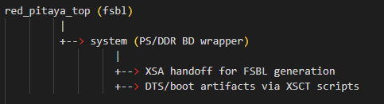

.. _fpga_project_fsbl:

######################
FPGA fsbl 项目
######################

``fsbl`` 是一个构建支持项目，用于生成 FSBL 和 U-Boot 平台产物。
从概念上看，它与 ``barebones`` 类似，但由于 U-Boot 不需要完整的 Linux 平台功能集，所以启用的外设/设置更少。
它并非 ``v0.94`` 或 ``stream_app`` 那样的通用应用镜像。

.. contents:: 目录
    :local:
    :depth: 1
    :backlinks: top

|

用途
----------

流程有以下需求时使用 ``fsbl``：

* 为启动包生成 XSA/FSBL
* 面向 U-Boot 的平台和交接产物
* 同步生成硬件/软件启动交接输出

实际上，该项目主要由 Make 目标使用，而不是作为面向用户的运行时镜像加载。

|

在构建流程中的作用
---------------------------

根目录的 ``Makefile`` 包含以下专用目标：

* ``fsbl_build``
* ``fsbl_dts``

这些目标运行 Vivado/XSCT Tcl 脚本，生成与 FSBL 和 U-Boot 相关的平台输出。

``barebones`` 提供完整的 Linux 设备树基础，而 ``fsbl`` 则专注于启动阶段的需求。

``prj/fsbl/dts`` 包含与启动相关的平台片段和 include 文件。

|

项目结构
------------------

``prj/fsbl/`` 中包含：

* ``ip/system.tcl`` —— 平台生成所用的块设计定义
* ``rtl/`` —— 项目顶层 RTL 封装
* ``dts/`` —— 用于集成 FSBL 和 U-Boot 的启动阶段设备树支持片段

|

何时需要修改
---------------

仅当需要更改底层启动/平台行为时才修改 ``fsbl``，例如：

* 外设启动要求
* 交接或启动阶段的设备树内容
* 平台生成脚本和依赖项

Linux 平台级基础工作应使用 ``barebones``。
生态系统内的应用级功能开发应从 ``v0.94`` 风格的项目开始。

|

代码架构（模块）
----------------------------

顶层源文件 ``prj/fsbl/rtl/red_pitaya_top.sv`` 刻意保持精简，与 barebones 风格一致：

* ``system`` —— PS/DDR 平台接口的块设计封装。

FSBL 特有的行为大多来自构建脚本和 DTS 组合，而不是复杂的 PL 数据路径逻辑。
与 ``barebones`` 相比，FSBL/U-Boot 平台配置只保留启动所需的设置。

相关代码/配置文件：

* ``prj/fsbl/ip/system.tcl`` —— 平台块设计定义
* ``prj/fsbl/dts/redpitaya.dtsi`` —— 包含平台级片段（Ethernet、I2C、USB、QSPI）
* ``red_pitaya_hsi_fsbl.tcl`` 和 ``red_pitaya_hsi_fsbl_dts.tcl`` —— 由 XSCT 驱动的生成流程

|

模块连接示意图
----------------------------

该项目侧重平台交接和启动产物，而非运行时信号处理链。
