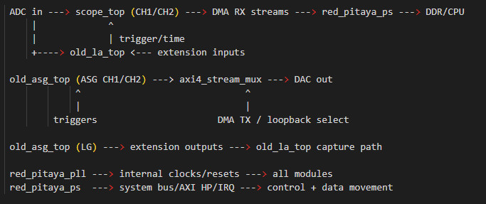

.. _fpga_project_stream_app:

########################
FPGA stream app 项目
########################

``stream_app`` 项目是 Red Pitaya 仓库中专用于高吞吐流式传输的 FPGA 镜像。
它用于通过 DMA 路径连续或突发传输 ADC、DAC 和 GPIO 数据，并通过 CLI/API 流式工具在主机侧进行控制。

.. contents:: 目录
    :local:
    :depth: 1
    :backlinks: top

|

用途
----------

当主要需求是在可编程逻辑与内存/主机软件之间高效移动数据时，请使用 ``stream_app``。

典型用例：

* 将 ADC 采集数据流式传输到内存，再传输给网络客户端
* 将内存/主机数据流式传输到 DAC 进行回放
* GPIO 数据流式传输和同步数字 I/O 工作流
* 需要深缓冲区和 DMA 控制的长时间采集/生成任务

|

架构概览
----------------------

与 ``v0.94`` 相比，本项目更关注传输流水线，而不是覆盖广泛混合仪器功能。

从较高层次看，该镜像包含：

* 支持触发、滤波、抽取和 DMA 写入的 ADC 流式路径
* 支持 DMA 读取和回放控制的 DAC 流式路径
* 用于数字数据传输的 GPIO 流式路径
* 用于事件处理、触发配置、DMA 模式和诊断的控制/状态寄存器

寄存器映射分为三个片选区域：

* ``CS[0]`` - ADC 流式传输
* ``CS[1]`` - DAC 流式传输
* ``CS[2]`` - GPIO 流式传输

详细寄存器信息请参阅：

* :ref:`In Dev <regset_in_dev>`

|

项目结构
------------------

在 ``prj/stream_app/`` 中，通常会使用：

* ``rtl/`` - 主要顶层逻辑和流式逻辑（包括板卡/变体子目录）
* ``ip/`` - 块设计 Tcl 和板卡专用 Tcl 辅助脚本
* ``dts/``、``dts_250/``、``dts_4ch/`` - 特定型号变体的设备树片段
* ``sdc/`` - 每个板卡/型号的时序约束
* ``tbn/`` - 仿真测试平台和脚本

|

板卡变体和型号相关说明
----------------------------------------

该项目以特定型号的变体实现，包括 4 输入和 250-12 平台。

在当前构建流程中，设备树 include 路径的选择由 ``Makefile`` 根据 ``PRJ`` 和 ``MODEL``/``FPGA_VERSION`` 的逻辑处理。
对于 ``stream_app``，这决定使用 ``dts``、``dts_250`` 还是 ``dts_4ch`` 中的内容。

|

构建和验证流程
----------------------------

典型命令：

* ``make project PRJ=stream_app MODEL=Z20_250``
* ``make PRJ=stream_app MODEL=Z20_250``
* ``make dts PRJ=stream_app MODEL=Z20_250``

建议执行以下验证：

* 确认 DMA 启动/停止以及缓冲区状态寄存器的行为符合预期
* 在所选采集模式下验证触发以及前/后采样行为
* 使用目标主机接口和软件栈测试持续吞吐量

|

代码架构（模块）
----------------------------

主要顶层源文件是 ``prj/stream_app/rtl/red_pitaya_top.sv``。该设计由可复用模块构成，这些模块围绕 AXI4-Stream 和系统总线接口连接。

``red_pitaya_top`` 中的核心模块：

* ``red_pitaya_ps`` - 处理系统封装器（DDR、MIO、时钟、IRQ、AXI HP 流式链路）。
* ``red_pitaya_pll`` - 生成内部 ADC/DAC/串行/PDM 时钟和锁定状态。
* ``sys_bus_interconnect`` - 地址解码器以及向功能模块扇出的系统总线。
* ``sys_bus_stub`` - 未使用系统总线区域的安全终止器。
* ``old_id`` - 构建/版本标识寄存器。
* ``muxctl`` - 流路由的回环和路径选择控制。
* ``cts`` - 采集模块使用的全局时间戳计数器。

采集/生成模块：

* ``scope_top`` （每个 ADC 通道一个）- 触发、抽取/滤波、采集流水线和 DMA 流式输出。
* ``old_asg_top`` （两个 ASG 通道）- 波形生成以及触发/IRQ 逻辑。
* ``old_asg_top`` （逻辑生成器实例 ``lg`` ）- 用于扩展路径输出的数字模式生成。
* ``old_la_top`` - 从扩展输入到 DMA 流的逻辑分析仪采集路径。

流式工具模块：

* ``axi4_stream_mux`` - 为 DAC 路径选择源流。
* ``axi4_stream_pas`` - 用于流式路径和回环的直通/格式桥接模块。

辅助输出模块：

* ``sys_reg_array_o`` + ``pdm`` - 由寄存器控制的 PDM DAC 输出。
* 可选的 ``sys_reg_array_o`` + ``pwm`` - 仅在定义 ``ENABLE_PWM`` 时启用。

``prj/stream_app/ip/system.tcl`` 使用的块设计 IP 包括：

* ``rp_oscilloscope``
* ``rp_dac``
* ``rp_gpio``
* ``rp_concat``
* Zynq PS7 和标准 Xilinx 胶合 IP

|

模块连接示意图
----------------------------

