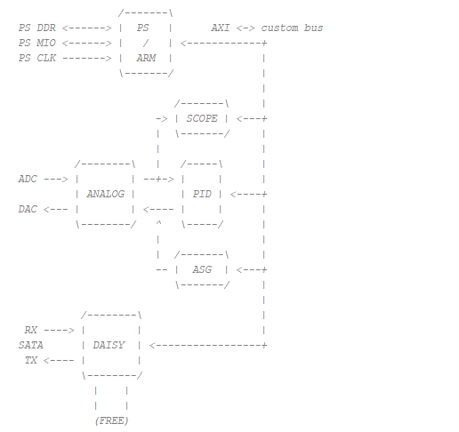
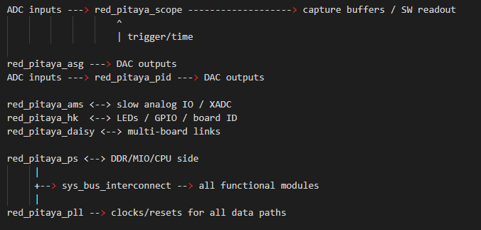
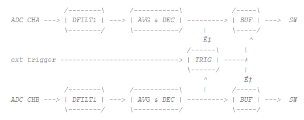
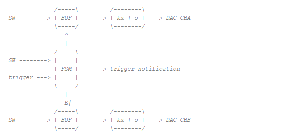
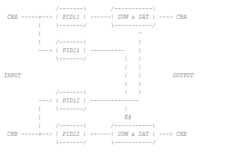
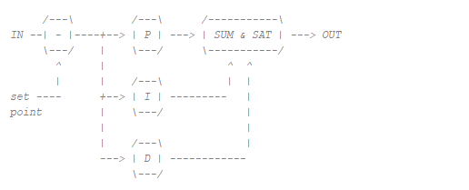
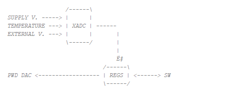
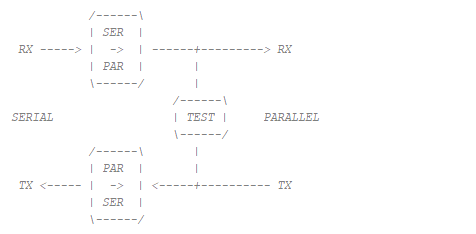
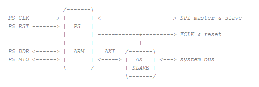

.. _fpga_project_v0_94:

#######################
FPGA v0.94 项目
#######################

v0.94 项目是 Red Pitaya 启动时加载的默认 FPGA 镜像。它包含运行标准 Red Pitaya 应用所需的全部组件，例如信号发生器、示波器和频谱分析仪。
大多数 Red Pitaya 应用也使用此镜像，因此如果要创建自己的 FPGA 项目，建议以此项目为起点。

v0.94 项目没有 IP Block Design 层次结构；相反，顶层集成直接使用 Verilog/SystemVerilog 完成。

.. note::

    **2025.1 状态：** 在当前 Red Pitaya FPGA 流程中，``v0.94`` 仍是默认且推荐的基准项目。
    构建/工具链已迁移到 Vivado/Vitis 2025.1，但项目的作用没有改变：对于大多数与应用兼容的定制，请使用 ``v0.94`` 作为参考镜像。

.. contents:: 目录
    :local:
    :depth: 1
    :backlinks: top
   
|

顶层模块
------------

顶层模块将 PS 部分连接到 Red Pitaya FPGA 的其余部分。

Red Pitaya FPGA 项目大部分使用 Verilog 和 System Verilog 编写，但也可以包含使用 VHDL 编写的组件。如果打开隐藏在 *red_pitaya_top* 下的资源下拉菜单，就能看到实际组成系统的 12 个组件。
它们之间的完整关系在 *red_pitaya_top* 模块顶部的注释中进行了说明，其中还提供了重要组件的简要描述。

各个组件通过一种简化形式的 AXI 总线互连。AXI（“Advanced eXtensible Interface”，高级可扩展接口）是为微控制器设计的通信协议，属于 AMBA（“Advanced Microcontroller Bus Architecture”，高级微控制器总线架构）协议集合。
AMBA 是一组不同的协议，用于定义片上系统（SoC）中各个功能块之间的通信方式。

Red Pitaya FPGA 使用的简化 AXI 总线包含以下信号：

* ``clk`` - 时钟信号
* ``addr`` - 地址总线
* ``wdata`` - 写数据
* ``rdata`` - 读数据
* ``wen`` - 写使能
* ``ren`` - 读使能
* ``err`` - 错误
* ``ack`` - 确认

v0.94 项目中 Red Pitaya 总线的 AXI 地址空间划分为 8 个区域，每个区域拥有 20 位地址。地址空间从十六进制地址 0x40000000 开始，到 0x407FFFFF 结束。8 个区域中的每个区域都对应一个特定模块。

+-------------+------------+----------------------------------+
| 起始地址    | 结束地址   | 模块名称                         |
+=============+============+==================================+
| 0x40000000  | 0x400FFFFF | 主控维护                         |
+-------------+------------+----------------------------------+
| 0x40100000  | 0x401FFFFF | 示波器                           |
+-------------+------------+----------------------------------+
| 0x40200000  | 0x402FFFFF | 任意信号发生器（ASG）            |
|             |            | \ 125-14-4-Input: \              |
|             |            | 示波器 CHC 和 CHD                |
+-------------+------------+----------------------------------+
| 0x40300000  | 0x403FFFFF | PID 控制器                       |
+-------------+------------+----------------------------------+
| 0x40400000  | 0x404FFFFF | 模拟混合信号（AMS）              |
+-------------+------------+----------------------------------+
| 0x40500000  | 0x405FFFFF | 菊花链                           |
+-------------+------------+----------------------------------+
| 0x40600000  | 0x406FFFFF | 空闲                             |
|             |            | \ 125-14-GEN2 Z20: \             |
|             |            | E3 连接器串行线路测试            |
+-------------+------------+----------------------------------+
| 0x40700000  | 0x407FFFFF | 电源测试                         |
+-------------+------------+----------------------------------+

Red Pitaya 采用 32 位架构，这意味着每个寄存器占用 32 位（4 字节）。寄存器采用内存映射方式，也就是说每个寄存器在内存空间中都有一个特定地址。寄存器用于配置和控制 FPGA 中的不同模块。

代码级模块概览
--------------------------

对于正在研究 RTL 源码的读者，``red_pitaya_top`` 中实例化的关键模块包括：

* ``red_pitaya_ps`` - PS/DDR/GPIO 和 AXI 桥接封装。
* ``red_pitaya_pll`` - 内部时钟生成和复位调理。
* ``sys_bus_interconnect`` - 将地址空间划分为模块区域。
* ``red_pitaya_hk`` - 主控维护（DNA、ID、LED、GPIO 控制）。
* ``red_pitaya_scope`` - 示波器采集路径。
* ``red_pitaya_asg`` - 任意波形生成。
* ``red_pitaya_pid`` - PID 控制模块。
* ``red_pitaya_ams`` - 慢速 ADC/DAC 和面向 XADC 的支持模块。
* ``red_pitaya_daisy`` - 多板同步/通信路径。

这些模块通过项目系统总线连接，并由共享的触发器/时钟/复位路径进行同步。

模块连接示意图
----------------------------

|

主控维护
----------------

在 v0.94 项目中，主控维护模块名为 ``red_pitaya_hk`` 或 ``i_hk``。该模块在启动时通过读取 DNA 和 ID 寄存器完成系统识别，ID 寄存器的值可由用户在编译时定义；同时，它还控制八个 LED 以及数字输入和输出（GPIO）。

|

示波器
--------------

示波器模块也称为 ``red_pitaya_scope`` 或 ``i_scope``，用于将数据采集到由 BRAM 实现的两个缓冲区中；每个输入通道各使用一个缓冲区。输入信号与缓冲区之间还有另外两个模块。第一个是数字滤波器，用于正确校准信号频率。
第二个模块可以对输入信号进行平均和抽取。目前，深度存储器模式使用的直接内存访问（DMA）也在此处实现，但未来版本会将其作为独立模块加入。

* 可以通过平均滤波器对输入数据进行平均和抽取，这一操作是可选的。

* 触发部分根据输入 ADC 数据或外部数字信号生成触发。要从模拟信号创建触发，会使用施密特触发器；外部触发首先经过消抖器，正边沿和负边沿分别使用独立的消抖器。

* 数据采集缓冲区使用 BRAM 实现。向 RAM 写入数据由 ARM/TRIG 逻辑执行。使用 ADC_ARM_DO 信号（SW）启用写入；该信号保持有效，直到触发到达且 ADC_DLY_CNT 计数到零。adc_wp_trig 的值作为指针，表示触发到达的位置，并用于显示触发前数据。

|

任意信号发生器（ASG）
---------------------------------

位于以下地址的任意信号/波形发生器允许生成用户定义的任意信号。在 FPGA 中，它由 ``red_pitaya_asg`` 或 ``i_asg`` 模块表示。信号由固定长度的缓冲区生成，读指针的跳跃量取决于给定频率。缓冲区内容由软件生成，可以采用预先选择的格式，也可以由用户提供。缓冲区信号在输出前还会通过校准定义的线性函数进行缩放。

* 软件填充缓冲区，并设置接管读指针控制权的有限状态机。所有与从缓冲区读取有关的寄存器都额外包含 16 位，用作小数位。这使时钟周期与输出信号频率之间能够达到更好的比例。

* 有限状态机可以设置为单次或连续循环序列。启动触发可以来自外部，同时还提供通知触发，以便与其他应用（示波器）同步。两个通道彼此独立。

* 输出数据使用线性变换进行缩放。

|

PID 控制器
------------------

PID 控制器（比例-积分-微分控制器）在 FPGA 中由 ``red_pitaya_pid`` 或 ``i_pid`` 模块表示。完整的 PID 模块由四个 PID 块组成。ADC 中代表快速模拟输入之一（CHA 和 CHB，或 IN1 和 IN2）的每条数据线都会被分成两部分。
每部分随后经过各自的 PID 块，再与另一个通道的 PID 块输出相加，并馈送到高速模拟输出。每个输出都包含饱和保护。

这样可以方便地使快速模拟输入同时依赖两个模拟输入，这对于控制不同系统（例如激光稳定）非常重要。

每个 PID 块由比例、积分和微分部分组成。设定值减去 PID 块的输入信号，所得差值表示误差，并馈送到 P、I 和 D 部分的输入端。随后将这三个部分的输出相加并馈送到输出端。

积分部分可以使用专用信号复位。

|

混合模拟信号（AMS）
---------------------------

“模拟混合信号”表示扩展连接器 E2 上的“慢速”模拟输入和输出。在 FPGA 中，它们由 ``red_pitaya_ams`` 或 ``i_ams`` 模块表示。

Red Pitaya 有四个慢速模拟输入和四个慢速模拟输出。慢速模拟输入（AIN0、AIN1、AIN2 和 AIN3）连接到 12 位 ADC，该 ADC 还会测量 Red Pitaya 内部电压（这对系统稳定性很重要）。这些输入的电压范围为 0 至 3.5 V，测量值存储在 FPGA 寄存器中。
模拟输出可以通过寄存器配置，输出电压范围为 0 至 1.8 V。

系统电压和外部电压由运行在序列器模式下的 XADC 读取。它会测量电源电压、温度以及外部连接器上的电压。测量值随后提供给软件。此外，软件可以设置用于控制 PWM DAC（模拟模块）逻辑的寄存器。

|

菊花链
---------------

菊花链模块用于通过主设备的时钟信号连接并同步多个 Red Pitaya 单元。在 FPGA 中，它由 ``red_pitaya_daisy`` 或 ``i_daisy`` 模块表示。
在链中，主设备与所有从设备共享时钟和触发信号，从而实现同步数据生成和采集。除共享时钟和触发信号外，该模块还支持各单元之间的快速通信和数据传输。

菊花链模块可用于与其他板卡通信并执行基本数据传输。连接通过快速串行线路实现，其中时钟线和数据线分开。该模块由多个子模块组成。

* TX 子模块将并行数据串行化，可使用 TX_CFG_SEL 开关选择数据。可选用户数据、训练数据、手动值或回环。

* RX 子模块将输入数据反串行化，并在训练模式下查找预定义值。

* 测试子模块生成可供 TX 模块选择使用的随机值。一段时间后，它会检查接收值并比较其是否相同。

|

空闲区域
--------

如本章开头所述，v0.94 项目中的地址总线划分为八个地址空间。其中六个由上述组件占用，另外两个为空闲区域，并连接到前置存根/终止器（“system stub”）。
读取空闲或未连接地址时，前置存根可以避免系统错误。

|

系统总线互连
-------------------------

FPGA 中由 ``system_bus_interconnect`` 模块表示的系统总线互连，用于将地址总线/空间划分为多个更小的部分。例如在 v0.94 项目中，它将地址空间划分为八个部分，每部分使用 20 位地址。

|

处理系统（PS）
--------------------

处理系统位于 ``red_pitaya_ps`` 或 ``ps`` 模块中，由双核 ARM 处理器和 FPGA 电路组成，两者共同构成 Zynq 7010 芯片。它依赖外部时钟和复位，并与 DDR 内存、扩展连接器 E1 和 E2 上的模拟与数字连接器、
电源旁 micro USB 连接器上的串行控制台以及 AXI 总线通信。该模块内部还有一个专用 AXI 块，用于简化 AXI 总线，使其更易于使用，并将其连接到系统总线。

PS 模块也是 block design 的封装。
