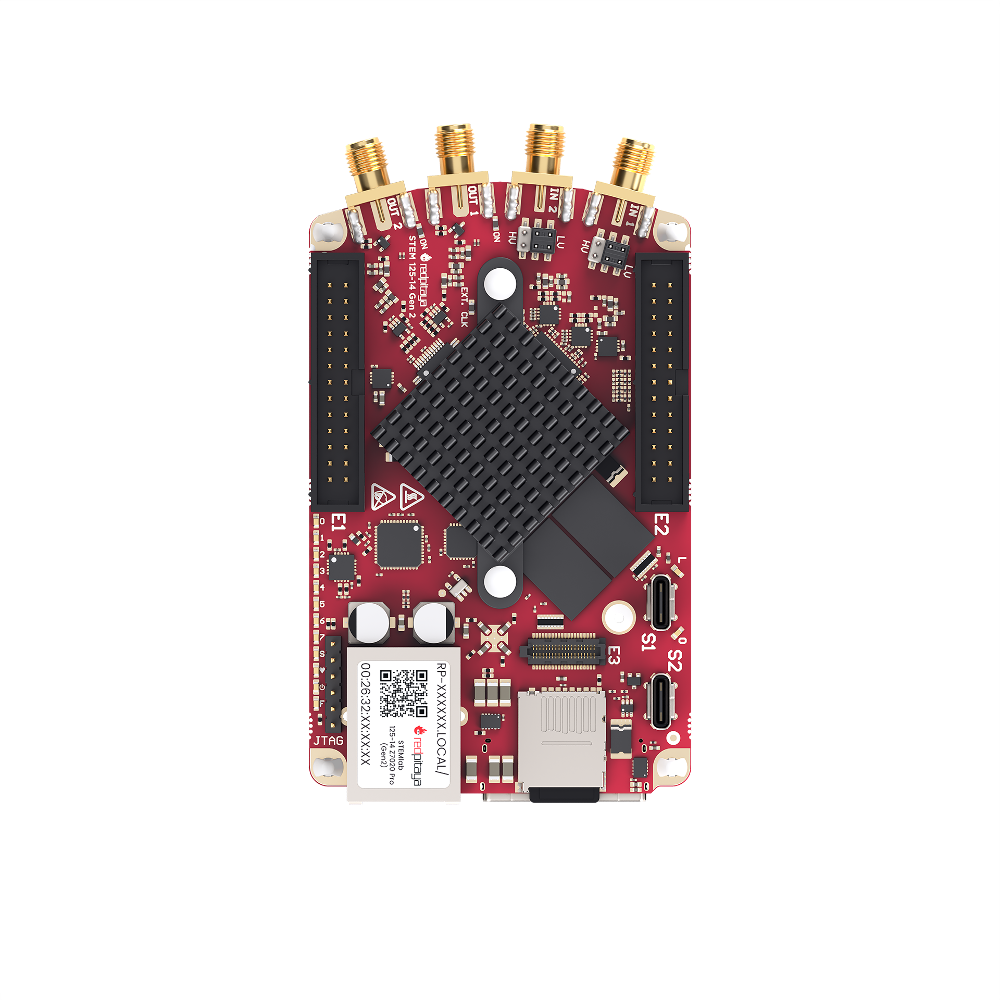
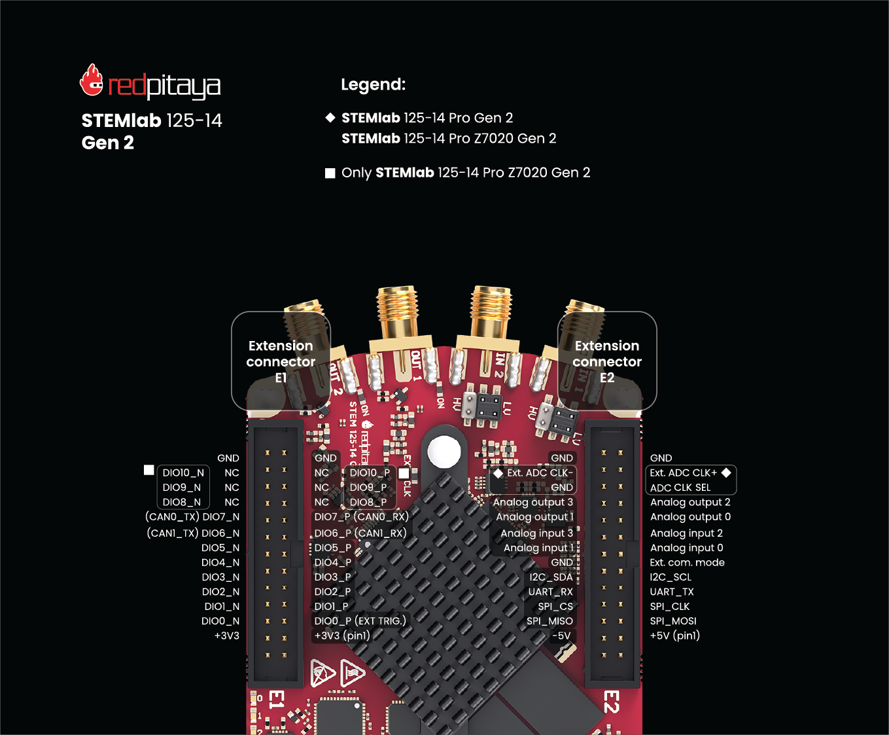

.. _top_125_14_pro_z7020_gen2:

##############################
STEMlab 125-14 PRO Z7020 Gen 2
##############################

|

.. contents:: 目录
    :local:
    :depth: 1
    :backlinks: top

概览
========

STEMlab 125-14 PRO Z7020 Gen 2 是一款Gen 2 系列中最先进的版本，配备强大的 Zynq 7020 SoC、1 GB RAM、带高速 LVDS 差分对的 E3 连接器以及外部 ADC 时钟功能。这款专业级板卡专为要求严苛的信号处理和自定义 FPGA 应用而设计。

特性
========

* 专业级 Gen 2 前端架构
* 14-bit、125 MS/s ADC 和 DAC
* 双核 ARM Cortex-A9 处理器
* FPGA AMD (Xilinx) Zynq 7020 SoC（性能强于 7010）
* 1 GB RAM（标准板卡的两倍）
* 22 个数字 GPIO、4 个模拟输入、4 个模拟输出
* 多种通信接口：I2C、SPI、UART、CAN
* 通过 USB-C 连接电源和控制台
* E3 连接器上提供 8 个高速 LVDS 差分对

快速参考
===============

.. list-table::
    :widths: 40 60
    :header-rows: 1

    * - **类别**
      - **关键规格**
    * - ADC
      - 2 个通道，14-bit，125 MS/s，DC-60 MHz
    * - DAC
      - 2 个通道，14-bit，125 MS/s，DC-60 MHz
    * - 处理器
      - 双核 ARM Cortex-A9
    * - FPGA
      - AMD Zynq 7020 SoC
    * - RAM
      - 1 GB
    * - 数字 I/O
      - 16 个 GPIO，@ 3.3V
    * - 模拟 I/O
      - 4 个输入（12-bit），4 个输出（8-bit）
    * - 抖动性能
      - 20 ps RMS @ 40 MHz
    * - 连接方式
      - Ethernet、USB-C、扩展连接器
    * - 特殊特性
      - E3、外部 ADC 时钟

板卡布局与引脚定义
======================

引脚图显示了所有外部连接器，包括 RF 输入/输出（IN1、IN2、OUT1、OUT2）和扩展连接器（E1、E2）。

有关 S1 和 S2 同步连接器、电源、通信及 Ethernet 端口等其他外部连接器，请参见下面的 Gen 2 总览图。

.. figure:: ../img/GEN2_specs.png
    :alt: Red Pitaya Gen 2 specs
    :width: 800
    :align: center

技术规格
=========================

.. list-table::
    :widths: 30 30 15 15
    :header-rows: 1

    * - **参数**
      - **值**
      - **单位**
      - **备注**
    * - **基本规格**
      -
      -
      -
    * - 处理器
      - 双核 ARM Cortex-A9
      - \-
      -
    * - FPGA
      - FPGA AMD (Xilinx) Zynq 7020 SoC（性能强于 7010）
      - \-
      -
    * - RAM
      - 512
      - GB
      - (8 Gb)
    * - 核心时钟频率
      - 125
      - MHz
      -
    * - 系统存储
      - Micro SD，最大 32 GB
      - \-
      -
    * - 串行控制台连接器
      - USB-C
      - \-
      -
    * - 电源连接器
      - USB-C
      - \-
      -
    * - 功耗
      - 5 V，3 A
      - \-
      - 最大值
    * - **连接方式**
      -
      -
      -
    * - Ethernet
      - 1
      - Gbit
      -
    * - USB
      - USB-C 2.0
      - \-
      -
    * - Wi-Fi
      - 需要 Wi-Fi dongle
      - \-
      -
    * - **RF 输入**
      -
      -
      -
    * - RF 输入通道
      - 2
      - \-
      -
    * - 采样率
      - 125
      - MS/s
      -
    * - ADC 分辨率
      - 14
      - bit
      -
    * - 输入阻抗
      - 1 MΩ / 10 pF
      - \-
      -
    * - 满量程电压范围
      - ±1 (LV)
      - V
      -
    * -
      - ±20 (HV)
      -
      -
    * - 输入耦合
      - DC
      - \-
      -
    * - 绝对最大输入电压
      - ±6 (LV)
      - V
      - DC 值 [#f1]_
    * -
      - ±30 (HV)
      -
      -
    * - 输入 ESD 保护
      - 1500
      - V
      - DC
    * - 过载保护
      - 保护二极管
      - \-
      -
    * - 带宽
      - DC - 60
      - MHz
      -
    * - 连接器类型
      - SMA
      - \-
      -
    * - **RF 输出**
      -
      -
      -
    * - RF 输出通道
      - 2
      - \-
      -
    * - 采样率
      - 125
      - MS/s
      -
    * - DAC 分辨率
      - 14
      - bit
      -
    * - 负载阻抗
      - 50 Ω / Hi-Z
      - \-
      -
    * - 电压范围
      - ±1 @ 50 Ω
      - V
      -
    * -
      - ±2 @ Hi-Z
      -
      -
    * - 输出耦合
      - DC
      - \-
      -
    * - 短路保护
      - 是
      - \-
      -
    * - 输出压摆率
      - 2 V / 10 ns
      - \-
      -
    * - RF 输出抖动 @40 MHz
      - 20
      - ps
      - RMS
    * - 带宽
      - DC - 60
      - MHz
      -
    * - 连接器类型
      - SMA
      - \-
      -
    * - **扩展连接器**
      -
      -
      -
    * - 数字 GPIO
      - 22
      - \-
      -
    * - 数字电平
      - 3.3
      - V
      -
    * - GPIO 时间分辨率
      - 8
      - ns
      - 核心时钟频率
    * - 高速差分对 (E3)
      - 8
      - \-
      -
    * - 高速差分对电压电平 (E3)
      - 2.5
      - V
      - LVDS
    * - 高速差分对时间分辨率 (E3)
      - 8
      - ns
      - 核心时钟频率
    * - 模拟输入
      - 4
      - \-
      -
    * - 模拟输入电压范围
      - 0 - 7.0
      - V
      -
    * - 模拟输入分辨率
      - 12
      - bit
      -
    * - 模拟输入采样率
      - 100
      - kS/s
      -
    * - 模拟输出
      - 4
      - \-
      -
    * - 模拟输出电压范围
      - 0 - 1.8
      - V
      -
    * - 模拟输出分辨率
      - 8
      - bit
      -
    * - 模拟输出采样率
      - ≲ 3.2
      - MS/s
      -
    * - 模拟输出带宽
      - ≈ 120
      - kHz
      -
    * - 通信接口
      - I2C、SPI、UART、CAN
      - \-
      -
    * - 可用电压
      - ±5、+3.3
      - V
      -
    * - 外部 ADC 时钟
      - 是
      - \-
      -
    * - E3 连接器
      - 是
      - \-
      -
    * - **同步**
      -
      -
      -
    * - 外部触发输入
      - DIO0_P
      - \-
      - E1 连接器
    * - 外部触发输入阻抗
      - Hi-Z
      - \-
      - 数字输入
    * - 触发输出
      - DIO0_N
      - \-
      - E1 连接器 [#f2]_
    * - 菊链连接器 (S1 和 S2)
      - 是
      - \-
      -
    * - 菊链连接器速率
      - 最高 500
      - Mb/s
      -
    * - 菊链连接器类型
      - USB-C
      - \-
      - 非标准 USB-C [#f3]_
    * - 参考时钟输入
      - N/A
      - \-
      -
    * - 参考时钟频率
      - N/A
      - \-
      -
    * - 参考时钟连接器类型
      - N/A
      - \-
      -
    * - **启动选项**
      -
      -
      -
    * - SD 卡
      - 是
      - \-
      -
    * - QSPI
      - E3 附加模块
      - \-
      -
    * - eMMC
      - E3 附加模块
      - \-
      -
    * - **环境规格**
      -
      -
      -
    * - 工作温度范围
      - 0 至 55
      - ℃
      - 使用默认散热器
    * - 工作湿度范围
      - < 90%
      - RH
      -
    * - 自动关机温度
      - 85
      - ℃
      -
    * - **尺寸**
      -
      -
      -
    * - 尺寸（长 x 宽 x 高）
      - 106.8 x 60.0 x 17.9
      - mm
      - 详情见 `原理图`_

.. warning::

    **最大输入电压**
    
    * **LV 模式：** ±6 V 绝对最大值
    * **HV 模式：** ±30 V 绝对最大值
    
    超过这些值可能会永久损坏板卡。

.. seealso::

    更多详细信息请参见 |Gen 2 comparison table|。

性能与测量
===========================

快速模拟前端的测量结果见此处：

.. toctree::
    :maxdepth: 1

    ../measurements/STEMlab-125-14_Gen2/index

.. _schematics_125_14_pro_z7020_gen2:

原理图与 3D 模型
=======================

原理图
----------

* :download:`Schematics_STEM_125-14_PRO_Z7020_Gen2_V2r0_RevA.pdf <https://downloads.redpitaya.com/doc/Schematics/Schematics_STEM_125-14_PRO_Z7020_Gen2_V2r0_RevA.pdf>`.

.. note::

    Red Pitaya 板卡的完整硬件原理图不公开。Red Pitaya 拥有开源代码，但不提供开放硬件原理图。不过，我们提供开发用原理图。
    该原理图包含硬件配置、FPGA 引脚连接等信息。

机械规格与 3D 模型
--------------------------------------

* STEP :download:`3D_STEM_125-14-Pro-Z7020-Gen2.zip <https://downloads.redpitaya.com/doc/3D_models/3D_STEM_125-14-Pro-Z7020-Gen2.zip>`.

硬件详情
=================

关键器件
--------------

信号链器件
~~~~~~~~~~~~~~~~~~~~~~~

STEMlab 125-14 PRO Z7020 Gen 2 的信号链采用 Linear Technology（现为 Analog Devices）的高性能模拟器件。

**ADC:** Analog Devices `LTC2145-14 <https://www.analog.com/en/products/ltc2145-14.html>`_

    * 双通道 14-bit、125 MS/s ADC
    * 低功耗
    * 高动态范围

**DAC:** Analog Devices `AD9767 <https://www.analog.com/en/products/AD9767.html>`_

    * 双通道 14-bit、125 MS/s DAC
    * 高 SFDR 性能
    * 低功耗运行

**FPGA:** AMD (Xilinx) `Zynq 7020 <https://docs.amd.com/v/u/en-US/ds190-Zynq-7000-Overview>`_

    * 双核 ARM Cortex-A9，@ 667 MHz
    * 可编程逻辑资源
    * 集成外设和内存控制器

**振荡器：** `SG3225VAN <https://support.epson.biz/td/api/doc_check.php?dl=brief_SG3225VAN&lang=en>`_

    * 高精度 125 MHz 参考振荡器
    * 低抖动性能

扩展连接器与接口
===================================

概览
---------

STEMlab 125-14 Gen 2 板卡具有以下连接器和接口：

* **E1 和 E2 连接器：** 主要扩展连接器，提供数字 I/O、模拟 I/O 和通信接口。用户可通过这些连接器连接其他硬件、传感器或外设，扩展板卡功能。
* **E3 连接器：** 次级扩展连接器，面向高速差分对、QSPI/eMMC 存储、电源管理和看门狗控制。适用于需要额外存储或专用接口的高级应用。
* **S1 和 S2 连接器：** 用于同步多块 Red Pitaya 板卡的菊链连接器，可实现板卡之间的时钟和触发同步。

连接器物理规格
----------------------------------

**E1 和 E2 扩展连接器：**

* 连接器类型：`2 x 13 pins IDC 2.54 mm pitch <https://www.digikey.com/en/products/detail/adam-tech/BHR-26-VUA/9832284>`_
* 引脚数：每个 26 个引脚（2x13 配置）
* 间距：2.54 mm (0.1")

**E3 扩展连接器：**

* 连接器类型：`2 x 20 pins Micro Blade & Beam 0.50 mm pitch <https://www.samtec.com/products/ss5-20-3.00-l-d-k-tr#compliance>`_。
* 引脚数：40 个引脚（2x20 配置）
* 间距：0.50 mm

**配套连接器：**

.. note::

    为定制 Red Pitaya 扩展板选择配套连接器时，需要使用 `double height elevated sockets <https://www.digikey.com/en/products/detail/samtec-inc/ESW-113-33-T-D/6693225>`_，以避开板上的散热器和 Ethernet 连接器。
    *insulation height* 达到 0.635" (16.13 mm) 或更高的连接器均可使用。该间隙要求取决于 Red Pitaya 板卡上最高的器件（散热器和 Ethernet 连接器）。

.. note::

    为防止损坏板卡或扩展板，将扩展板连接到 E1 和 E2 连接器时，请确保：
    
    * **连接器正确对齐**——确保连接器正确对齐。Red Pitaya 板卡的插座外壳内有额外空间，即使扩展板偏移 ±1 个引脚，看起来仍可能已物理连接。这会损坏板卡和/或扩展板，因此通电前请再次确认对齐情况。
    * **配套件紧密贴合**——使用牢固配合的连接器，防止意外断开或损坏。

E1 连接器——数字 I/O 与 CAN
----------------------------------

.. include:: ../_specs_common/E1_connector_7020.inc

E2 连接器——模拟与通信
--------------------------------------

.. include:: ../_specs_common/E2_connector.inc

|

E3 连接器——QSPI/eMMC 与电源控制
-----------------------------------------

.. include:: ../_specs_common/E3_connector_7020.inc

|

辅助模拟输入与输出
------------------------------------

.. include:: ../_specs_common/slow_analog_io.inc

通用数字 I/O 通道
--------------------------------------

.. list-table::
    :widths: 30 30 15 15
    :header-rows: 1

    * - **参数**
      - **值**
      - **单位**
      - **备注**
    * - GPIO 数量
      - 22
      - \-
      -
    * - 数字电平
      - 3.3
      - V
      -
    * - 绝对最小电压
      - -0.40
      - V
      -
    * - 绝对最大电压
      - 3.3 + 0.55
      - V
      -
    * - 电流限制
      - < 8
      - mA
      - 驱动能力
    * - 方向
      - 可配置
      - \-
      -
    * - 时间分辨率
      - 8 ns
      - ns
      - (1/125 MHz)
    * - 连接器位置
      - 扩展连接器 |E1|
      - \-
      -

同步连接器（S1 和 S2）
-------------------------------------

.. include:: ../_specs_common/Sync_connectors.inc

|

高级特性
==================

电源
--------------

.. include:: ../_specs_common/power_supply.inc

|

外部 ADC 时钟
-------------------

.. include:: ../_specs_common/ext_adc_clk.inc

|

外部启动选项
--------------------------

.. include:: ../_specs_common/Ext_boot_options.inc

|

校准
------------

.. include:: ../_specs_common/calibration.inc

其他资源
====================

更多规格和测量结果请参见：

* |Gen 2 hardware specs| - Gen 2 通用规格
* |Gen 2 comparison table| - 所有 Red Pitaya Gen 2 型号对比
* :ref:`E3 模块规格 <E3_HW>` - E3 模块详细规格

法律与免责声明
===================

.. include:: ../_specs_common/disclaimer.inc

.. rubric:: 脚注

.. [#f1] 绝对最大输入电压值适用于低于 1 kHz 的频率。对于更高频率，请将输入电压范围规格作为**绝对最大值**。
.. [#f2] 有关触发输出配置，请参见 :ref:`X-channel 2.0（Click Shield）同步 <click_shield_sync>` 和 :ref:`X-channel 2.0（Click Shield）同步示例 <examples_multiboard_sync>`。
.. [#f3] 不兼容 USB-C 标准（直流耦合）。仅用于多块 Red Pitaya 板卡的菊链连接。
.. [#f4] 外部 ADC 时钟首先进入 `NB6L72`_ 时钟选择芯片，然后经过 ADC，最终到达 FPGA 引脚。
.. [#f5] 有关确切电平，请参阅 `NB6L72`_ 数据手册。
.. [#f6] FPGA 中的负逻辑。
.. [#f7] 默认连接 DIO12 差分引脚对。可通过改变 E3 板上电阻的位置来连接 I2C1 和 UART 引脚。
.. [#f8] 默认软件以取决于 CPU 的速度进行采样。要以 100 kS/s 速率采集数据，必须额外实现 FPGA 处理。
.. [#f9] 输出经过一阶低通滤波器。如需额外滤波，可根据应用的具体要求在外部实现。
.. [#f10] VBUS 连接器在板上彼此相连，但未连接到板卡电源。
.. [#f11] 在 S1 连接器上，CC1 引脚连接到 Orient LED 和 S1_ORIENT FPGA 引脚（通过电阻分压器将电平降至 2V5）。CC1 和 CC2 引脚连接到 XOR 门，用于确定 **Link LED** 的状态。XOR 门的输出也连接到 S1_LINK FPGA 引脚（通过电阻分压器将电平降至 2V5）。
.. [#f12] 在 S2 连接器上，CC1 引脚通过齐纳二极管保护至 3V3，但未连接到 FPGA。CC2 引脚未连接。
.. [#f13] 取决于具体应用。输出电流由扩展连接器和已连接的 USB 设备共享；不使用其他外设时，电流可能更高。

.. substitutions

.. |E1| replace:: :ref:`E1 连接器 <E1_gen2>`
.. |E2| replace:: :ref:`E2 连接器 <E2_gen2>`
.. |E3| replace:: :ref:`E3 连接器 <E3_gen2>`
.. |Gen 2 hardware specs| replace:: :ref:`Gen 2 硬件规格 <hw_specs_gen2>`
.. |Gen 2 comparison table| replace:: :ref:`Gen 2 板卡对比表 <rp-board-comp-gen2>`
.. |STEMlab 125-14 PRO Gen 2| replace:: :ref:`STEMlab 125-14 PRO Gen 2 <top_125_14_pro_gen2>`
.. |STEMlab 125-14 PRO Z7020 Gen 2| replace:: :ref:`STEMlab 125-14 PRO Z7020 Gen 2 <top_125_14_pro_z7020_gen2>`
.. _NB6L72: https://www.onsemi.com/pdf/datasheet/nb6l72-d.pdf
