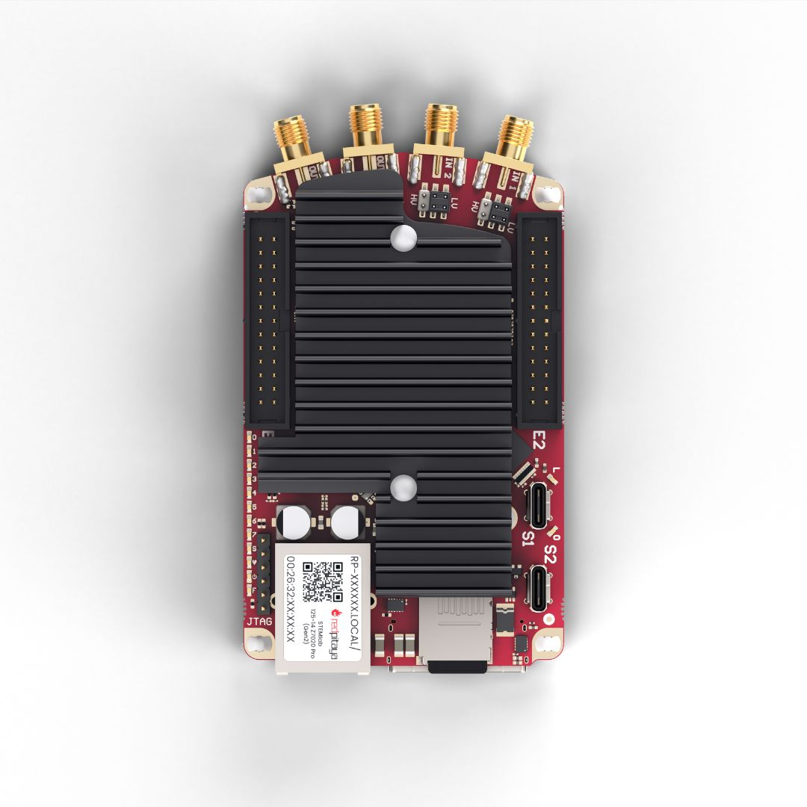
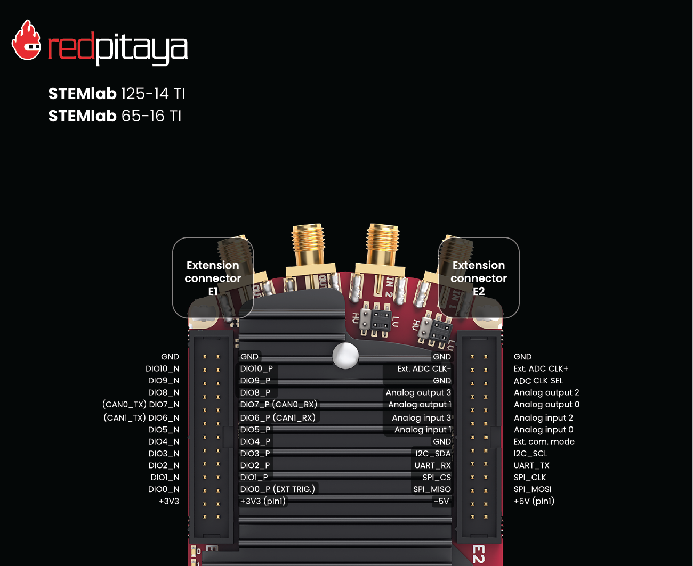
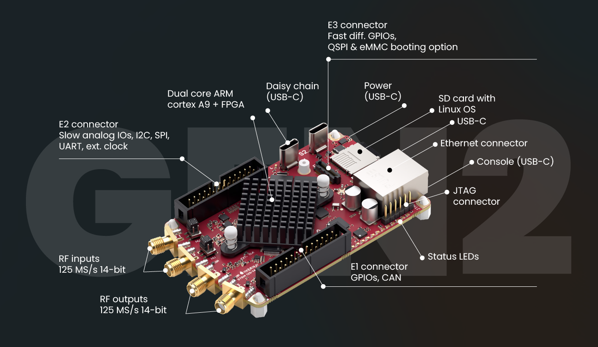

.. _top_125_14_TI:

#################################
STEMlab 125-14 TI
#################################

|

.. contents:: 目录
    :local:
    :depth: 1
    :backlinks: top

|

概述
========

STEMlab 125-14 TI 是一款采用 Texas Instruments 高性能 ADC 和 DAC 器件的专用 Red Pitaya 板卡。
该板卡凭借超低抖动性能提供更高的信号质量，适用于要求极高时序精度的精密测量和信号生成应用。

TI 版本基于相同的 Gen 2 前端架构，并通过精心选择的 TI 器件在高要求应用中提供更优性能。

|

功能特性
========

* 与 Gen 2 板卡相同的前端改进
* TI ADC3664 14-bit、125 MSps SAR ADC，具有高 SNR、低延迟、片上数字滤波和 DDC
* TI DAC2904Y 14-bit、125 MSps 双通道 DAC，具有低延迟、低抖动输出
* TI LMK03318 可编程超低抖动时钟发生器（5 ps RMS @ 40 MHz）
* 超低 RF 输出抖动：5 ps RMS @ 40 MHz（Original Gen 设备为 20 ps）
* 双核 ARM Cortex-A9 处理器，搭载 FPGA AMD (Xilinx) Zynq 7020 SoC
* 22 个数字 I/O、4 个模拟输入、4 个模拟输出
* 多种通信接口：I2C、SPI、UART、CAN
* 通过 USB-C 连接器支持菊花链同步

|

快速参考
===============

.. table::
    :widths: 40 60
    
    +----------------------------+--------------------------------------------------+
    | **类别**                   | **关键规格**                                     |
    +============================+==================================================+
    | ADC                        | 2 通道，14-bit，125 MS/s，DC-60 MHz              |
    +----------------------------+--------------------------------------------------+
    | DAC                        | 2 通道，14-bit，125 MS/s，DC-60 MHz              |
    +----------------------------+--------------------------------------------------+
    | 处理器                     | 双核 ARM Cortex-A9                               |
    +----------------------------+--------------------------------------------------+
    | FPGA                       | AMD Zynq 7020 SoC                                |
    +----------------------------+--------------------------------------------------+
    | RAM                        | 512 MB                                           |
    +----------------------------+--------------------------------------------------+
    | 数字 I/O                   | 22 个 GPIO @ 3.3V                                |
    +----------------------------+--------------------------------------------------+
    | 模拟 I/O                   | 4 路输入（12-bit），4 路输出（8-bit）            |
    +----------------------------+--------------------------------------------------+
    | 抖动性能                   | 5 ps RMS @ 40 MHz                                |
    +----------------------------+--------------------------------------------------+
    | 连接能力                   | 以太网、USB-C、扩展连接器                        |
    +----------------------------+--------------------------------------------------+
    | 特殊功能                   | 高精度 ADC、外部 ADC 时钟、PLL                   |
    +----------------------------+--------------------------------------------------+

|

板卡布局与引脚定义
======================

引脚图展示了所有外部连接器，包括 RF 输入/输出（IN1、IN2、OUT1、OUT2）和扩展连接器（E1、E2）。

对于 S1 和 S2 同步连接器、电源、通信和以太网端口等其他外部连接器，请参阅下方 Gen 2 通用图。

|

技术规格
=========================

.. table::
    :widths: 30 30 15 15

    +------------------------------------+------------------------------------+-----------+----------------------------------+
    | **参数**                           | **值**                             | **单位**  | **备注**                         |
    +====================================+====================================+===========+==================================+
    | |br|                                                                                                                   |
    | **基本规格**                                                                                                           |
    +------------------------------------+------------------------------------+-----------+----------------------------------+
    | 处理器                             | 双核 ARM Cortex-A9                 | \-        |                                  |
    +------------------------------------+------------------------------------+-----------+----------------------------------+
    | FPGA                               | FPGA AMD (Xilinx) Zynq 7020 SoC    | \-        |                                  |
    +------------------------------------+------------------------------------+-----------+----------------------------------+
    | RAM                                | 512                                | MB        | (4 Gb)                           |
    +------------------------------------+------------------------------------+-----------+----------------------------------+
    | 核心时钟频率                       | 125                                | MHz       |                                  |
    +------------------------------------+------------------------------------+-----------+----------------------------------+
    | 系统存储                           | 最高 32 GB 的 Micro SD             | \-        |                                  |
    +------------------------------------+------------------------------------+-----------+----------------------------------+
    | 串行控制台连接器                   | USB-C                              | \-        |                                  |
    +------------------------------------+------------------------------------+-----------+----------------------------------+
    | 电源连接器                         | USB-C                              | \-        |                                  |
    +------------------------------------+------------------------------------+-----------+----------------------------------+
    | 功耗                               | 5 V, 3 A                           | \-        | 最大值                           |
    +------------------------------------+------------------------------------+-----------+----------------------------------+
    | |br|                                                                                                                   |
    | **连接能力**                                                                                                           |
    +------------------------------------+------------------------------------+-----------+----------------------------------+
    | 以太网                             | 1                                  | Gbit      |                                  |
    +------------------------------------+------------------------------------+-----------+----------------------------------+
    | USB                                | USB-C 2.0                          | \-        |                                  |
    +------------------------------------+------------------------------------+-----------+----------------------------------+
    | Wi-Fi                              | 需要 Wi-Fi 适配器                  | \-        |                                  |
    +------------------------------------+------------------------------------+-----------+----------------------------------+
    | |br|                                                                                                                   |
    | **RF 输入**                                                                                                            |
    +------------------------------------+------------------------------------+-----------+----------------------------------+
    | RF 输入通道                        | 2                                  | \-        |                                  |
    +------------------------------------+------------------------------------+-----------+----------------------------------+
    | 采样率                             | 125                                | MS/s      |                                  |
    +------------------------------------+------------------------------------+-----------+----------------------------------+
    | ADC 分辨率                         | 14                                 | bit       |                                  |
    +------------------------------------+------------------------------------+-----------+----------------------------------+
    | 输入阻抗                           | 1 MΩ / 10 pF                       | \-        |                                  |
    +------------------------------------+------------------------------------+-----------+----------------------------------+
    | 满量程电压范围                     | | ±1 (LV)                          | V         |                                  |
    |                                    | | ±20 (HV)                         |           |                                  |
    +------------------------------------+------------------------------------+-----------+----------------------------------+
    | 输入耦合                           | DC                                 | \-        |                                  |
    +------------------------------------+------------------------------------+-----------+----------------------------------+
    | 绝对最大输入电压                   | | ±6 (LV)                          | V         | 直流值 [#f1]_                    |
    |                                    | | ±30 (HV)                         |           |                                  |
    +------------------------------------+------------------------------------+-----------+----------------------------------+
    | 输入 ESD 保护                      | 1500                               | V         | DC                               |
    +------------------------------------+------------------------------------+-----------+----------------------------------+
    | 过载保护                           | 保护二极管                         | \-        |                                  |
    +------------------------------------+------------------------------------+-----------+----------------------------------+
    | 带宽                               | DC - 60                            | MHz       |                                  |
    +------------------------------------+------------------------------------+-----------+----------------------------------+
    | 连接器类型                         | SMA                                | \-        |                                  |
    +------------------------------------+------------------------------------+-----------+----------------------------------+
    | |br|                                                                                                                   |
    | **RF 输出**                                                                                                            |
    +------------------------------------+------------------------------------+-----------+----------------------------------+
    | RF 输出通道                        | 2                                  | \-        |                                  |
    +------------------------------------+------------------------------------+-----------+----------------------------------+
    | 采样率                             | 125                                | MS/s      |                                  |
    +------------------------------------+------------------------------------+-----------+----------------------------------+
    | DAC 分辨率                         | 14                                 | bit       |                                  |
    +------------------------------------+------------------------------------+-----------+----------------------------------+
    | 负载阻抗                           | 50 Ω / Hi-Z                        | \-        |                                  |
    +------------------------------------+------------------------------------+-----------+----------------------------------+
    | 电压范围                           | | ±1 @ 50 Ω                        | V         |                                  |
    |                                    | | ±2 @ Hi-Z                        |           |                                  |
    +------------------------------------+------------------------------------+-----------+----------------------------------+
    | 输出耦合                           | DC                                 | \-        |                                  |
    +------------------------------------+------------------------------------+-----------+----------------------------------+
    | 短路保护                           | 是                                 | \-        |                                  |
    +------------------------------------+------------------------------------+-----------+----------------------------------+
    | 输出压摆率                         | 2 V / 10 ns                        | \-        |                                  |
    +------------------------------------+------------------------------------+-----------+----------------------------------+
    | RF 输出抖动                        | 5 @ 40 MHz                         | ps        | RMS                              |
    +------------------------------------+------------------------------------+-----------+----------------------------------+
    | 带宽                               | DC - 60                            | MHz       |                                  |
    +------------------------------------+------------------------------------+-----------+----------------------------------+
    | 连接器类型                         | SMA                                | \-        |                                  |
    +------------------------------------+------------------------------------+-----------+----------------------------------+
    | |br|                                                                                                                   |
    | **扩展连接器**                                                                                                         |
    +------------------------------------+------------------------------------+-----------+----------------------------------+
    | 数字 GPIO                          | 22                                 | \-        |                                  |
    +------------------------------------+------------------------------------+-----------+----------------------------------+
    | 数字电平                           | 3.3                                | V         |                                  |
    +------------------------------------+------------------------------------+-----------+----------------------------------+
    | GPIO 时间分辨率                    | 8                                  | ns        | 核心时钟频率                     |
    +------------------------------------+------------------------------------+-----------+----------------------------------+
    | 高速差分对（E3）                   | N/A                                | \-        |                                  |
    +------------------------------------+------------------------------------+-----------+----------------------------------+
    | 高速差分对电压                     | N/A                                | \-        |                                  |
    | 电平（E3）                         |                                    |           |                                  |
    +------------------------------------+------------------------------------+-----------+----------------------------------+
    | 高速差分对时间                     | N/A                                | \-        |                                  |
    | 分辨率（E3）                       |                                    |           |                                  |
    +------------------------------------+------------------------------------+-----------+----------------------------------+
    | 模拟输入                           | 4                                  | \-        |                                  |
    +------------------------------------+------------------------------------+-----------+----------------------------------+
    | 模拟输入电压范围                   | 0 - 7.0                            | V         |                                  |
    +------------------------------------+------------------------------------+-----------+----------------------------------+
    | 模拟输入分辨率                     | 12                                 | bit       |                                  |
    +------------------------------------+------------------------------------+-----------+----------------------------------+
    | 模拟输入采样率                     | 100                                | kS/s      |                                  |
    +------------------------------------+------------------------------------+-----------+----------------------------------+
    | 模拟输出                           | 4                                  | \-        |                                  |
    +------------------------------------+------------------------------------+-----------+----------------------------------+
    | 模拟输出电压范围                   | 0 - 1.8                            | V         |                                  |
    +------------------------------------+------------------------------------+-----------+----------------------------------+
    | 模拟输出分辨率                     | 8                                  | bit       |                                  |
    +------------------------------------+------------------------------------+-----------+----------------------------------+
    | 模拟输出采样率                     | ≲ 3.2                              | MS/s      |                                  |
    +------------------------------------+------------------------------------+-----------+----------------------------------+
    | 模拟输出带宽                       | ≈ 120                              | kHz       |                                  |
    +------------------------------------+------------------------------------+-----------+----------------------------------+
    | 通信接口                           | I2C, SPI, UART, CAN                | \-        |                                  |
    +------------------------------------+------------------------------------+-----------+----------------------------------+
    | 可用电压                           | ±5, +3.3                           | V         |                                  |
    +------------------------------------+------------------------------------+-----------+----------------------------------+
    | 外部 ADC 时钟                      | 是                                 | \-        |                                  |
    +------------------------------------+------------------------------------+-----------+----------------------------------+
    | E3 连接器                          | N/A                                | \-        |                                  |
    +------------------------------------+------------------------------------+-----------+----------------------------------+
    | |br|                                                                                                                   |
    | **同步**                                                                                                               |
    +------------------------------------+------------------------------------+-----------+----------------------------------+
    | 外部触发输入                       | DIO0_P                             | \-        | E1 连接器                        |
    +------------------------------------+------------------------------------+-----------+----------------------------------+
    | 外部触发输入阻抗                   | Hi-Z                               | \-        | 数字输入                         |
    +------------------------------------+------------------------------------+-----------+----------------------------------+
    | 触发输出                           | DIO0_N                             | \-        | E1 连接器 [#f2]_                 |
    +------------------------------------+------------------------------------+-----------+----------------------------------+
    | 菊花链连接器（S1 和 S2）           | 是                                 | \-        |                                  |
    +------------------------------------+------------------------------------+-----------+----------------------------------+
    | 菊花链连接器速率                   | 最高 500                           | Mb/s      |                                  |
    +------------------------------------+------------------------------------+-----------+----------------------------------+
    | 菊花链连接器类型                   | USB-C                              | \-        | 非标准 USB-C [#f3]_              |
    +------------------------------------+------------------------------------+-----------+----------------------------------+
    | 参考时钟输入                       | 是                                 | \-        | 通过 Ext. ADC Clk± [#f4]_        |
    +------------------------------------+------------------------------------+-----------+----------------------------------+
    | 参考时钟频率                       | 1 - 300                            | MHz       | 默认：125 MHz                    |
    +------------------------------------+------------------------------------+-----------+----------------------------------+
    | 参考时钟连接器类型                 | Ext. ADC Clk±                      | \-        | |E2| 上的引脚 23/24              |
    +------------------------------------+------------------------------------+-----------+----------------------------------+
    | |br|                                                                                                                   |
    | **启动选项**                                                                                                           |
    +------------------------------------+------------------------------------+-----------+----------------------------------+
    | SD 卡                              | 是                                 | \-        |                                  |
    +------------------------------------+------------------------------------+-----------+----------------------------------+
    | QSPI                               | 未装配                             | \-        | 参见 `启动选项`_                 |
    +------------------------------------+------------------------------------+-----------+----------------------------------+
    | eMMC                               | N/A                                | \-        |                                  |
    +------------------------------------+------------------------------------+-----------+----------------------------------+
    | |br|                                                                                                                   |
    | **环境规格**                                                                                                           |
    +------------------------------------+------------------------------------+-----------+----------------------------------+
    | 工作温度范围                       | 0 至 55                            | ℃         | 使用默认散热器                   |
    +------------------------------------+------------------------------------+-----------+----------------------------------+
    | 工作湿度范围                       | < 90%                              | RH        |                                  |
    +------------------------------------+------------------------------------+-----------+----------------------------------+
    | 自动关机温度                       | 85                                 | ℃         |                                  |
    +------------------------------------+------------------------------------+-----------+----------------------------------+
    | |br|                                                                                                                   |
    | **尺寸**                                                                                                               |
    +------------------------------------+------------------------------------+-----------+----------------------------------+
    | 尺寸（长 × 宽 × 高）               | 106.8 x 60.0 x 17.9                | mm        | 详见 `原理图`_                   |
    +------------------------------------+------------------------------------+-----------+----------------------------------+

.. warning::

    **最大输入电压**
    
    * **LV 模式：** 绝对最大值 ±6 V
    * **HV 模式：** 绝对最大值 ±30 V
    
    超过这些值可能会永久损坏板卡。

.. seealso::

    更详细的信息请参阅 |Gen 2 comparison table|。

|

性能与测量
===========================

.. note::

    目前尚无 STEMlab 125-14 TI 板卡的专用测量结果。请参阅 Gen 2 测量结果以大致了解其性能。
    
快速模拟前端的测量结果见此处：

* :ref:`Gen 2 - STEMlab 125-14 Gen 2 <measurements_gen2>`.

|

.. _schematics_125_14_TI:

原理图与 3D 模型
========================

原理图
----------

* :download:`Schematics_STEM_125-14_TI_V1r3_RevA.pdf <https://downloads.redpitaya.com/doc/Schematics/Schematics_STEM_125-14_TI_V1r3_RevA.pdf>`.

.. note::

    Red Pitaya 板卡不提供完整硬件原理图。Red Pitaya 的代码开源，但硬件原理图并不开源。不过，可提供开发原理图。该原理图包含硬件配置、FPGA 引脚连接等信息。

|

机械规格与 3D 模型
----------------------------------------

.. note::

    STEMlab 125-14 TI 板卡目前尚无 3D 模型，未来将上传。

.. TODO add 3D models

|

硬件详情
=================

关键器件
--------------

信号路径器件
~~~~~~~~~~~~~~~~~~~~~~~

STEMlab 125-14 TI 的信号链采用高性能 Texas Instruments 器件，以 14-bit ADC 分辨率提供卓越性能。

**ADC:** Texas Instruments `ADC3664 <https://www.ti.com/product/ADC3664>`_

    * 14-bit、125 MSPS SAR ADC
    * 高 SNR、低延迟
    * 片上数字滤波和 DDC（数字下变频）

**DAC:** Texas Instruments `DAC2904 <https://www.ti.com/product/DAC2904>`_

    * 四路 14-bit、125 MSPS 双通道 DAC
    * 低延迟、低抖动输出
    * 高 SFDR 性能

**时钟发生器：** Texas Instruments `LMK03318 <https://www.ti.com/lit/ds/symlink/lmk03318.pdf>`_

    * 超低噪声抖动时钟发生器
    * 5 ps RMS @ 40 MHz
    * 可编程频率合成

**FPGA:** AMD (Xilinx) `Zynq 7020 <https://docs.amd.com/v/u/en-US/ds190-Zynq-7000-Overview>`_

    * 双核 ARM Cortex-A9 @ 667 MHz
    * 可编程逻辑架构
    * 集成外设和内存控制器
    * 逻辑容量高于 Zynq 7010

**振荡器：** `Epson SG3225VAN <https://support.epson.biz/td/api/doc_check.php?dl=brief_SG3225VAN&lang=en>`_

    * 高精度参考振荡器
    * 低抖动性能

|

辅助器件
~~~~~~~~~~~~~~~~~~~~~

Texas Instruments IC 器件
^^^^^^^^^^^^^^^^^^^^^^^^^^^

**保护与接口：**

* `TPD4E02B04 <https://www.ti.com/lit/ds/symlink/tpd4e02b04.pdf>`_ - USB-C ESD 保护

**逻辑与缓冲器：**

* `SN74AHCT1G125-Q1 <https://www.ti.com/lit/ds/symlink/sn74ahct1g125-q1.pdf>`_ - 带三态输出的单路缓冲器/驱动器
* `SN74LVC1G86 <https://www.ti.com/lit/ds/symlink/sn74lvc1g86.pdf>`_ - 单路双输入 XOR 门

**电平转换：**

* `TXS02612 <https://www.ti.com/lit/ds/symlink/txs02612.pdf>`_ - 电压电平转换器
* `LSF0102 <https://www.ti.com/lit/ds/symlink/lsf0102.pdf>`_ - 双向电压电平转换器
* `PCA9306 <https://www.ti.com/lit/ds/symlink/pca9306.pdf>`_ - 双路双向 I2C 总线和 SMBus 电压电平转换器

**电源管理：**

* `TPS25821 <https://www.ti.com/lit/ds/symlink/tps25821.pdf>`_ - USB Type-C 和 USB Power Delivery 控制器
* `TPS62080 <https://www.ti.com/lit/ds/symlink/tps62080.pdf>`_ - 降压转换器
* `LM27762 <https://www.ti.com/lit/ds/symlink/lm27762.pdf>`_ - 双电荷泵加 LDO

**信号调理：**

* `THS4541-Q1 <https://www.ti.com/lit/ds/symlink/ths4541-q1.pdf>`_ - 差分放大器
* `OPA810 <https://www.ti.com/lit/ds/symlink/opa810.pdf>`_ - 轨到轨运算放大器
* `OPA695 <https://www.ti.com/lit/ds/symlink/opa695.pdf>`_ - 电流反馈运算放大器
* `LM393 <https://www.ti.com/lit/ds/symlink/lm393.pdf>`_ - 双路比较器

|

Analog Devices IC 器件
^^^^^^^^^^^^^^^^^^^^^^^

**电源稳压：**

* `ADP7182 <https://www.analog.com/media/en/technical-documentation/data-sheets/ADP7182.pdf>`_ - 线性稳压器
* `ADP151 <https://www.analog.com/media/en/technical-documentation/data-sheets/ADP151.pdf>`_ - 低压差线性稳压器
* `ADM7170 <https://www.analog.com/media/en/technical-documentation/data-sheets/ADM7170.pdf>`_ - 低压差线性稳压器

**高速信号处理：**

* `AD8007 <https://www.analog.com/media/en/technical-documentation/data-sheets/AD8007_8008.pdf>`_ - 高速运算放大器

|

扩展连接器与接口
===================================

概述
---------

STEMlab 125-14 TI 配备多个扩展连接器，便于灵活进行系统集成：

* **E1 和 E2 连接器：** 提供数字 I/O、模拟 I/O 和通信接口的主要扩展连接器
* **S1 和 S2 连接器：** 用于多板菊花链连接的 USB-C 同步连接器

这些连接器支持自定义扩展、外部外设和多板同步系统。

|

连接器物理规格
----------------------------------

**E1 和 E2 扩展连接器：**

* 连接器类型：`2 x 13 引脚 IDC，2.54 mm 间距 <https://www.digikey.com/en/products/detail/adam-tech/BHR-26-VUA/9832284>`_
* 引脚数：每个 26 引脚（2x13 配置）
* 间距：2.54 mm (0.1")

**配对连接器：**

.. note::

    为自定义 Red Pitaya 扩展板选择配对连接器时，需要使用 `双层高架插座 <https://www.digikey.com/en/products/detail/samtec-inc/ESW-113-33-T-D/6693225>`_，以避开板卡上的散热器和以太网连接器。
    任何*绝缘高度*达到或超过 0.635" (16.13 mm) 的连接器都可使用。此间隙要求基于 Red Pitaya 板卡上最高的器件（散热器和以太网连接器）。

.. note::

    为防止损坏板卡或扩展板，将扩展板连接到 E1 和 E2 连接器时，请确保：
    
    * **正确对齐连接器** - 确保连接器正确对齐。Red Pitaya 板卡连接器的插座外壳中留有额外空间，因此扩展板即使错位 ±1 个引脚，外观上仍可能像是已连接。这可能损坏板卡和/或扩展板，因此请在板卡上电前再次检查对齐情况。
    * **配合紧密的连接器** - 使用牢固配合的连接器，以防意外断开或损坏。

|

E1 连接器 - 数字 I/O 与 CAN
----------------------------------

.. include:: ../_specs_common/E1_connector_7020.inc

|

E2 连接器 - 模拟与通信
--------------------------------------

.. include:: ../_specs_common/E2_connector.inc

|

辅助模拟输入与输出
------------------------------------

.. include:: ../_specs_common/slow_analog_io.inc

|

通用数字 I/O 规格
-------------------------------------------

.. table::
    :widths: 30 30 15 15

    +------------------------------------+------------------------------------+-----------+------------------------+
    | **参数**                           | **值**                             | **单位**  | **备注**               |
    +====================================+====================================+===========+========================+
    | GPIO 数量                          | 22                                 | \-        |                        |
    +------------------------------------+------------------------------------+-----------+------------------------+
    | 数字电平                           | 3.3                                | V         |                        |
    +------------------------------------+------------------------------------+-----------+------------------------+
    | 绝对最小电压                       | -0.40                              | V         |                        |
    +------------------------------------+------------------------------------+-----------+------------------------+
    | 绝对最大电压                       | 3.3 + 0.55                         | V         |                        |
    +------------------------------------+------------------------------------+-----------+------------------------+
    | 电流限制                           | < 8                                | mA        | 驱动能力               |
    +------------------------------------+------------------------------------+-----------+------------------------+
    | 方向                               | 可配置                             | \-        |                        |
    +------------------------------------+------------------------------------+-----------+------------------------+
    | 时间分辨率                         | 8 ns                               | ns        | (1/125 MHz)            |
    +------------------------------------+------------------------------------+-----------+------------------------+
    | 连接器位置                         | 扩展连接器 |E1|                    | \-        |                        |
    +------------------------------------+------------------------------------+-----------+------------------------+

|

同步连接器（S1 与 S2）
-------------------------------------

.. include:: ../_specs_common/Sync_connectors.inc

|

高级功能
==================

电源
------------

.. include:: ../_specs_common/power_supply.inc

|

外部 ADC 时钟
-------------------

.. include:: ../_specs_common/ext_adc_clk_TI.inc

|

启动选项
----------------

STEMlab 125-14 TI 支持 QSPI 启动，但默认未装配 QSPI 芯片。有关板卡修改的更多信息，请联系 support@redpitaya.com 或 info@redpitaya.com。

.. warning::

    任何非 Red Pitaya 官方硬件修改都会导致保修失效，我们无法保证为修改后的板卡提供支持。

|

校准
------------

.. include:: ../_specs_common/calibration.inc

|

其他资源
====================

有关其他规格和测量，请参阅：

* |Gen 2 hardware specs| - Gen 2 通用规格
* |Gen 2 comparison table| - 所有 Red Pitaya Gen 2 型号的对比

|

法律信息与免责声明
====================

.. include:: ../_specs_common/disclaimer.inc

|

.. rubric:: 脚注

.. [#f1] 绝对最大输入电压值适用于 1 kHz 以下的频率。对于更高频率，请将输入电压范围规格视为 **绝对最大值**。
.. [#f2] 触发输出配置请参阅 :ref:`X-channel 2.0（Click Shield）同步 <click_shield_sync>` 和 :ref:`X-channel 2.0（Click Shield）同步示例 <examples_multiboard_sync>`。
.. [#f3] 与 USB-C 标准不兼容（直流耦合）。仅用于多块 Red Pitaya 板卡的菊花链连接。
.. [#f4] 外部 ADC 时钟首先进入 `LMK03318`_ 时钟发生器，由其生成 ADC、DAC 和 FPGA 所需的时钟信号。
.. [#f5] 精确电平请参阅 `LMK03318`_ 数据手册。
.. [#f8] 默认软件以取决于 CPU 的速度进行采样。如需以 100 kS/s 采集数据，必须实现额外的 FPGA 处理。
.. [#f9] 输出会经过一阶低通滤波器。如需额外滤波，可按应用的具体要求在外部实现。
.. [#f10] 板卡上的 VBUS 连接器彼此相连，但未连接到板卡电源。
.. [#f11] 在 S1 连接器上，CC1 引脚连接到 Orient LED 和 S1_ORIENT FPGA 引脚（通过电阻分压器将电平降至 2V5）。CC1 和 CC2 引脚连接到用于确定 **Link LED** 状态的 XOR 门。XOR 门输出也连接到 S1_LINK FPGA 引脚（通过电阻分压器将电平降至 2V5）。
.. [#f12] 在 S2 连接器上，CC1 引脚通过稳压二极管保护至 3V3，但未连接 FPGA。CC2 引脚未连接。
.. [#f13] 取决于具体应用。输出电流由扩展连接器和已连接的 USB 设备共享；如未使用其他外设，可用电流可能更高。

|

..  Substitutions

.. |E1| replace:: :ref:`E1 连接器 <E1_gen2>`
.. |E2| replace:: :ref:`E2 连接器 <E2_gen2>`
.. |Gen 2 hardware specs| replace:: :ref:`Gen 2 硬件规格 <hw_specs_gen2>`
.. |Gen 2 comparison table| replace:: :ref:`Gen 2 板卡对比表 <rp-board-comp-gen2>`
.. |STEMlab 125-14 PRO Gen 2| replace:: :ref:`STEMlab 125-14 PRO Gen 2 <top_125_14_pro_gen2>`
.. |STEMlab 125-14 PRO Z7020 Gen 2| replace:: :ref:`STEMlab 125-14 PRO Z7020 Gen 2 <top_125_14_pro_z7020_gen2>`
.. _LMK03318: https://www.ti.com/lit/ds/symlink/lmk03318.pdf
