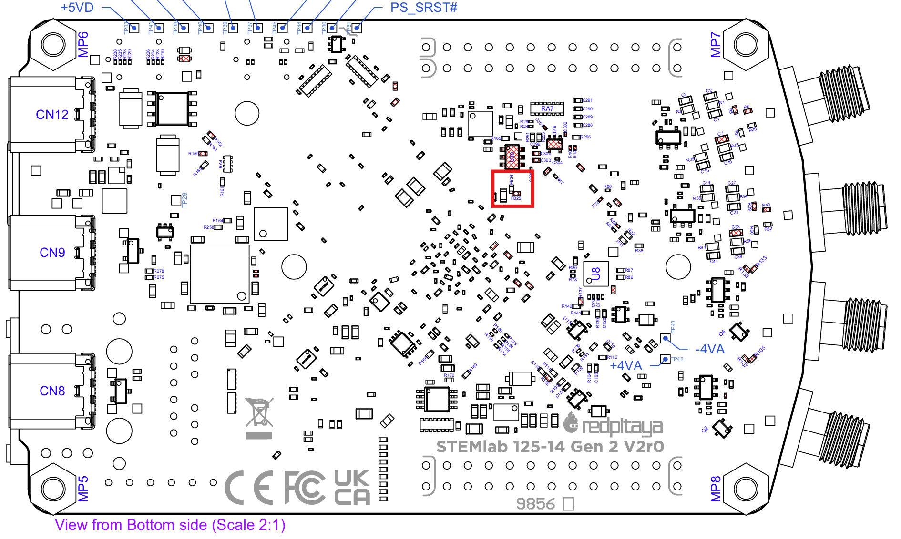
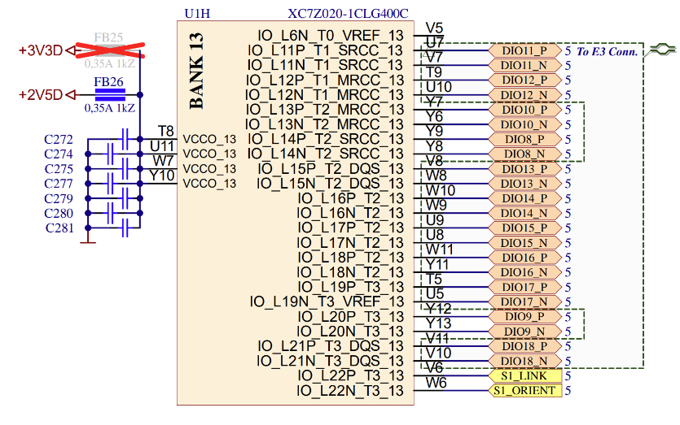
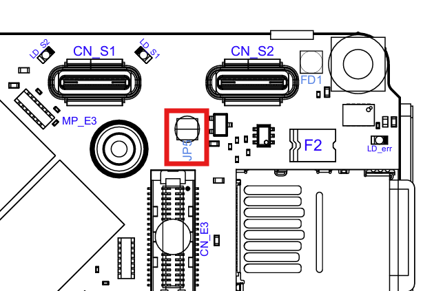

.. _faq_gen2:

#####################
Gen 2 常见问题
#####################

以下是有关 Red Pitaya Gen 2 板卡的一些常见问题。

.. contents:: Questions
    :local:
    :backlinks: top

|

快速模拟输入和输出
=================================

在哪里可以找到快速模拟前端的测量数据？
----------------------------------------------------------------

Gen 2 板卡快速模拟前端的测量数据可在各板卡规格下的 *性能与测量* 章节中找到。

如何旁路 Gen 2 板卡上的输入 FPGA 滤波器？
--------------------------------------------------

旁路 Gen 2 板卡输入 FPGA 滤波器的最简单方法是在 :ref:`示波器应用 <osc_app>` 的输入设置中将其禁用。

也可以修改 FPGA 镜像中 **Reconstruction filter bypass** 寄存器（地址 0x4010_0098）的值来禁用重构滤波器。
寄存器说明请参阅 :ref:`FPGA 寄存器 <fpga_registers>` 章节。

如何确保 Red Pitaya 启动时输出为 0 V？
------------------------------------------------------------------------------

在 FPGA 镜像完成加载之前，Gen 2 板卡的输出信号由硬件禁用。此后，FPGA 镜像中 DAC 的配置（初始化）方式决定输出信号。为防止输出电压尖峰，应将 DAC 初始化为 0 V。

由于官方 Red Pitaya OS 镜像需要先识别 Red Pitaya 板卡类型，DAC 不会立即初始化。因此，在 FPGA 镜像加载完成后到 DAC 初始化之前，输出端会出现尖峰。

|

外部时钟和同步
===================================

在哪里可以找到外部时钟规格？
-----------------------------------------------------

外部 ADC 时钟应符合 `NB6L72`_ 输入规格。该芯片由 3V3 供电。

如何从内部时钟切换到外部时钟？
------------------------------------------------

|STEMlab 125-14 PRO Gen 2| 和 |STEMlab 125-14 PRO Z7020 Gen 2| 板卡的主 FPGA CLK 信号可通过 **Ext. ADC Clk±** 端口由外部信号源提供。

内部振荡器时钟和外部时钟信号均连接到 `NB6L72`_ 差分交叉点开关。
**CLK_SEL** 引脚用于选择时钟源：

* 3V3（逻辑高电平）或未连接 - **内部时钟**。
* GND（逻辑低电平）- **外部时钟**。

随后，时钟信号从 NB6L72 的输出端经过 ADC 传输到 FPGA。

**外部时钟规格**
外部 ADC 时钟应符合 `NB6L72`_ 输入规格。该芯片由 3V3 供电。

.. note::

    同步多块 Red Pitaya *PRO Gen 2* 板卡时，请注意：

    * :ref:`X-channel 2.0（Click Shield）同步 <click_shield_sync>` 开箱即用。
    * :ref:`X-channel 同步 <x-ch_streaming>` 需要修改硬件，因为从板与主板不同。

.. note::

    仅 Gen 2 PRO 板卡型号（STEMlab 125-14 PRO Gen 2、STEMlab 125-14 PRO Z7020 Gen 2）支持在内部时钟与外部时钟之间切换。

如何同步 Gen 2 板卡（多通道）？
---------------------------------------------------

Gen 2 板卡可以采用与原始板卡相同的方式进行同步：

*   :ref:`X-channel 2.0（Click Shield）同步 <click_shield_sync>` 开箱即用。
*   :ref:`X-channel 同步 <x-ch_streaming>` 需要修改硬件，因为从板与主板不同。此外，同步使用 USB-C 线缆而不是 SATA 线缆。

如何通过 USB-C 菊花链连接同步 Gen 2 板卡？
--------------------------------------------------------------------

使用 USB-C 数据线连接两块板卡。确保 Orientation 和 Link LED 亮起。

更多信息请参阅 :ref:`X-channel 同步 <x-ch_streaming>` 章节。

可以将其他设备连接到 USB-C 菊花链连接器吗？
------------------------------------------------------------------

不可以。USB-C 菊花链连接器不符合 USB-C 标准，仅用于多块 Red Pitaya 板卡之间的同步。连接其他设备可能损坏板卡。连接外设时，请使用板卡底部标有 **HOST** 的专用 USB-C 连接器。

|

E3 连接器和 QSPI eMMC 模块
=====================================

在哪里可以找到 E3 连接器引脚定义？
------------------------------------------------

更多信息请参阅 :ref:`E3 连接器引脚定义 <E3_gen2>` 章节。

.. TODO Are there any timing requirements for the high-speed differential pairs?

高速差分对的电压电平是否可配置？需要注意什么？
----------------------------------------------------------------------------------------

高速差分对的电压电平由 Zynq 7020 FPGA Bank 13 的电源电压决定。默认电压设置为 2.5 V；通过将 PCB 上的磁珠从 **FB26** 位置移到 **FB25** 位置，可将其配置在 2.5 V 至 3.3 V 之间。

    高速差分对电源配置

要充分利用高速差分对的速度，应将 Bank 13 电压设置为 2.5 V。

    Zynq 7020 FPGA 的 Bank 13

.. list-table::
    :widths: 29 29 29
    :header-rows: 1

    * - Bank 13 引脚列表
      - 连接器
      - 类型
    * - DIO8_P, DIO8_N
      - E1
      - 输入/输出
    * - DIO9_P, DIO9_N
      - E1
      - 输入/输出
    * - DIO10_P, DIO10_N
      - E1
      - 输入/输出
    * - DIO11_P, DIO11_N
      - E3
      - 输入/输出
    * - DIO12_P, DIO12_N
      - E3
      - 输入/输出
    * - DIO13_P, DIO13_N
      - E3
      - 输入/输出
    * - DIO14_P, DIO14_N
      - E3
      - 输入/输出
    * - DIO15_P, DIO15_N
      - E3
      - 输入/输出
    * - DIO16_P, DIO16_N
      - E3
      - 输入/输出
    * - DIO17_P, DIO17_N
      - E3
      - 输入/输出
    * - DIO18_P, DIO18_N
      - E3
      - 输入/输出
    * - S1_LINK
      - S1 链路 LED
      - 输入
    * - S1_ORIENT
      - S1 方向 LED
      - 输入

.. note::

    更改 Bank 13 的电源会影响连接到该 Bank 的所有引脚的数字电压电平。这不仅包括高速差分对，还包括 E1 扩展连接器上的 DIO10-DIO8 GPIO 引脚。

在哪里可以找到 QSPI eMMC（E3）模块文档？
------------------------------------------------------------------

更多信息请参阅 :ref:`QSPI eMMC 模块 <QSPI_eMMC_board>` 章节。

连接 QSPI eMMC 模块后，Gen 2 板卡无法启动，该怎么办？
------------------------------------------------------------------------------------

QSPI eMMC 模块连接到 Red Pitaya 板卡后，Red Pitaya 不会自动启动。应按下 QSPI eMMC 模块上的 **P-ON** 按钮，为 Red Pitaya 板卡上电。

更多信息请参阅 :ref:`QSPI eMMC 模块 <QSPI_eMMC_board>` 章节。

|

电源
==============

使用 USB-C 电源时，如何禁用 Power Delivery 协商？
-------------------------------------------------------------------------------

位于 S1 和 S2 同步连接器附近的跳线 JP5 用于禁用 Power Delivery 协商。使用焊桥连接两个焊盘即可禁用 Power Delivery 协商。

    用于禁用 Power Delivery 协商的 JP5 位置

|

其他
========

在哪里可以找到 Gen 2 板卡原理图？
------------------------------------------------

板卡开发原理图可在各板卡型号硬件规格部分的 *原理图和 3D 模型* 章节中找到。

在哪里可以找到 Gen 2 板卡 3D 模型？
------------------------------------------------

Red Pitaya 板卡的 3D 模型可在各板卡型号硬件规格部分的 *原理图和 3D 模型* 章节中找到。

|

.. substitutions

.. |STEMlab 125-14 PRO Gen 2| replace:: :ref:`STEMlab 125-14 PRO Gen 2 <top_125_14_pro_gen2>`
.. |STEMlab 125-14 PRO Z7020 Gen 2| replace:: :ref:`STEMlab 125-14 PRO Z7020 Gen 2 <top_125_14_pro_z7020_gen2>`
.. _NB6L72: https://www.onsemi.com/pdf/datasheet/nb6l72-d.pdf
