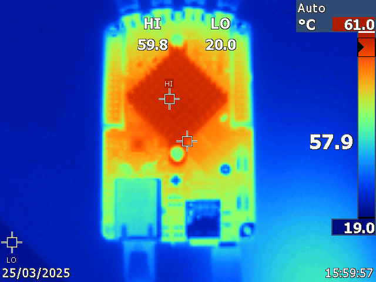
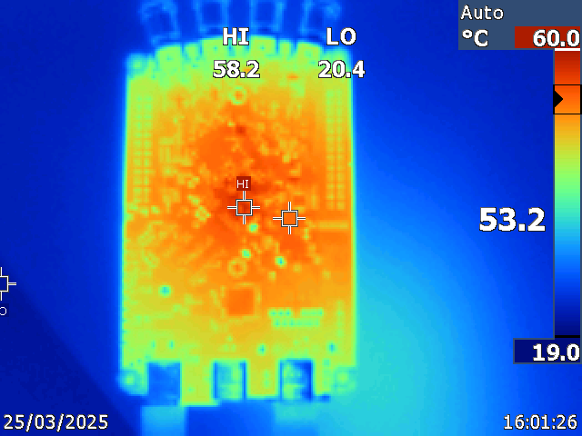
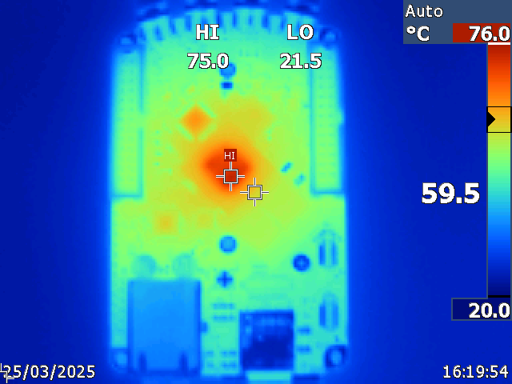
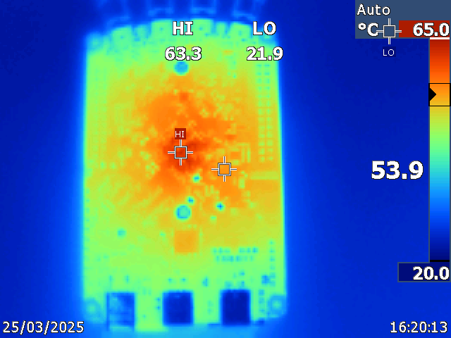
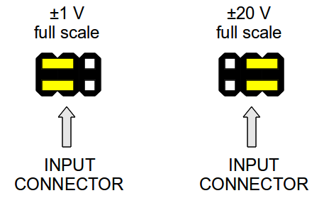
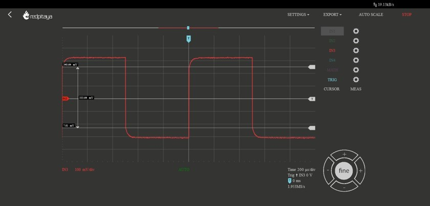

.. _hw_specs_gen2:

#######################################
通用硬件规格（Gen 2）
#######################################

.. note::

    查找 :ref:`原始 Gen 硬件规格？ <hw_specs_orig_gen>`

本节包含适用于**所有** Red Pitaya Gen 2 板卡的信息。

.. note::

    有关板卡专属的规格、测量结果、电源要求、连接器引脚分配以及详细技术数据，请参阅相应板卡的文档页面：

    * :ref:`STEMlab 125-14 Gen 2 <top_125_14_gen2>`
    * :ref:`STEMlab 125-14 PRO Gen 2 <top_125_14_pro_gen2>`
    * :ref:`STEMlab 125-14 PRO Z7020 Gen 2 <top_125_14_pro_z7020_gen2>`
    * :ref:`STEMlab 125-14 TI <top_125_14_TI>`
    * :ref:`STEMlab 65-16 TI <top_65_16_TI>`

请注意，Red Pitaya 板卡的完整硬件原理图不可用。Red Pitaya 虽然拥有开源代码，但硬件原理图并非开源。不过，可以获取包含硬件配置、FPGA 引脚连接等信息的开发原理图。

.. note::

    Red Pitaya d.o.o. 提供的信息被认为准确可靠。但是，对于其使用不承担任何责任。请注意，内容可能会在不另行通知的情况下发生变化。

.. contents:: **索引**
   :local:
   :backlinks: none

所有 Gen 2 板卡的电源
=================================

**所有 Red Pitaya Gen 2 板卡使用相同的电源：**

* **5 V、3 A USB-C 电源**

目前，所有 Gen 2 板卡使用以下型号的电源：MKE2-P27WSFAD（5 V、5 A、USB-C 输出）。Red Pitaya Gen 2 套件中均包含此电源，套件可在 |redpitaya-store| 上购买。

.. note::

    请务必注意，Red Pitaya 板卡**不得**使用功率低于上述规格的电源或电线过细的电源。这样做可能导致设备行为异常，引起重启和网络断开。
    同样，如果直接由 PC 的 USB 端口（供电电流不足）或无法提供足够电力的集线器供电，或者使用了故障电源线，Red Pitaya 板卡也可能发生故障。

    此外，使用未经批准的电源可能降低性能或损坏产品。

.. warning::

    电源注意事项：

    * 所有 Gen 2 板卡只能通过 USB-C 连接器使用隔离式外部电源供电，电源为 5 V DC，最大电流为 3 A。
      Red Pitaya 使用的任何外部电源都必须符合使用国家适用的相关法规和标准。

所有 Gen 2 板卡的 SD 卡容量
=================================

建议 Red Pitaya Gen 2 板卡使用容量至少为 **32 GB** 的 SD 卡。SD 卡应为 **Class 10 或更高等级**。

所有 Gen 2 板卡所需硬件
=====================================

以下物品是板卡正常运行所必需的。Red Pitaya 套件中均已包含这些物品，套件可在 |redpitaya-store| 上购买：

* 预装 Red Pitaya OS 的 32 GB Class 10 micro SD 卡。
* 以太网线。
* USB-C 电源（5 V、3 A）。

Red Pitaya 套件不包含、但另外需要的物品：

* 一台带有互联网浏览器的计算机（推荐使用 Google Chrome）。
* 启用 DHCP 服务器的路由器（需要访问互联网，以使用 :ref:`软件更新管理器 <software_update_manager>` 和部分第三方社区项目）。

.. _status_leds_gen2:

所有 Gen 2 板卡的状态 LED 说明
===========================================

.. list-table::
   :widths: 12 88
   :header-rows: 1

   * - 颜色
     - 功能
   * - 蓝色
     - FPGA 比特流状态（正常运行时，此 LED 点亮，表示 FPGA 比特流已成功加载）。
   * - 绿色
     - 电源状态（正常运行时，此 LED 点亮，表示 Red Pitaya 上的所有电源均正常工作）。
   * - 红色
     - 表示 CPU 负载的心跳闪烁模式（正常运行时，此 LED 将持续闪烁）。
   * - 橙色
     - SD 卡访问指示灯（正常运行时，此 LED 将以较慢的间隔偶尔闪烁）。如果存在 :ref:`QSPI eMMC 模块 <E3_QSPI_eMMC_module_HW>`，内部看门狗定时器会改为连接到橙色 LED（该 LED 将持续闪烁）。

.. note::

    当 :ref:`QSPI eMMC 模块 <E3_QSPI_eMMC_module_HW>` 连接到 Gen 2 PRO 板卡时，橙色 LED 的功能将切换为显示看门狗定时器状态，而不是 SD 卡访问状态。

工作温度与安全
==================================

工作温度范围
----------------------------

Red Pitaya Gen 2 设备的工作温度范围为 0°C 至 +55°C，存储温度范围为 -20°C 至 +85°C。

如需工作温度范围为 -40°C 至 +85°C 的工业级 Gen 2 板卡，请联系 info@redpitaya.com。

* 应在正常条件下运行，且不应被覆盖。
* 适用于室内使用，最大海拔 2000 m、污染等级 2、相对湿度低于 90%。
* 应使用低电压电源和信号，不应直接连接到超过 30 Volts 的电压。

.. note::

    如果板卡使用随附的散热器，工作温度范围为 0°C 至 +55°C。将散热器更换为更大的散热器或增加其他冷却方案，可以扩大板卡的工作温度范围。

    使用自定义冷却方案时，请注意 Zynq 温度不得超过 +85°C。此外，Red Pitaya OS 具有软件温度保护功能，温度过高时会关闭板卡。这是为了保护板卡，避免过热和损坏。
    如果使用自定义冷却方案，请检查软件温度保护是否妨碍板卡正常运行。

加热与冷却
--------------------

Red Pitaya 板卡在运行期间达到 60°C 或更高温度并不罕见。下面的热图显示了典型运行期间的预期温度。

    安装散热器的板卡热图（顶视图）——典型工作温度。

    安装散热器的板卡热图（底视图）——典型工作温度。

    未安装散热器的板卡热图（顶视图）——不建议在没有散热器的情况下运行。

    未安装散热器的板卡热图（底视图）——不建议在没有散热器的情况下运行。

.. note::

    请注意，板卡的某些部件，尤其是散热器，在运行期间和运行后可能会变热。为避免受伤，请勿触摸这些部件。

.. note::

    必须安装散热器，并且板卡应在没有任何阻碍气流的障碍物的平坦表面上运行。
    为减轻环境温度升高以及外壳内压力降低的影响，必须采用有效的通风方案。
    当内部温度达到 85°C 时，产品的运行功能会自动禁用，以防止可能发生的损坏。

冷却选项
^^^^^^^^^^^^^^^^^

为增强冷却效果，建议使用以下一个或多个选项：

* :ref:`Gen 2 铝制外壳 <alucase>` （**尚未提供**）——改善散热并保护板卡免受外部因素影响。
* :ref:`Gen 2 散热器接口 <heatsink>` （**尚未提供**）——改善散热并将板卡连接到外部散热器。
* 外部冷却风扇——增加板卡周围的气流。

所有 Gen 2 板卡的快速模拟输入和输出
==================================================

.. warning::

    通过 SMA 连接器提供的所有输入和输出共用一个连接到电源地的公共地。

.. warning::

    连接到 Red Pitaya 的线缆上的 SMA 连接器必须符合 MILC39012 标准。中心针必须具有合适的长度，否则 Red Pitaya 上安装的 SMA 连接器会受到机械损坏。
    Red Pitaya 上 SMA 连接器的中心针会失去与板卡的接触，并且由于机械损坏（焊盘从板卡上分离），板卡将无法维修。

跳线设置
----------------

电压输入范围由每个输入 SMA 连接器后方的跳线设置。两个输入通道的增益均可独立调整。

    跳线设置图

.. figure:: img/jumpers/Jumper_settings_photo.png
    :align: center

    跳线位置：

    - **左侧设置（LV）** 将满量程调整为 ±1 V
    - **右侧设置（HV）** 将满量程调整为 ±20 V

.. warning::

    请注意，跳线设置仅限于所述位置。任何其他配置或使用不同类型的跳线都可能损坏产品并使保修失效。

跳线方向（重要）
--------------------------------

**跳线的位置和方向会显著影响测量精度。** 跳线在内部连接到一块充当电容器的小金属板，并会影响整体电容，进而影响输入阻抗。

如果将跳线从错误位置移动到正确位置，**强烈建议进行校准**，因为输入电容取决于跳线设置，并且可能因位置而异。

1. **跳线凸起的位置必须如图所示。** 由于跳线及其锁扣具有非对称结构，建议安装时将锁扣置于外侧，以避免跳线难以拆卸。

    .. figure:: img/jumpers/Jumper_position_Note.png
        :align: center

2. **安装后，跳线的位置应使金属部分不可见。** 请参考下图中的 STEMlab 125-14 4-Input 示例。

    .. figure:: img/jumpers/Jumper_position_4IN_0.png
        :align: center
        :width: 700 px

    .. figure:: img/jumpers/Jumper_position_4IN_1.png
        :align: center
        :width: 700 px

**跳线位置错误的影响：**

跳线位置错误可能导致采集的方波信号前沿过冲或下冲，如下图所示。

    跳线设置不正确时，阶跃响应的补偿不足。

正确放置跳线引脚后，相同波形会明显改善：

.. figure:: img/jumpers/Jumper_position_correct_signal.jpg
    :align: center
    :width: 800

    正确放置跳线可产生适当的阶跃响应。

所有 Gen 2 板卡的扩展连接器
=========================================

所有 Gen 2 板卡都配有扩展连接器（E1 和 E2），使用相同的物理格式和电气特性：

**物理规格：**

* **连接器类型**：2 x 13 针 IDC，2.54 mm 间距
* **数字 I/O 电压电平**：3.3V LVCMOS33
* **电源轨**：+5V、-5V、+3.3V

**电流限制：**

* +5V 为 0.5 A（由扩展模块和 USB 设备共享）
* -5V 为 0.1 A
* +3.3V 为 0.5 A（由扩展模块和 USB 设备共享）

**板卡专属差异：**

引脚分配、可用功能和 FPGA 连接会因板卡型号而显著不同：

* **STEMlab 125-14 Gen 2**：16 个数字 I/O、4 个慢速 ADC、4 个慢速 DAC、SPI/UART/I2C/CAN
* **STEMlab 125-14 PRO Gen 2**：16 个数字 I/O、4 个慢速 ADC、4 个慢速 DAC、SPI/UART/I2C/CAN、**外部时钟输入**
* **STEMlab 125-14 PRO Z7020 Gen 2**：**22 个数字 I/O**、4 个慢速 ADC、4 个慢速 DAC、SPI/UART/I2C/CAN、外部时钟输入、**E3 连接器** （额外 16 个 GPIO）
* **TI 变体**：具体引脚分配请参阅相应板卡文档

如需完整引脚分配图、FPGA 引脚编号和详细规格，请参阅相应板卡的文档页面。

Gen 2 有哪些不同？
============================

Gen 2 板卡相较于第一代实现了重大硬件演进。以下是主要改进：

**STEMlab 125-14 Gen 2 的改进：**

* 降低快速模拟输入和输出上的噪声与串扰
* 增大快速模拟输出电压范围（50 Ω 负载下为 ±1 V，Hi-Z 负载下为 ±2 V）
* 使用 USB-C 连接器（电源和控制台）替代 Micro USB
* 清晰、稳定的 50 Ω 输出阻抗
* 改善 SFDR
* 板卡上电时输出不会出现电压毛刺（完整详情请参阅 :ref:`Gen 2 FAQ <faq_gen2>` 部分）

**PRO 型号专属功能：**

* 通过 *CLK SEL* 引脚在内部时钟和外部时钟之间切换
* 配备 STM32 微控制器的 E3 附加板，可控制电源、WDT 以及多种启动选项（QSPI、eMMC）

**STEMlab 125-14 PRO Z7020 Gen 2 专属功能：**

* E3 连接器，具有 8 对快速差分对（16 个 GPIO），并支持外部 eMMC 和 QSPI 启动选项
* 1 GB RAM（为标准 512 MB 的两倍）
* Zynq 7020 FPGA（逻辑容量为 Zynq 7010 的两倍）

**重要兼容性说明：**

* Gen 2 板卡需要 OS 版本 **2.07-43 或更高版本**
* **TI 变体** 与较旧 OS 版本不向后兼容——详情请参阅 :ref:`OS 版本兼容性 <os_compatibility>`
* USB-C 电源：**5V、3A** （原始 Gen 使用 Micro USB 5V、2A）
* 不同的前端架构意味着模拟性能特性不同于原始 Gen

有关详细的性能测量和规格，请参阅各个产品页面。
