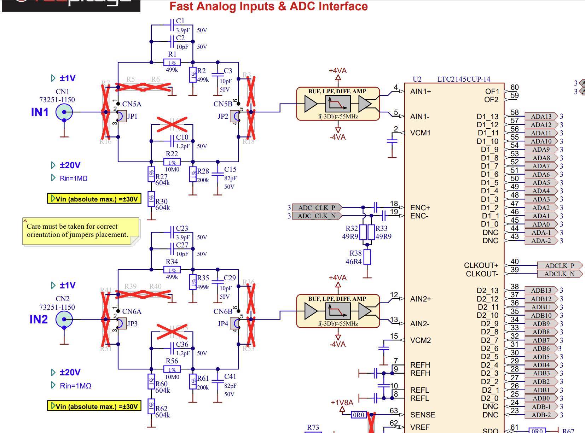
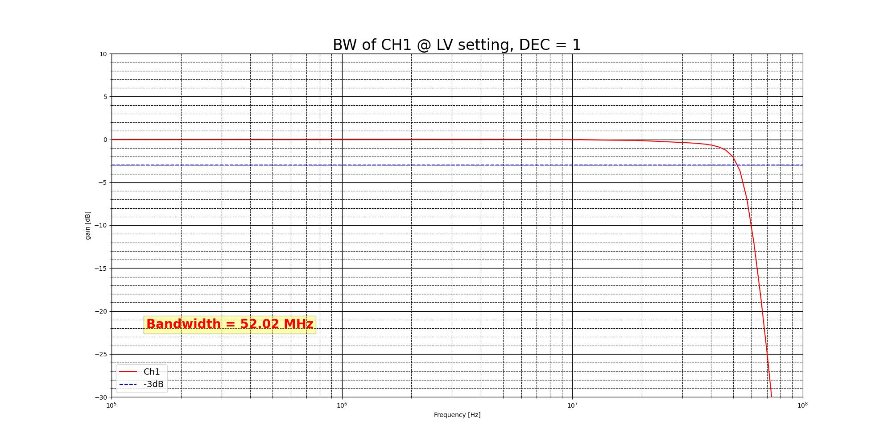
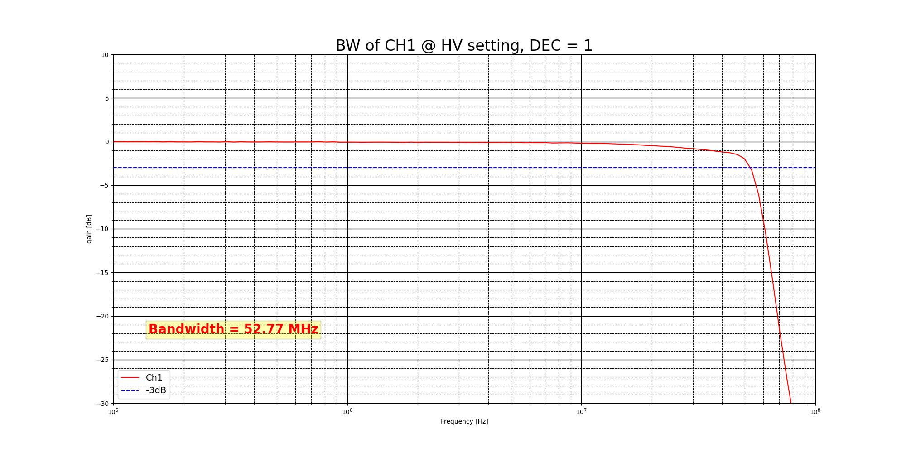
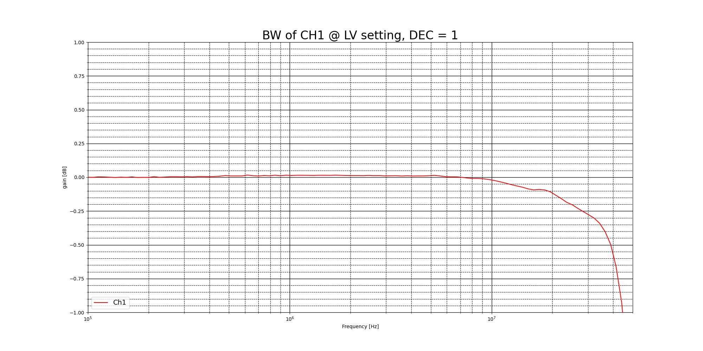
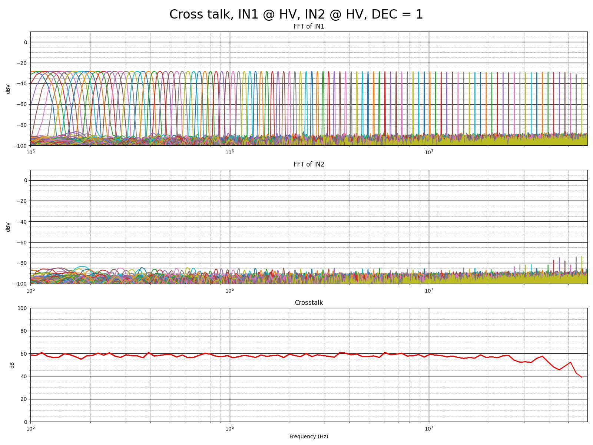

.. _measurements_gen2_inputs:

###########################
快速模拟输入
###########################

本页包含 Gen 2 快速模拟输入的详细规格和性能测量结果。

.. contents::
   :local:
   :depth: 2
   :backlinks: none

|

规格
=======================

.. list-table::
    :widths: 30 30 15 15
    :header-rows: 1

    * - 参数
      - 值
      - 单位
      - 备注
    * - RF 输入
      -
      -
      -
    * - RF 输入通道
      - 2
      - \-
      -
    * - 采样率
      - 125
      - MS/s
      -
    * - ADC 分辨率
      - 14
      - 位
      -
    * - 输入阻抗
      - 1 MΩ (10 pF)
      - \-
      -
    * - 满量程电压范围
      - ±1 (LV)；±20 (HV)
      - V
      -
    * - 输入耦合
      - DC
      - \-
      -
    * - 绝对最大输入电压
      - ±6 (LV)；±30 (HV)
      - V
      - DC 值 [#f1]_
    * - 输入 ESD 保护
      - 是
      - \-
      -
    * - 过载保护
      - 保护二极管
      - \-
      - 在输入电压额定范围内
    * - 带宽
      - DC - 50
      - MHz
      - 典型值
    * - 连接器类型
      - SMA
      - \-
      -

.. note::
    
    过载保护适用于低频信号。对于包含 1 kHz 以上频率分量的输入信号，此时电容分压器会发挥作用，满量程值规定了允许的最大输入电压。

|

硬件详情
=================

输入级原理图
-----------------------

输入级由分压器、缓冲放大器、抗混叠滤波器和 ADC 驱动器组成。

更多信息请参阅各板卡的硬件文档。

|

输入耦合
------------------

快速模拟输入采用 **DC 耦合**。

.. TODO add input impedance measurements

|

性能测量
==========================

输入带宽
------------------

.. list-table::
    :widths: 36 36
    :header-rows: 1

    * - 跳线设置
      - 带宽
    * - LV
      - 52.02 MHz (-3 dB)
    * - HV
      - 52.77 MHz (-3 dB)

LV 模式下输入通道 1 的带宽测量结果。

HV 模式下输入通道 1 的带宽测量结果。

|

输入带宽平坦度
--------------------------

在 LV 增益设置下，从 DC 到完整（-3 dB）带宽的带宽平坦度为 <0.05 dB。

LV 模式下输入通道 1 的带宽平坦度测量结果。

|

输入串扰
------------------

对 LV 和 HV 模式下输入通道 1 与 2 之间的串扰进行了测量。

.. list-table::
    :widths: 36 18 18 18 18

    * - 
      - **最高 30 MHz**
      - 
      - **高于 30 MHz**
      - 
    * - |br| |br| **IN1\IN2**
      - |br| |br| **LV**
      - |br| |br| **HV**
      - |br| |br| **LV**
      - |br| |br| **HV**
    * - **LV**
      - >70 dB
      - >80 dB
      - >50 dB
      - >50 dB
    * - **HV**
      - 40 dB
      - 55 dB
      - >35 dB
      - >40 dB
    * - |br| |br| **IN2\IN1**
      - |br| |br| **LV**
      - |br| |br| **HV**
      - |br| |br| **LV**
      - |br| |br| **HV**
    * - **LV**
      - >70 dB
      - 55 dB
      - >55 dB
      - 50 dB
    * - **HV**
      - 70 dB
      - 55 dB
      - >55 dB
      - 55 dB

HV 模式下输入通道 1 与 2 之间的串扰测量结果。

|

.. Input SFDR
.. ------------------

.. Input SNR
.. ------------------

.. Input THD
.. ------------------

.. Input ENOB
.. ------------------

.. Input noise floor
.. ------------------

.. Input IMD
.. ------------------

|

校准
==============

模拟输入校准
--------------------------

要校准模拟输入，请参阅 :ref:`校准指南 <calibration_app>`。

|

.. rubric:: 脚注

.. [#f1] 绝对最大输入电压值适用于低于 1 kHz 的频率。对于更高频率，请将输入电压范围规格作为**绝对最大值**。
