.. _measurements_gen2_outputs:

###########################
快速模拟输出
###########################

本页包含 Gen 2 快速模拟输出的详细规格和性能测量结果。

.. contents::
   :local:
   :depth: 2
   :backlinks: none

|

规格
========================

.. list-table::
    :header-rows: 1
    :widths: 30 30 15 15

    * - **参数**
      - **数值**
      - **单位**
      - **备注**
    * - **RF 输出**
      -
      -
      -
    * - RF 输出通道
      - 2
      - \-
      -
    * - 采样率
      - 125
      - MS/s
      -
    * - DAC 分辨率
      - 14
      - 位
      -
    * - 负载阻抗
      - 50 Ω (Hi-Z)
      - \-
      -
    * - 电压范围
      - | ±1 @ 50 Ω
        | ±2 @ Hi-Z
      - V
      -
    * - 输出耦合
      - DC
      - \-
      -
    * - 短路保护
      - 是
      - \-
      -
    * - 输出压摆率
      - 200
      - V/μs
      -
    * - RF 输出抖动 @40 MHz
      - 20
      - ps
      - RMS，典型值
    * - 带宽
      - DC - 50
      - MHz
      - 典型值
    * - 连接器类型
      - SMA
      - \-
      -

.. note::

    连接负载前，应在软件中设置输出负载阻抗。

|

硬件详情
========================

输出级原理图
-----------------------

输出级由缓冲放大器、低通滤波器和 DAC 驱动器组成。

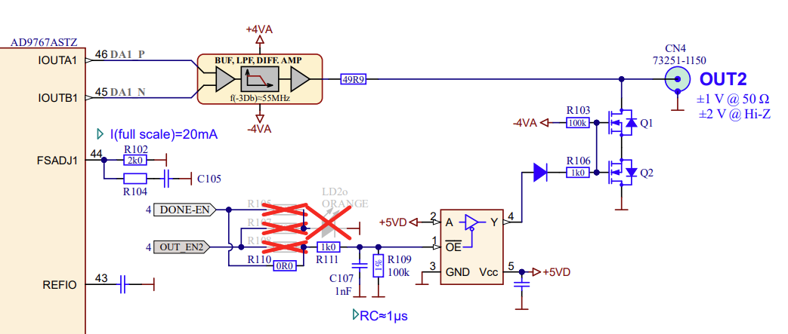

更多信息请参阅各板卡的硬件文档。

|

性能测量
==========================

输出带宽
------------------

+------------------------------------+------------------------------------+
| 负载阻抗                           | 带宽                               |
+====================================+====================================+
| 50 Ω                               | 54.3 MHz (-3 dB)                   |
+------------------------------------+------------------------------------+
| High-Z                             | 55.0 MHz (-3 dB)                   |
+------------------------------------+------------------------------------+

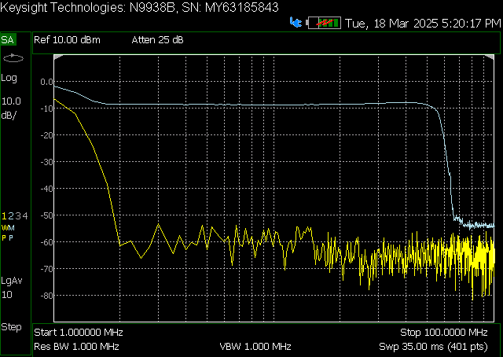

输出通道 1 在 50 Ω 负载下的带宽测量。

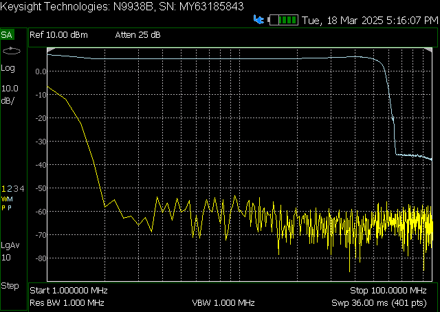

输出通道 1 在高阻负载下的带宽测量。

|

输出带宽平坦度
--------------------------

从 DC 到完整（-3 dB）带宽范围内，输出带宽平坦度保持在 -1 dB 以内。

|

输出阻抗
------------------

下图显示了输出通道（输出放大器和滤波器）的阻抗，同时给出原始 *STEMlab 125-14* 的输出阻抗以供比较。

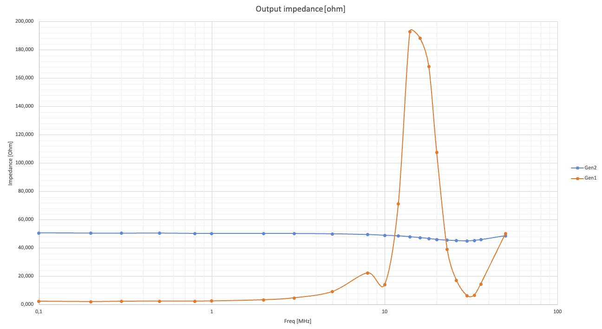

原始板卡和 Gen 2 的输出阻抗测量。

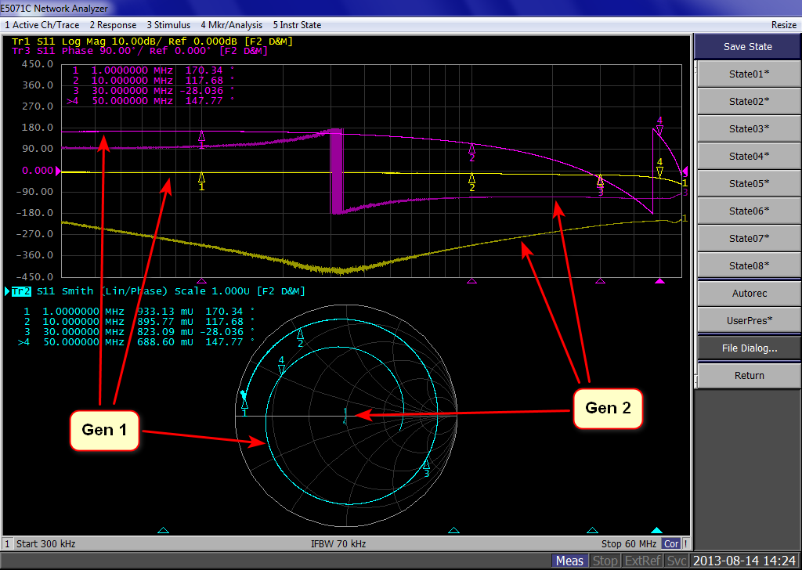

原始板卡和 Gen 2 输出阻抗的 Smith 图。

|

输出相位噪声
------------------

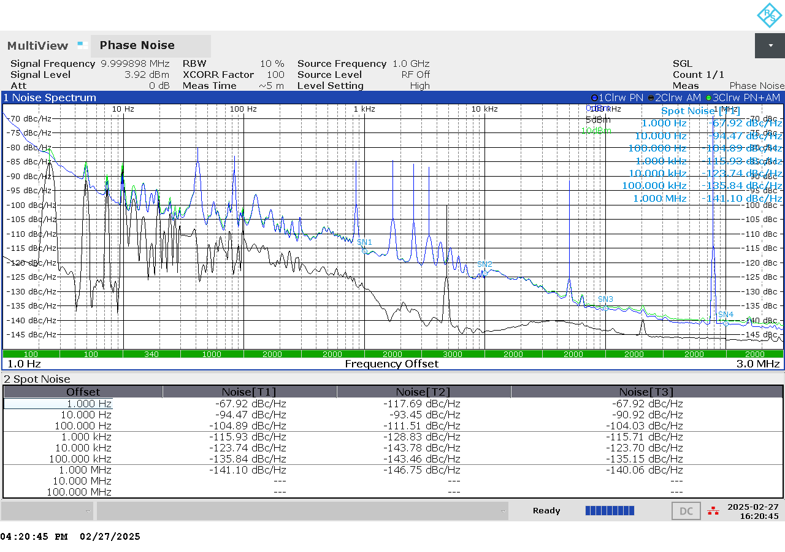

1 Hz 至 1 MHz 之间的相位噪声测量。

|

输出 SFDR
------------------

+------------------+-----------------+-----------------+
|                  | **OUT 1**       | **OUT 2**       |
+==================+=================+=================+
| **f [MHz]**      | **SFDR [dB]**   | **SFDR [dB]**   |
+------------------+-----------------+-----------------+
| 0.1              | 56              | 54              |
+------------------+-----------------+-----------------+
| 1                | 52              | 58              |
+------------------+-----------------+-----------------+
| 10               | 58              | 55              |
+------------------+-----------------+-----------------+
| 20               | 44              | 44              |
+------------------+-----------------+-----------------+
| 30               | 45              | 45              |
+------------------+-----------------+-----------------+
| 40               | 44              | 45              |
+------------------+-----------------+-----------------+

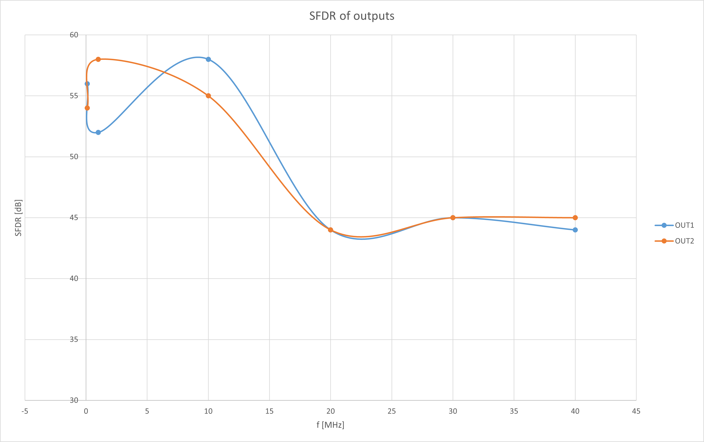

两个输出通道的 SFDR 测量。

**特定频率下的测量**

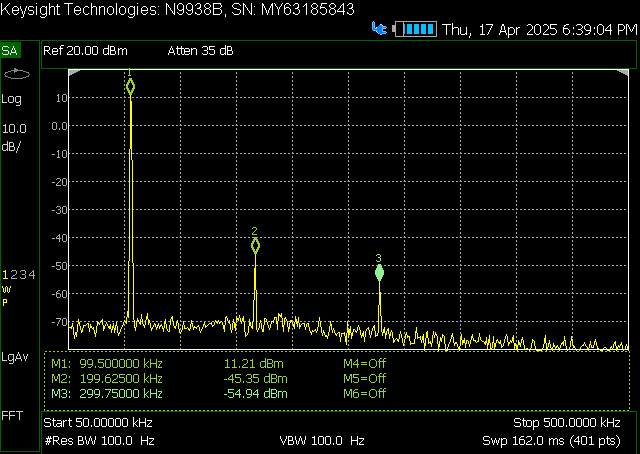

100 kHz 时的 SFDR。

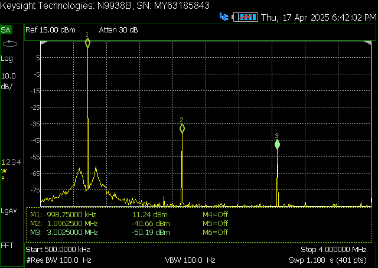

1 MHz 时的 SFDR。

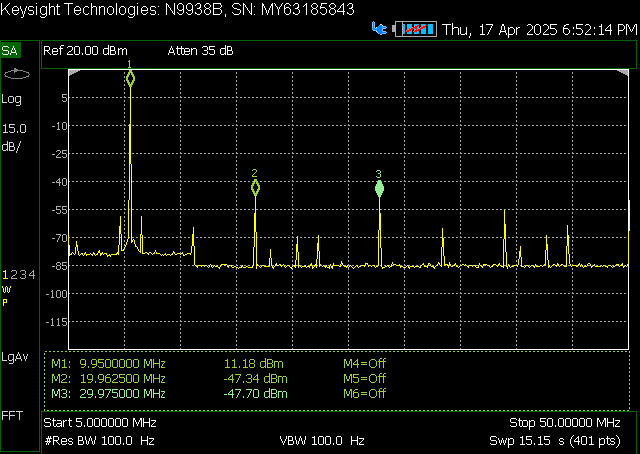

10 MHz 时的 SFDR。

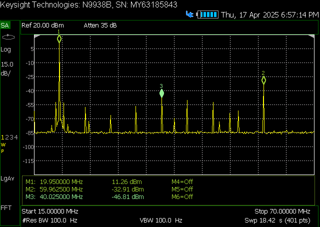

20 MHz 时的 SFDR。

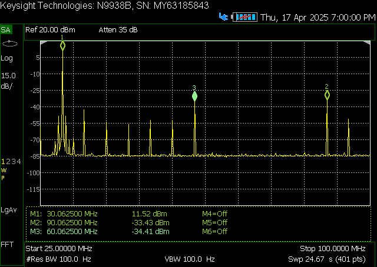

30 MHz 时的 SFDR。

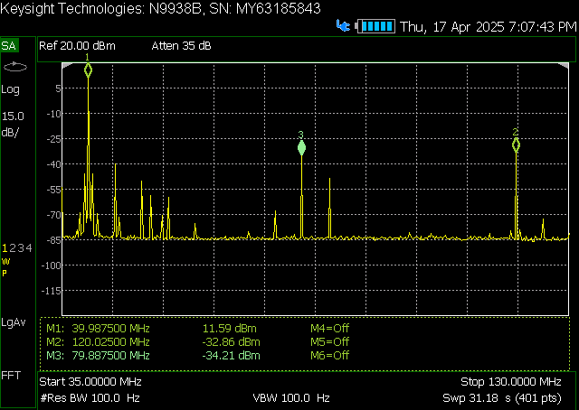

40 MHz 时的 SFDR。

|

输出 SNR
-------------------

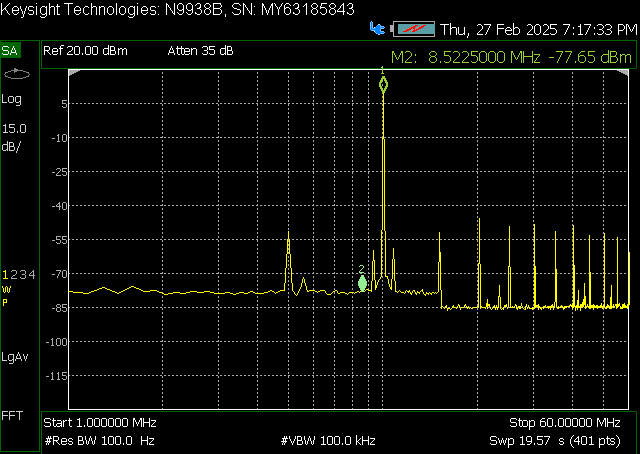

输出通道 1 的 SNR 测量（整个频谱）。

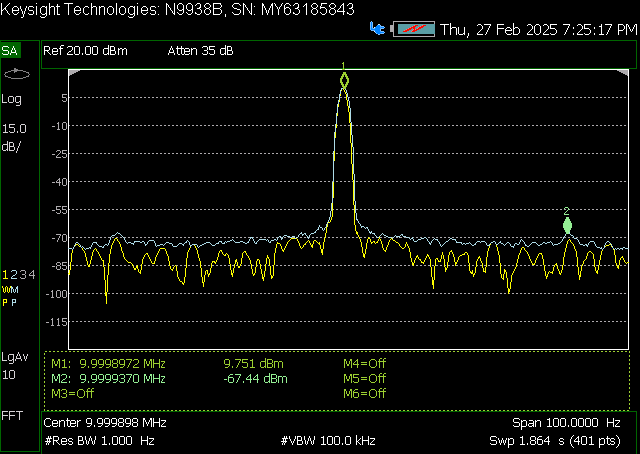

输出通道 1 的 SNR 测量（VBW 100 kHz）。

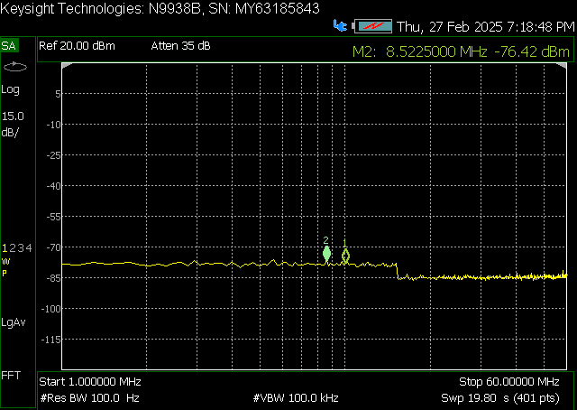

输出通道 1 的 SNR 测量（无信号）。

|

.. Output THD
.. ------------------

.. Output ENOB
.. ------------------

.. Output noise floor
.. ------------------

.. Output IMD
.. ------------------

|

校准
==============

模拟输出校准
--------------------------

有关模拟输出校准，请参阅 :ref:`校准指南 <calibration_app>`。
