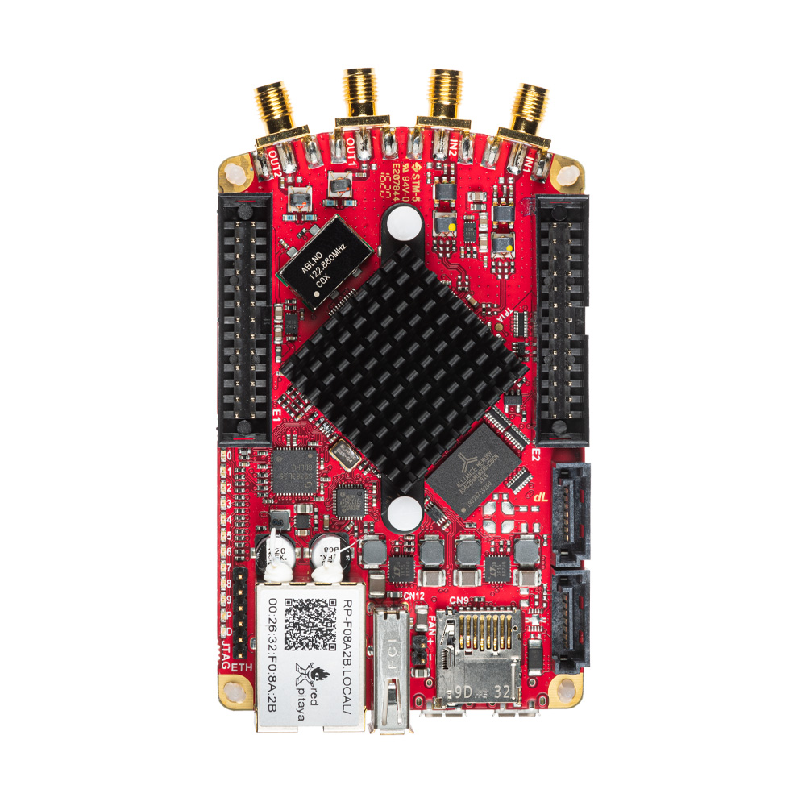

.. _top_122_16:

###############
SDRlab 122-16
###############

|

.. contents:: 目录
    :local:
    :depth: 1
    :backlinks: top

|

概述
========

SDRlab 122-16 是专为软件定义无线电（SDR）应用设计的 Red Pitaya 板卡。它采用 16-bit ADC 和 14-bit DAC，采样率为 122.88 MS/s，
并针对 RF 信号处理进行了优化。板卡配备 AC 耦合 50 Ω 输入，以 SDR 标准的 122.88 MHz 时钟频率工作。

|

功能特性
========

* 16-bit ADC 和 14-bit DAC，122.88 MS/s
* AC 耦合 50 Ω RF 输入和输出
* SDR 优化时钟频率（122.88 MHz）
* 双核 ARM Cortex-A9 处理器
* FPGA Xilinx Zynq 7020 SoC
* 512 MB RAM
* 22 个数字 I/O、4 个模拟输入、4 个模拟输出
* 多种通信接口：I2C、SPI、UART、CAN
* Micro USB 连接，用于供电和控制台

|

快速参考
===============

.. table::
    :widths: 40 60

    +----------------------------+--------------------------------------------------+
    | **类别**                   | **关键规格**                                     |
    +============================+==================================================+
    | ADC                        | 2 通道，16-bit，122.88 MS/s                      |
    +----------------------------+--------------------------------------------------+
    | DAC                        | 2 通道，14-bit，122.88 MS/s                      |
    +----------------------------+--------------------------------------------------+
    | 处理器                     | 双核 ARM Cortex-A9                               |
    +----------------------------+--------------------------------------------------+
    | FPGA                       | Xilinx Zynq 7020 SoC                             |
    +----------------------------+--------------------------------------------------+
    | RAM                        | 512 MB                                           |
    +----------------------------+--------------------------------------------------+
    | 数字 I/O                   | 22 个 GPIO @ 3.3V                                |
    +----------------------------+--------------------------------------------------+
    | 模拟 I/O                   | 4 路输入（12-bit），4 路输出（8-bit）            |
    +----------------------------+--------------------------------------------------+
    | 连接能力                   | 以太网、USB-C、扩展连接器                        |
    +----------------------------+--------------------------------------------------+
    | 输入阻抗                   | 50 Ω（AC 耦合）                                  |
    +----------------------------+--------------------------------------------------+
    | 特殊功能                   | AC 耦合、16-bit 分辨率                           |
    +----------------------------+--------------------------------------------------+

|

板卡布局与引脚定义
======================

.. figure:: ../125-14/img/Red_Pitaya_pinout.jpg
    :alt: Red Pitaya 引脚定义
    :width: 700
    :align: center

|

技术规格
=========================

.. table::
    :widths: 30 30 15 15

    +------------------------------------+------------------------------------+-----------+----------------------------------+
    | **参数**                           | **值**                             | **单位**  | **备注**                         |
    +====================================+====================================+===========+==================================+
    | |br|                                                                                                                   |
    | **基本规格**                                                                                                           |
    +------------------------------------+------------------------------------+-----------+----------------------------------+
    | 处理器                             | 双核 ARM Cortex-A9                 | \-        |                                  |
    +------------------------------------+------------------------------------+-----------+----------------------------------+
    | FPGA                               | FPGA AMD (Xilinx) Zynq 7020 SoC    | \-        |                                  |
    +------------------------------------+------------------------------------+-----------+----------------------------------+
    | RAM                                | 512                                | MB        | (4 Gb)                           |
    +------------------------------------+------------------------------------+-----------+----------------------------------+
    | 核心时钟频率                       | 122.88                             | MHz       |                                  |
    +------------------------------------+------------------------------------+-----------+----------------------------------+
    | 系统存储                           | 最高 32 GB 的 Micro SD             | \-        |                                  |
    +------------------------------------+------------------------------------+-----------+----------------------------------+
    | 串行控制台连接器                   | Micro USB                          | \-        |                                  |
    +------------------------------------+------------------------------------+-----------+----------------------------------+
    | 电源连接器                         | Micro USB                          | \-        |                                  |
    +------------------------------------+------------------------------------+-----------+----------------------------------+
    | 功耗                               | 5 V, 2 A                           | \-        | max                              |
    +------------------------------------+------------------------------------+-----------+----------------------------------+
    | |br|                                                                                                                   |
    | **连接能力**                                                                                                           |
    +------------------------------------+------------------------------------+-----------+----------------------------------+
    | Ethernet                           | 1                                  | Gbit      |                                  |
    +------------------------------------+------------------------------------+-----------+----------------------------------+
    | USB                                | USB-A 2.0                          | \-        |                                  |
    +------------------------------------+------------------------------------+-----------+----------------------------------+
    | Wi-Fi                              | 需要 Wi-Fi 适配器                  | \-        |                                  |
    +------------------------------------+------------------------------------+-----------+----------------------------------+
    | |br|                                                                                                                   |
    | **RF 输入**                                                                                                            |
    +------------------------------------+------------------------------------+-----------+----------------------------------+
    | RF 输入通道                        | 2                                  | \-        |                                  |
    +------------------------------------+------------------------------------+-----------+----------------------------------+
    | 采样率                             | 122.88                             | MS/s      |                                  |
    +------------------------------------+------------------------------------+-----------+----------------------------------+
    | ADC 分辨率                         | 16                                 | bit       |                                  |
    +------------------------------------+------------------------------------+-----------+----------------------------------+
    | 输入阻抗                           | 50 Ω                               | \-        |                                  |
    +------------------------------------+------------------------------------+-----------+----------------------------------+
    | 满量程电压范围                     | 0.5 Vpp / -2 dBm                   | \-        |                                  |
    +------------------------------------+------------------------------------+-----------+----------------------------------+
    | 输入耦合                           | AC                                 | \-        |                                  |
    +------------------------------------+------------------------------------+-----------+----------------------------------+
    | 绝对最大输入电压                   | | DC 最大 50 V（AC 耦合）          | V         |                                  |
    |                                    | | RF 最大 1 Vpp                    |           |                                  |
    +------------------------------------+------------------------------------+-----------+----------------------------------+
    | 输入 ESD 保护                      | 否                                 | \-        | AC 耦合 [#f1]_                   |
    +------------------------------------+------------------------------------+-----------+----------------------------------+
    | 过载保护                           | DC 电压保护                        | \-        |                                  |
    +------------------------------------+------------------------------------+-----------+----------------------------------+
    | 带宽                               | 300 kHz - 60 MHz                   | \-        | 欠采样最高 550 MHz               |
    +------------------------------------+------------------------------------+-----------+----------------------------------+
    | 连接器类型                         | SMA                                | \-        |                                  |
    +------------------------------------+------------------------------------+-----------+----------------------------------+
    | |br|                                                                                                                   |
    | **RF 输出**                                                                                                            |
    +------------------------------------+------------------------------------+-----------+----------------------------------+
    | RF 输出通道                        | 2                                  | \-        |                                  |
    +------------------------------------+------------------------------------+-----------+----------------------------------+
    | 采样率                             | 122.88                             | MS/s      |                                  |
    +------------------------------------+------------------------------------+-----------+----------------------------------+
    | DAC 分辨率                         | 14                                 | bit       |                                  |
    +------------------------------------+------------------------------------+-----------+----------------------------------+
    | 负载阻抗                           | 50 Ω                               | \-        |                                  |
    +------------------------------------+------------------------------------+-----------+----------------------------------+
    | 电压范围                           | 0.5 Vpp / -2 dBm                   | \-        |                                  |
    +------------------------------------+------------------------------------+-----------+----------------------------------+
    | 输出耦合                           | AC                                 | \-        |                                  |
    +------------------------------------+------------------------------------+-----------+----------------------------------+
    | 短路保护                           | 否                                 | \-        | 仅 AC 耦合                       |
    +------------------------------------+------------------------------------+-----------+----------------------------------+
    | 带宽                               | 300 kHz - 60 MHz                   | \-        |                                  |
    +------------------------------------+------------------------------------+-----------+----------------------------------+
    | 连接器类型                         | SMA                                | \-        |                                  |
    +------------------------------------+------------------------------------+-----------+----------------------------------+
    | |br|                                                                                                                   |
    | **扩展连接器**                                                                                                         |
    +------------------------------------+------------------------------------+-----------+----------------------------------+
    | 数字 GPIO                          | 22                                 | \-        |                                  |
    +------------------------------------+------------------------------------+-----------+----------------------------------+
    | 数字电平                           | 3.3                                | V         |                                  |
    +------------------------------------+------------------------------------+-----------+----------------------------------+
    | GPIO 时间分辨率                    | 8.138                              | ns        | 核心时钟频率                     |
    +------------------------------------+------------------------------------+-----------+----------------------------------+
    | 模拟输入                           | 4                                  | \-        |                                  |
    +------------------------------------+------------------------------------+-----------+----------------------------------+
    | 模拟输入电压范围                   | 0 - 7.0                            | V         |                                  |
    +------------------------------------+------------------------------------+-----------+----------------------------------+
    | 模拟输入分辨率                     | 12                                 | bit       |                                  |
    +------------------------------------+------------------------------------+-----------+----------------------------------+
    | 模拟输入采样率                     | 100                                | kS/s      |                                  |
    +------------------------------------+------------------------------------+-----------+----------------------------------+
    | 模拟输出                           | 4                                  | \-        |                                  |
    +------------------------------------+------------------------------------+-----------+----------------------------------+
    | 模拟输出电压范围                   | 0 - 1.8                            | V         |                                  |
    +------------------------------------+------------------------------------+-----------+----------------------------------+
    | 模拟输出分辨率                     | 8                                  | bit       |                                  |
    +------------------------------------+------------------------------------+-----------+----------------------------------+
    | 模拟输出采样率                     | ≲ 3.2                              | MS/s      |                                  |
    +------------------------------------+------------------------------------+-----------+----------------------------------+
    | 模拟输出带宽                       | ≈ 160                              | kHz       |                                  |
    +------------------------------------+------------------------------------+-----------+----------------------------------+
    | 通信接口                           | I2C, SPI, UART, CAN                | \-        |                                  |
    +------------------------------------+------------------------------------+-----------+----------------------------------+
    | 可用电压                           | +5, +3.3                           | V         |                                  |
    +------------------------------------+------------------------------------+-----------+----------------------------------+
    | 外部 ADC 时钟                      | 否                                 | \-        | 参见 [#f2]_                      |
    +------------------------------------+------------------------------------+-----------+----------------------------------+
    | |br|                                                                                                                   |
    | **同步**                                                                                                               |
    +------------------------------------+------------------------------------+-----------+----------------------------------+
    | 外部触发输入                       | DIO0_P                             | \-        | E1 连接器                        |
    +------------------------------------+------------------------------------+-----------+----------------------------------+
    | 外部触发输入阻抗                   | Hi-Z                               | \-        | 数字输入                         |
    +------------------------------------+------------------------------------+-----------+----------------------------------+
    | 触发输出                           | DIO0_N                             | \-        | E1 连接器 [#f3]_                 |
    +------------------------------------+------------------------------------+-----------+----------------------------------+
    | 菊花链连接器（S1 和 S2）           | 是                                 | \-        |                                  |
    +------------------------------------+------------------------------------+-----------+----------------------------------+
    | 菊花链连接器速率                   | 最高 500                           | Mb/s      |                                  |
    +------------------------------------+------------------------------------+-----------+----------------------------------+
    | 菊花链连接器类型                   | SATA                               | \-        |                                  |
    +------------------------------------+------------------------------------+-----------+----------------------------------+
    | 参考时钟输入                       | N/A                                | \-        |                                  |
    +------------------------------------+------------------------------------+-----------+----------------------------------+
    | 参考时钟频率                       | N/A                                | \-        |                                  |
    +------------------------------------+------------------------------------+-----------+----------------------------------+
    | 参考时钟连接器类型                 | N/A                                | \-        |                                  |
    +------------------------------------+------------------------------------+-----------+----------------------------------+
    | |br|                                                                                                                   |
    | **启动选项**                                                                                                           |
    +------------------------------------+------------------------------------+-----------+----------------------------------+
    | SD 卡                              | 是                                 | \-        |                                  |
    +------------------------------------+------------------------------------+-----------+----------------------------------+
    | QSPI                               | 未装配                             | \-        |                                  |
    +------------------------------------+------------------------------------+-----------+----------------------------------+
    | eMMC                               | N/A                                | \-        |                                  |
    +------------------------------------+------------------------------------+-----------+----------------------------------+
    | |br|                                                                                                                   |
    | **环境规格**                                                                                                           |
    +------------------------------------+------------------------------------+-----------+----------------------------------+
    | 工作温度范围                       | 0 至 55                            | ℃         | 使用默认散热器                   |
    +------------------------------------+------------------------------------+-----------+----------------------------------+
    | 工作湿度范围                       | < 90%                              | RH        |                                  |
    +------------------------------------+------------------------------------+-----------+----------------------------------+
    | 自动关机温度                       | 85                                 | ℃         |                                  |
    +------------------------------------+------------------------------------+-----------+----------------------------------+
    | |br|                                                                                                                   |
    | **尺寸**                                                                                                               |
    +------------------------------------+------------------------------------+-----------+----------------------------------+
    | 尺寸（长 × 宽 × 高）               | 106.8 x 60.0 x 21.1                | mm        | 详见 `原理图`_                   |
    +------------------------------------+------------------------------------+-----------+----------------------------------+

.. note::

    SDRlab 122-16 以 122.88 MHz 工作，这是 SDR 应用的标准时钟频率。

.. note::

    **RF 信号极性**

    SDRlab 122-16 模拟前端会对 RF 输入和 RF 输出都引入 180 度相位反转。

    * 施加到 IN1 或 IN2 的正弦突发信号会以 ``-sine`` 形式被采集。
    * 生成的正弦突发信号会以 ``-sine`` 形式出现在相应的 RF 输出端。

    在模拟环回中，输入和输出反转相加为 360 度，因此通常不会注意到这种极性变化。

.. seealso::

    更详细的信息请参阅 |Original Gen comparison table|。

|

.. warning::

    **最大输入电压**

    * **RF 信号：** 最大 1 Vpp（标称 0.5 Vpp）
    * **DC 电压：** 最高 50 V（输入为 AC 耦合，DC 不会通过到 ADC）

    超过 RF 输入电平可能会永久损坏板卡。

|

性能与测量
===========================

.. note::

    目前没有 SDRlab 122-16 板卡的专用测量结果。

类似板卡的快速模拟前端测量结果见此处：

* :ref:`Original Gen - STEMlab 125-14 <measurements_orig_gen>`.

|

.. _schematics_122_16:

原理图与 3D 模型
========================

原理图
----------

* :download:`Schematics_STEM_122-16SDR_V1r1.pdf <https://downloads.redpitaya.com/doc/Schematics/Schematics_STEM_122-16SDR_V1r1.pdf>`.

.. note::

    Red Pitaya 板卡不提供完整硬件原理图。Red Pitaya 的代码开源，但硬件原理图并不开源。不过，可提供开发原理图，其中包含硬件配置、FPGA 引脚连接等信息。

机械规格与 3D 模型
--------------------------------------

* PDF :download:`3D_STEM_122-16SDR_V1r1.pdf.zip <https://downloads.redpitaya.com/doc/3D_models/3D_STEM_122-16SDR_V1r1.pdf.zip>`.
* STEP :download:`3D_STEM_122-16SDR_V1r1.zip <https://downloads.redpitaya.com/doc/3D_models/3D_STEM_122-16SDR_V1r1.zip>`.

|

硬件详情
==================

器件
----------

SDRlab 122-16 使用针对 SDR（软件定义无线电）应用优化的高性能模拟器件。

**ADC:** Analog Devices `LTC2185 <https://www.analog.com/en/products/LTC2185.html>`_

    * 双通道 16-bit、最高 250 MS/s ADC（以 122.88 MS/s 运行）
    * 低噪声、高动态范围
    * 用于 RF 应用的 AC 耦合输入

**DAC:** Analog Devices `AD9767 <https://www.analog.com/en/products/AD9767.html>`_

    * 双通道 14-bit、125 MS/s DAC（以 122.88 MS/s 运行）
    * 高 SFDR 性能
    * 低功耗运行

**FPGA:** Xilinx `Zynq 7020 <https://docs.amd.com/v/u/en-US/ds190-Zynq-7000-Overview>`_

    * 双核 ARM Cortex-A9 @ 667 MHz
    * 比 Zynq 7010 更大的可编程逻辑架构
    * 集成外设和存储器控制器

**振荡器：** `ABRACON ABLNO 122.88 MHz <https://abracon.com/Precisiontiming/ABLNO.pdf>`_

    * 高精度 122.88 MHz 参考振荡器（SDR 标准频率）

**DC-DC 转换器：** `LTC3615 <https://www.analog.com/en/products/LTC3615.html>`_

    * 高效降压稳压器

**DDR3 SRAM：** `MT41J256M16HA-125 <https://www.digikey.com/en/products/detail/micron-technology-inc/MT41J256M16HA-125-E/4315785>`_

    * 512 MB DDR3 RAM

**QSPI 闪存：** `S25FL128SAGNFI001 <https://www.infineon.com/part/S25FL128SAGNFI001>`_

    * 标准板卡上未装配

|

扩展连接器与接口
===================================

概述
---------

SDRlab 122-16 板卡配备以下连接器和接口：

* **E1 和 E2 连接器：** 提供数字 I/O、模拟 I/O 和通信接口的主要扩展连接器，可连接其他硬件、传感器或外设。
* **S1 和 S2 连接器：** 直接连接 FPGA 的 SATA 连接器。与 STEMlab 125-14 不同，此板卡不支持通过这些连接器进行多板时钟同步，因为共享时钟信号不会传播到 ADC 和 DAC。
  这些连接器仍可用于在板卡或外部设备之间交换时钟、触发或数据信号。请注意，电平为 1V8，这并非标准 SATA 电平。

|

连接器物理规格
----------------------------------

**E1 和 E2 扩展连接器：**

* 连接器类型： `2 x 13 引脚 IDC，2.54 mm 间距 <https://www.digikey.com/en/products/detail/adam-tech/BHR-26-VUA/9832284>`_
* 引脚数：每个 26 引脚（2x13 配置）
* 间距：2.54 mm（0.1"）

**配对连接器：**

.. note::

    为自定义 Red Pitaya 扩展板选择配对连接器时，需要使用 `双层高架插座 <https://www.digikey.com/en/products/detail/samtec-inc/ESW-113-33-T-D/6693225>`_，以避开板卡上的散热器和以太网连接器。
    任何*绝缘高度*达到或超过 0.635" (16.13 mm) 的连接器都可使用。此间隙要求基于 Red Pitaya 板卡上最高的器件（散热器和以太网连接器）。

.. note::

    为防止损坏板卡或扩展板，将扩展板连接到 E1 和 E2 连接器时，请确保：

    * **正确对齐连接器**——确保连接器正确对齐。Red Pitaya 板卡连接器的插座外壳中留有额外空间，因此扩展板即使错位 ±1 个引脚，外观上仍可能像是已连接。
      这可能损坏板卡和／或扩展板，因此请在板卡上电前再次检查对齐情况。
    * **配合紧密的连接器**——使用牢固配合的连接器，以防意外断开或损坏。

|

E1 连接器——数字 I/O 与 CAN
----------------------------------

.. include:: ../_specs_common/E1_connector_7020.inc

|

E2 连接器——模拟与通信
--------------------------------------

E2 扩展连接器提供模拟 I/O 和通信接口，用于传感器集成和数据采集。

**功能特性：**

*  +5 V 电源（最大 0.5 A，与 USB 设备共享）
* SPI、UART、I2C 通信接口
* 4 路慢速 ADC（12-bit、100 kS/s）
* 4 路慢速 DAC（8-bit PWM、≲ 3.2 MS/s）

**E2 引脚定义：**

.. list-table::
    :widths: 5 23 19 47 16
    :header-rows: 1

    * - 引脚
      - 说明
      - FPGA 引脚编号
      - FPGA 引脚说明
      - 电压电平
    * - 1
      - +5V
      -
      -
      -
    * - 2
      - NC
      -
      -
      -
    * - 3
      - SPI (MOSI)
      - E9
      - PS_MIO10_500
      - 3V3
    * - 4
      - SPI (MISO)
      - C6
      - PS_MIO11_500
      - 3V3
    * - 5
      - SPI (SCK)
      - D9
      - PS_MIO12_500
      - 3V3
    * - 6
      - SPI (CS)
      - E8
      - PS_MIO13_500
      - 3V3
    * - 7
      - UART (TX)
      - D5
      - PS_MIO8_500
      - 3V3
    * - 8
      - UART (RX)
      - B5
      - PS_MIO9_500
      - 3V3
    * - 9
      - I2C (SCL)
      - B13
      - PS_MIO50_501
      - 3V3
    * - 10
      - I2C (SDA)
      - B9
      - PS_MIO51_501
      - 3V3
    * - 11
      - 外部通信模式（AIN）
      -
      -
      - GND（默认）
    * - 12
      - GND
      -
      -
      -
    * - 13
      - 模拟输入 0
      - B19, A20
      - IO_L2P_T0_AD8P_35, IO_L2N_T0_AD8N_35
      - 0-7.0 V
    * - 14
      - 模拟输入 1
      - C20, B20
      - IO_L1P_T0_AD0P_35, IO_L1N_T0_AD0N_35
      - 0-7.0 V
    * - 15
      - 模拟输入 2
      - E17, D18
      - IO_L3P_T0_DQS_AD1P_35, IO_L3N_T0_DQS_AD1N_35
      - 0-7.0 V
    * - 16
      - 模拟输入 3
      - E18, E19
      - IO_L5P_T0_AD9P_35, IO_L5N_T0_AD9N_35
      - 0-7.0 V
    * - 17
      - 模拟输出 0
      - T10
      - IO_L1N_T0_34
      - 0-1.8 V
    * - 18
      - 模拟输出 1
      - T11
      - IO_L1P_T0_34
      - 0-1.8 V
    * - 19
      - 模拟输出 2
      - P15
      - IO_L24P_T3_34
      - 0-1.8 V
    * - 20
      - 模拟输出 3
      - U13
      - IO_L3P_T0_DQS_PUDC_B_34
      - 0-1.8 V
    * - 21
      - GND
      -
      -
      -
    * - 22
      - GND
      -
      -
      -
    * - 23
      - NC
      -
      -
      -
    * - 24
      - NC
      -
      -
      -
    * - 25
      - GND
      -
      -
      -
    * - 26
      - GND
      -
      -
      -

.. note::

    **UART TX (PS_MIO08)** 仅为输出。上电时必须将其连接到 GND 或保持悬空（不得使用外部上拉）！

|

辅助模拟输入与输出
------------------------------------

.. include:: ../_specs_common/slow_analog_io.inc

|

通用数字 I/O 通道
--------------------------------------

.. table::
    :widths: 30 30 15 15

    +------------------------------------+------------------------------------+-----------+------------------------+
    | **参数**                           | **值**                             | **单位**  | **备注**               |
    +====================================+====================================+===========+========================+
    | GPIO 数量                          | 22                                 | \-        |                        |
    +------------------------------------+------------------------------------+-----------+------------------------+
    | 数字电平                           | 3.3                                | V         |                        |
    +------------------------------------+------------------------------------+-----------+------------------------+
    | 绝对最小电压                       | -0.40                              | V         |                        |
    +------------------------------------+------------------------------------+-----------+------------------------+
    | 绝对最大电压                       | 3.3 + 0.55                         | V         |                        |
    +------------------------------------+------------------------------------+-----------+------------------------+
    | 电流限制                           | < 8                                | mA        | 驱动能力               |
    +------------------------------------+------------------------------------+-----------+------------------------+
    | 方向                               | 可配置                             | \-        |                        |
    +------------------------------------+------------------------------------+-----------+------------------------+
    | 时间分辨率                         | 8.14                               | ns        | (1/122.88 MHz)         |
    +------------------------------------+------------------------------------+-----------+------------------------+
    | 连接器位置                         | 扩展连接器 |E1|                    | \-        |                        |
    +------------------------------------+------------------------------------+-----------+------------------------+

|

同步 Connectors (S1 & S2)
--------------------------------------

.. include:: ../_specs_common/Sync_connectors_SATA_nosync.inc

|

高级功能
==================

电源
-------------

.. include:: ../_specs_common/power_supply.inc

|

外部 ADC 时钟
-------------------

.. note::

    标准 SDRlab 122-16 必须经过硬件修改才能支持外部 ADC 时钟。如需无需自行修改即可使用外部时钟，请使用预修改板卡：

    * :ref:`SDRlab 122-16 外部时钟版 <top_122_16_EXT>` — 具备外部时钟功能的板卡

.. _external_122_16:

**时钟源**

ADC 时钟可由以下两个来源提供：

* **板载 122.88 MHz 振荡器（默认）：** 内部时钟源
* **通过 E2 连接器接入的外部源：** 通过 Ext. ADC Clk± 引脚输入外部时钟（需要下述硬件修改）

|

**外部时钟规格**

外部 ADC 时钟应为差分 LVDS 信号：

.. list-table::
    :widths: 55 46 9 9 9 9
    :header-rows: 1

    * - 参数
      - 说明
      - 最小值
      - 典型值
      - 最大值
      - 单位
    * - 时钟输入引脚
      - |E2| 上的 23 (Clk+) 和 24 (Clk-)
      -
      -
      -
      -
    * - 输入标准
      - LVDS
      -
      -
      -
      -
    * - 输入时钟耦合
      - AC（修改时添加电容）
      -
      -
      -
      -
    * - :math:`f_{CLK}`             | 输入频率范围
      -
      - 1
      - 122.88
      - 125
      - MHz
    * - :math:`V_{ID,DIFF,PP}`      | 输入电压摆幅
      - 差分峰峰值
      -
      - 0.35
      - 0.8
      - V
    * - IDC                         | 输入时钟占空比
      -
      - 45%
      -
      - 55%
      -

|

**所需材料**

* 2 个 100 nF 0402 电容
* 1 个 100 Ω 0402 电阻

**硬件修改说明**

要启用外部时钟输入，需要进行以下 PCB 修改。下图中用红色 X 划掉的器件未装配在标准 SDRlab 122-16 上。

1.  将 0R 电阻 R37 和 R46 移至 R34 和 R35 位置。

    .. figure:: img/External_img1.png
        :align: center
        :width: 800

2.  拆下磁珠 FB11。

    .. figure:: img/External_img2.png
        :align: center
        :width: 800

3.  拆下 C64 和 R24 位置的 0R 电阻。
4.  在 C64 和 C63 位置安装 100 nF 0402 电容。
5.  在 R36 位置安装一个 100 Ω 电阻。

    .. figure:: img/External_img3.png
        :align: center
        :width: 600

    .. figure:: img/External_shem.png
        :align: center
        :width: 1200

        显示修改位置的完整原理图

.. warning::

    **不支持在运行期间更改外部时钟频率**

    Red Pitaya FPGA 按板卡规定的核心时钟频率（SDRlab 122-16 为 122.88 MHz）设计和测试，并保证正确工作。

    虽然板卡可以在不同的时钟频率下运行，但请注意：

    * FPGA 在非标准频率下可能无法按预期工作，需要进行充分测试
    * ADC 和 DAC 采样率会随时钟频率成比例变化
    * 较低的时钟频率会降低板卡的模拟带宽
    * Red Pitaya 不保证板卡在 122.88 MHz 以外的频率下正常工作

    板卡可使用任何有效的外部时钟信号启动。OS 2.07-48 及更高版本在缺少外部时钟时不会阻止启动。

.. warning::

    任何非 Red Pitaya 官方硬件修改都会导致保修失效，我们无法保证为修改后的板卡提供支持。

|

QSPI Flash
-----------

Red Pitaya 板卡默认未装配 QSPI Flash 芯片。有关板卡修改的更多信息，请联系 support@redpitaya.com 或 info@redpitaya.com。

.. warning::

    任何非 Red Pitaya 官方硬件修改都会导致保修失效，我们无法保证为修改后的板卡提供支持。

|

校准
------------

.. include:: ../_specs_common/calibration.inc

|

其他资源
====================

有关其他规格和测量，请参阅：

* |Original Gen hardware specs| - Original Gen 通用规格
* |Original Gen comparison table| - 所有 Red Pitaya Original Gen 型号的对比
* :ref:`SDRlab 122-16 外部时钟版 <top_122_16_EXT>` - 外部时钟版本

|

法律信息与免责声明
===================

.. include:: ../_specs_common/disclaimer.inc

|

.. rubric:: 脚注

.. [#f1] 除了可阻断最高 50 V 直流电压并保护 ADC 的 AC 耦合外，没有额外的 ESD 保护。RF 输入用于连接 50 Ω 源（天线、发生器等），而不是示波器探头。请避免徒手触碰输入引脚。
.. [#f2] 外部时钟支持请参阅 :ref:`SDRlab 122-16 外部时钟版 <top_122_16_EXT>`，硬件修改说明请参阅 :ref:`外部 ADC 时钟章节 <external_122_16>`。
.. [#f3] 触发输出配置请参阅 :ref:`X-channel 2.0（Click Shield）同步 <click_shield_sync>` 和 :ref:`X-channel 2.0（Click Shield）同步示例 <examples_multiboard_sync>`。
.. [#f8] 默认软件以取决于 CPU 的速度进行采样。如需以 100 kS/s 采集数据，必须实现额外的 FPGA 处理。
.. [#f9] 输出会经过一阶低通滤波器。如需额外滤波，可按应用的具体要求在外部实现。
.. [#f10] 取决于具体应用。输出电流由扩展连接器和已连接的 USB 设备共享；如未使用其他外设，可用电流可能更高。

|

.. substitutions

.. |E1| replace:: :ref:`E1 连接器 <E1_sdr>`
.. |E2| replace:: :ref:`E2 连接器 <E2_sdr>`
.. |Original Gen hardware specs| replace:: :ref:`Original Gen 硬件规格 <hw_specs_orig_gen>`
.. |Original Gen comparison table| replace:: :ref:`Original Gen 板卡对比表 <rp-board-comp-orig_gen>`
