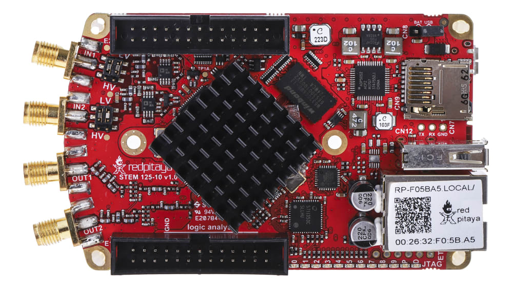

.. _top_125_10:

################################
STEMlab 125-10（已停产）
################################

|

.. warning::

    **产品已停产**

    STEMlab 125-10 已停产（不再生产）。此处文档仅供现有用户参考。
    请注意，该板卡的软件支持即将终止（具体日期待定）。我们会提前通知所有用户。

|

.. contents:: 目录
    :local:
    :depth: 1
    :backlinks: top

|

概览
========

STEMlab 125-10 是一款入门级 Red Pitaya 板卡，具有 10-bit ADC 和 DAC 分辨率、256 MB RAM，且相比 STEMlab 125-14 功耗更低。
它是一款灵活紧凑的测量与控制平台，面向电子、信号处理和嵌入式系统开发等广泛应用。
它配备双核 ARM Cortex-A9 处理器、Xilinx Zynq 7010 SoC FPGA 以及高速 ADC 和 DAC，适用于数据采集、信号生成、
以及实时处理。

该板卡已停产，不再生产。

|

特性
========

* 10-bit、125 MS/s ADC 和 DAC
* 双核 ARM Cortex-A9 处理器
* Xilinx Zynq 7010 SoC FPGA
* 256 MB RAM
* 16 路数字 I/O、4 路模拟输入、4 路模拟输出
* 多种通信接口：I2C、SPI、UART、CAN
* 用于供电和控制台连接的 Micro USB
* 紧凑的外形尺寸

|

快速参考
===============

.. list-table::
    :widths: 28 40
    :header-rows: 1

    * - **类别**
      - **关键规格**
    * - ADC
      - 2 通道、10-bit、125 MS/s、DC-50 MHz
    * - DAC
      - 2 通道、10-bit、125 MS/s、DC-50 MHz
    * - 处理器
      - 双核 ARM Cortex-A9
    * - FPGA
      - Xilinx Zynq 7010 SoC
    * - RAM
      - 256 MB
    * - 数字 I/O
      - 16 路 GPIO @ 3.3V
    * - 模拟 I/O
      - 4 路输入（12-bit）、4 路输出（8-bit）
    * - 连接方式
      - 以太网、USB、扩展连接器
    * - 状态
      - **已停产**

|

板卡布局与引脚定义
======================

.. figure:: ../125-14/img/Red_Pitaya_pinout.jpg
    :alt: Red Pitaya pinout
    :width: 700
    :align: center

.. note::

    STEMlab 125-10 与 STEMlab 125-14 使用相同的引脚定义。

|

技术规格
=========================

.. list-table::
    :widths: 36 36 11 34
    :header-rows: 1

    * - **参数**
      - **值**
      - **单位**
      - **备注**
    * - |br| **基本规格**
      -
      -
      - |
    * - 处理器
      - 双核 ARM Cortex-A9
      - \-
      -
    * - FPGA
      - AMD (Xilinx) Zynq 7010 SoC FPGA
      - \-
      -
    * - RAM
      - 256
      - MB
      - (2 Gb)
    * - 核心时钟频率
      - 125
      - MHz
      -
    * - 系统存储
      - Micro SD，最大 32 GB
      - \-
      -
    * - 串行控制台连接器
      - 3-pin 连接器（未安装）
      - \-
      - 需要 USB 转串行转换器
    * - 电源连接器
      - Micro USB
      - \-
      -
    * - 功耗
      - 5 V, 1.5 A
      - \-
      - 最大值
    * - |br| **连接方式**
      -
      -
      - |
    * - 以太网
      - 1
      - Gbit
      -
    * - USB
      - USB-A 2.0
      - \-
      -
    * - Wi-Fi
      - 需要 Wi-Fi 加密狗
      - \-
      -
    * - |br| **RF 输入**
      -
      -
      - |
    * - RF 输入通道
      - 2
      - \-
      -
    * - 采样率
      - 125
      - MS/s
      -
    * - ADC 分辨率
      - 10
      - bit
      -
    * - 输入阻抗
      - 1 MΩ / 10 pF
      - \-
      -
    * - 满量程电压范围
      - | ±1 (LV) | ±20 (HV)
      - V
      -
    * - 输入耦合
      - DC
      - \-
      -
    * - 绝对最大输入电压
      - | ±6 (LV) | ±30 (HV)
      - V
      - DC 值 [#f1]_
    * - 输入 ESD 保护
      - 1500
      - V
      - DC
    * - 过载保护
      - 保护二极管
      - \-
      -
    * - 带宽
      - DC - 50
      - MHz
      -
    * - 连接器类型
      - SMA
      - \-
      -
    * - |br| **RF 输出**
      -
      -
      - |
    * - RF 输出通道
      - 2
      - \-
      -
    * - 采样率
      - 125
      - MS/s
      -
    * - DAC 分辨率
      - 10
      - bit
      -
    * - 负载阻抗
      - 50 Ω
      - \-
      -
    * - 电压范围
      - ±1
      - V
      -
    * - 输出耦合
      - DC
      - \-
      -
    * - 短路保护
      - 是
      - \-
      -
    * - 输出压摆率
      - 2 V / 10 ns
      - \-
      -
    * - 带宽
      - DC - 50
      - MHz
      -
    * - 连接器类型
      - SMA
      - \-
      -
    * - |br| **扩展连接器**
      -
      -
      - |
    * - 数字 GPIO
      - 16
      - \-
      -
    * - 数字电平
      - 3.3
      - V
      -
    * - GPIO 时间分辨率
      - 8
      - ns
      - 核心时钟频率
    * - 模拟输入
      - 4
      - \-
      -
    * - 模拟输入电压范围
      - 0 - 7.0
      - V
      -
    * - 模拟输入分辨率
      - 12
      - bit
      -
    * - 模拟输入采样率
      - 100
      - kS/s
      -
    * - 模拟输出
      - 4
      - \-
      -
    * - 模拟输出电压范围
      - 0 - 1.8
      - V
      -
    * - 模拟输出分辨率
      - 8
      - bit
      -
    * - 模拟输出采样率
      - ≲ 3.2
      - MS/s
      -
    * - 模拟输出带宽
      - ≈ 160
      - kHz
      -
    * - 通信接口
      - I2C, SPI, UART, CAN
      - \-
      -
    * - 可用电压
      - +5, +3.3, -3.4
      - V
      -
    * - 外部 ADC 时钟
      - 不适用
      - \-
      -
    * - |br| **同步**
      -
      -
      - |
    * - 外部触发输入
      - DIO0_P
      - \-
      - E1 连接器
    * - 外部触发输入阻抗
      - Hi-Z
      - \-
      - 数字输入
    * - 触发输出
      - DIO0_N
      - \-
      - E1 连接器 [#f3]_
    * - 菊链连接器 (S1 & S2)
      - 否
      - \-
      -
    * - 菊链连接器速度
      - 不适用
      - Mb/s
      -
    * - 菊链连接器类型
      - 不适用
      - \-
      -
    * - 参考时钟输入
      - 不适用
      - \-
      -
    * - 参考时钟频率
      - 不适用
      - \-
      -
    * - 参考时钟连接器类型
      - 不适用
      - \-
      -
    * - |br| **启动选项**
      -
      -
      - |
    * - SD 卡
      - 是
      - \-
      -
    * - QSPI
      - 不适用
      - \-
      -
    * - eMMC
      - 不适用
      - \-
      -
    * - |br| **环境规格**
      -
      -
      - |
    * - 工作温度范围
      - 0 - 55
      - ℃
      - 使用默认散热器
    * - 工作湿度范围
      - < 90%
      - RH
      -
    * - 自动关机温度
      - 85
      - ℃
      -
    * - |br| **尺寸**
      -
      -
      - |
    * - 尺寸（长 x 宽 x 高）
      - 106.8 x 60.0 x 21.1
      - mm
      - 详见 `原理图`_

.. seealso::

    有关详细信息，请参阅 |Original Gen comparison table|。

|

.. warning::

    **最大输入电压**

    * **LV 模式：** ±6 V 绝对最大值
    * **HV 模式：** ±30 V 绝对最大值

    超过这些值可能会永久损坏板卡。

|

性能与测量
============================

.. note::

    我们没有 STEMlab 125-10 板卡的明确测量结果。

类似板卡的快速模拟前端测量结果见此处：

* :ref:`Original Gen - STEMlab 125-14 <measurements_orig_gen>`.

|

.. _schematics_125_10:

原理图与 3D 模型
========================

原理图
----------

* :download:`原理图_STEM_125-10_V1.0.pdf <https://downloads.redpitaya.com/doc/Schematics/Schematics_STEM_125-10_V1.0.pdf>`.

.. note::

    Red Pitaya 板卡的完整硬件原理图不公开。Red Pitaya 提供开源代码，但硬件原理图并未开源。不过，开发用原理图可供使用。该原理图包含硬件配置、FPGA 引脚连接等信息。

机械规格与 3D 模型
--------------------------------------

* STEP :download:`3D_STEM_125-10_V1.0.zip <https://downloads.redpitaya.com/doc/3D_models/3D_STEM_125-10_V1.0.zip>`.

|

硬件详情
==================

器件
----------

STEMlab 125-10 使用与 STEMlab 125-14 类似的高性能模拟器件，但分辨率为 10-bit 而非 14-bit。

**ADC：** Analog Devices `LTC2145-10 <https://www.analog.com/en/products/ltc2145-14.html>`_

    * 双通道 10-bit、125 MS/s ADC
    * 低功耗
    * 高动态范围

**DAC：** Analog Devices `AD9767 <https://www.analog.com/en/products/AD9767.html>`_

    * 双通道 14-bit、125 MS/s DAC（可配置为 10-bit 模式）
    * 高 SFDR 性能
    * 低功耗运行

**FPGA:** Xilinx `Zynq 7010 <https://docs.xilinx.com/v/u/en-US/ds190-Zynq-7000-Overview>`_

    * 双核 ARM Cortex-A9 @ 667 MHz
    * 可编程逻辑资源
    * 集成外设和内存控制器

|

扩展连接器与接口
===================================

概览
---------

STEMlab 125-10 板卡具有以下连接器和接口：

* **E1 和 E2 连接器：** 主要扩展连接器，提供数字 I/O、模拟 I/O 和通信接口。用户可通过这些连接器连接其他硬件、传感器或外设，以扩展板卡功能。

|

连接器物理规格
----------------------------------

**E1 和 E2 扩展连接器：**

* 连接器类型: `2 x 13 pins IDC 2.54 mm pitch <https://www.digikey.com/en/products/detail/adam-tech/BHR-26-VUA/9832284>`_
* 引脚数：每个 26 个引脚（2x13 配置）
* 间距： 2.54 mm (0.1")

**配套连接器：**

.. note::

    为定制 Red Pitaya 扩展板选择配套连接器时，需要使用 `双高度抬高插座 <https://www.digikey.com/en/products/detail/samtec-inc/ESW-113-33-T-D/6693225>`_，以避开板上的散热器和以太网连接器。
    *绝缘高度* 为 0.635"（16.13 mm）或更高的连接器均可使用。此间隙要求基于 Red Pitaya 板卡上最高的器件（散热器和以太网连接器）确定。

.. note::

    为防止损坏板卡或扩展板，将扩展板连接到 E1 和 E2 连接器时，请确保：

    * **连接器正确对齐** - 确保连接器正确对齐。Red Pitaya 板卡连接器的插座外壳中有额外空间，即使扩展板错开 ±1 个引脚，外观上仍可能像是已连接。这可能损坏板卡和/或扩展板，因此通电前请仔细复核对齐情况。
    * **配套连接器紧密贴合** - 使用牢固配合的连接器，防止意外断开或损坏。

|

E1 连接器——数字 I/O 与 CAN
----------------------------------

.. include:: ../_specs_common/E1_connector_7010.inc

|

E2 连接器——模拟与通信
--------------------------------------

E2 扩展连接器提供模拟 I/O 和通信接口，用于传感器集成和数据采集。

**特性:**

* +5 V 电源（最大值 0.5 A，与 USB 设备共享）
* -3.4 V 电源（最大值 0.1 A）
* SPI、UART、I2C 通信接口
* 4 路慢速 ADC（12-bit、100 kS/s）
* 4 路慢速 DAC（8-bit PWM、≲ 3.2 MS/s）

**E2 引脚定义：**

.. list-table::
    :widths: 8 22 16 38 16
    :header-rows: 1

    * - 引脚
      - 说明
      - FPGA 引脚编号
      - FPGA 引脚说明
      - 电压电平
    * - 1
      - +5V
      -
      -
      -
    * - 2
      - -3.4V
      -
      -
      -
    * - 3
      - SPI (MOSI)
      - E9
      - PS_MIO10_500
      - 3V3
    * - 4
      - SPI (MISO)
      - C6
      - PS_MIO11_500
      - 3V3
    * - 5
      - SPI (SCK)
      - D9
      - PS_MIO12_500
      - 3V3
    * - 6
      - SPI (CS)
      - E8
      - PS_MIO13_500
      - 3V3
    * - 7
      - UART (TX)
      - D5
      - PS_MIO8_500
      - 3V3
    * - 8
      - UART (RX)
      - B5
      - PS_MIO9_500
      - 3V3
    * - 9
      - I2C (SCL)
      - B13
      - PS_MIO50_501
      - 3V3
    * - 10
      - I2C (SDA)
      - B9
      - PS_MIO51_501
      - 3V3
    * - 11
      - 扩展通信模式 (AIN)
      -
      -
      - GND（默认）
    * - 12
      - GND
      -
      -
      -
    * - 13
      - 模拟输入 0
      - B19, A20
      - IO_L2P_T0_AD8P_35, IO_L2N_T0_AD8N_35
      - 0-7.0 V
    * - 14
      - 模拟输入 1
      - C20, B20
      - IO_L1P_T0_AD0P_35, IO_L1N_T0_AD0N_35
      - 0-7.0 V
    * - 15
      - 模拟输入 2
      - E17, D18
      - IO_L3P_T0_DQS_AD1P_35, IO_L3N_T0_DQS_AD1N_35
      - 0-7.0 V
    * - 16
      - 模拟输入 3
      - E18, E19
      - IO_L5P_T0_AD9P_35, IO_L5N_T0_AD9N_35
      - 0-7.0 V
    * - 17
      - 模拟输出 0
      - T10
      - IO_L1N_T0_34
      - 0-1.8 V
    * - 18
      - 模拟输出 1
      - T11
      - IO_L1P_T0_34
      - 0-1.8 V
    * - 19
      - 模拟输出 2
      - P15
      - IO_L24P_T3_34
      - 0-1.8 V
    * - 20
      - 模拟输出 3
      - U13
      - IO_L3P_T0_DQS_PUDC_B_34
      - 0-1.8 V
    * - 21
      - GND
      -
      -
      -
    * - 22
      - GND
      -
      -
      -
    * - 23
      - NC
      -
      -
      -
    * - 24
      - NC
      -
      -
      -
    * - 25
      - GND
      -
      -
      -
    * - 26
      - GND
      -
      -
      -

.. note::

    **UART TX (PS_MIO08)** 仅为输出端。上电时必须连接到 GND 或保持悬空（不得使用外部上拉）！

|

辅助模拟输入与输出
------------------------------------

.. include:: ../_specs_common/slow_analog_io.inc

|

通用数字 I/O 通道
--------------------------------------

.. list-table::
    :widths: 36 36 11 24
    :header-rows: 1

    * - **参数**
      - **值**
      - **单位**
      - **备注**
    * - GPIO 数量
      - 16
      - \-
      -
    * - 数字电平
      - 3.3
      - V
      -
    * - 绝对最小电压
      - -0.40
      - V
      -
    * - 绝对最大电压
      - 3.3 + 0.55
      - V
      -
    * - 电流限制
      - < 8
      - mA
      - 驱动强度
    * - 方向
      - 可配置
      - \-
      -
    * - 时间分辨率
      - 8
      - ns
      - (1/125 MHz)
    * - 连接器位置
      - 扩展连接器 |E1|
      - \-
      -

|

高级特性
==================

电源
-------------

.. include:: ../_specs_common/power_supply.inc

|

校准
------------

.. include:: ../_specs_common/calibration.inc

|

其他资源
====================

更多规格和测量结果请参见：

* |Original Gen hardware specs| - Original Gen 通用规格
* |Original Gen comparison table| - 所有 Red Pitaya Original Gen 型号对比

|

法律与免责声明
===================

.. include:: ../_specs_common/disclaimer.inc

|

.. rubric:: 脚注

.. [#f1] 绝对最大输入电压值适用于低于 1 kHz 的频率。对于更高频率，请将输入电压范围规格作为**绝对最大值**使用。
.. [#f3] 有关触发输出配置，请参阅 :ref:`X-channel 2.0 (Click Shield) synchronisation <click_shield_sync>` 和 :ref:`X-channel 2.0 (Click Shield) synchronisation examples <examples_multiboard_sync>`。
.. [#f8] 默认软件以依赖 CPU 的速度启用采样。要以 100 kS/s 的速率采集数据，必须额外实现 FPGA 处理。
.. [#f9] 输出信号经过一阶低通滤波器。如果需要额外滤波，可根据应用的具体要求在外部实现。
.. [#f10] 取决于具体应用。输出电流由扩展连接器和已连接的 USB 设备共享；如果未使用其他外设，输出电流可以更高。

.. substitutions

.. |E1| replace:: :ref:`E1 连接器 <E1_orig_gen>`
.. |E2| replace:: :ref:`E2 connector <E2_orig_gen>`
.. |Original Gen hardware specs| replace:: :ref:`Original Gen hardware specifications <hw_specs_orig_gen>`
.. |Original Gen comparison table| replace:: :ref:`Original Gen board comparison table <rp-board-comp-orig_gen>`
