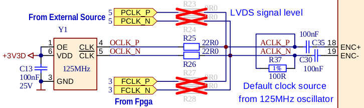

.. _top_125_14:

################
STEMlab 125-14
################

.. figure:: img/STEMlab-125-14.jpg
    :width: 500
    :align: center

|

.. contents:: 目录
    :local:
    :depth: 1
    :backlinks: top

|

概述
========

STEMlab 125-14 是 Red Pitaya 的初代板卡，是一款多功能紧凑型测量与控制平台，适用于电子、信号处理和嵌入式系统开发等广泛应用。
它配备双核 ARM Cortex-A9 处理器、FPGA Xilinx Zynq 7010 SoC 以及高速 ADC 和 DAC，适合数据采集、信号生成和实时处理等任务。

|

功能特性
========

* 14-bit、125 MS/s ADC 和 DAC
* 双核 ARM Cortex-A9 处理器
* FPGA Xilinx Zynq 7010 SoC
* 512 MB RAM
* 16 个数字 I/O、4 个模拟输入、4 个模拟输出
* 多种通信接口：I2C、SPI、UART、CAN
* Micro USB 连接，用于供电和控制台
* 用于多板同步的 SATA 菊花链连接器

|

快速参考
===============

.. table::
    :widths: 40 60

    +----------------------------+--------------------------------------------------+
    | **类别**                   | **关键规格**                                     |
    +============================+==================================================+
    | ADC                        | 2 通道，14-bit，125 MS/s，DC-60 MHz              |
    +----------------------------+--------------------------------------------------+
    | DAC                        | 2 通道，14-bit，125 MS/s，DC-60 MHz              |
    +----------------------------+--------------------------------------------------+
    | 处理器                     | 双核 ARM Cortex-A9                               |
    +----------------------------+--------------------------------------------------+
    | FPGA                       | Xilinx Zynq 7010 SoC                             |
    +----------------------------+--------------------------------------------------+
    | RAM                        | 512 MB                                           |
    +----------------------------+--------------------------------------------------+
    | 数字 I/O                   | 16 个 GPIO @ 3.3V                                |
    +----------------------------+--------------------------------------------------+
    | 模拟 I/O                   | 4 路输入（12-bit），4 路输出（8-bit）            |
    +----------------------------+--------------------------------------------------+
    | 连接能力                   | 以太网、USB、扩展连接器                          |
    +----------------------------+--------------------------------------------------+

|

板卡布局与引脚定义
======================

.. figure:: img/Red_Pitaya_pinout.jpg
    :alt: Red Pitaya 引脚定义
    :width: 700
    :align: center

引脚图展示了所有外部连接器，包括 RF 输入／输出（IN1、IN2、OUT1、OUT2）和扩展连接器（E1、E2）。

|

技术规格
=========================

.. table::
    :widths: 30 30 15 15

    +------------------------------------+------------------------------------+-----------+----------------------------------+
    | **参数**                           | **值**                             | **单位**  | **备注**                         |
    +====================================+====================================+===========+==================================+
    | |br|                                                                                                                   |
    | **基本规格**                                                                                                           |
    +------------------------------------+------------------------------------+-----------+----------------------------------+
    | 处理器                             | 双核 ARM Cortex-A9                 | \-        |                                  |
    +------------------------------------+------------------------------------+-----------+----------------------------------+
    | FPGA                               | FPGA AMD (Xilinx) Zynq 7010 SoC    | \-        |                                  |
    +------------------------------------+------------------------------------+-----------+----------------------------------+
    | RAM                                | 512                                | MB        | (4 Gb)                           |
    +------------------------------------+------------------------------------+-----------+----------------------------------+
    | 核心时钟频率                       | 125                                | MHz       |                                  |
    +------------------------------------+------------------------------------+-----------+----------------------------------+
    | 系统存储                           | 最高 32 GB 的 Micro SD             | \-        |                                  |
    +------------------------------------+------------------------------------+-----------+----------------------------------+
    | 串行控制台连接器                   | Micro USB                          | \-        |                                  |
    +------------------------------------+------------------------------------+-----------+----------------------------------+
    | 电源连接器                         | Micro USB                          | \-        |                                  |
    +------------------------------------+------------------------------------+-----------+----------------------------------+
    | 功耗                               | 5 V, 2 A                           | \-        | 最大值                           |
    +------------------------------------+------------------------------------+-----------+----------------------------------+
    | |br|                                                                                                                   |
    | **连接能力**                                                                                                           |
    +------------------------------------+------------------------------------+-----------+----------------------------------+
    | Ethernet                           | 1                                  | Gbit      |                                  |
    +------------------------------------+------------------------------------+-----------+----------------------------------+
    | USB                                | USB-A 2.0                          | \-        |                                  |
    +------------------------------------+------------------------------------+-----------+----------------------------------+
    | Wi-Fi                              | 需要 Wi-Fi 适配器                  | \-        |                                  |
    +------------------------------------+------------------------------------+-----------+----------------------------------+
    | |br|                                                                                                                   |
    | **RF 输入**                                                                                                            |
    +------------------------------------+------------------------------------+-----------+----------------------------------+
    | RF 输入通道                        | 2                                  | \-        |                                  |
    +------------------------------------+------------------------------------+-----------+----------------------------------+
    | 采样率                             | 125                                | MS/s      |                                  |
    +------------------------------------+------------------------------------+-----------+----------------------------------+
    | ADC 分辨率                         | 14                                 | bit       |                                  |
    +------------------------------------+------------------------------------+-----------+----------------------------------+
    | 输入阻抗                           | 1 MΩ / 10 pF                       | \-        |                                  |
    +------------------------------------+------------------------------------+-----------+----------------------------------+
    | 满量程电压范围                     | | ±1 (LV)                          | V         |                                  |
    |                                    | | ±20 (HV)                         |           |                                  |
    +------------------------------------+------------------------------------+-----------+----------------------------------+
    | 输入耦合                           | DC                                 | \-        |                                  |
    +------------------------------------+------------------------------------+-----------+----------------------------------+
    | 绝对最大输入电压                   | | ±6 (LV)                          | V         | 直流值 [#f1]_                    |
    |                                    | | ±30 (HV)                         |           |                                  |
    +------------------------------------+------------------------------------+-----------+----------------------------------+
    | 输入 ESD 保护                      | 1500                               | V         | DC                               |
    +------------------------------------+------------------------------------+-----------+----------------------------------+
    | 过载保护                           | 保护二极管                         | \-        |                                  |
    +------------------------------------+------------------------------------+-----------+----------------------------------+
    | 带宽                               | DC - 60                            | MHz       |                                  |
    +------------------------------------+------------------------------------+-----------+----------------------------------+
    | 连接器类型                         | SMA                                | \-        |                                  |
    +------------------------------------+------------------------------------+-----------+----------------------------------+
    | |br|                                                                                                                   |
    | **RF 输出**                                                                                                            |
    +------------------------------------+------------------------------------+-----------+----------------------------------+
    | RF 输出通道                        | 2                                  | \-        |                                  |
    +------------------------------------+------------------------------------+-----------+----------------------------------+
    | 采样率                             | 125                                | MS/s      |                                  |
    +------------------------------------+------------------------------------+-----------+----------------------------------+
    | DAC 分辨率                         | 14                                 | bit       |                                  |
    +------------------------------------+------------------------------------+-----------+----------------------------------+
    | 负载阻抗                           | 50 Ω                               | \-        |                                  |
    +------------------------------------+------------------------------------+-----------+----------------------------------+
    | 电压范围                           | ±1                                 | V         |                                  |
    +------------------------------------+------------------------------------+-----------+----------------------------------+
    | 输出耦合                           | DC                                 | \-        |                                  |
    +------------------------------------+------------------------------------+-----------+----------------------------------+
    | 短路保护                           | 是                                 | \-        |                                  |
    +------------------------------------+------------------------------------+-----------+----------------------------------+
    | 输出压摆率                         | 2 V / 10 ns                        | \-        |                                  |
    +------------------------------------+------------------------------------+-----------+----------------------------------+
    | 带宽                               | DC - 60                            | MHz       |                                  |
    +------------------------------------+------------------------------------+-----------+----------------------------------+
    | 连接器类型                         | SMA                                | \-        |                                  |
    +------------------------------------+------------------------------------+-----------+----------------------------------+
    | |br|                                                                                                                   |
    | **扩展连接器**                                                                                                         |
    +------------------------------------+------------------------------------+-----------+----------------------------------+
    | 数字 GPIO                          | 16                                 | \-        |                                  |
    +------------------------------------+------------------------------------+-----------+----------------------------------+
    | 数字电平                           | 3.3                                | V         |                                  |
    +------------------------------------+------------------------------------+-----------+----------------------------------+
    | GPIO 时间分辨率                    | 8                                  | ns        | 核心时钟频率                     |
    +------------------------------------+------------------------------------+-----------+----------------------------------+
    | 模拟输入                           | 4                                  | \-        |                                  |
    +------------------------------------+------------------------------------+-----------+----------------------------------+
    | 模拟输入电压范围                   | 0 - 7.0                            | V         |                                  |
    +------------------------------------+------------------------------------+-----------+----------------------------------+
    | 模拟输入分辨率                     | 12                                 | bit       |                                  |
    +------------------------------------+------------------------------------+-----------+----------------------------------+
    | 模拟输入采样率                     | 100                                | kS/s      |                                  |
    +------------------------------------+------------------------------------+-----------+----------------------------------+
    | 模拟输出                           | 4                                  | \-        |                                  |
    +------------------------------------+------------------------------------+-----------+----------------------------------+
    | 模拟输出电压范围                   | 0 - 1.8                            | V         |                                  |
    +------------------------------------+------------------------------------+-----------+----------------------------------+
    | 模拟输出分辨率                     | 8                                  | bit       |                                  |
    +------------------------------------+------------------------------------+-----------+----------------------------------+
    | 模拟输出采样率                     | ≲ 3.2                              | MS/s      |                                  |
    +------------------------------------+------------------------------------+-----------+----------------------------------+
    | 模拟输出带宽                       | ≈ 160                              | kHz       |                                  |
    +------------------------------------+------------------------------------+-----------+----------------------------------+
    | 通信接口                           | I2C, SPI, UART, CAN                | \-        |                                  |
    +------------------------------------+------------------------------------+-----------+----------------------------------+
    | 可用电压                           | +5, +3.3, -3.4                     | V         |                                  |
    +------------------------------------+------------------------------------+-----------+----------------------------------+
    | 外部 ADC 时钟                      | 否                                 | \-        | 参见 [#f2]_                      |
    +------------------------------------+------------------------------------+-----------+----------------------------------+
    | |br|                                                                                                                   |
    | **同步**                                                                                                               |
    +------------------------------------+------------------------------------+-----------+----------------------------------+
    | 外部触发输入                       | DIO0_P                             | \-        | E1 连接器                        |
    +------------------------------------+------------------------------------+-----------+----------------------------------+
    | 外部触发输入 impedance             | Hi-Z                               | \-        | 数字输入                         |
    +------------------------------------+------------------------------------+-----------+----------------------------------+
    | 触发输出                           | DIO0_N                             | \-        | E1 连接器 [#f3]_                 |
    +------------------------------------+------------------------------------+-----------+----------------------------------+
    | 菊花链连接器（S1 和 S2）           | 是                                 | \-        |                                  |
    +------------------------------------+------------------------------------+-----------+----------------------------------+
    | 菊花链连接器速率                   | 最高 500                           | Mb/s      |                                  |
    +------------------------------------+------------------------------------+-----------+----------------------------------+
    | 菊花链连接器类型                   | SATA                               | \-        |                                  |
    +------------------------------------+------------------------------------+-----------+----------------------------------+
    | 参考时钟输入                       | N/A                                | \-        |                                  |
    +------------------------------------+------------------------------------+-----------+----------------------------------+
    | 参考时钟频率                       | N/A                                | \-        |                                  |
    +------------------------------------+------------------------------------+-----------+----------------------------------+
    | 参考时钟连接器类型                 | N/A                                | \-        |                                  |
    +------------------------------------+------------------------------------+-----------+----------------------------------+
    | |br|                                                                                                                   |
    | **启动选项**                                                                                                           |
    +------------------------------------+------------------------------------+-----------+----------------------------------+
    | SD 卡                              | 是                                 | \-        |                                  |
    +------------------------------------+------------------------------------+-----------+----------------------------------+
    | QSPI                               | 未装配                             | \-        |                                  |
    +------------------------------------+------------------------------------+-----------+----------------------------------+
    | eMMC                               | N/A                                | \-        |                                  |
    +------------------------------------+------------------------------------+-----------+----------------------------------+
    | |br|                                                                                                                   |
    | **环境规格**                                                                                                           |
    +------------------------------------+------------------------------------+-----------+----------------------------------+
    | 工作温度范围                       | 0 至 55                            | ℃         | 使用默认散热器                   |
    +------------------------------------+------------------------------------+-----------+----------------------------------+
    | 工作湿度范围                       | < 90%                              | RH        |                                  |
    +------------------------------------+------------------------------------+-----------+----------------------------------+
    | 自动关机温度                       | 85                                 | ℃         |                                  |
    +------------------------------------+------------------------------------+-----------+----------------------------------+
    | |br|                                                                                                                   |
    | **尺寸**                                                                                                               |
    +------------------------------------+------------------------------------+-----------+----------------------------------+
    | 尺寸（长 × 宽 × 高）               | 106.8 x 60.0 x 21.1                | mm        | 详见 `原理图`_                   |
    +------------------------------------+------------------------------------+-----------+----------------------------------+

.. warning::

    **最大输入电压**

    * **LV 模式：** 绝对最大值 ±6 V
    * **HV 模式：** 绝对最大值 ±30 V

    超过这些值可能会永久损坏板卡。

.. seealso::

    更详细的信息请参阅 |Original Gen comparison table|。

|

性能与测量
============================

快速模拟前端的测量结果见此：

* :ref:`Original Gen - STEMlab 125-14 <measurements_orig_gen>`.

|

.. _schematics_125_14:

原理图与 3D 模型
========================

原理图
----------

* :download:`Schematics_STEM_125-14_v1.1.pdf <https://downloads.redpitaya.com/doc/Schematics/Schematics_STEM_125-14_v1.1.pdf>`.

.. note::

    Red Pitaya 板卡不提供完整硬件原理图。Red Pitaya 的代码开源，但硬件原理图并不开源。
    不过，可提供开发原理图，其中包含硬件配置、FPGA 引脚连接等信息。

机械规格与 3D 模型
--------------------------------------

* STEP :download:`3D_STEM_125-14_v1.0.zip <https://downloads.redpitaya.com/doc/3D_models/3D_STEM_125-14_v1.0.zip>`.

|

硬件详情
==================

器件
----------

STEMlab 125-14 的信号链使用 Linear Technology（现为 Analog Devices）的高性能模拟器件。

**ADC:** Analog Devices `LTC2145-14 <https://www.analog.com/en/products/ltc2145-14.html>`_

    * 双通道 14-bit、125 MS/s ADC
    * 低功耗
    * 高动态范围

**DAC:** Analog Devices `AD9767 <https://www.analog.com/en/products/AD9767.html>`_

    * 双通道 14-bit、125 MS/s DAC
    * 高 SFDR 性能
    * 低功耗运行

**FPGA:** Xilinx `Zynq 7010 <https://docs.xilinx.com/v/u/en-US/ds190-Zynq-7000-Overview>`_

    * 双核 ARM Cortex-A9 @ 667 MHz
    * 可编程逻辑架构
    * 集成外设和存储器控制器

**振荡器：** `125 MHz 振荡器 <https://eu.mouser.com/datasheet/2/417/bf-8746.pdf>`_

    * 高精度 125 MHz 参考振荡器

**DC-DC 转换器：** `LTC3615 <https://www.analog.com/en/products/LTC3615.html>`_

    * 高效降压稳压器

**DDR3 SRAM:** `MT41J256M16HA-125 <https://www.digikey.com/en/products/detail/micron-technology-inc/MT41J256M16HA-125-E/4315785>`_

    * 512 MB DDR3 RAM

**QSPI Flash:** `S25FL128SAGNFI001 <https://www.infineon.com/cms/en/product/memories/nor-flash/standard-spi-nor-flash/quad-spi-flash/s25fl128sagnfi001/>`_

    * 标准板卡上未装配

|

扩展连接器与接口
===================================

概述
---------

STEMlab 125-14 板卡配备以下连接器和接口：

* **E1 和 E2 连接器：** 提供数字 I/O、模拟 I/O 和通信接口的主要扩展连接器；用户可借此连接其他硬件、传感器或外设，扩展板卡功能。
* **S1 和 S2 连接器：** 用于同步多块 Red Pitaya 板卡的菊花链连接器，可实现板卡之间的时钟和触发同步。

|

连接器物理规格
----------------------------------

**E1 和 E2 扩展连接器：**

* 连接器类型：`2 x 13 引脚 IDC，2.54 mm 间距 <https://www.digikey.com/en/products/detail/adam-tech/BHR-26-VUA/9832284>`_
* 引脚数：每个 26 引脚（2x13 配置）
* 间距：2.54 mm（0.1"）

**配对连接器：**

.. note::

    为自定义 Red Pitaya 扩展板选择配对连接器时，需要使用 `双层高架插座 <https://www.digikey.com/en/products/detail/samtec-inc/ESW-113-33-T-D/6693225>`_，以避开板卡上的散热器和以太网连接器。
    任何*绝缘高度*达到或超过 0.635"（16.13 mm）的连接器均可使用。此间隙要求基于 Red Pitaya 板卡上最高的器件（散热器和以太网连接器）。

.. note::

    为防止损坏板卡或扩展板，将扩展板连接到 E1 和 E2 连接器时，请确保：

    * **正确对齐连接器**——确保连接器正确对齐。Red Pitaya 板卡连接器的插座外壳中留有额外空间，因此扩展板即使错位 ±1 个引脚，外观上仍可能像是已连接。
      这可能损坏板卡和／或扩展板，因此请在板卡上电前再次检查对齐情况。
    * **配合紧密的连接器**——使用牢固配合的连接器，以防意外断开或损坏。

|

E1 连接器——数字 I/O 与 CAN
----------------------------------

.. include:: ../_specs_common/E1_connector_7010.inc

|

E2 连接器——模拟与通信
--------------------------------------

.. include:: ../_specs_common/E2_connector_125-14.inc

|

辅助模拟输入与输出
------------------------------------

.. include:: ../_specs_common/slow_analog_io.inc

|

通用数字 I/O 通道
--------------------------------------

.. table::
    :widths: 30 30 15 15

    +------------------------------------+------------------------------------+-----------+------------------------+
    | **参数**                           | **值**                             | **单位**  | **备注**               |
    +====================================+====================================+===========+========================+
    | GPIO 数量                          | 16                                 | \-        |                        |
    +------------------------------------+------------------------------------+-----------+------------------------+
    | 数字电平                           | 3.3                                | V         |                        |
    +------------------------------------+------------------------------------+-----------+------------------------+
    | 绝对最小电压                       | -0.40                              | V         |                        |
    +------------------------------------+------------------------------------+-----------+------------------------+
    | 绝对最大电压                       | 3.3 + 0.55                         | V         |                        |
    +------------------------------------+------------------------------------+-----------+------------------------+
    | 电流限制                           | < 8                                | mA        | 驱动能力               |
    +------------------------------------+------------------------------------+-----------+------------------------+
    | 方向                               | 可配置                             | \-        |                        |
    +------------------------------------+------------------------------------+-----------+------------------------+
    | 时间分辨率                         | 8                                  | ns        | (1/125 MHz)            |
    +------------------------------------+------------------------------------+-----------+------------------------+
    | 连接器位置                         | 扩展连接器 |E1|                    | \-        |                        |
    +------------------------------------+------------------------------------+-----------+------------------------+

|

同步连接器（S1 与 S2）
--------------------------------------

.. include:: ../_specs_common/Sync_connectors_SATA.inc

|

高级功能
==================

电源
-------------

.. include:: ../_specs_common/power_supply.inc

|

外部 ADC 时钟
-------------------

.. note::

    标准 STEMlab 125-14 必须经过硬件修改才能支持外部 ADC 时钟。如需无需自行修改即可支持外部时钟，可考虑以下预修改板卡：

    * :ref:`STEMlab 125-14 External Clock <top_125_14_EXT>` - 具备外部时钟功能的板卡
    * :ref:`STEMlab 125-14 4-Input <top_125_14_4-IN>` - 具备 4 个输入通道和外部时钟功能的板卡
    * :ref:`STEMlab 125-14 PRO Gen 2 <top_125_14_pro_gen2>` - 具备外部时钟功能的第二代 STEMlab 125-14 板卡

.. _external_125_14:

**时钟源**

ADC 时钟可由以下三个来源提供：

* **板载 125 MHz 振荡器（默认）：** 内部时钟源
* **通过 E2 连接器接入的外部源：** 通过 Ext. ADC Clk± 引脚输入外部时钟（需要硬件修改：R25、R26 → R23、R24）
* **SATA 连接器（来自 FPGA）：** 用于 X-channel 次级／从机配置（需要硬件修改：R25、R26 → R27、R28）

    ADC 时钟源选项

|

**外部时钟规格**

外部 ADC 时钟应为差分 LVDS 信号：

.. list-table::
    :widths: 55 46 9 9 9 9
    :header-rows: 1

    * - 参数
      - 说明
      - 最小值
      - 典型值
      - 最大值
      - 单位
    * - 时钟输入引脚
      - |E2| 上的 23 (Clk+) 和 24 (Clk-)
      -
      -
      -
      -
    * - 输入标准
      - LVDS
      -
      -
      -
      -
    * - 输入时钟耦合
      - AC（板载电容）
      -
      -
      -
      -
    * - :math:`f_{CLK}`             | 输入频率范围
      -
      - 1
      - 125
      - 125
      - MHz
    * - :math:`V_{ID,DIFF,PP}`      | 输入电压摆幅
      - 差分峰峰值
      -
      - 0.35
      - 0.8
      - V
    * - IDC                         | 输入时钟占空比
      -
      - 45%
      -
      - 55%
      -

|

**硬件修改说明**

要启用外部时钟输入，必须在 PCB 上移装 SMD 电阻：

1.  从板卡顶面拆下 R25 和 R26

    .. figure:: img/schematics/External_clock_top.png
        :alt: 顶面原理图
        :align: center
        :width: 400

        顶面原理图

2.  将从 R25 和 R26 拆下的电阻移装到：

    * **R23 和 R24**：用于外部时钟（E2 连接器上的 Ext. ADC CLK± 引脚）
    * **R27 和 R28**：用于 X-channel 次级端（SATA 连接器）

    .. figure:: img/schematics/External_clock_bottom_photo.png
        :alt: 底面照片
        :align: center
        :width: 400

        显示电阻位置的底面照片

    .. figure:: img/schematics/External_clock_resistors.jpeg
        :alt: 标出电阻位置的完整原理图
        :align: center
        :width: 400

        标出电阻位置的完整原理图

.. warning::

    **不支持在运行期间更改外部时钟频率**

    Red Pitaya FPGA 按 125 MHz 设计和测试，并保证在该频率下正确工作。

    虽然板卡可以在不同的时钟频率下运行，但请注意：

    * FPGA 在非标准频率下可能无法按预期工作，需要进行充分测试
    * ADC 和 DAC 采样率会随时钟频率成比例变化
    * 较低的时钟频率会降低板卡的模拟带宽
    * Red Pitaya 不保证板卡在 125 MHz 以外的频率下正常工作

    板卡可使用任何有效的外部时钟信号启动。OS 2.07-48 及更高版本在缺少外部时钟时不会阻止启动。

.. warning::

    任何非 Red Pitaya 官方硬件修改都会导致保修失效，我们无法保证为修改后的板卡提供支持。

|

QSPI 闪存
-----------

Red Pitaya 板卡默认未装配 QSPI Flash 芯片。有关板卡修改的更多信息，请联系 support@redpitaya.com 或 info@redpitaya.com。

.. warning::

    任何非 Red Pitaya 官方硬件修改都会导致保修失效，我们无法保证为修改后的板卡提供支持。

|

校准
------------

.. include:: ../_specs_common/calibration.inc

|

其他资源
====================

有关其他规格和测量，请参阅：

* |Original Gen hardware specs| - Original Gen 通用规格
* |Original Gen comparison table| - 所有 Red Pitaya Original Gen 型号的对比

|

法律信息与免责声明
===================

.. include:: ../_specs_common/disclaimer.inc

|

.. rubric:: 脚注

.. [#f1] 绝对最大输入电压值适用于 1 kHz 以下的频率。对于更高频率，请将输入电压范围规格视为 **绝对最大值**。
.. [#f2] 更多信息请参阅 :ref:`STEMlab 125-14 外部时钟 <top_125_14_EXT>` 板卡，硬件修改说明请参阅 :ref:`外部 ADC 时钟章节 <external_125_14>`。
.. [#f3] 触发输出配置请参阅 :ref:`X-channel 2.0（Click Shield）同步 <click_shield_sync>` 和 :ref:`X-channel 2.0（Click Shield）同步示例 <examples_multiboard_sync>`。
.. [#f7] Red Pitaya Version 1.0 的引脚 2 为 -3.3 V，Red Pitaya Version 1.1 的引脚 2 为 -3.4 V。
.. [#f8] 默认软件以取决于 CPU 的速度进行采样。如需以 100 kS/s 采集数据，必须实现额外的 FPGA 处理。
.. [#f9] 输出会经过一阶低通滤波器。如需额外滤波，可按应用的具体要求在外部实现。
.. [#f10] 取决于具体应用。输出电流由扩展连接器和已连接的 USB 设备共享；如未使用其他外设，可用电流可能更高。

.. substitutions

.. |E1| replace:: :ref:`E1 连接器 <E1_orig_gen>`
.. |E2| replace:: :ref:`E2 连接器 <E2_orig_gen>`
.. |Original Gen hardware specs| replace:: :ref:`Original Gen 硬件规格 <hw_specs_orig_gen>`
.. |Original Gen comparison table| replace:: :ref:`Original Gen 板卡对比表 <rp-board-comp-orig_gen>`
