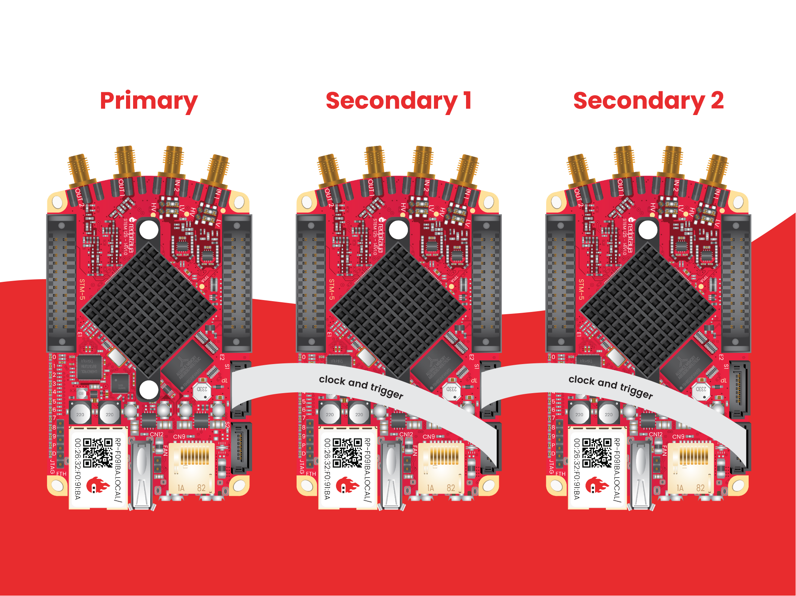

.. _top_125_14_MULTI:

###############################################
STEMlab 125-14 X-Channel 系统（已停产）
###############################################

|

.. note::

    STEMlab 125-14 X-Channel 系统已停产（不再生产）。此处文档供现有用户参考。
    X-Channel System 2.0 (Click Shields) 是当前的多板解决方案；最新信息请参阅 :ref:`X-Channel 2.0 文档 <click_shield_sync>`。

.. contents:: 目录
    :local:
    :depth: 1
    :backlinks: top

|

概述
========

Red Pitaya X-Channel 系统是一种多板配置，由通过 SATA 电缆以菊花链方式连接的 :ref:`STEMlab 125-14 LN <top_125_14_LN>` 设备组成。
其中一块开发板作为 **Primary**（未经修改），提供主时钟和触发信号。其余开发板为经过硬件修改的 **Secondary** 板，
其 ADC 时钟由 SATA 连接器而非板载振荡器驱动，从而实现所有通道的相干相位运行。

.. note::

    这是最初的 X-Channel 系统配置。有关 X-Channel System 2.0 (Click Shields)，请参阅 :ref:`X-Channel 2.0 文档 <click_shield_sync>`。

|

系统组件
=================

X-Channel 系统包括：

* **一块 Primary Low-Noise STEMlab 125-14** —— 标准 Low-Noise STEMlab 125-14 设备，为 Secondary 设备提供时钟和触发信号
* **一块或多块 Secondary Low-Noise STEMlab 125-14 设备** —— 经过修改的设备，从 Primary 设备接收时钟和触发信号，并可将其分配至下一块 Secondary 设备（贴有“S”标贴）
* **SATA 同步电缆** —— 用于以菊花链配置连接开发板
* **软件** —— 支持多通道 RF 信号采集和生成

|

特性
========

* **可扩展的多通道采集：** 每块开发板 2 路输入（可实现 4、6、8 路以上通道）
* **相干相位运行：** 所有开发板共享同一时钟和触发
* **线性电源：** 降低噪声，实现高质量测量
* **菊花链拓扑：** 通过 SATA 电缆轻松连接
* **软件支持：** 多通道采集和生成应用程序
* 每块开发板均采用标准 STEMlab 125-14 LN 规格

|

快速参考
===============

.. table::
    :widths: 40 60

    +----------------------------+--------------------------------------------------+
    | **类别**                   | **主要规格**                                     |
    +============================+==================================================+
    | 每板通道数                 | 2 路输入 + 2 路输出                              |
    +----------------------------+--------------------------------------------------+
    | ADC                        | 2 通道、14-bit、125 MS/s（每块开发板）           |
    +----------------------------+--------------------------------------------------+
    | DAC                        | 2 通道、14-bit、125 MS/s（每块开发板）           |
    +----------------------------+--------------------------------------------------+
    | 同步                       | SATA 菊花链、共享时钟和触发                      |
    +----------------------------+--------------------------------------------------+
    | 系统可扩展性               | 多块开发板（4、6、8 路以上通道）                 |
    +----------------------------+--------------------------------------------------+
    | 特殊功能                   | 相位相干、低噪声、多通道                         |
    +----------------------------+--------------------------------------------------+

|

硬件配置与差异
======================================

Primary 开发板
--------------------

Primary 开发板是 **未经任何硬件修改** 的标准 :ref:`STEMlab 125-14 LN <top_125_14_LN>`。它：

* 通过板载振荡器提供主时钟信号
* 通过 SATA 连接器将时钟和触发分配给 Secondary 开发板

Secondary 开发板
----------------

Secondary 开发板是只经过一项硬件修改的 :ref:`STEMlab 125-14 LN <top_125_14_LN>` 开发板（通过“S”标贴识别）：

+--------------------------------------+---------------------------------------------+---------------------------------------------+
| **参数**                             | **STEMlab 125-14 LN (Primary)**             | **STEMlab 125-14 LN Secondary**             |
+======================================+=============================================+=============================================+
| ADC 时钟源                           | 板载振荡器（默认）                          | SATA 连接器（来自 Primary/前一块开发板）    |
+--------------------------------------+---------------------------------------------+---------------------------------------------+
| 电阻 R25、R26                        | 位于默认位置                                | 移至 R27、R28                               |
+--------------------------------------+---------------------------------------------+---------------------------------------------+
| 外部 ADC 时钟                        | 否                                          | 是（来自 SATA 菊花链）                      |
+--------------------------------------+---------------------------------------------+---------------------------------------------+
| 无 SATA 时钟输入时的运行状态         | 正常（使用板载振荡器）                      | FPGA 无法工作；PS 从 33 MHz 启动            |
+--------------------------------------+---------------------------------------------+---------------------------------------------+
| 标识                                 | 无标记                                      | 开发板上贴有“S”标贴                         |
+--------------------------------------+---------------------------------------------+---------------------------------------------+

.. note::

    如果没有外部时钟源，或者未将电阻移回原始位置，Secondary 开发板 **不能作为独立开发板使用**。

|

同步
===============

X-Channel 系统使用：

* **共享时钟：** 从 Primary 通过 SATA 菊花链分配
* **共享触发：** 通过 SATA 连接器传输同步触发信号
* **SATA 电缆：** 用于时钟/触发分配，数据速率最高 500 Mb/s

有关同步的详细信息，请参阅：

* :ref:`X-Channel 同步 <x-ch_streaming>`
* :ref:`多板同步示例 <examples_multiboard_sync>`

|

技术规格
=========================

X-Channel 系统中的每块开发板均与 :ref:`STEMlab 125-14 Low Noise <top_125_14_LN>` 开发板具有相同规格。

完整技术规格请参阅 :ref:`STEMlab 125-14 LN 规格 <top_125_14_LN>`。

.. seealso::

    更多详细信息请参阅 |Original Gen comparison table|。

|

性能与测量
============================

.. note::

    虽然我们没有 X-Channel 配置下 STEMlab 125-14 LN 开发板的专门测量结果，
    但其快速模拟输入性能与 STEMlab 125-14 相同。
    Leonhard Neuhaus 关于 |Red Pitaya DAC performance| 的博客介绍了输出性能（加装线性电源后的测量结果）。

.. |Red Pitaya DAC performance| raw:: html

    <a href="https://ln1985blog.wordpress.com/2016/02/07/red-pitaya-dac-performance/" target="_blank">Red Pitaya DAC performance</a>

可在此处查看参考测量结果：

* :ref:`初代产品——STEMlab 125-14 <measurements_orig_gen>`。

|

常见问题
========

能否使用其他 Red Pitaya STEMlab 125-14 设备作为 Primary 设备？
----------------------------------------------------------------------------

可以，任何版本的 STEMlab 125-14 都可用作 Primary 设备，包括：

* STEMlab 125-14 LN
* STEMlab 125-14
* STEMlab 125-14 Z7020

不过，为获得最佳性能，建议使用 STEMlab 125-14 LN 作为 Primary 设备，因为它具有更好的噪声特性。

能否独立使用 X-Channel Secondary 开发板？
-------------------------------------------------

不能。Secondary 开发板经过硬件修改以接收外部时钟；若不具备以下任一条件，便无法独立运行：

1. 提供外部时钟源；或
2. 将 SMD 电阻移回原始位置（撤销修改）

|

其他资源
====================

有关其他规格和设置信息，请参阅：

* :ref:`STEMlab 125-14 LN <top_125_14_LN>` —— 单块开发板规格
* |Original Gen hardware specs| —— 初代产品通用规格
* |Original Gen comparison table| —— 所有 Red Pitaya 初代型号的对比
* :ref:`X-Channel 同步文档 <x-ch_streaming>`
* :ref:`多板同步示例 <examples_multiboard_sync>`

|

法律声明与免责声明
===================

.. include:: ../_specs_common/disclaimer.inc

|

.. substitutions

.. |Original Gen hardware specs| replace:: :ref:`初代产品硬件规格 <hw_specs_orig_gen>`
.. |Original Gen comparison table| replace:: :ref:`初代开发板对比表 <rp-board-comp-orig_gen>`
