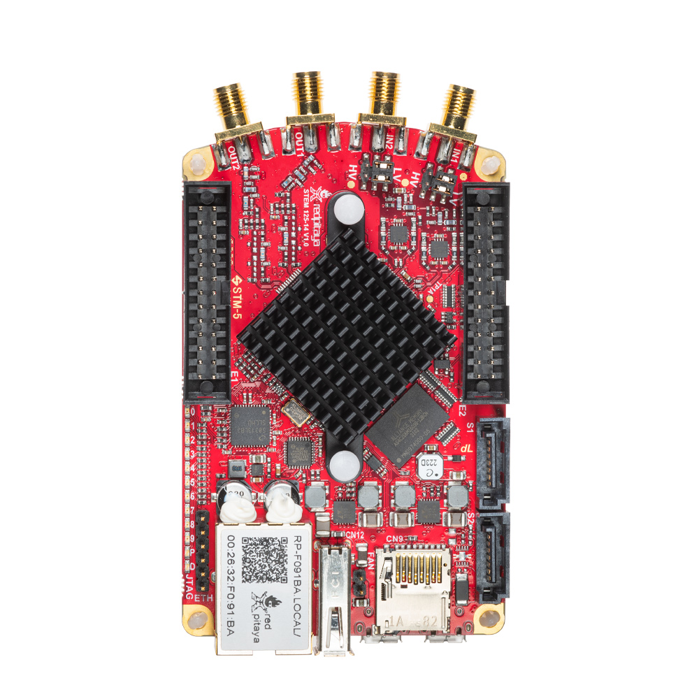

.. _top_125_14_Z7020_LN:

########################################
STEMlab 125-14 Z7020 LN（已停产）
########################################

.. note::

    STEMlab 125-14 Z7020 LN 已停产（不再生产）。此处文档供现有用户参考。

|

.. contents:: 目录
    :local:
    :depth: 1
    :backlinks: top

|

概述
========

STEMlab 125-14 Z7020-LN 是标准 :ref:`STEMlab 125-14 <top_125_14>` 的一个变体，结合了两项硬件改动：

* **Zynq 7020 FPGA** — 取代 Zynq 7010，提供 3 倍的可编程逻辑，并在 E1 连接器上提供 22 路数字 I/O（原为 16 路）
* **线性模拟电源稳压器** — 使用已装配的线性稳压器取代默认的开关稳压器，从而降低模拟电源轨噪声并改善 ENOB

有关线性电源改善噪声性能的更多信息，请参阅 Leonhard Neuhaus 的博客：|Red Pitaya DAC performance|。

.. |Red Pitaya DAC performance| raw:: html

    <a href="https://ln1985blog.wordpress.com/2016/02/07/red-pitaya-dac-performance/" target="_blank">Red Pitaya DAC 性能</a>

|

特性
========

* 14-bit、125 MS/s ADC 和 DAC
* 双核 ARM Cortex-A9 处理器
* FPGA Xilinx Zynq 7020 SoC（逻辑资源为 7010 的 3 倍）
* 512 MB RAM
* 22 路数字 I/O、4 路模拟输入、4 路模拟输出
* 采用线性模拟电源以改善噪声性能
* 多种通信接口：I2C、SPI、UART、CAN
* Micro USB 连接，用于供电和控制台
* 用于多板同步的 SATA 菊花链连接器

|

快速参考
===============

.. list-table::
   :widths: 40 60
   :header-rows: 1

   * - **类别**
     - **关键规格**
   * - ADC
     - 2 通道、14-bit、125 MS/s、DC-60 MHz
   * - DAC
     - 2 通道、14-bit、125 MS/s、DC-60 MHz
   * - 处理器
     - 双核 ARM Cortex-A9
   * - FPGA
     - Xilinx Zynq 7020 SoC
   * - RAM
     - 512 MB
   * - 数字 I/O
     - 22 路 GPIO @ 3.3V
   * - 模拟 I/O
     - 4 路输入（12-bit）、4 路输出（8-bit）
   * - 特殊功能
     - 线性电源、Zynq 7020

|

与标准 STEMlab 125-14 的差异
==========================================

本板卡与 :ref:`STEMlab 125-14 <top_125_14>` 使用相同的 PCB 和模拟前端，但有以下改动：

.. list-table::
    :widths: 38 45 45
    :header-rows: 1

    * - **参数**
      - **STEMlab 125-14**
      - **STEMlab 125-14 Z7020-LN**
    * - FPGA
      - Xilinx Zynq 7010
      - Xilinx Zynq 7020（逻辑资源多 3 倍）
    * - 数字 I/O（E1）
      - 16 路 GPIO
      - 22 路 GPIO
    * - 模拟电源稳压器
      - 开关稳压器（未装配）
      - 线性稳压器（已装配）
    * - 模拟电源噪声
      - 较高（存在开关噪声伪影）
      - 较低（洁净线性电源）
    * - 输出 ENOB
      - 标准
      - 已改善
    * - 可用电压（E2 引脚 2）
      - -3.4 V
      - -4.2 V

|

技术规格
=========================

.. list-table::
   :widths: 30 30 15 15
   :header-rows: 1

   * - **参数**
     - **数值**
     - **单位**
     - **备注**
   * - **基本参数**
     - 
     - 
     - 
   * - 处理器
     - 双核 ARM Cortex-A9
     - \-
     - 
   * - FPGA
     - FPGA AMD (Xilinx) Zynq 7020 SoC
     - \-
     - 
   * - RAM
     - 512
     - MB
     - (4 Gb)
   * - 核心时钟频率
     - 125
     - MHz
     - 
   * - 系统存储
     - 最大 32 GB 的 Micro SD
     - \-
     - 
   * - 串行控制台连接器
     - Micro USB
     - \-
     - 
   * - 电源连接器
     - Micro USB
     - \-
     - 
   * - 功耗
     - 5 V, 2 A
     - \-
     - 最大
   * - **连接能力**
     - 
     - 
     - 
   * - Ethernet
     - 1
     - Gbit
     - 
   * - USB
     - USB-A 2.0
     - \-
     - 
   * - Wi-Fi
     - 需要 Wi-Fi 适配器
     - \-
     - 
   * - **RF 输入**
     - 
     - 
     - 
   * - RF 输入通道
     - 2
     - \-
     - 
   * - 采样率
     - 125
     - MS/s
     - 
   * - ADC 分辨率
     - 14
     - 位
     - 
   * - 输入阻抗
     - 1 MΩ / 10 pF
     - \-
     - 
   * - 满量程电压范围
     - ±1 (LV) / ±20 (HV)
     - V
     -
   * - 输入耦合
     - DC
     - \-
     - 
   * - 绝对最大输入电压
     - ±6 (LV) / ±30 (HV)
     - V
     - DC 数值 [#f1]_
   * - 输入 ESD 保护
     - 1500
     - V
     - DC
   * - 过载保护
     - 保护二极管
     - \-
     - 
   * - 带宽
     - DC - 60
     - MHz
     - 
   * - 连接器类型
     - SMA
     - \-
     - 
   * - **RF 输出**
     - 
     - 
     - 
   * - RF 输出通道
     - 2
     - \-
     - 
   * - 采样率
     - 125
     - MS/s
     - 
   * - DAC 分辨率
     - 14
     - 位
     - 
   * - 负载阻抗
     - 50 Ω
     - \-
     - 
   * - 电压范围
     - ±1
     - V
     - 
   * - 输出耦合
     - DC
     - \-
     - 
   * - 短路保护
     - 是
     - \-
     - 
   * - 输出压摆率
     - 2 V / 10 ns
     - \-
     - 
   * - 带宽
     - DC - 60
     - MHz
     - 
   * - 连接器类型
     - SMA
     - \-
     - 
   * - **扩展连接器**
     - 
     - 
     - 
   * - 数字 GPIO
     - 22
     - \-
     - 
   * - 数字电压电平
     - 3.3
     - V
     - 
   * - GPIO 时间分辨率
     - 8
     - ns
     - 核心时钟频率
   * - 模拟输入
     - 4
     - \-
     - 
   * - 模拟输入电压范围
     - 0 - 7.0
     - V
     - 
   * - 模拟输入分辨率
     - 12
     - 位
     - 
   * - 模拟输入采样率 [#f8]_
     - 100
     - kS/s
     - 
   * - 模拟输出
     - 4
     - \-
     - 
   * - 模拟输出电压范围
     - 0 - 1.8
     - V
     - 
   * - 模拟输出分辨率
     - 8
     - 位
     - 
   * - 模拟输出采样率
     - ≲ 3.2
     - MS/s
     - 
   * - 模拟输出带宽 [#f9]_
     - ≈ 160
     - kHz
     - 
   * - 通信接口
     - I2C, SPI, UART, CAN
     - \-
     - 
   * - 可用电压 [#f10]_
     - +5, +3.3, -4.2
     - V
     - 
   * - 外部 ADC 时钟
     - 否
     - \-
     - 见 [#f2]_
   * - **同步**
     - 
     - 
     - 
   * - 外部触发输入
     - DIO0_P
     - \-
     - E1 连接器
   * - 外部触发输入阻抗
     - Hi-Z
     - \-
     - 数字输入
   * - 触发输出
     - DIO0_N
     - \-
     - E1 连接器 [#f3]_
   * - 菊花链连接器
     - SATA 连接器
     - \-
     - 
   * - 菊花链连接器速度
     - 最高 500
     - Mb/s
     - 
   * - 参考时钟输入
     - N/A
     - \-
     - 
   * - 参考时钟频率
     - N/A
     - \-
     - 
   * - 参考时钟连接器类型
     - N/A
     - \-
     - 
   * - **启动选项**
     - 
     - 
     - 
   * - SD 卡
     - 是
     - \-
     - 
   * - QSPI
     - 未装配
     - \-
     - 
   * - eMMC
     - N/A
     - \-
     - 
   * - **环境规格**
     - 
     - 
     - 
   * - 工作温度范围
     - 0 to 55
     - ℃
     - 使用默认散热器
   * - 工作湿度范围
     - < 90%
     - RH
     - 
   * - 自动关机温度
     - 85
     - ℃
     - 
   * - **尺寸**
     - 
     - 
     - 
   * - 尺寸（长 x 宽 x 高）
     - 106.8 x 60.0 x 21.1
     - mm
     - 详情见 :ref:`原理图 <schematics_125_14_Z7020>`

.. warning::

    **最大输入电压**
    
    * **LV 模式：** 绝对最大值 ±6 V
    * **HV 模式：** 绝对最大值 ±30 V
    
    超过这些数值可能对板卡造成永久损坏。

.. seealso::

    有关更多详细信息，请参阅 |Original Gen comparison table|。

|

性能与测量
============================

.. note::

    虽然没有针对 STEMlab 125-14 Z7020 LN 板卡的专门测量数据，但其快速模拟输入性能与 STEMlab 125-14 相同。输出性能见 Leonhard Neuhaus 关于 |Red Pitaya DAC performance| 的博客（加装线性电源后的测量结果）。
    
快速模拟前端的测量结果见：

* :ref:`Original Gen — STEMlab 125-14 <measurements_orig_gen>`。

|

.. _schematics_125_14_Z7020:

原理图与 3D 模型
========================

原理图
----------

* :download:`Schematics_STEM_125-14_v1.1_LN_Z7020.pdf <https://downloads.redpitaya.com/doc/Schematics/Schematics_STEM_125-14_v1.1_LN_Z7020.pdf>`.

.. note::

    Red Pitaya 板卡不提供完整的硬件原理图。Red Pitaya 的代码是开源的，但硬件原理图并不开源；不过仍提供开发用原理图，其中包含硬件配置、FPGA 引脚连接等信息。

机械规格与 3D 模型
--------------------------------------

* STEP :download:`3D_STEM_125-14_v1.0.zip <https://downloads.redpitaya.com/doc/3D_models/3D_STEM_125-14_v1.0.zip>`.

|

硬件详情
==================

组件
----------

STEMlab 125-14 Z7020-LN 使用与标准 :ref:`STEMlab 125-14 <top_125_14>` 相同的 ADC、DAC 和振荡器。不同之处有两项：

**FPGA：** Xilinx `Zynq 7020 <https://docs.xilinx.com/v/u/en-US/ds190-Zynq-7000-Overview>`_

    * 双核 ARM Cortex-A9 @ 667 MHz
    * 可编程逻辑资源为 Zynq 7010 的 3 倍
    * E1 上有 22 路数字 I/O（7010 为 16 路）
    * 集成外设和存储器控制器

**模拟电源：**

    * 模拟电源轨装配线性稳压器（降低开关噪声）

|

扩展连接器与接口
===================================

概述
---------

STEMlab 125-14 Z7020-LN 板卡具有以下连接器和接口：

* **E1 和 E2 连接器：** 主要扩展连接器，提供数字 I/O、模拟 I/O 和通信接口。E1 连接器提供 22 路数字 I/O（比标准 7010 版本多 6 路）。
* **S1 和 S2 连接器：** 用于同步多块 Red Pitaya 板卡的菊花链连接器，可实现板间时钟与触发同步。

|

连接器物理规格
----------------------------------

**E1 和 E2 扩展连接器：**

* 连接器类型：`2 x 13 引脚、IDC、2.54 mm 间距 <https://www.digikey.com/en/products/detail/adam-tech/BHR-26-VUA/9832284>`_
* 引脚数量：每个 26 个引脚（2x13 配置）
* 间距：2.54 mm (0.1")

**配对连接器：**

.. note::

    为自定义 Red Pitaya 扩展板选择配对连接器时，需要使用 `双层高度加高插座 <https://www.digikey.com/en/products/detail/samtec-inc/ESW-113-33-T-D/6693225>`_，以避开板卡上的散热器和以太网连接器。
    任何 *绝缘体高度* 不低于 0.635" (16.13 mm) 的连接器均可使用。此净空要求取决于 Red Pitaya 板卡上最高的组件（散热器和以太网连接器）。

.. note::

    为防止损坏板卡或扩展板，将扩展板连接到 E1 和 E2 连接器时，请确保：
    
    * **连接器正确对齐** — 确保连接器正确对齐。Red Pitaya 板卡连接器的插座外壳留有额外空间，因此扩展板即使错位 ±1 个引脚，在外观上仍可能像是已经连接。这可能损坏板卡和/或扩展板，请在给板卡上电前再次检查对齐情况。
    * **配对牢固** — 使用连接牢固的连接器，以防意外断开或损坏。

|

E1 连接器——数字 I/O 与 CAN
----------------------------------

.. include:: ../_specs_common/E1_connector_7020.inc

|

E2 连接器——模拟与通信
--------------------------------------

E2 扩展连接器提供用于传感器集成和数据采集的模拟 I/O 与通信接口。

**特性：**

* +5 V 电源（最大 0.5 A，与 USB 设备共享）
* -3.4 V/-4 V 电源（最大 0.1 A）
* SPI、UART、I2C 通信接口
* 4 路慢速 ADC（12-bit、100 kS/s）
* 4 路慢速 DAC（8-bit PWM、≲ 3.2 MS/s）

**E2 引脚排列：**

.. list-table::
    :widths: 5 23 19 47 16
    :header-rows: 1

    * - 引脚
      - 说明
      - FPGA 引脚编号
      - FPGA 引脚说明
      - 电压电平
    * - 1
      - +5V
      - 
      - 
      - 
    * - 2
      - -4.2 V
      - 
      - 
      - 
    * - 3
      - SPI (MOSI)
      - E9
      - PS_MIO10_500
      - 3V3
    * - 4
      - SPI (MISO)
      - C6
      - PS_MIO11_500
      - 3V3
    * - 5
      - SPI (SCK)
      - D9
      - PS_MIO12_500
      - 3V3
    * - 6
      - SPI (CS)
      - E8
      - PS_MIO13_500
      - 3V3
    * - 7
      - UART (TX)
      - D5
      - PS_MIO8_500
      - 3V3
    * - 8
      - UART (RX)
      - B5
      - PS_MIO9_500
      - 3V3
    * - 9
      - I2C (SCL)
      - B13
      - PS_MIO50_501
      - 3V3
    * - 10
      - I2C (SDA)
      - B9
      - PS_MIO51_501
      - 3V3
    * - 11
      - 外部通信模式（AIN）
      - 
      - 
      - GND（默认）
    * - 12
      - GND
      - 
      - 
      - 
    * - 13
      - 模拟输入 0
      - B19, A20
      - IO_L2P_T0_AD8P_35, IO_L2N_T0_AD8N_35
      - 0-7.0 V
    * - 14
      - 模拟输入 1
      - C20, B20
      - IO_L1P_T0_AD0P_35, IO_L1N_T0_AD0N_35
      - 0-7.0 V
    * - 15
      - 模拟输入 2
      - E17, D18
      - IO_L3P_T0_DQS_AD1P_35, IO_L3N_T0_DQS_AD1N_35
      - 0-7.0 V
    * - 16
      - 模拟输入 3
      - E18, E19
      - IO_L5P_T0_AD9P_35, IO_L5N_T0_AD9N_35
      - 0-7.0 V
    * - 17
      - 模拟输出 0
      - T10
      - IO_L1N_T0_34
      - 0-1.8 V
    * - 18
      - 模拟输出 1
      - T11
      - IO_L1P_T0_34
      - 0-1.8 V
    * - 19
      - 模拟输出 2
      - P15
      - IO_L24P_T3_34
      - 0-1.8 V
    * - 20
      - 模拟输出 3
      - U13
      - IO_L3P_T0_DQS_PUDC_B_34
      - 0-1.8 V
    * - 21
      - GND
      - 
      - 
      - 
    * - 22
      - GND
      - 
      - 
      - 
    * - 23
      - NC
      - 
      - 
      - 
    * - 24
      - NC
      - 
      - 
      - 
    * - 25
      - GND
      - 
      - 
      - 
    * - 26
      - GND
      - 
      - 
      - 

.. note::

    **UART TX (PS_MIO08)** 仅用作输出。上电时必须将其连接到 GND 或保持悬空（不得外接上拉电阻）！

|

辅助模拟输入与输出
------------------------------------

.. include:: ../_specs_common/slow_analog_io.inc

|

通用数字 I/O 通道
--------------------------------------

.. list-table::
   :widths: 30 30 15 15
   :header-rows: 1

   * - **参数**
     - **数值**
     - **单位**
     - **备注**
   * - GPIO 数量
     - 22
     - \-
     - 
   * - 数字电压电平
     - 3.3
     - V
     - 
   * - 绝对最小电压
     - -0.40
     - V
     - 
   * - 绝对最大电压
     - 3.3 + 0.55
     - V
     - 
   * - 电流限制
     - < 8
     - mA
     - 驱动能力
   * - 方向
     - 可配置
     - \-
     - 
   * - 时间分辨率
     - 8
     - ns
     - (1/125 MHz)
   * - 连接器位置
     - 扩展连接器 |E1|
     - \-
     - 

|

同步连接器（S1 与 S2）
--------------------------------------

.. include:: ../_specs_common/Sync_connectors_SATA.inc
    
|

高级功能
==================

电源
-------------

.. include:: ../_specs_common/power_supply.inc

|

外部 ADC 时钟与 X-Channel 配置
---------------------------------------------

STEMlab 125-14 Z7020-LN 支持与标准 STEMlab 125-14 相同的 ADC 时钟重新配置选项。通过移动 PCB 上的 SMD 电阻，可将板卡转换为：

* **外部时钟变体**\ （电阻 R25、R26 → R23、R24）— ADC 时钟通过 E2 连接器上的 Ext. ADC Clk± 引脚提供。其功能等同于 :ref:`STEMlab 125-14 外部时钟版 <top_125_14_EXT>`，但采用 Zynq 7020 FPGA 和线性电源。
* **X-channel Secondary**\ （电阻 R25、R26 → R27、R28）— ADC 时钟通过 SATA 连接器从 Primary 板卡接收。其功能等同于 :ref:`STEMlab 125-14 X-Channel Secondary <top_125_14_MULTI>`，但采用 Zynq 7020 FPGA 和线性电源。

有关时钟源原理图和完整改装说明，请参阅 STEMlab 125-14 页面中的 :ref:`外部 ADC 时钟章节 <external_125_14>`。

.. important::

    这些硬件配置 **不作为标准现货产品提供**，**仅可按定制请求提供**。
    如果需要预先改装的板卡，或需要自行改装的指导，请通过 info@redpitaya.com 联系我们。

|

校准
------------

.. include:: ../_specs_common/calibration.inc

|

其他资源
====================

有关其他规格和测量结果，请参阅：

* |Original Gen hardware specs| — Original Gen 通用规格
* |Original Gen comparison table| — 所有 Red Pitaya Original Gen 型号的比较
* :ref:`STEMlab 125-14 <top_125_14>` — 标准 STEMlab 125-14 规格

|

法律声明与免责声明
===================

.. include:: ../_specs_common/disclaimer.inc

|

.. rubric:: 脚注

.. [#f1] 绝对最大输入电压值适用于低于 1 kHz 的频率。对于更高频率，请将输入电压范围规格作为 **绝对最大值**。
.. [#f2] 可通过硬件改装使板卡支持外部 ADC 时钟输入（R25、R26 → R23、R24）或 X-channel Secondary 配置（R25、R26 → R27、R28）。这些变体仅可按定制请求提供。更多信息请联系 info@redpitaya.com。
.. [#f3] 有关触发输出配置，请参阅 :ref:`X-channel 2.0（Click Shield）同步 <click_shield_sync>` 和 :ref:`X-channel 2.0（Click Shield）同步示例 <examples_multiboard_sync>`。
.. [#f8] 默认软件以取决于 CPU 的速度进行采样。若要以 100 kS/s 的速率采集数据，必须实现额外的 FPGA 处理。
.. [#f9] 输出经过一阶低通滤波器。如需额外滤波，可根据具体应用要求在外部实现。
.. [#f10] 取决于具体应用。输出电流由扩展连接器和已连接的 USB 设备共享；未使用其他外设时，电流可以更高。

|

.. substitutions

.. |E1| replace:: :ref:`E1 连接器 <E1_orig_gen>`
.. |E2| replace:: :ref:`E2 连接器 <E2_orig_gen>`
.. |Original Gen hardware specs| replace:: :ref:`Original Gen 硬件规格 <hw_specs_orig_gen>`
.. |Original Gen comparison table| replace:: :ref:`Original Gen 板卡比较表 <rp-board-comp-orig_gen>`
