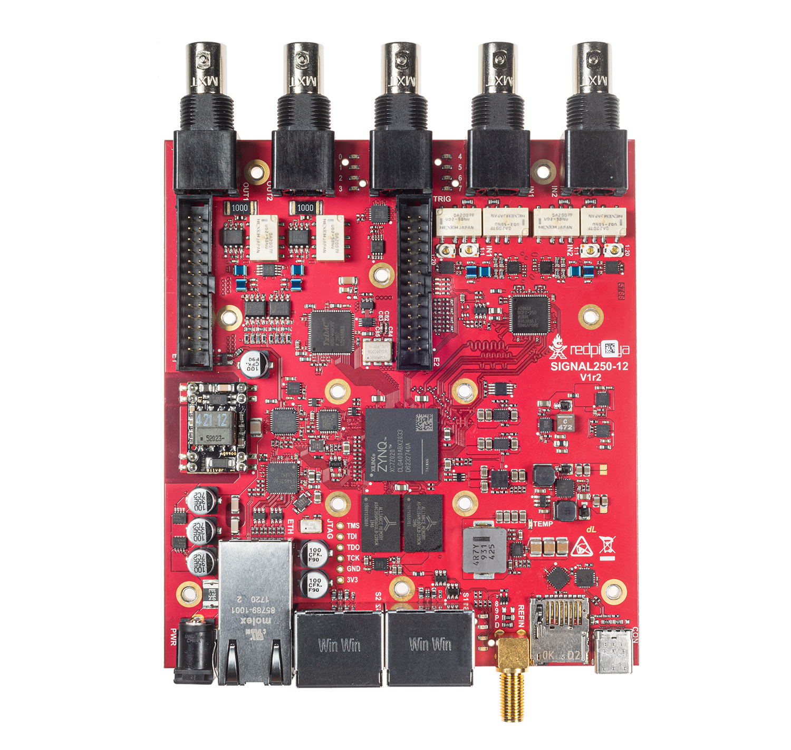
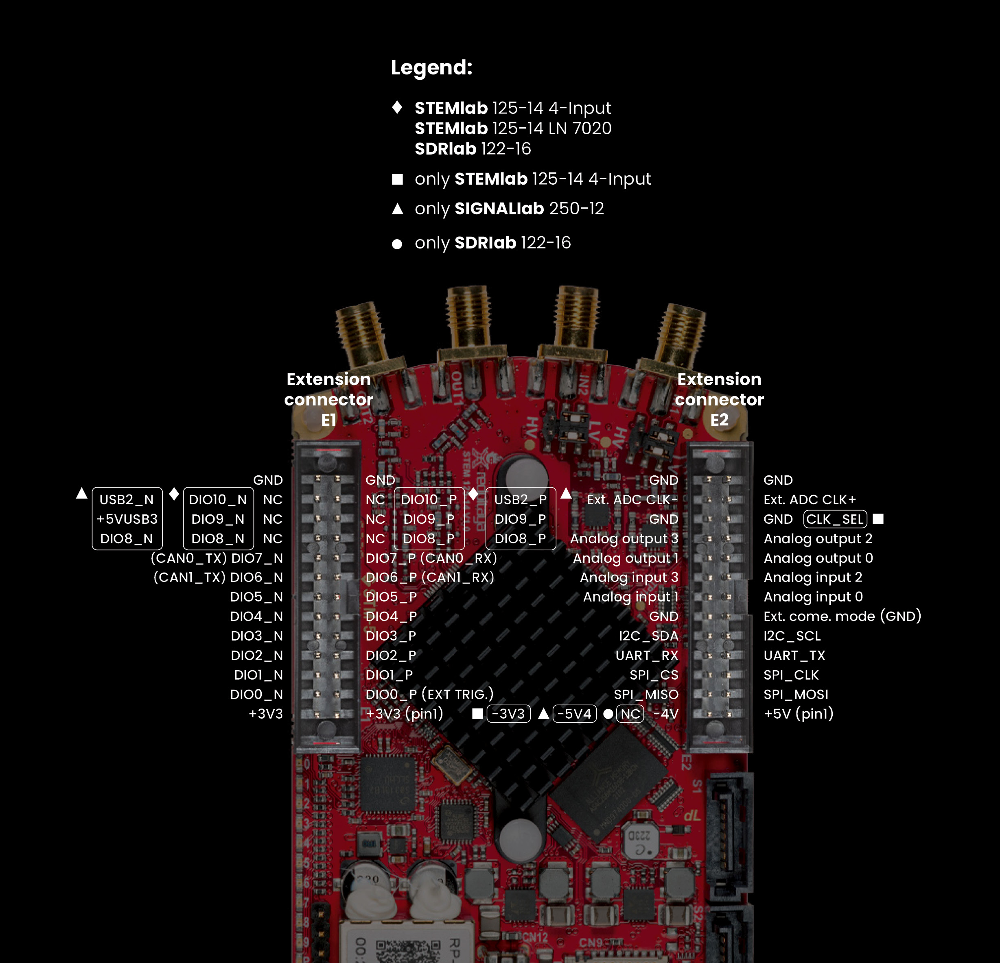

.. _top_250_12:

#################
SIGNALlab 250-12
#################

.. figure:: img/Signal-Lab-250-12_full.jpg
    :width: 600
    :align: center

.. note::

    SIGNALlab 250-12 OEM 开发板不带外壳，但包含第一张图片顶部所示的黑色鳍片散热器。
    散热器安装在开发板底面。

|

.. contents:: 目录
    :local:
    :depth: 1
    :backlinks: top

|

概述
========

SIGNALlab 250-12 是 Red Pitaya 平台的高性能型号，具有 250 MS/s 采样率、12-bit ADC、14-bit DAC、软件可选 AC/DC 耦合和 BNC 连接器。
它采用双核 ARM Cortex-A9 处理器和 FPGA Xilinx Zynq 7020 SoC，并配备 1 GB RAM，非常适合要求苛刻的信号处理和测量应用。

|

特性
========

* 12-bit、250 MS/s ADC 和 14-bit、250 MS/s DAC
* 软件可选 AC/DC 输入耦合
* 软件可选输入/输出范围（输入 ±1 V/±20 V，输出 ±2 V/±10 V）
* RF 输入和输出采用 BNC 连接器
* 双核 ARM Cortex-A9 处理器
* FPGA Xilinx Zynq 7020 SoC
* 1 GB RAM
* 19 路数字 I/O、4 路模拟输入、4 路模拟输出
* 多种通信接口：I2C、SPI、UART、CAN、USB
* 24 V 或 PoE 电源输入
* USB-C 控制台连接器
* 外部 ADC 时钟输入
* 10 MHz SMA 参考时钟输入

|

快速参考
===============

.. table::
    :widths: 40 60

    +----------------------------+--------------------------------------------------+
    | **类别**                   | **主要规格**                                     |
    +============================+==================================================+
    | ADC                        | 2 通道、12-bit、250 MS/s、DC-60 MHz              |
    +----------------------------+--------------------------------------------------+
    | DAC                        | 2 通道、14-bit、250 MS/s、DC-60 MHz              |
    +----------------------------+--------------------------------------------------+
    | 处理器                     | 双核 ARM Cortex-A9                               |
    +----------------------------+--------------------------------------------------+
    | FPGA                       | Xilinx Zynq 7020 SoC                             |
    +----------------------------+--------------------------------------------------+
    | RAM                        | 1 GB                                             |
    +----------------------------+--------------------------------------------------+
    | 数字 I/O                   | 19 路 GPIO @ 3.3V                                |
    +----------------------------+--------------------------------------------------+
    | 模拟 I/O                   | 4 路输入 (12-bit)、4 路输出 (8-bit)              |
    +----------------------------+--------------------------------------------------+
    | 连接能力                   | 以太网、USB-C、扩展连接器                        |
    +----------------------------+--------------------------------------------------+
    | 特殊功能                   | AC/DC 耦合、BNC 连接器、±10 V 输出               |
    +----------------------------+--------------------------------------------------+

|

开发板布局与引脚排列
======================

引脚图展示了扩展连接器布局 (E1、E2)，该布局与其他 Red Pitaya 开发板共用。
SIGNALlab 250-12 的 RF 输入/输出 (IN1、IN2、OUT1、OUT2) 使用 BNC 连接器，并设有专用 BNC 触发输入。
10 MHz SMA 参考时钟输入和 SATA 菊花链连接器 (S1、S2) 位于后面板。

|

技术规格
=========================

.. table::
    :widths: 30 30 15 15

    +------------------------------------+------------------------------------+-----------+----------------------------------+
    | **参数**                           | **数值**                           | **单位**  | **备注**                         |
    +====================================+====================================+===========+==================================+
    | |br|                                                                                                                   |
    | **基本信息**                                                                                                           |
    +------------------------------------+------------------------------------+-----------+----------------------------------+
    | 处理器                             | 双核 ARM Cortex-A9                 | \-        |                                  |
    +------------------------------------+------------------------------------+-----------+----------------------------------+
    | FPGA                               | FPGA AMD (Xilinx) Zynq 7020 SoC    | \-        |                                  |
    +------------------------------------+------------------------------------+-----------+----------------------------------+
    | RAM                                | 1                                  | GB        | (8 Gb)                           |
    +------------------------------------+------------------------------------+-----------+----------------------------------+
    | 核心时钟频率                       | 250                                | MHz       |                                  |
    +------------------------------------+------------------------------------+-----------+----------------------------------+
    | 系统存储                           | Micro SD，最大 32 GB               | \-        |                                  |
    +------------------------------------+------------------------------------+-----------+----------------------------------+
    | 串行控制台连接器                   | USB-C                              | \-        |                                  |
    +------------------------------------+------------------------------------+-----------+----------------------------------+
    | 电源连接器                         | 电源插孔 / RJ45 (PoE)              | \-        |                                  |
    +------------------------------------+------------------------------------+-----------+----------------------------------+
    | 电源插孔尺寸                       | 5.5 x 2.5                          | mm        | 外径 x 内径                      |
    +------------------------------------+------------------------------------+-----------+----------------------------------+
    | 输入电压范围                       | 12 - 26                            | V         |                                  |
    +------------------------------------+------------------------------------+-----------+----------------------------------+
    | 最大输入电流                       | 2.5                                | A         |                                  |
    +------------------------------------+------------------------------------+-----------+----------------------------------+
    | 标称电源                           | 24 V, 1 A                          | \-        | 随开发板附带                     |
    +------------------------------------+------------------------------------+-----------+----------------------------------+
    | 功耗                               | 24 V, 0.5 A                        | \-        | 最大值                           |
    +------------------------------------+------------------------------------+-----------+----------------------------------+
    | |br|                                                                                                                   |
    | **连接能力**                                                                                                           |
    +------------------------------------+------------------------------------+-----------+----------------------------------+
    | 以太网                             | 1                                  | Gbit      |                                  |
    +------------------------------------+------------------------------------+-----------+----------------------------------+
    | USB                                | USB-A 2.0 (2x)                     | \-        |                                  |
    +------------------------------------+------------------------------------+-----------+----------------------------------+
    | Wi-Fi                              | 需要 Wi-Fi 适配器                  | \-        |                                  |
    +------------------------------------+------------------------------------+-----------+----------------------------------+
    | |br|                                                                                                                   |
    | **RF 输入**                                                                                                            |
    +------------------------------------+------------------------------------+-----------+----------------------------------+
    | RF 输入通道                        | 2                                  | \-        |                                  |
    +------------------------------------+------------------------------------+-----------+----------------------------------+
    | 采样率                             | 250                                | MS/s      |                                  |
    +------------------------------------+------------------------------------+-----------+----------------------------------+
    | ADC 分辨率                         | 12                                 | bit       |                                  |
    +------------------------------------+------------------------------------+-----------+----------------------------------+
    | 输入阻抗                           | 1 MΩ                               | \-        |                                  |
    +------------------------------------+------------------------------------+-----------+----------------------------------+
    | 满量程电压范围                     | ±1 (LV)；±20 (HV)                  | V         | 软件可选                         |
    +------------------------------------+------------------------------------+-----------+----------------------------------+
    | 输入耦合                           | AC / DC                            | \-        | 软件可选                         |
    +------------------------------------+------------------------------------+-----------+----------------------------------+
    | 绝对最大输入电压                   | ±6 (LV)；±30 (HV)                  | V         | DC 数值 [#f1]_                   |
    +------------------------------------+------------------------------------+-----------+----------------------------------+
    | 输入 ESD 保护                      | 1500                               | V         | DC                               |
    +------------------------------------+------------------------------------+-----------+----------------------------------+
    | 过载保护                           | 保护二极管                         | \-        |                                  |
    +------------------------------------+------------------------------------+-----------+----------------------------------+
    | 带宽                               | DC - 60                            | MHz       |                                  |
    +------------------------------------+------------------------------------+-----------+----------------------------------+
    | 连接器类型                         | BNC                                | \-        |                                  |
    +------------------------------------+------------------------------------+-----------+----------------------------------+
    | |br|                                                                                                                   |
    | **RF 输出**                                                                                                            |
    +------------------------------------+------------------------------------+-----------+----------------------------------+
    | RF 输出通道                        | 2                                  | \-        |                                  |
    +------------------------------------+------------------------------------+-----------+----------------------------------+
    | 采样率                             | 250                                | MS/s      |                                  |
    +------------------------------------+------------------------------------+-----------+----------------------------------+
    | DAC 分辨率                         | 14                                 | bit       |                                  |
    +------------------------------------+------------------------------------+-----------+----------------------------------+
    | 负载阻抗                           | 50 Ω / Hi-Z                        | \-        |                                  |
    +------------------------------------+------------------------------------+-----------+----------------------------------+
    | 电压范围                           | ±1 @ 50 Ω（x1 比例）；             | V         | 软件可选                         |
    |                                    | ±2 @ Hi-Z（x1 比例）；             |           |                                  |
    |                                    | ±5 @ 50 Ω（x5 比例）；             |           |                                  |
    |                                    | ±10 @ Hi-Z（x5 比例）              |           |                                  |
    +------------------------------------+------------------------------------+-----------+----------------------------------+
    | 输出耦合                           | DC                                 | \-        |                                  |
    +------------------------------------+------------------------------------+-----------+----------------------------------+
    | 短路保护                           | 是                                 | \-        |                                  |
    +------------------------------------+------------------------------------+-----------+----------------------------------+
    | 输出压摆率                         | 10 V / 17 ns                       | \-        |                                  |
    +------------------------------------+------------------------------------+-----------+----------------------------------+
    | 带宽                               | DC - 60                            | MHz       |                                  |
    +------------------------------------+------------------------------------+-----------+----------------------------------+
    | 连接器类型                         | BNC                                | \-        |                                  |
    +------------------------------------+------------------------------------+-----------+----------------------------------+
    | |br|                                                                                                                   |
    | **扩展连接器**                                                                                                         |
    +------------------------------------+------------------------------------+-----------+----------------------------------+
    | 数字 GPIO                          | 19                                 | \-        |                                  |
    +------------------------------------+------------------------------------+-----------+----------------------------------+
    | 数字电平                           | 3.3                                | V         |                                  |
    +------------------------------------+------------------------------------+-----------+----------------------------------+
    | GPIO 时间分辨率                    | 4                                  | ns        | 核心时钟频率                     |
    +------------------------------------+------------------------------------+-----------+----------------------------------+
    | 模拟输入                           | 4                                  | \-        |                                  |
    +------------------------------------+------------------------------------+-----------+----------------------------------+
    | 模拟输入电压范围                   | 0 - 7.0                            | V         |                                  |
    +------------------------------------+------------------------------------+-----------+----------------------------------+
    | 模拟输入分辨率                     | 12                                 | bit       |                                  |
    +------------------------------------+------------------------------------+-----------+----------------------------------+
    | 模拟输入采样率                     | 100                                | kS/s      |                                  |
    +------------------------------------+------------------------------------+-----------+----------------------------------+
    | 模拟输出                           | 4                                  | \-        |                                  |
    +------------------------------------+------------------------------------+-----------+----------------------------------+
    | 模拟输出电压范围                   | 0 - 1.8                            | V         |                                  |
    +------------------------------------+------------------------------------+-----------+----------------------------------+
    | 模拟输出分辨率                     | 8                                  | bit       |                                  |
    +------------------------------------+------------------------------------+-----------+----------------------------------+
    | 模拟输出采样率                     | ≲ 3.2                              | MS/s      |                                  |
    +------------------------------------+------------------------------------+-----------+----------------------------------+
    | 模拟输出带宽                       | ≈ 160                              | kHz       |                                  |
    +------------------------------------+------------------------------------+-----------+----------------------------------+
    | 通信接口                           | I2C, SPI, UART, CAN, USB           | \-        |                                  |
    +------------------------------------+------------------------------------+-----------+----------------------------------+
    | 可用电压                           | +5, +3.3, -5.4                     | V         |                                  |
    +------------------------------------+------------------------------------+-----------+----------------------------------+
    | 外部 ADC 时钟                      | 是                                 | \-        |                                  |
    +------------------------------------+------------------------------------+-----------+----------------------------------+
    | |br|                                                                                                                   |
    | **同步**                                                                                                               |
    +------------------------------------+------------------------------------+-----------+----------------------------------+
    | 外部触发输入                       | BNC                                | \-        |                                  |
    +------------------------------------+------------------------------------+-----------+----------------------------------+
    | 外部触发输入阻抗                   | 10 (HW_rev 1.0-1.2a)；             | kΩ        |                                  |
    |                                    | 1 (HW_rev 1.2b)                    |           |                                  |
    +------------------------------------+------------------------------------+-----------+----------------------------------+
    | 触发输出                           | DIO0_N                             | \-        | E1 连接器 [#f2]_                 |
    +------------------------------------+------------------------------------+-----------+----------------------------------+
    | 菊花链连接器 (S1 & S2)             | 是                                 | \-        |                                  |
    +------------------------------------+------------------------------------+-----------+----------------------------------+
    | 菊花链连接器速率                   | 最高 500                           | Mb/s      |                                  |
    +------------------------------------+------------------------------------+-----------+----------------------------------+
    | 菊花链连接器类型                   | eSATA                              | \-        |                                  |
    +------------------------------------+------------------------------------+-----------+----------------------------------+
    | 参考时钟输入                       | 是                                 | \-        |                                  |
    +------------------------------------+------------------------------------+-----------+----------------------------------+
    | 参考时钟频率                       | 10                                 | MHz       |                                  |
    +------------------------------------+------------------------------------+-----------+----------------------------------+
    | 参考时钟连接器类型                 | SMA                                | \-        | 位于后面板                       |
    +------------------------------------+------------------------------------+-----------+----------------------------------+
    | |br|                                                                                                                   |
    | **启动选项**                                                                                                           |
    +------------------------------------+------------------------------------+-----------+----------------------------------+
    | SD 卡                              | 是                                 | \-        |                                  |
    +------------------------------------+------------------------------------+-----------+----------------------------------+
    | QSPI                               | N/A                                | \-        |                                  |
    +------------------------------------+------------------------------------+-----------+----------------------------------+
    | eMMC                               | N/A                                | \-        |                                  |
    +------------------------------------+------------------------------------+-----------+----------------------------------+
    | |br|                                                                                                                   |
    | **环境规格**                                                                                                           |
    +------------------------------------+------------------------------------+-----------+----------------------------------+
    | 工作温度范围                       | 0 至 55                            | ℃         | 使用默认散热器                   |
    +------------------------------------+------------------------------------+-----------+----------------------------------+
    | 工作湿度范围                       | < 90%                              | RH        |                                  |
    +------------------------------------+------------------------------------+-----------+----------------------------------+
    | 自动关机温度                       | 85                                 | ℃         |                                  |
    +------------------------------------+------------------------------------+-----------+----------------------------------+
    | |br|                                                                                                                   |
    | **尺寸**                                                                                                               |
    +------------------------------------+------------------------------------+-----------+----------------------------------+
    | 尺寸（长 x 宽 x 高）               | 157.3 x 125.0 x 36.0               | mm        | 详情参见 :ref:`原理图            |
    |                                    |                                    |           | <schematics_250_12>`             |
    +------------------------------------+------------------------------------+-----------+----------------------------------+

.. seealso::

    更多详细信息请参阅 |Original Gen comparison table|。

.. warning::

    **最大输入电压**
    
    * **LV 模式：** 绝对最大值 ±6 V
    * **HV 模式：** 绝对最大值 ±30 V
    
    超过这些数值可能会永久损坏开发板。

|

性能与测量
============================

.. note::

    我们目前没有 SIGNALlab 250-12 开发板的专门测量结果。
    
可在此处查看快速模拟前端的参考测量结果：

* :ref:`初代产品——STEMlab 125-14 <measurements_orig_gen>`。

|

.. _schematics_250_12:

原理图与 3D 模型
========================

原理图
----------

* :download:`Schematics_SIGNAL_250-12_V1r1.pdf <https://downloads.redpitaya.com/doc/Schematics/Schematics_SIGNAL_250-12_V1r1.pdf>`

.. note::

    Red Pitaya 开发板不提供完整的硬件原理图。Red Pitaya 的代码开源，但硬件原理图并不开源；不过我们提供开发用原理图。该原理图可提供硬件配置、FPGA 引脚连接等信息。

机械规格与 3D 模型
--------------------------------------

* PDF :download:`3D_SIGNAL_250-12_V1r2.pdf.zip <https://downloads.redpitaya.com/doc/3D_models/3D_SIGNAL_250-12_V1r2.pdf.zip>`
* STEP :download:`3D_SIGNAL_250-12_V1r2.zip <https://downloads.redpitaya.com/doc/3D_models/3D_SIGNAL_250-12_V1r2.zip>`
* 孔位尺寸：:download:`SIGNALlab 250-12 孔位尺寸 <SIGNALlab_hole_dimensions.pdf>`

|

硬件详情
==================

组件
----------

**ADC:** Analog Devices `AD9613 <https://www.analog.com/en/products/AD9613.html>`_

    * 双通道 12-bit、250 MS/s ADC
    * 高动态范围

**DAC:** Analog Devices `AD9746 <https://www.analog.com/en/products/ad9746.html>`_

    * 单通道 14-bit、250 MS/s DAC
    * 高 SFDR 性能

**FPGA:** Xilinx `Zynq 7020 <https://docs.xilinx.com/v/u/en-US/ds190-Zynq-7000-Overview>`_

    * 双核 ARM Cortex-A9 @ 667 MHz
    * 可编程逻辑结构

**电流反馈运算放大器：** Analog Devices `AD8000 <https://www.analog.com/en/products/AD8000.html>`_

    * 1.5 GHz 带宽
    * 用于信号链

**电压反馈 FastFET 运算放大器：** Analog Devices `ADA4817-1 <https://www.analog.com/en/products/ada4817-1.html>`_

    * 1 GHz 带宽
    * 低功耗差分 ADC 驱动器

**振荡器：** Skyworks `Si571 <https://www.skyworksinc.com/-/media/skyworks/sl/documents/public/data-sheets/si570-71.pdf>`_

    * 可编程 VCXO——10 ppm 稳定度
    * 频率范围：10 MHz 至 1.4 GHz

|

扩展连接器与接口
===================================

概述
---------

SIGNALlab 250-12 开发板提供以下连接器和接口：

* **E1 和 E2 连接器：** 提供数字 I/O、模拟 I/O 和通信接口的主要扩展连接器。用户可借此连接额外的硬件、传感器或外设，扩展开发板能力。
* **S1 和 S2 连接器：** 直接连接 FPGA 的 SATA 连接器。与 STEMlab 125-14 不同，本开发板不支持通过这些连接器进行多板时钟同步——共享
  时钟信号不会传递到 ADC 和 DAC。它们仍可用于在开发板或外部设备之间交换时钟、触发或数据信号。请注意，其电平为 1V8，
  这并非 SATA 连接的标准电平。

.. note::

    除“裸板 OEM”版本外，SIGNALlab 250-12 开发板均装在铝制外壳中；要访问 E1 和 E2 扩展连接器，应拆下外壳。

|

连接器物理规格
----------------------------------

**E1 和 E2 扩展连接器：**

* 连接器类型：`2 x 13 引脚、2.54 mm 间距 IDC <https://www.digikey.com/en/products/detail/adam-tech/BHR-26-VUA/9832284>`_
* 引脚数：每个 26 引脚（2x13 配置）
* 间距：2.54 mm (0.1")

|

.. _E1_signal:

E1 连接器——数字 I/O 与 CAN
----------------------------------

E1 扩展连接器为控制和通信应用提供数字 I/O 与 CAN 总线接口。

**特性：**

* 两路 +3V3 电源（最大电流 0.5 A）
* 19 路单端或 9 路差分数字 I/O，逻辑电平为 3.3 V
* 两路 CAN 总线（可通过软件配置）
* USB 2.0 端口（引脚 22-24）

**电气规格：**

所有 DIOx_y 引脚均为 LVCMOS33，绝对最大额定值如下：

* 最小电压：-0.40 V
* 最大电压：3.3 V + 0.55 V
* 驱动能力：< 8 mA

**E1 引脚排列：**

.. list-table::
    :widths: 5 23 19 47 16
    :header-rows: 1

    * - 引脚
      - 说明
      - FPGA 引脚编号
      - FPGA 引脚说明
      - 电平
    * - 1
      - 3V3
      - 
      - 
      - 
    * - 2
      - 3V3
      - 
      - 
      - 
    * - 3
      - DIO0_P / EXT TRIG
      - W10
      - IO_L16P_T2_13
      - 3.3V
    * - 4
      - DIO0_N / TRIG OUT
      - W9
      - IO_L16N_T2_13
      - 3.3V
    * - 5
      - DIO1_P
      - T9
      - IO_L12P_T1_MRCC_13
      - 3.3V
    * - 6
      - DIO1_N
      - U10
      - IO_L12N_T1_MRCC_13
      - 3.3V
    * - 7
      - DIO2_P
      - Y9
      - IO_L14P_T2_SRCC_13
      - 3.3V
    * - 8
      - DIO2_N
      - Y8
      - IO_L14N_T2_SRCC_13
      - 3.3V
    * - 9
      - DIO3_P
      - U9
      - IO_L17P_T2_13
      - 3.3V
    * - 10
      - DIO3_N
      - U8
      - IO_L17N_T2_13
      - 3.3V
    * - 11
      - DIO4_P
      - V8
      - IO_L15P_T2_DQS_13
      - 3.3V
    * - 12
      - DIO4_N
      - W8
      - IO_L15N_T2_DQS_13
      - 3.3V
    * - 13
      - DIO5_P
      - V11
      - IO_L21P_T3_DQS_13
      - 3.3V
    * - 14
      - DIO5_N
      - V10
      - IO_L21N_T3_DQS_13
      - 3.3V
    * - 15
      - DIO6_P / CAN1_RX
      - W11
      - IO_L18P_T2_13
      - 3.3V
    * - 16
      - DIO6_N / CAN1_TX
      - Y11
      - IO_L18N_T2_13
      - 3.3V
    * - 17
      - DIO7_P / CAN0_RX
      - Y12
      - IO_L20P_T3_13
      - 3.3V
    * - 18
      - DIO7_N / CAN0_TX
      - Y13
      - IO_L20N_T3_13
      - 3.3V
    * - 19
      - DIO8_P
      - Y7
      - IO_L13P_T2_MRCC_13
      - 3.3V
    * - 20
      - DIO8_N
      - Y6
      - IO_L13N_T2_MRCC_13
      - 3.3V
    * - 21
      - DIO9_P
      - U5
      - IO_L19N_T3_VREF_13
      - 3.3V
    * - 22
      - +5VUSB3
      - 
      - 
      - 3.3V
    * - 23
      - USB2_P
      - 
      - 
      - 3.3V
    * - 24
      - USB2_N
      - 
      - 
      - 3.3V
    * - 25
      - GND
      - 
      - 
      - 
    * - 26
      - GND
      - 
      - 
      - 

.. note::
        
    要将 DIO6_P、DIO6_N、DIO7_P 和 DIO7_N 的功能从 GPIO 更改为 CAN，请修改 **housekeeping** 寄存器在 **地址 0x34** 处的值。更多详情请参阅 :ref:`FPGA 寄存器章节 <fpga_registers>`。
        
    也可以使用相应的 SCPI 或 API 命令完成更改。更多详情请参阅 :ref:`CAN 命令章节 <commands_can>`。

|

.. _E2_signal:

E2 连接器——模拟与通信
---------------------------------------

E2 扩展连接器为传感器集成和数据采集提供模拟 I/O 与通信接口。

**特性：**

* +5 V 电源（最大 0.5 A，与 USB 设备共享）
* -5.4 V 电源（最大 0.05 A）
* SPI、UART、I2C 通信接口
* 4 路慢速 ADC（12-bit、100 kS/s）
* 4 路慢速 DAC（8-bit PWM、≲ 3.2 MS/s）
* 快速 ADC 外部时钟输入能力（LVDS，引脚 23/24）

**E2 引脚排列：**

.. list-table::
    :widths: 5 23 19 47 16
    :header-rows: 1

    * - 引脚
      - 说明
      - FPGA 引脚编号
      - FPGA 引脚说明
      - 电平
    * - 1
      - +5V
      - 
      - 
      - 
    * - 2
      - -5.4V
      - 
      - 
      - 
    * - 3
      - SPI (MOSI)
      - E9
      - PS_MIO10_500
      - 3V3
    * - 4
      - SPI (MISO)
      - C6
      - PS_MIO11_500
      - 3V3
    * - 5
      - SPI (SCK)
      - D9
      - PS_MIO12_500
      - 3V3
    * - 6
      - SPI (CS)
      - E8
      - PS_MIO13_500
      - 3V3
    * - 7
      - UART (TX)
      - D5
      - PS_MIO8_500
      - 3V3
    * - 8
      - UART (RX)
      - B5
      - PS_MIO9_500
      - 3V3
    * - 9
      - I2C (SCL)
      - B13
      - PS_MIO50_501
      - 3V3
    * - 10
      - I2C (SDA)
      - B9
      - PS_MIO51_501
      - 3V3
    * - 11
      - 外部通信模式 (AIN)
      - 
      - 
      - GND（默认）
    * - 12
      - GND
      - 
      - 
      - 
    * - 13
      - 模拟输入 0
      - B19, A20
      - IO_L2P_T0_AD8P_35, IO_L2N_T0_AD8N_35
      - 0-7.0 V
    * - 14
      - 模拟输入 1
      - C20, B20
      - IO_L1P_T0_AD0P_35, IO_L1N_T0_AD0N_35
      - 0-7.0 V
    * - 15
      - 模拟输入 2
      - E17, D18
      - IO_L3P_T0_DQS_AD1P_35, IO_L3N_T0_DQS_AD1N_35
      - 0-7.0 V
    * - 16
      - 模拟输入 3
      - E18, E19
      - IO_L5P_T0_AD9P_35, IO_L5N_T0_AD9N_35
      - 0-7.0 V
    * - 17
      - 模拟输出 0
      - T10
      - IO_L1N_T0_34
      - 0-1.8 V
    * - 18
      - 模拟输出 1
      - T11
      - IO_L1P_T0_34
      - 0-1.8 V
    * - 19
      - 模拟输出 2
      - P15
      - IO_L24P_T3_34
      - 0-1.8 V
    * - 20
      - 模拟输出 3
      - U13
      - IO_L3P_T0_DQS_PUDC_B_34
      - 0-1.8 V
    * - 21
      - GND
      - 
      - 
      - 
    * - 22
      - GND
      - 
      - 
      - 
    * - 23
      - Ext. ADC Clk+
      - 
      - 
      - LVDS
    * - 24
      - Ext. ADC Clk-
      - 
      - 
      - LVDS
    * - 25
      - GND
      - 
      - 
      - 
    * - 26
      - GND
      - 
      - 
      - 

.. note::

    **UART TX (PS_MIO08)** 仅为输出。上电时必须将其连接到 GND 或保持悬空（不得使用外部上拉）！

|

辅助模拟输入与输出
------------------------------------

辅助模拟输入通道
~~~~~~~~~~~~~~~~~~~~~~~~~~~~~~~~

E2 连接器提供 4 路辅助模拟输入，用于低速测量和传感器接口。

.. table::
    :widths: 30 30 15 15

    +------------------------------------+------------------------------------+-----------+------------------------+
    | **参数**                           | **数值**                           | **单位**  | **备注**               |
    +====================================+====================================+===========+========================+
    | 通道数                             | 4                                  | \-        |                        |
    +------------------------------------+------------------------------------+-----------+------------------------+
    | ADC 分辨率                         | 12                                 | bit       |                        |
    +------------------------------------+------------------------------------+-----------+------------------------+
    | 采样率                             | 100                                | kS/s      | [#f8]_                 |
    +------------------------------------+------------------------------------+-----------+------------------------+
    | 输入电压范围                       | 0 - 7.0                            | V         |                        |
    +------------------------------------+------------------------------------+-----------+------------------------+
    | 输入耦合                           | DC                                 | \-        |                        |
    +------------------------------------+------------------------------------+-----------+------------------------+
    | 连接器                             | 扩展连接器 |E2|                    | \-        | 引脚 13、14、15、16    |
    +------------------------------------+------------------------------------+-----------+------------------------+

|

辅助模拟输出通道
~~~~~~~~~~~~~~~~~~~~~~~~~~~~~~~~~

E2 连接器提供 4 路采用低通滤波 PWM 的辅助模拟输出。

.. table::
    :widths: 30 30 15 15

    +------------------------------------+------------------------------------+-----------+------------------------+
    | **参数**                           | **数值**                           | **单位**  | **备注**               |
    +====================================+====================================+===========+========================+
    | 通道数                             | 4                                  | \-        |                        |
    +------------------------------------+------------------------------------+-----------+------------------------+
    | 输出分辨率                         | 8                                  | bit       |                        |
    +------------------------------------+------------------------------------+-----------+------------------------+
    | 采样率                             | ≲ 3.2                              | MS/s      |                        |
    +------------------------------------+------------------------------------+-----------+------------------------+
    | 输出带宽                           | ≈ 160                              | kHz       |                        |
    +------------------------------------+------------------------------------+-----------+------------------------+
    | 输出电压范围                       | 0 - 1.8                            | V         |                        |
    +------------------------------------+------------------------------------+-----------+------------------------+
    | 输出耦合                           | DC                                 | \-        |                        |
    +------------------------------------+------------------------------------+-----------+------------------------+
    | 输出类型                           | 低通滤波 PWM                       | \-        | [#f9]_                 |
    +------------------------------------+------------------------------------+-----------+------------------------+
    | PWM 时间分辨率                     | 4                                  | ns        | (1/250 MHz)            |
    +------------------------------------+------------------------------------+-----------+------------------------+
    | 连接器                             | 扩展连接器 |E2|                    | \-        | 引脚 17、18、19、20    |
    +------------------------------------+------------------------------------+-----------+------------------------+

|

通用数字 I/O 通道
--------------------------------------

.. table::
    :widths: 30 30 15 15

    +------------------------------------+------------------------------------+-----------+------------------------+
    | **参数**                           | **数值**                           | **单位**  | **备注**               |
    +====================================+====================================+===========+========================+
    | GPIO 数量                          | 19                                 | \-        |                        |
    +------------------------------------+------------------------------------+-----------+------------------------+
    | 数字电平                           | 3.3                                | V         |                        |
    +------------------------------------+------------------------------------+-----------+------------------------+
    | 绝对最小电压                       | -0.40                              | V         |                        |
    +------------------------------------+------------------------------------+-----------+------------------------+
    | 绝对最大电压                       | 3.3 + 0.55                         | V         |                        |
    +------------------------------------+------------------------------------+-----------+------------------------+
    | 电流限制                           | < 8                                | mA        | 驱动能力               |
    +------------------------------------+------------------------------------+-----------+------------------------+
    | 方向                               | 可配置                             | \-        |                        |
    +------------------------------------+------------------------------------+-----------+------------------------+
    | 时间分辨率                         | 4 ns                               | ns        | (1/250 MHz)            |
    +------------------------------------+------------------------------------+-----------+------------------------+
    | 连接器位置                         | 扩展连接器 |E1|                    | \-        |                        |
    +------------------------------------+------------------------------------+-----------+------------------------+

|

同步连接器 (S1 & S2)
-------------------------------------

.. include:: ../_specs_common/Sync_connectors_SATA_nosync.inc

|

高级功能
==================

外部 ADC 时钟
-------------------

.. include:: ../_specs_common/ext_adc_clk_250-12.inc

|

外部 10 MHz 参考时钟
---------------------------------

.. include:: ../_specs_common/ext_ref_clk_250-12.inc

|

多板同步
-----------------------------

可通过以下三个步骤同步多块 SIGNALlab 250-12 开发板：

#. 将外部 **10 MHz 参考时钟** 连接到每块开发板后面板上的 SMA 连接器。
#. 将 **外部触发信号** 连接到每块开发板中间的 BNC 连接器。
#. 使用 SCPI 或 API 命令启动开发板上的 PLL 同步。详情参见 :ref:`锁相环 (PLL) 命令 <commands_pll>`。

.. tip::

    要在启动时自动运行 PLL 同步，最简单的方法是将 C++ 或 Python API 调用添加到 ``startup.sh`` 脚本。
    详情参见 :ref:`启动时运行应用程序 <API_commands>`。

|

校准
------------

.. include:: ../_specs_common/calibration.inc

|

电源
=============

SIGNALlab 250-12 支持宽输入电压范围，因此可兼容多种电源。

.. table::
    :widths: 30 30 15 15

    +------------------------------------+------------------------------------+-----------+----------------------------------+
    | **参数**                           | **数值**                           | **单位**  | **备注**                         |
    +====================================+====================================+===========+==================================+
    | 输入电压范围                       | 12 - 26                            | V         | 电源插孔输入                     |
    +------------------------------------+------------------------------------+-----------+----------------------------------+
    | 最大输入电流                       | 2.5                                | A         |                                  |
    +------------------------------------+------------------------------------+-----------+----------------------------------+
    | 标称电源电压                       | 24                                 | V         | 随开发板附带                     |
    +------------------------------------+------------------------------------+-----------+----------------------------------+
    | 标称电源电流                       | 1                                  | A         | 随开发板附带                     |
    +------------------------------------+------------------------------------+-----------+----------------------------------+
    | 随附电源型号                       | KA2401A-2401000DE                  | \-        |                                  |
    +------------------------------------+------------------------------------+-----------+----------------------------------+
    | 电源连接器类型                     | 电源插孔 / RJ45 (PoE)              | \-        |                                  |
    +------------------------------------+------------------------------------+-----------+----------------------------------+
    | 电源插孔尺寸                       | 5.5 x 2.5                          | mm        | 外径 x 内径                      |
    +------------------------------------+------------------------------------+-----------+----------------------------------+

|

其他资源
====================

有关其他规格和测量结果，请参阅：

* |Original Gen hardware specs| —— 初代产品通用规格
* |Original Gen comparison table| —— 所有 Red Pitaya 初代型号的对比

|

法律声明与免责声明
===================

.. include:: ../_specs_common/disclaimer.inc

|

.. rubric:: 脚注

.. [#f1] 绝对最大输入电压值适用于低于 1 kHz 的频率。对于更高频率，请将输入电压范围规格视为 **绝对最大值**。
.. [#f2] 请参阅 :ref:`X-channel 2.0（Click Shield）同步 <click_shield_sync>` 和 :ref:`X-channel 2.0（Click Shield）同步示例 <examples_multiboard_sync>`。
.. [#f8] 默认软件以取决于 CPU 的速度进行采样。要以 100 kS/s 的速率采集数据，必须实现额外的 FPGA 处理。
.. [#f9] 输出经过一阶低通滤波器。如需额外滤波，可根据具体应用要求在外部实施。

|

.. substitutions

.. |Original Gen hardware specs| replace:: :ref:`初代产品硬件规格 <hw_specs_orig_gen>`
.. |Original Gen comparison table| replace:: :ref:`初代开发板对比表 <rp-board-comp-orig_gen>`
.. |E1| replace:: :ref:`E1 连接器 <E1_signal>`
.. |E2| replace:: :ref:`E2 连接器 <E2_signal>`
