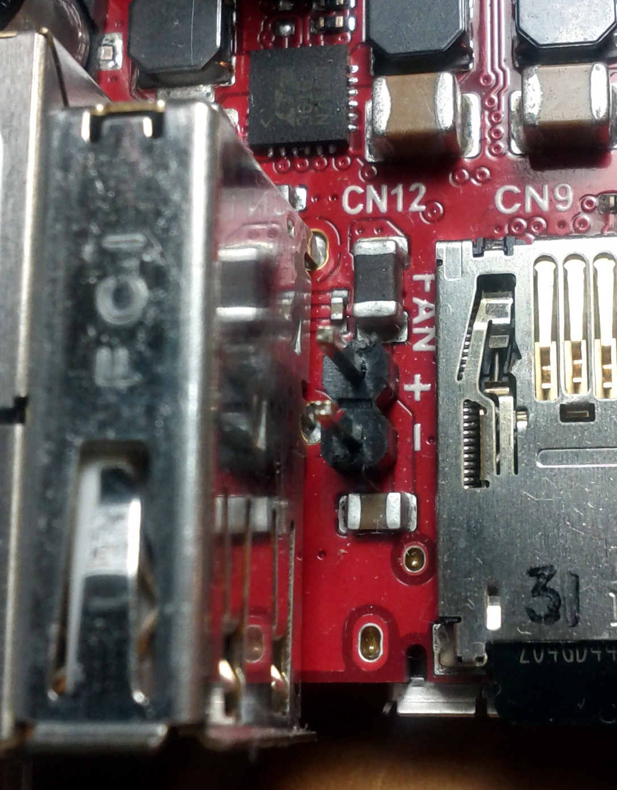
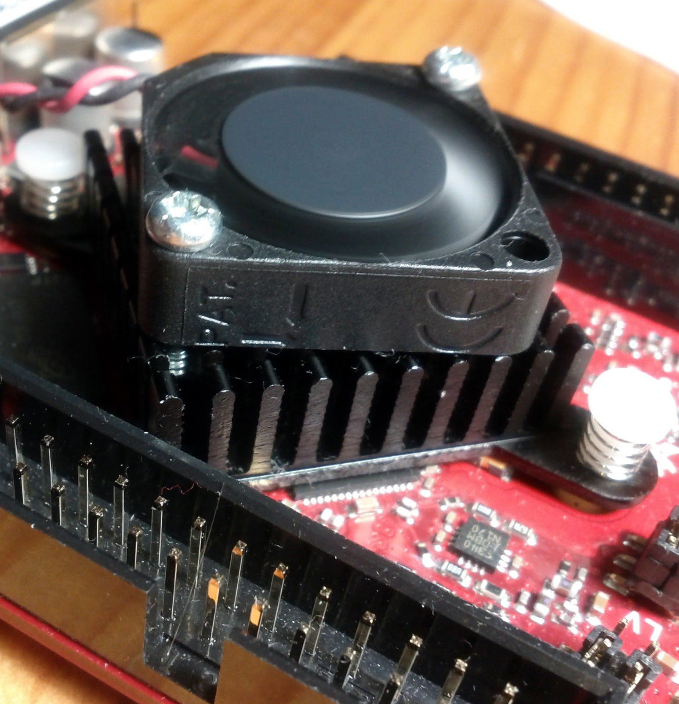
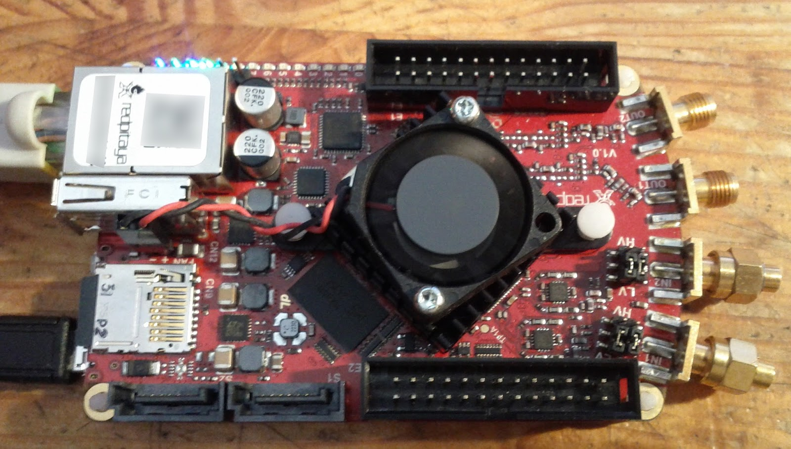
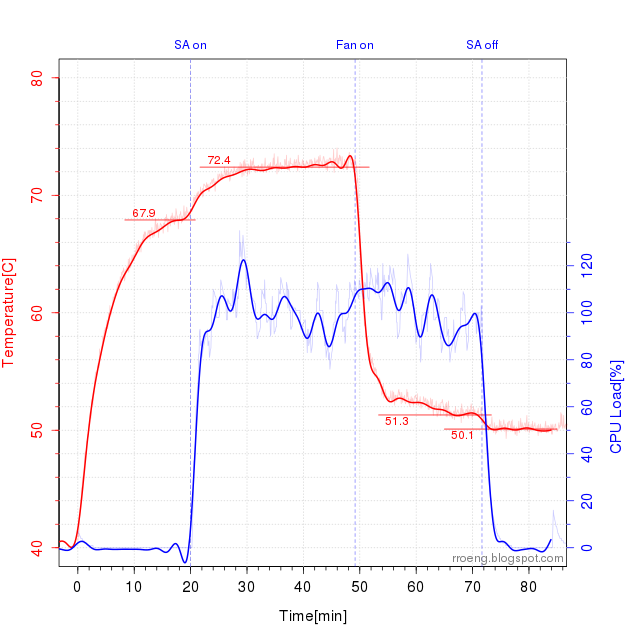
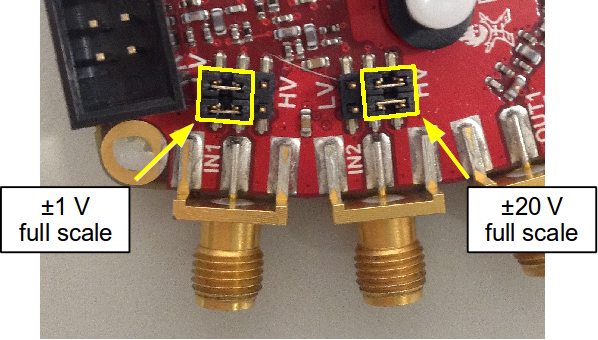
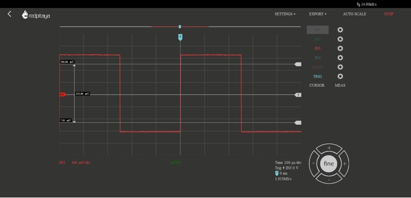

.. _hw_specs_orig_gen:

#################################################
原始一代通用硬件规格
#################################################

.. note::

    正在查找 :ref:`第二代硬件规格？ <hw_specs_gen2>`

本节包含适用于**所有** Red Pitaya 原始一代开发板的信息。

.. note::

    有关特定开发板的规格、测量值、电源要求、连接器引脚分配和详细技术数据，请参阅对应开发板的文档页面：

    * :ref:`STEMlab 125-14 <top_125_14>`
    * :ref:`STEMlab 125-14 Z7020-LN <top_125_14_Z7020_LN>`
    * :ref:`SDRlab 122-16 <top_122_16>`
    * :ref:`SDRlab 122-16 External Clock <top_122_16_EXT>`
    * :ref:`SIGNALlab 250-12 <top_250_12>`
    * :ref:`STEMlab 125-14 4-Input <top_125_14_4-IN>`
    * :ref:`STEMlab 125-14 External Clock (Discontinued) <top_125_14_EXT>`
    * :ref:`STEMlab 125-14 LN (Discontinued) <top_125_14_LN>`
    * :ref:`STEMlab 125-14 X-Channel System (Discontinued) <top_125_14_MULTI>`
    * :ref:`STEMlab 125-10 (Discontinued) <top_125_10>`

请注意，Red Pitaya 开发板的完整硬件原理图并不可用。虽然 Red Pitaya 拥有开源代码，但硬件原理图并非开源。不过，可以获取包含硬件配置、FPGA 引脚连接等信息的开发原理图。

.. note::

    Red Pitaya d.o.o. 提供的信息被认为是准确且可靠的。但是，对于使用这些信息不承担任何责任。请注意，内容可能在不另行通知的情况下发生变更。

.. contents:: **索引**
   :local:
   :backlinks: none

电源（因开发板型号而异）
======================================

原始一代开发板根据型号具有不同的电源要求：

* **STEMlab 125-14、SDRlab 122-16、STEMlab 125-14 variants**：5V、2A Micro USB 电源
* **SIGNALlab 250-12**：24V、0.5A 带插孔连接器的电源适配器（PoE 版本也可使用 PoE）

.. note::

    请务必注意，Red Pitaya 开发板**不得**使用功率低于上述规定值的电源，或使用电线过细的电源。这样做可能导致设备行为异常，包括重启和网络断开。同样，如果直接由 PC 上的 USB 端口供电（由于供电电流不足），或由无法提供足够电流的集线器供电，或者使用了故障电源线，Red Pitaya 开发板也可能发生故障。

    此外，使用未经批准的电源可能降低性能或造成产品损坏。

.. warning::

    电源注意事项：

    * STEMlab 125-14、STEMlab 125-14 Z7020、STEMlab 125-14 4-Input、SDRlab 122-16 和 STEMlab 125-10 只能使用隔离的外部 5 Volts DC 电源供电，最大电流为 2 A。推荐型号为 KA23-0502000DES。
    * SIGNALlab 250-12 只能使用原装 KA2401A 24 V/1 A 隔离电源供电，或通过 RJ45 Ethernet 连接器供电（仅限 PoE 版本）。
    * Red Pitaya 使用的任何其他外部电源都必须符合使用国家/地区适用的相关法规和标准。

SD 卡容量（所有原始一代开发板）
========================================

对于 Red Pitaya OS 2.00 及更高版本，我们建议使用至少 **16 GB** 的 SD 卡。对于 OS 1.04，建议使用至少 8 GB 的卡。对于更早的 OS 版本（0.9），使用 4 GB 的 SD 卡可能也足够。

所需硬件（所有原始一代开发板）
=============================================

要使开发板正常运行，需要以下物品。我们提供的每套 Red Pitaya 套件中都已包含这些物品，可在 |WEBstore| 上获取：

* 预装 Red Pitaya OS 的 Micro SD 卡（OS 2.00+ 推荐使用 16 GB Class 10）。
* Ethernet 电缆。
* 电源（规格因开发板型号而异，见上文）。

Red Pitaya 套件不包含、但另外需要的物品：

* 一台配有互联网浏览器的计算机（推荐 Google Chrome）。
* 启用 DHCP 服务器并可访问互联网的路由器。

.. |WEBstore| replace:: :rp-store:`WEB store <>`

.. _status_leds:

状态 LED 说明（所有原始一代开发板）
==================================================

.. list-table::
   :widths: 15 85
   :header-rows: 1

   * - 颜色
     - 功能
   * - Blue
     - FPGA bitstream 状态（正常运行时，此 LED 点亮，表示 FPGA bitstream 已成功加载）。
   * - Green
     - 电源状态（正常运行时，此 LED 点亮，表示 Red Pitaya 上的所有电源均正常工作）。
   * - Red
     - 表示 CPU 负载的心跳闪烁模式（正常运行时，此 LED 将持续闪烁）。
   * - Orange
     - SD 卡访问指示灯（正常运行时，此 LED 会以较慢的间隔不定期闪烁）。

工作温度与安全
==================================

工作温度范围
----------------------------

Red Pitaya 原始一代设备的工作温度范围为 0°C 至 +55°C，存储温度范围为 -20°C 至 +85°C。

* 应在正常条件下运行，不应被覆盖。
* 适用于室内使用，最大海拔 2000 m、污染等级 2、相对湿度低于 90%。
* 设计用于低电压电源和信号，不应直接连接到超过 30 Volts 的电压。

.. note::

    如果开发板使用随附的散热片，工作温度范围为 0°C 至 +55°C。将散热片更换为更大的散热片，或采用额外的冷却方案，将提高开发板的工作温度范围。

    使用自定义冷却方案时，请注意 Zynq 温度不得超过 +85°C。此外，Red Pitaya OS 具有软件温度保护功能，在开发板温度过高时会将其关闭。这是为了防止开发板过热和损坏。如果使用了自定义冷却方案，请检查软件温度保护是否阻止了正常运行。

加热与冷却
--------------------

Red Pitaya 开发板在运行期间达到 60°C 或更高温度并不罕见。

.. note::

    请注意，开发板的某些部件，尤其是散热片，在运行期间和运行后可能会变热。为避免受伤，请勿触摸这些部件。

.. note::

    必须安装散热片，并且开发板必须在没有任何阻碍气流障碍物的平面上运行。为减轻封闭外壳内环境温度升高和气压降低的影响，必须实施有效的通风方案。当内部温度达到 85°C 时，产品的运行功能会自动禁用，以防止可能造成的损坏。

增强冷却选项
^^^^^^^^^^^^^^^^^

如需增强冷却，我们建议使用以下一个或多个选项：

* :ref:`Original Aluminium case <alucase>` - 改善散热并保护开发板免受外部因素影响。
* :ref:`Original Heatsink interface <heatsink>` （仅限 STEMlab 125-14）- 改善散热并将开发板连接到外部散热片。
* 外部冷却风扇 - 增加开发板周围的气流。

可以使用 30 mm 或 25 mm 风扇。可以使用开发板的电源连接器为风扇供电，但请注意，该连接器提供的最大电压为 5 V。电源连接器位于 micro-SD 插槽和 host USB 连接器之间。

    Red Pitaya 电源连接器。图片来自 `blog <https://rroeng.blogspot.com/2014/03/keep-your-red-pitaya-cool.html>`_ （经 Jacek Radzikowski 许可）。

.. note::

    请注意，电源连接器是标准的 2-pin 0.1" 连接器，仅提供 5 V。

风扇组装示例
~~~~~~~~~~~~~~~~~~~~~

1. 将风扇的 0.05" 插头更换为标准的 2-pin 0.1" 连接器。

#. 将黑线连接到负极端子，将红线连接到正极端子。下图中可以看到标记。

#. 如下图所示，使用两颗螺钉将风扇固定到散热片上。

   安装了风扇的 Red Pitaya。

温度测量
~~~~~~~~~~~~~~~~~~~~~~~~~

   风扇关闭和开启时，在低 CPU 负载与高 CPU 负载下测得的温度。

图片来自 `blog <https://rroeng.blogspot.com/2014/03/keep-your-red-pitaya-cool.html>`_ （经 Jacek Radzikowski 许可）。

快速模拟输入和输出（所有原始一代开发板）
==========================================================

.. warning::

    通过 SMA 和 BNC 连接器提供的所有输入和输出共用连接到电源地的公共地。

.. warning::

    连接到 Red Pitaya 的电缆上的 SMA 连接器必须符合 MILC39012 标准。中心针必须具有合适的长度，否则安装在 Red Pitaya 上的 SMA 连接器会机械损坏该 SMA 连接器。Red Pitaya 上 SMA 连接器的中心针会失去与开发板的接触，并且由于机械损坏（焊盘从开发板上脱离），开发板将无法维修。

跳线设置
----------------

电压输入范围由每个输入 SMA 连接器后方的跳线设置。两个输入通道的增益都可以独立调节。

.. figure:: img/jumpers/Jumper_settings.png
    :align: center

    跳线设置示意图

    跳线位置：

    - **左侧设置（LV）** 调整为 ±1 V 满量程
    - **右侧设置（HV）** 调整为 ±20 V 满量程

.. warning::

    请注意，跳线设置仅限于上述位置。任何其他配置或使用不同类型的跳线都可能损坏产品并使保修失效。

跳线方向（重要）
--------------------------------

**跳线的位置和方向会显著影响测量精度。** 跳线内部连接到一块小金属片，该金属片起电容作用并影响整体电容，进而影响输入阻抗。

如果将跳线从错误位置移到正确位置，强烈建议进行**校准**，因为输入电容取决于跳线设置，并且可能因位置而异。

1. **跳线凸起的位置必须如图所示。** 由于跳线及其锁扣具有非对称性，我们建议将锁扣安装在外侧，以避免跳线难以拆卸的问题。

    .. figure:: img/jumpers/Jumper_position_Note.png
        :align: center

2. **安装后，跳线的位置应使金属部分不可见。** 请参考下图中的 STEMlab 125-14 4-Input 示例。

    .. figure:: img/jumpers/Jumper_position_4IN_0.png
        :align: center
        :width: 700 px

    .. figure:: img/jumpers/Jumper_position_4IN_1.png
        :align: center
        :width: 700 px

**跳线放置错误的影响：**

跳线放置错误可能导致采集方波信号的前沿出现过冲或欠冲，如下图所示。

.. figure:: img/jumpers/Jumper_position_wrong_signal.jpg
    :align: center
    :width: 800

    如果跳线设置不正确，阶跃响应将欠补偿。

正确放置跳线后，同一波形会明显改善：

    正确放置跳线可得到正常的阶跃响应。

扩展连接器（所有原始一代开发板）
================================================

所有原始一代开发板都配备使用相同物理格式的扩展连接器（E1 和 E2）：

**物理规格：**

* **连接器类型**：2 x 13 pins IDC，2.54 mm 间距
* **数字 I/O 电压电平**：3.3V LVCMOS33
* **电源轨**：+5V、+3.3V、-3.4V

**电流限制：**

* +5V 为 500 mA（由扩展模块和 USB 设备共享）
* +3.3V 为 500 mA（由扩展模块和 USB 设备共享）
* -3.4V 电源为 50 mA

**开发板特定差异：**

引脚分配、可用功能和 FPGA 连接因开发板型号而有显著差异：

* **STEMlab 125-14**：16 个数字 I/Os、4 个慢速 ADC、4 个慢速 DAC、SPI/UART/I2C/CAN
* **SDRlab 122-16**：22 个数字 I/Os、4 个慢速 ADC、4 个慢速 DAC、SPI/UART/I2C/CAN
* **SIGNALlab 250-12**：19 个数字 I/Os、4 个慢速 ADC、4 个慢速 DAC、SPI/UART/I2C/CAN/USB
* **STEMlab 125-14 4-Input**：22 个数字 I/Os、4 个慢速 ADC、4 个慢速 DAC、SPI/UART/I2C/CAN
* **STEMlab 125-14 Z7020**：与 STEMlab 125-14 类似，但 FPGA 引脚分配不同

有关完整的引脚分配图、FPGA 引脚编号和详细规格，请参阅对应开发板的文档页面。

可选功能
==================

.. _qspi_chip:

外部启动选项
-------------------------

Red Pitaya 原始开发板可以从板载 QSPI flash memory 芯片或外部 SD 卡启动。Red Pitaya 开发板默认未安装 QSPI flash memory 芯片，但如有需要，之后可以添加。QSPI flash memory 芯片用于启动开发板，也可用于存储操作系统和其他文件。

请注意，位于开发板顶层、散热片下方 TP1A 正右侧的 `QSPI chip <https://www.infineon.com/cms/en/product/memories/nor-flash/standard-spi-nor-flash/quad-spi-flash/s25fl128sagnfi001/>`_（:ref:`STEMlab 125-14 schematics <schematics_125_14>`）默认未安装在 Red Pitaya 开发板上。有关开发板修改的更多信息，请联系 support@redpitaya.com 或 info@redpitaya.com。

.. warning::

    任何非 Red Pitaya 硬件修改都会使保修失效，我们也无法保证为改装后的开发板提供支持。
