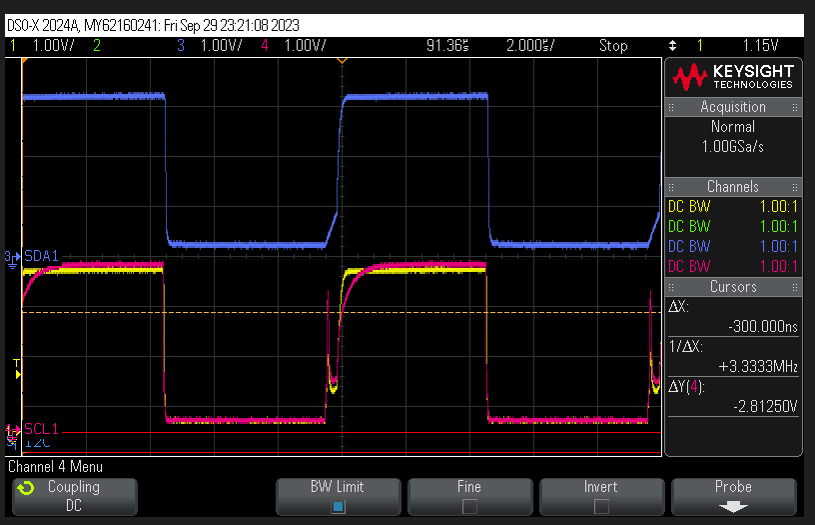
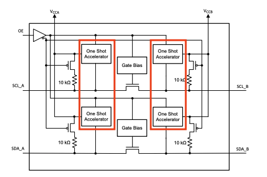

.. _known_hw_issues_orig_gen:

########################################
已知硬件问题（初代）
########################################

本页列出 Red Pitaya 初代平台的已知硬件问题。硬件问题需要修改板卡或采用变通方案，Gen 2 板卡已解决这些问题。

.. |TCA9406DCUR| replace:: `TCA9406DCUR <https://www.digikey.com/en/products/detail/texas-instruments/TCA9406DCUR/2510728>`__
.. |PCA9306| replace:: `PCA9306 <https://www.ti.com/lit/ds/symlink/pca9306.pdf>`__

受影响的板卡和型号
===========================

**涵盖的板卡：**

    * STEMlab 125-14（硬件版本最高 1.1）
    * SDRlab 122-16（硬件版本 1.0）
    * SIGNALlab 250-12（硬件版本最高 1.2b）
    * STEMlab 125-14 4-Input（硬件版本最高 1.3）
    * STEMlab 125-14 Z7020（硬件版本最高 1.1）

.. contents:: 问题类别
   :local:
   :depth: 1

当前问题
=============

这些硬件问题会影响初代板卡，需要进行硬件修改或采用变通方案。所有问题均已在 Gen 2 板卡中解决。

I2C 系统故障
-------------------

* **受影响硬件：** 所有初代板卡
* **受影响器件：** |TCA9406DCUR| I2C 电平转换器
* **严重性：** 重大
* **变通方案：** 需要硬件修改
* **状态：** 已在 Gen 2 中修复

**症状**

扩展连接器上的 I2C 通信可能间歇性失败或完全失败，尤其是在总线上连接多个带上升时间加速器的设备时。

**根本原因**

Red Pitaya 在 PS I2C 引脚与扩展连接器上的 I2C 引脚之间使用 |TCA9406DCUR| 电平转换器。|TCA9406DCUR| 内置上升时间加速器，这对电平转换器而言属于非标准功能。

总线物理设计（电容）与 I2C 总线上多个上升时间加速器之间的相互作用，会导致信号完整性问题。下面示波器截图中的粉色波形显示了两个上升时间加速器在总线上相互作用所导致的问题行为：

**变通方案**

对于初代板卡，将现有的 |TCA9406DCUR| I2C 电平转换器替换为不带上升时间加速器的替代器件。

.. warning::

    此修改需要高级焊接技能。当前所有可用的 I2C 电平转换器引脚排列都不同，因此需要谨慎进行 PCB 改造或设计转接板。

**Gen 2 解决方案**

Gen 2 板卡通过将 |TCA9406DCUR| 替换为不带单次加速器的 |PCA9306| 解决了此问题。

|

UART TX 启动阻止
------------------------

**受影响硬件：** 所有初代板卡
**受影响器件：** :ref:`E2 连接器 <E2_orig_gen>` 上的 UART TX 引脚
**严重性：** 严重
**变通方案：** 需要考虑硬件设计
**状态：** 已在 Gen 2 中修复

**症状**

如果外部设备在 Red Pitaya 启动序列之前或期间将 UART TX 引脚驱动为高电平（3.3V），系统可能无法正常启动，从而阻止用户登录。

**根本原因**

UART TX 引脚缺乏足够的驱动能力和隔离，无法应对外部设备在启动期间驱动该线路。Zynq PS 将外部信号解释为冲突，导致启动序列失败。

**Workaround**

为初代板卡设计定制扩展 Shield 时：

1. 在设备与 UART TX 引脚之间增加带开漏输出的外部缓冲器
2. 在缓冲器输出端加入 3.3V 上拉电阻
3. 确保外部设备在 Red Pitaya 启动期间不驱动 UART TX 引脚

**示例电路：**

- 使用带开漏/开集电极输出的缓冲器 IC（例如 74LVC07A）
- 将 4.7kΩ 上拉电阻从缓冲器输出端连接到 3.3V
- 将缓冲器输出端连接到 Red Pitaya UART TX 引脚

**Gen 2 解决方案**

Gen 2 板卡通过在 UART TX 引脚增加额外的输出缓冲器，提供适当的隔离和驱动能力，解决了此问题。

|

硬件设计说明
=====================

这些是不会影响整体功能、但偏离原始设计意图的设计特性。与上面的当前问题不同，这些特性同时存在于初代和 Gen 2 板卡上，不需要变通方案。

|

.. _slow_analog_voltage_note_orig_gen:

慢速模拟输入电压范围
--------------------------------

* **受影响硬件：** 所有 Red Pitaya 板卡（初代和 Gen 2）
* **受影响器件：** E2 连接器上的慢速模拟输入 AI0-AI3
* **状态：** 设计如此 — Gen 2 板卡同样存在

**背景**

在原始硬件设计期间，假定 Zynq 7010 XADC 的单极性输入范围为 **0-0.5 V**。Zynq XADC 实际的单极性输入范围为 **0-1 V**。因此，慢速模拟输入分压器被设计为将 0-3.5 V 外部信号降低到当时认为是 ADC 满量程的范围。

**后果**

使用 30.0 kΩ / 4.99 kΩ 电压分压器（比例 ≈ 0.143）以及 XADC 实际 1.0 V 满量程时：

.. math::

    range = \frac{1.0\ \text{V}}{0.143} = 7.00\ \text{V}

慢速模拟输入（AI0–AI3）的实际满量程输入范围为 **0-7.0 V**，而不是最初设计的 0-3.5 V。

.. note::

    双极性模式不受影响。设计时正确假定了 XADC 的 ±0.5 V 双极性输入范围，因此双极性工作可获得预期的 ±3.5 V 满量程输入范围。
