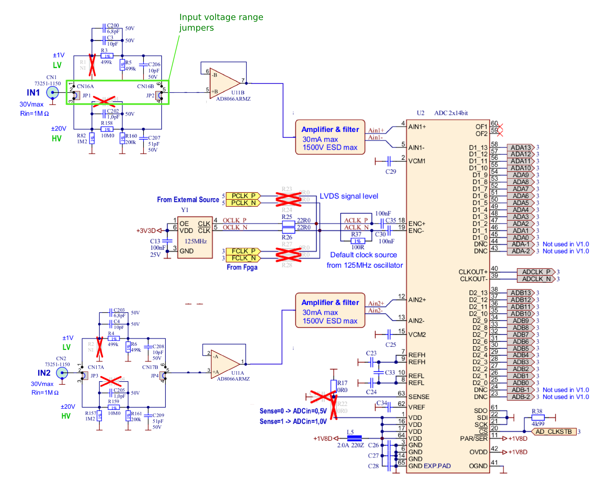
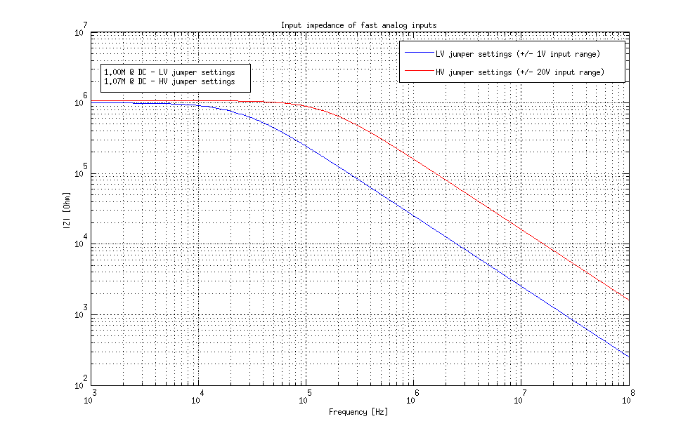
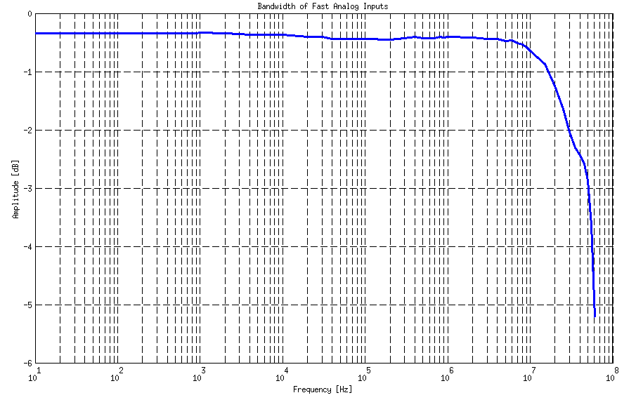
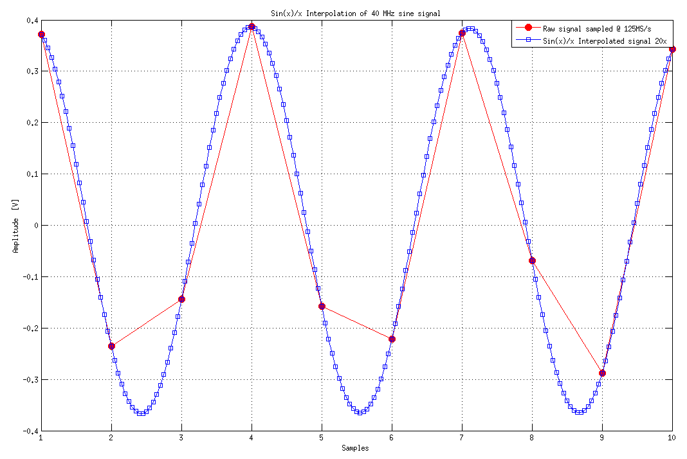
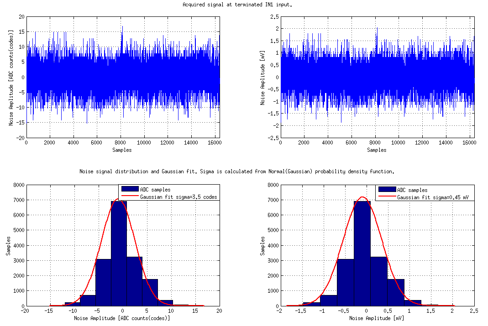
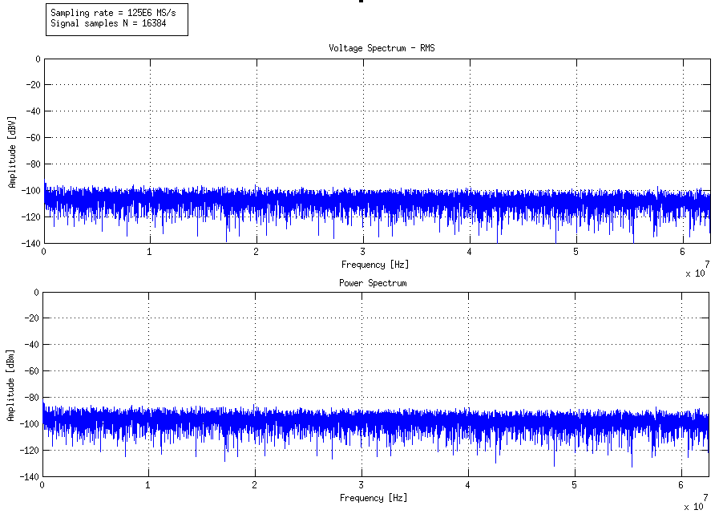
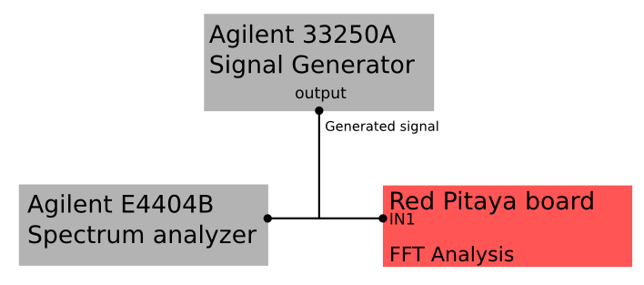

.. _measurements_orig_gen_inputs:

###########################
快速模拟输入
###########################

本页包含 Original Generation 快速模拟输入的详细规格和性能测量结果。

.. contents::
   :local:
   :depth: 2
   :backlinks: none

|

STEMlab 125-14 板卡模拟前端具有 2 个快速模拟输入。

通用规格
=======================

+---------------------------------+-----------------------------------------------+
| 通道数量                        | 2                                             |
+---------------------------------+-----------------------------------------------+
| 采样率                          | 125 Msps                                      |
+---------------------------------+-----------------------------------------------+
| ADC 分辨率                      | 14 bits                                       |
+---------------------------------+-----------------------------------------------+
| 输入耦合                        | DC                                            |
+---------------------------------+-----------------------------------------------+
| | **绝对最大输入电压额定值**    | | **LV: 6 V (1500 V ESD)**                    |
|                                 | | **HV: 30 V (1500 V ESD)**                   |
+---------------------------------+-----------------------------------------------+
| 过载保护                        | 保护二极管                                    |
|                                 | （在输入电压额定条件下）                      |
+---------------------------------+-----------------------------------------------+
| 连接器类型                      | SMA                                           |
+---------------------------------+-----------------------------------------------+
| 输入级电压范围 [#]_             | | LV (±1 V)                                   |
|                                 | | HV (±20 V)                                  |
+---------------------------------+-----------------------------------------------+
| 带宽                            | 50 MHz (-3 dB)                                |
+---------------------------------+-----------------------------------------------+

.. [#] 测量性能在此范围内规定。

    .. note::
    
       过载保护适用于低频信号。对于包含高于 1 kHz 频率分量、会使电容分压器起作用的输入信号，满量程值定义了最大允许输入电压。

    .. note::
    
        连接到 Red Pitaya 的线缆上的 SMA 连接器必须符合 MILC39012 标准。中心针长度必须合适，否则会对 Red Pitaya 上安装的 SMA 连接器造成机械损坏。
        Red Pitaya SMA 连接器的中心针将与板卡失去接触，并且因机械损坏（焊盘与板卡分离）而无法修复。

输入级原理图
------------------------

        
    快速模拟输入原理图

输入耦合
------------------

快速模拟输入采用 **DC 耦合**。输入阻抗如下图所示。

       
    快速模拟输入的输入阻抗

输入带宽
----------------

+---------------------------------+-----------------------------------------------+
| 带宽                            | 50 MHz (-3 dB)                                |
+---------------------------------+-----------------------------------------------+
    
下图显示了快速模拟输入的频率响应（带宽）。测量以 |Agilent 33250A| 信号发生器作为参考。使用 :ref:`远程控制命令 <command_list>` 采集被测信号，从采集的信号中提取电压幅值，并与参考信号幅值进行比较。
        

        
    快速模拟输入的带宽
        
由于最大采样率为 125 MS/s，在测量 10 MHz 以上的信号时，我们使用 sin(x)/x 插值来获得更准确的 Vpp 电压结果，从而更准确地测量模拟带宽。测量 10 MHz 以上的信号时，不使用插值，或直接使用示波器应用和 P2P 测量，也应获得相近的结果。
        
注意：不使用插值进行测量时，需要利用完整的 16k 缓冲区提取采集信号的最大值和最小值。
使用示波器的 P2P 测量时，需要取测量结果中显示的最大值。下图（右侧）给出了 40 MHz 信号的 sin(x)/x 插值示例。
        
.. note::
        
    图中仅显示了 16k 缓冲区中的 10 个采样点，用于表示 40 MHz 信号的几个周期。
        

        
    Sin(x)/x 插值
   

输入噪声
---------------

测量采用高增益（LV ±1 V）跳线设置，并尽量限制环境噪声；输入和输出均端接、输出信号禁用，PCB 通过 SMA 地端接地。
测量以全速率（125 MS/s）对 16k 个连续采样点进行。（典型全带宽 std(Vn) < 0.5 mV。）下图（右侧）所示噪声频谱通过对 N = 16384 个、以 Fs = 125E6 MS/s 采样的样本进行 FFT 分析计算得到。
    

        
    噪声分布
        

        
    噪声电平
        

输入串扰
-------------------------

分别在 LV 和 HV 模式下测量了输入通道 1 与通道 2 之间的串扰。

+------------------------------------+------------------+------------------+------------------+------------------+
|                                    | **不高于 30 MHz**                   | **高于 30 MHz**                     |
+------------------------------------+------------------+------------------+------------------+------------------+
| |br|                               | |br|             | |br|             | |br|             | |br|             |
| **IN1 \ IN2**                      | **LV**           | **HV**           | **LV**           | **HV**           |
+------------------------------------+------------------+------------------+------------------+------------------+
| **LV**                             | >55 dB           | >60 dB           | 40 dB            | 40 dB            |
+------------------------------------+------------------+------------------+------------------+------------------+
| **HV**                             | >40 dB           | >50 dB           | 35 dB            | 35 dB            |
+------------------------------------+------------------+------------------+------------------+------------------+
| |br|                               | |br|             | |br|             | |br|             | |br|             |
| **IN2 \ IN1**                      | **LV**           | **HV**           | **LV**           | **HV**           |
+------------------------------------+------------------+------------------+------------------+------------------+
| **LV**                             | >55 dB           | 50 dB            | 40 dB            | 40 dB            |
+------------------------------------+------------------+------------------+------------------+------------------+
| **HV**                             | >55 dB           | >50 dB           | >40 dB           | >35 dB           |
+------------------------------------+------------------+------------------+------------------+------------------+

典型性能：

    * 65 dB @ 10 kHz
    * 50 dB @ 100 kHz
    * 55 dB @ 1 M
    * 55 dB @ 10 MHz
    * 52 dB @ 20 MHz
    * 48 dB @ 30 MHz
    * 44 dB @ 40 MHz
    * 40 dB @ 50 MHz

典型性能特性是在两个通道均采用 LV 跳线设置时测得的。未参与测量的 SMA 连接器均已端接。
    

输入谐波
----------------

+------------------------------------+------------------------------------+
| 幅度                               | 谐波                               |
+====================================+====================================+
| -3 dBFS                            | -45 dBc                            |
+------------------------------------+------------------------------------+
| -20 dBFS                           | -60 dBc                            |
+------------------------------------+------------------------------------+ 
       
典型测量采用 LV 跳线设置，输入匹配、输出端接、输出信号禁用，PCB 通过 SMA 地端接地。

输入 SFDR
-------------------------------

+---------------------------------+-----------------------------------------------+
| 输入 SFDR                       | < -90 dBFS                                    |
+---------------------------------+-----------------------------------------------+
    
测量采用 LV 跳线设置，输入和输出均端接、输出信号禁用，PCB 通过 SMA 地端接地。
下图显示了 Red Pitaya 快速模拟输入的典型性能。参考信号由 |Agilent 33250A| 信号发生器生成。
生成信号的参考频谱使用 |Agilent E4404B| 频谱分析仪测量；同时使用 **Red Pitaya 板卡采集同一信号并执行 FFT 分析**。
结果如下图所示，其中右侧为 Red Pitaya 的测量结果。

            
    测量配置
    

参考信号
------------------

    #. 参考信号：-20 dBm，2 MHz

        .. figure:: img/RF_inputs/-20dBm_2MHz_RP_AG.png
            :width: 1200
    
    #. 参考信号：-20 dBm，10 MHz
       
        .. figure::   img/RF_inputs/-20dBm_10MHz_RP_AG.png
            :width: 1200
            
    #. 参考信号：-20 dBm，30 MHz
      
        .. figure:: img/RF_inputs/-20dBm_30MHz_RP_AG.png
            :width: 1200
            
    #. 参考信号：0 dBm，2 MHz
  
        .. figure:: img/RF_inputs/0dBm_2MHz_RP_AG.png
            :width: 1200
            
    #. 参考信号：0 dBm，10 MHz
  
        .. figure:: img/RF_inputs/0dBm_10MHz_RP_AG.png
            :width: 1200
            
    #. 参考信号：0 dBm，30 MHz
  
        .. figure:: img/RF_inputs/0dBm_30MHz_RP_AG.png
            :width: 1200
            
    #. 参考信号：-3 dBFS，2 MHz
  
        .. figure:: img/RF_inputs/-3dBFS_2MHZ_RP_AG.png
            :width: 1200
            
    #. 参考信号：-3 dBFS，10 MHz
  
        .. figure:: img/RF_inputs/-3dBFS_10MHZ_RP_AG.png
            :width: 1200
            
    #. 参考信号：-3 dBFS，30 MHz
  
        .. figure:: img/RF_inputs/-3dBFS_30MHZ_RP_AG.png
            :width: 1200
            
由于模拟输入和输出的电气特性存在自然离散性，不同 Red Pitaya 板卡的偏移和增益会略有差异，并且可能随时间变化。校准系数存储在 Red Pitaya 的 EEPROM 中，可通过校准实用程序访问和修改：
    

输入 DC 偏移误差
----------------------

.. list-table::

   * - DC 偏移误差
     - < 5% FS
 

输入增益误差
-----------------

.. list-table::
   :header-rows: 1

   * - 跳线设置
     - 增益误差
   * - LV
     - <3%
   * - HV
     - <10%
    
可通过更精确的增益和 DC 偏移 :ref:`校准 <calib>` 进行进一步修正。
        
        
.. |Agilent 33250A| raw:: html

    <a href="http://www.keysight.com/en/pd-1000000803%3Aepsg%3Apro-pn-33250A/function-arbitrary-waveform-generator-80-mhz?cc=US&lc=eng" target="_blank">Agilent 33250A</a>
        
.. |Agilent E4404B| raw:: html

    <a href="https://www.keysight.com/us/en/product/E4404B/esae-spectrum-analyzer-9-khz-to-67-ghz.html" target="_blank">Agilent E4404B</a>

.. _calib:

模拟输入校准
============================

可使用 :ref:`校准应用 <calibration_app>` 或 **calib** :ref:`命令行实用程序 <com_line_tools>` 执行校准。
要使用 :ref:`校准应用 <calibration_app>` 校准 Red Pitaya，只需选择 *System -> Calibration* 并按照说明操作。

**使用 calib 实用程序校准**
    
启动 Red Pitaya，并通过 :ref:`SSH <ssh>` 连接。

.. code-block:: shell-session
   
    root@rp-xxxxxx:~# calib
    calib version 2.00-0-f6ded7198
    
    Usage: calib [OPTION]...
    
    OPTIONS:
     -r    Read calibration values from eeprom (to stdout).
           The -n flag has no effect. The system automatically determines the type of stored data.
    
     -w    Write calibration values to eeprom (from stdin).
           Possible combination of flags: -wn, -wf, -wfn, -wmn, -wfmn
    
     -f    Use factory address space.
     -d    Reset calibration values in eeprom from factory zone. WARNING: Saves automatic to a new format
    
     -i    Reset calibration values in eeprom by default
           Possible combination of flags: -in , -inf.
    
     -o    Converts the calibration from the user zone to the old calibration format. For ecosystem version 0.98
    
     -v    Produce verbose output.
     -h    Print this info.
     -x    Print in hex.
     -u    Print stored calibration in unified format.
    
     -m    Modify specific parameter in universal calibration
     -n    Flag for working with the new calibration storage format.

EEPROM 是非易失性存储器，因此校准系数不会因 Red Pitaya 重新上电、通过 Bazaar 升级软件或手动更改 SD 卡内容而改变。
下面是从 EEPROM 读取校准参数并输出详细信息的示例：

.. code-block:: shell-session

    root@rp-xxxxxx:~# calib -r -v
    dataStructureId = 5
    wpCheck = 53
    count = 28
    DAC Ch1 Gain (1) = 2674690              # OUT1 gain coefficient
    DAC Ch1 Offset (2) = -69                # OUT1 DC offset 
    DAC Ch2 Gain (3) = 2692407              # OUT2 gain coefficient
    DAC Ch2 Offset (4) = -94                # OUT2 DC offset
    ADC Ch1 Gain 1/1 (9) = 2817122          # IN1 gain coefficient for LV (±1V range)  jumper configuration
    ADC Ch1 Offset 1/1 (10) = -159          # IN1 DC offset for LV (±1V range)  jumper configuration
    ADC Ch2 Gain 1/1 (11) = 2811646         # IN2 gain coefficient for LV (±1V range)  jumper configuration
    ADC Ch2 Offset 1/1 (12) = -126          # IN2 DC offset for LV (±1V range)  jumper configuration
    ADC Ch1 Gain 1/20 (17) = 3113286        # IN1 gain coefficient for HV (±20V range) jumper configuration
    ADC Ch1 Offset 1/20 (18) = -186         # IN1 DC offset for HV (±20V range) jumper configuration
    ADC Ch2 Gain 1/20 (19) = 3115407        # IN2 gain coefficient for HV (±20V range) jumper configuration
    ADC Ch2 Offset 1/20 (20) = -148         # IN2 DC offset for HV (±20V range) jumper configuration
    ADC Ch1 AA 1/1 (33) = 32147             # IN1 FPGA filter coefficient AA for LV
    ADC Ch1 BB 1/1 (34) = 276423            # IN1 FPGA filter coefficient BB for LV
    ADC Ch1 PP 1/1 (35) = 9830              # IN1 FPGA filter coefficient PP for LV
    ADC Ch1 KK 1/1 (36) = 14260634          # IN1 FPGA filter coefficient KK for LV
    ADC Ch2 AA 1/1 (37) = 32147             # IN2 FPGA filter coefficient AA for LV
    ADC Ch2 BB 1/1 (38) = 276423            # IN2 FPGA filter coefficient BB for LV
    ADC Ch2 PP 1/1 (39) = 9830              # IN2 FPGA filter coefficient PP for LV
    ADC Ch2 KK 1/1 (40) = 14260634          # IN2 FPGA filter coefficient KK for LV
    ADC Ch1 AA 1/20 (49) = 16901            # IN1 FPGA filter coefficient AA for HV
    ADC Ch1 BB 1/20 (50) = 193419           # IN1 FPGA filter coefficient BB for HV
    ADC Ch1 PP 1/20 (51) = 9830             # IN1 FPGA filter coefficient PP for HV
    ADC Ch1 KK 1/20 (52) = 14260634         # IN1 FPGA filter coefficient KK for HV
    ADC Ch2 AA 1/20 (53) = 16901            # IN2 FPGA filter coefficient AA for HV
    ADC Ch2 BB 1/20 (54) = 193419           # IN2 FPGA filter coefficient BB for HV
    ADC Ch2 PP 1/20 (55) = 9830             # IN2 FPGA filter coefficient PP for HV
    ADC Ch2 KK 1/20 (56) = 14260634         # IN2 FPGA filter coefficient KK for HV

下面是从 EEPROM 读取相同校准参数但不输出详细信息的示例，适合在脚本中编辑：

.. code-block:: shell-session

    root@rp-xxxxxx:~# calib -r
                        1             2674690                   2                 -69                   3             2692407
                        4                 -94                   9             2817122                  10                -159
                       11             2811646                  12                -126                  17             3113286
                       18                -186                  19             3115407                  20                -148
                       33               32147                  34              276423                  35                9830
                       36            14260634                  37               32147                  38              276423
                       39                9830                  40            14260634                  49               16901
                       50              193419                  51                9830                  52            14260634
                       53               16901                  54              193419                  55                9830
                       56            14260634

可以使用 ``calib -w`` 命令写入修改后的校准参数：

1. 在命令行（终端）中输入 ``calib -w``。
#. 按 Enter 键。
#. 粘贴或输入新的校准参数。
#. 按 Enter 键。

.. code-block:: shell-session
   
    root@rp-xxxxxx:~# calib -wn
                        1             2674690                   2                 -69                   3             2692407
                        4                 -94                   9             2817122                  10                -159
                       11             2811646                  12                -126                  17             3113286
                       18                -186                  19             3115407                  20                -148
                       33               32147                  34              276423                  35                9830
                       36            14260634                  37               32147                  38              276423
                       39                9830                  40            14260634                  49               16901
                       50              193419                  51                9830                  52            14260634
                       53               16901                  54              193419                  55                9830

如果校准向量进入非预期状态，随时可以使用以下命令将其恢复为出厂默认值：

.. code-block:: shell-session
   
   redpitaya> calib -d

将输入接地后，采集所得信号的平均值即为 DC 偏移校准参数。

可使用 :ref:`校准工具 <calib_util>` 更改校准参数。也可以使用参考电压源和示波器应用计算增益参数。
启动示波器应用，将参考电压连接到所需输入并进行测量。
按照上述方法更改增益校准参数，重新加载示波器应用，然后使用新的校准参数再次测量。
重复校准和测量步骤可优化增益参数。

下表列出了校准后的典型结果。

.. list-table::
   :header-rows: 1

   * - 参数
     - 跳线设置
     - 数值
   * - DC 增益精度 @ 122 kS/s
     - LV
     - 0.2%
   * - DC 偏移 @ 122 kS/s
     - LV
     - ±0.5 mV
   * - DC 增益精度 @ 122 kS/s
     - HV
     - 0.5%
   * - DC 偏移 @ 122 kS/s
     - HV
     - ±5 mV

可从频率响应（带宽）中得出 AC 增益精度。

