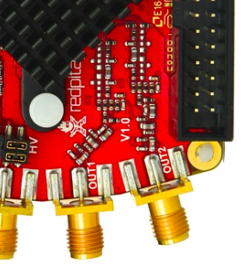
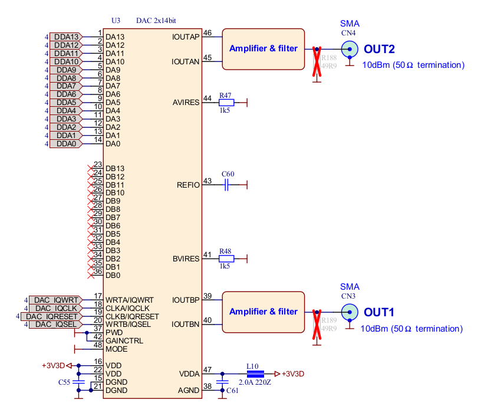
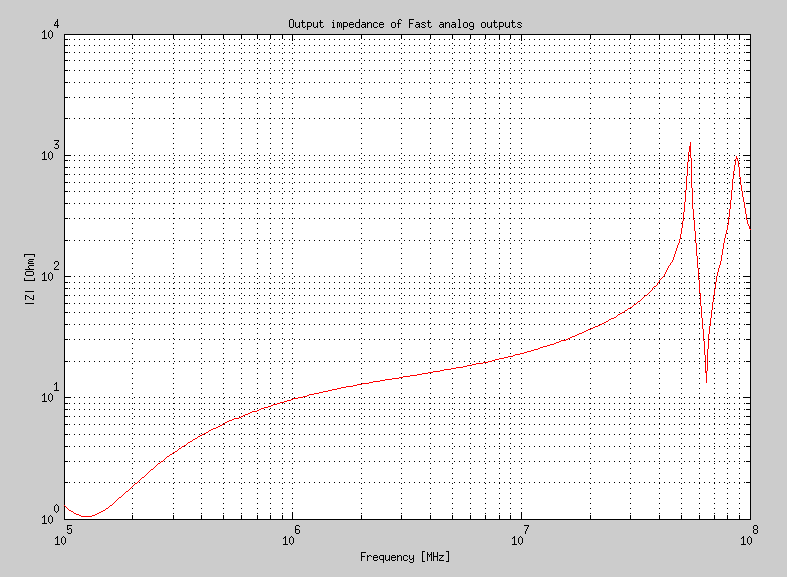
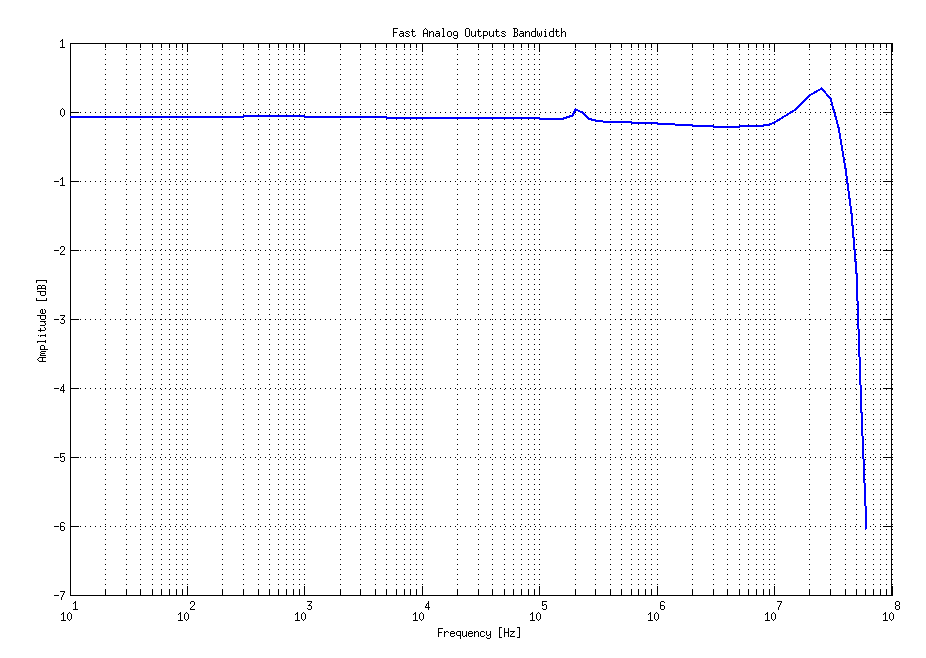

.. _measurements_orig_gen_outputs:

###########################
快速模拟输出
###########################

本页包含初代产品快速模拟输出的详细规格和性能测量结果。

.. contents::
   :local:
   :depth: 2
   :backlinks: none

|

Red Pitaya 开发板模拟前端配有两个快速模拟输出。

规格
========================

+---------------------------------+-----------------------------------------------+
| 通道数                          | 2                                             |
+---------------------------------+-----------------------------------------------+
| 采样率                          | 125 Msps                                      |
+---------------------------------+-----------------------------------------------+
| DAC 分辨率                      | 14 bits                                       |
+---------------------------------+-----------------------------------------------+
| 输出耦合                        | DC                                            |
+---------------------------------+-----------------------------------------------+
| 负载阻抗                        | 50 Ω                                          |
+---------------------------------+-----------------------------------------------+
| 满量程功率                      | > 9 dBm                                       |
+---------------------------------+-----------------------------------------------+
| 连接器类型                      | SMA                                           |
+---------------------------------+-----------------------------------------------+
| 输出压摆率限制                  | 200 V/us                                      |
+---------------------------------+-----------------------------------------------+
| 带宽                            | 50 MHz (3 dB)                                 |
+---------------------------------+-----------------------------------------------+

.. note::

    输出通道专为驱动 50 Ω 负载而设计。通道不使用时，请对输出进行端接。在高阻抗负载应用中，应连接一个 50 Ω 并联负载（SMA T 型接头）。

.. note::

    使用 1 MHz 正弦波时的典型功率电平为 9.5 dBm。输出功率受压摆率限制。
    
.. note::

    连接 Red Pitaya 的电缆所用 SMA 连接器必须符合 MILC39012 标准。中心针长度必须合适，否则会对安装在 Red Pitaya 上的 SMA 连接器造成机械损坏。
    Red Pitaya 上 SMA 连接器的中心针会与开发板失去接触；此类机械损坏（焊盘与开发板分离）将导致开发板无法维修。
    

       
    输出通道电压范围：±1 V
        
输出级如下图所示。
    

       
    输出通道原理图
           

输出阻抗
-------------------

输出通道（输出放大器和滤波器）的阻抗如下图所示。
    

    
    输出阻抗

输出带宽
-----------------

+---------------------------------+-----------------------------------------------+
| 带宽                            | 50 MHz (-3 dB)                                |
+---------------------------------+-----------------------------------------------+

带宽测量结果如下图所示。使用 |Agilent MSO7104B| 示波器，在被测信号的每个频率步进点（10 Hz - 60 MHz）进行测量。
Red Pitaya 开发板的 OUT1 采用 0 dBm 输出功率。第二个输出通道和两个输入通道均使用 50 Ohm 端接。使用示波器地端将 Red Pitaya 开发板接地。示波器输入必须设置为 50 Ohm 输入阻抗。

请注意，输出相位噪声略微依赖于频率。

输出谐波
------------------

输出谐波的典型性能如下表所示。

+------------------------------------+------------------------------------+
| 输出信号频率 (8 dBm)               | 谐波                               |
+====================================+====================================+
| 1 MHz                              | -51 dBc                            |
+------------------------------------+------------------------------------+
| 10 MHz                             | -49 dBc                            |
+------------------------------------+------------------------------------+
| 20 MHz                             | -48 dBc                            |
+------------------------------------+------------------------------------+
| 45 MHz                             | -53 dBc                            |
+------------------------------------+------------------------------------+

输出 DC 偏移误差
------------------------

+---------------------------------+-----------------------------------------------+
| DC 偏移误差                     | < 5% FS                                       |
+---------------------------------+-----------------------------------------------+

输出增益误差
------------------

+---------------------------------+-----------------------------------------------+
| 输出增益误差                    | < 5%                                          |
+---------------------------------+-----------------------------------------------+
    
可以通过更精确的增益和 DC 偏移校准进一步修正。

.. |Agilent MSO7104B| raw:: html

    <a href="http://www.keysight.com/en/pdx-x201799-pn-MSO7104B/mixed-signal-oscilloscope-1-ghz-4-analog-plus-16-digital-channels?pm=spc&nid=-32535.1150174&cc=SI&lc=eng" target="_blank">Agilent MSO7104B</a>

模拟输出校准
==========================

校准在噪声受控环境中进行。输入和输出增益分别使用精度为 0.02% 和 0.003% 的 DC 参考电压标准进行校准。输入增益校准在中等时基范围内进行。Red Pitaya 是非屏蔽设备，其输入/输出地不像大多数传统示波器那样连接到保护地。要达到下述校准结果，必须将 Red Pitaya 接地并屏蔽。

.. 表格：校准后的典型规格

================= ==========
参数              数值
================= ==========
DC 增益精度        0.4%
DC 偏移            ±4 mV
纹波（@ 0.5V DC）  0.4 mVpp
================= ==========

    校准后的典型规格
