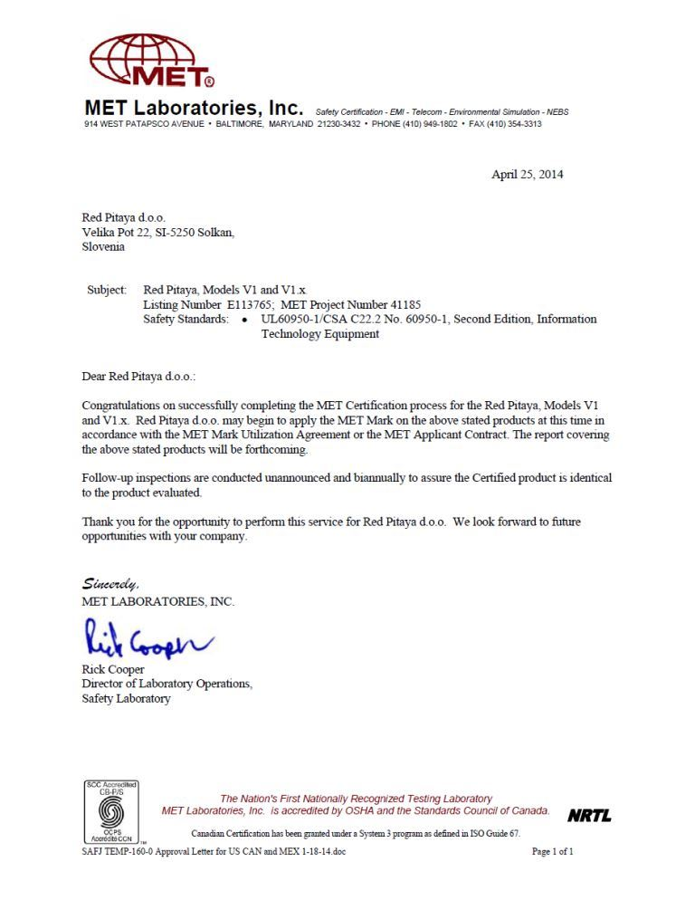
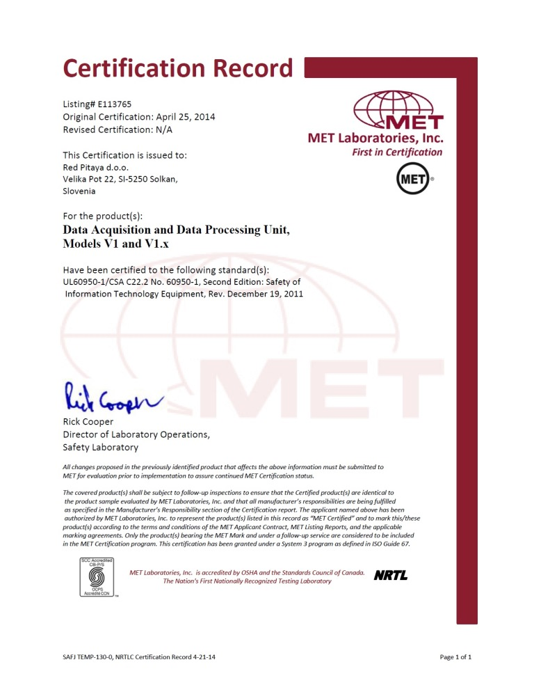

.. _certificates:

##############
认证证书
##############

Red Pitaya 已通过外部 `测试与认证机构 <https://www.siq.si/en/>`_ 的安全、电磁兼容性 (EMC) 和功能测试。

CE、FCC——符合性声明
====================================

* :rp-download:`Red Pitaya FCC 符合性声明 <doc/Certificates/CE-Declaration_of_conformity_2023.pdf>`

CB 测试证书——EMC
===========================

* :download:`Red Pitaya CB 测试证书——EMC <certificates/CB_certificate_EMC_SI-4169.pdf>`

此证书符合以下标准：

* IEC CISPR22:2008 第六版。
* IEC CISPR 24:2010（第二版）。

CB 测试证书——安全
==============================

* :download:`Red Pitaya CB 测试证书——安全 <certificates/CB_certificate_safety_SI-4208.pdf>`

此证书符合以下标准：

* IEC 60950-1:2005（第二版）+ A1:2009 + A2:2013。

ROHS、REACH 和冲突矿产政策
========================================

* :download:`Red Pitaya REACH <certificates/REACH_20261805.pdf>`
* :download:`Red Pitaya PFAS 声明 <certificates/PFAS_20260114.pdf>`

.. * :download:`Red Pitaya ROHS、REACH 和冲突矿产政策 <certificates/Cicor_Arad_ROHS_REACH_Conflict_Minerals.pdf>`

此证书符合以下标准：

* ROHS 2011/65.
* EU 2015/863.
* REACH 1907/2006.
* 《多德-弗兰克华尔街改革法案》第 1502 条（冲突矿产）。

有关 Red Pitaya ROHS、REACH 和冲突矿产政策的更多信息，请联系 support@redpitaya.com。

PCB 材料和阻燃等级
=====================================

* PCB 材料：FR4 (S1000H/S1000HB)
* 阻燃等级：UL94V-0

这些材料在 C-48/23/50 和 E-24/125 条件下进行测试。

此信息仅供参考。有关 PCB 材料和阻燃等级的更多详情，请联系 support@redpitaya.com。

MET 批准函
=====================

NRTLC 认证记录
===========================

易失性声明函 (LoV)
=============================

如需获取我们任何产品的易失性声明函，请联系 support@redpitaya.com。

|

其他信息
==========================

有关认证的更多信息，请联系 support@redpitaya.com。
