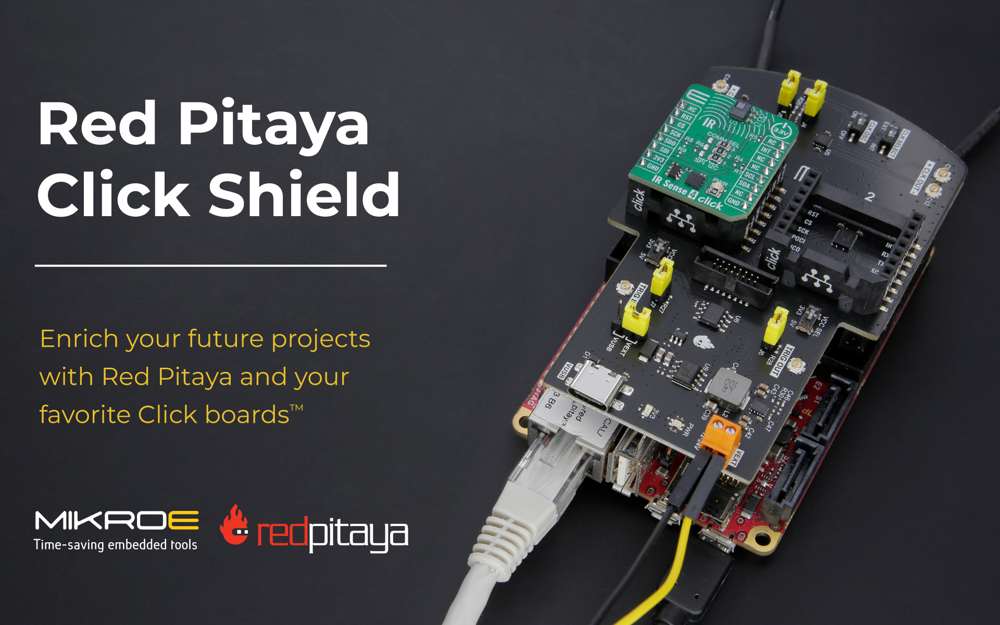
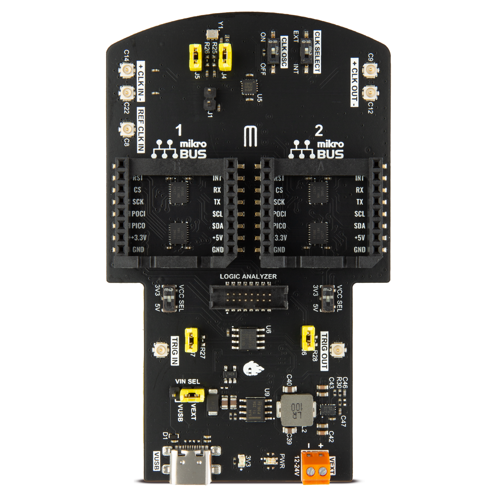
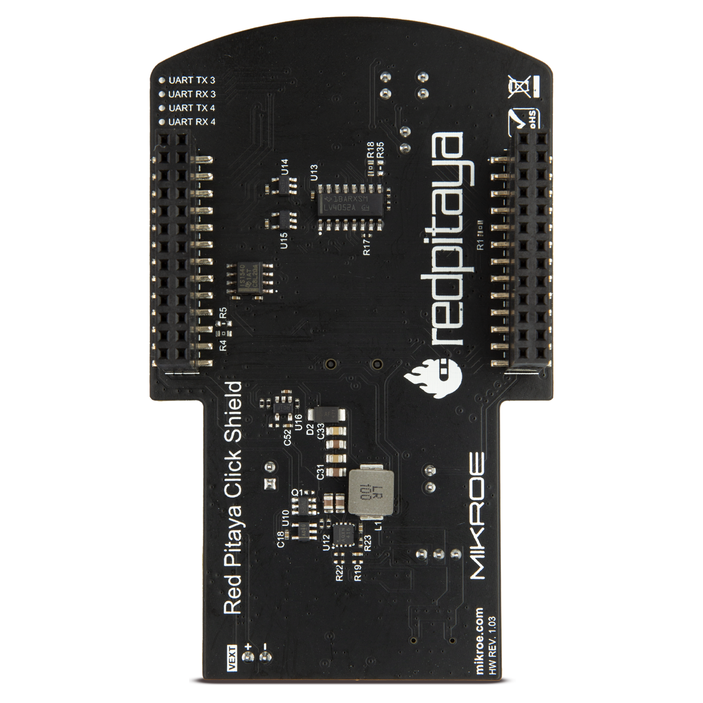
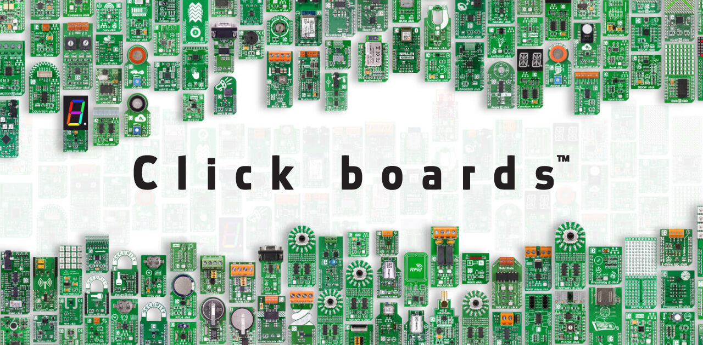
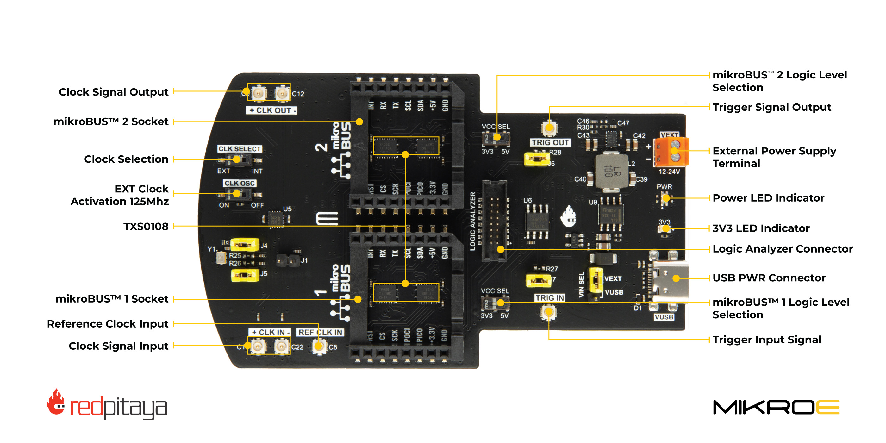
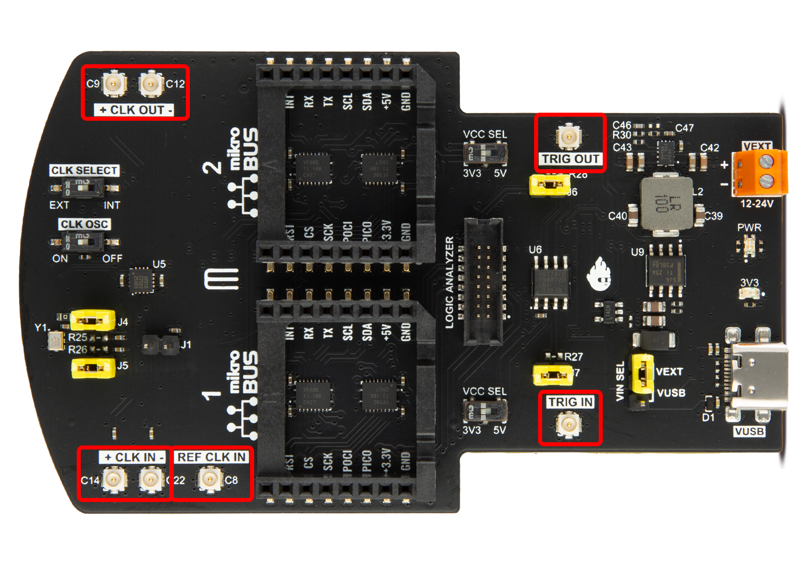
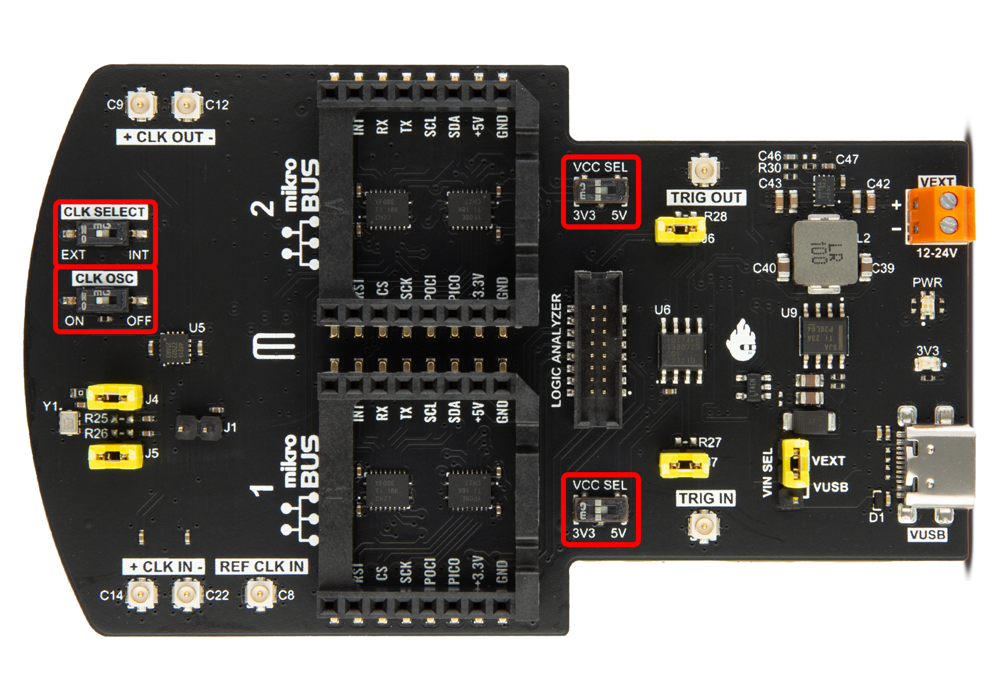
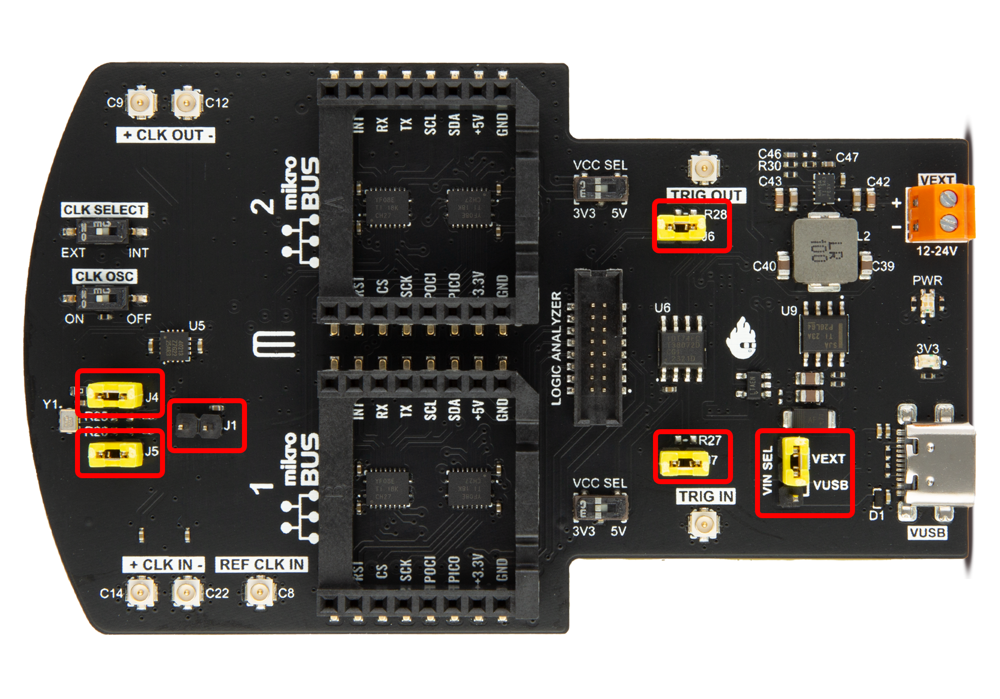
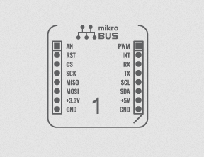
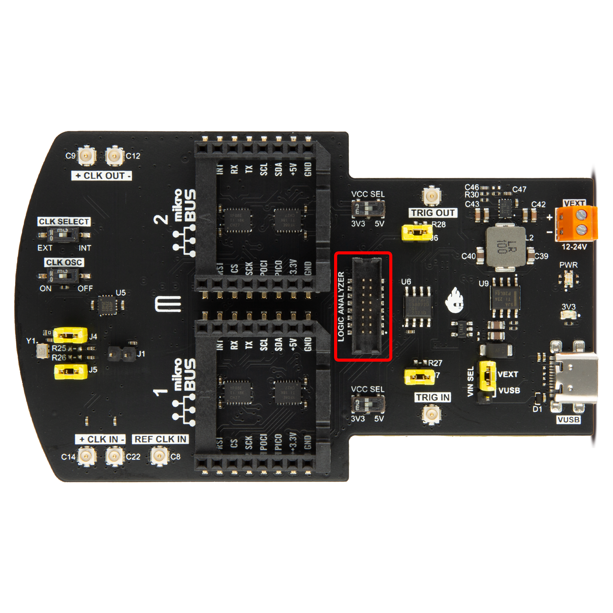

.. _click_shield:

##############
Click Shield
##############

Red Pitaya Click Shield 扩展模块允许用户通过两个 |Click Boards| 扩展 Red Pitaya 硬件，并使用外部 USB C 电源适配器或 12-24 Volt 外部电源为 Click Board 和 Red Pitaya 供电。使用 U.FL 跳线时，该扩展板还可用于多个 Red Pitaya 单元和/或其他设备之间的高性能时钟与触发同步。也可以通过 U.FL 连接器向扩展板接入外部参考时钟。

**主要特点：**

* 两个 |mikroBUS| 插座，可连接超过 1500 种 |Click Boards| 设备。
* 多个 Red Pitaya 单元或其他设备之间的高性能时钟与触发同步。
* 通过外部电源（12-24 V 或 USB-C 连接器）为 Red Pitaya 供电。

|click_shield_front| |click_shield_back|

|

.. contents:: 目录
   :local:
   :depth: 2
   :backlinks: top

|

1. 包装盒中有什么？
=======================

* 1 个 Red Pitaya Click Shield。
* 3 条用于触发和时钟同步的 U.FL 转 U.FL 跳线。

.. _click_shield_compatibility:

2. 兼容性
=================

.. note::

    根据所使用的 Red Pitaya 板卡型号，Red Pitaya Click Shield 的部分功能可能不适用。

时钟同步仅兼容以下板卡型号：

* :ref:`STEMlab 125-14 PRO Gen 2 <top_125_14_pro_gen2>`.
* :ref:`STEMlab 125-14 PRO Z7020 Gen 2 <top_125_14_pro_z7020_gen2>`.
* :ref:`STEMlab 125-14 External Clock <top_125_14_EXT>` [#f1]_.
* :ref:`SDRlab 122-16 External Clock <top_122_16_EXT>`.
* :ref:`STEMlab 125-14 4-Input <top_125_14_4-IN>`.

外部时钟与内部时钟之间的切换仅适用于 STEMlab 125-14 4-Input（CLK SEL 引脚），但未来重新设计的 Red Pitaya 板卡都将兼容该功能。

触发同步和 |Click Boards| 兼容所有板卡型号。

对于 STEMlab 125-10（Original Gen），Click Board 和触发同步功能适用，扩展板供电也适用；但该型号不支持外部时钟同步。请勿将 Click Shield 的外部时钟输入/输出能力理解为 125-10 的外部时钟同步支持。

兼容性表如下：

.. table::
    :widths: 10 18 18

    +------------------------------------+--------------------------------------+--------------------------------------+
    | Click Shield Feature Compatibility Gen 2                                                                         |
    +====================================+======================================+======================================+
    |                                    | **STEMlab 125-14 Gen 2**             | | **STEMlab 125-14 Pro Gen 2**       |
    |                                    |                                      | | **STEMlab 125-14 Pro Z7020 Gen 2** |
    |                                    |                                      | | **STEMlab 125-14 TI**              |
    |                                    |                                      | | **STEMlab 65-16 TI**               |
    +------------------------------------+--------------------------------------+--------------------------------------+
    | Click Boards (microBus)            | Yes                                  | Yes                                  |
    +------------------------------------+--------------------------------------+--------------------------------------+
    | High speed Clock Synchronisation   | No                                   | Yes                                  |
    +------------------------------------+--------------------------------------+--------------------------------------+
    | Powering options                   | No [#f2]_                            | No [#f2]_                            |
    +------------------------------------+--------------------------------------+--------------------------------------+
    | Clk Switch (Internal/External)     | No                                   | Yes                                  |
    +------------------------------------+--------------------------------------+--------------------------------------+

.. table::
    :widths: 10 18 18 18 18

    +------------------------------------+--------------------------------+--------------------------------+------------------------------+------------------------------+
    | Click Shield Feature Compatibility Original Gen                                                                                                                    |
    +====================================+================================+================================+==============================+==============================+
    |                                    | | **STEMlab 125-14**           | | **STEMlab 125-14 ext. clk**  | **STEMlab 125-14 4-Input**   | **SIGNALlab 250-12**         |
    |                                    | | **STEMlab 125-14 LN**        | | **SDRlab 122-16 ext. clk**   |                              |                              |
    |                                    | | **STEMlab 125-14-Z7020-LN**  | |                              |                              |                              |
    |                                    | | **SDRlab 122-16**            | |                              |                              |                              |
    |                                    | |                              | |                              |                              |                              |
    +------------------------------------+--------------------------------+--------------------------------+------------------------------+------------------------------+
    | Click Boards (microBus)            | Yes                            | Yes                            | Yes                          | Yes                          |
    +------------------------------------+--------------------------------+--------------------------------+------------------------------+------------------------------+
    | High speed Clock Synchronisation   | No                             | Yes                            | Yes                          | No                           |
    +------------------------------------+--------------------------------+--------------------------------+------------------------------+------------------------------+
    | Powering options                   | Yes                            | Yes                            | Yes                          | No                           |
    +------------------------------------+--------------------------------+--------------------------------+------------------------------+------------------------------+
    | Clk Switch (Internal/External)     | No                             | No                             | Yes                          | No                           |
    +------------------------------------+--------------------------------+--------------------------------+------------------------------+------------------------------+

|

3. 什么是 Click Board？
==========================

|MIKROE| 的 |Click Boards| 是小型附加板，通过提供预先构建并测试的特定功能模块，简化电子项目开发。目前有超过 1500 种 Click Board，涵盖通信、显示、传感器、存储、电机控制、混合信号等类别。

无论初学者还是有经验的开发者，都可以使用这些 Click Board 以创新且高效的方式开发硬件项目。MikroElektronika Click Board 易于使用，并配备标准 |mikroBUS| 插座连接器，可轻松插入 Red Pitaya Click Shield。

4. 技术规格
============================

|

连接器
-------------

.. warning::

    Red Pitaya 板卡上的 E1 和 E2 扩展连接器比 Click Shield 的配对连接器更宽，因此从物理上看扩展板最多可以插入三个不同位置。**只有中间位置正确**，此时所有引脚对齐。将扩展板插入错误位置会导致引脚映射错误，并可能损坏板卡或扩展板。通电前务必再次检查对齐情况。

.. list-table::
    :widths: 25 20 40

    * - **Click Shield Label**
      - **Red Pitaya Pin**
      - **Notes**
    * - CLK IN+
      - ADC CLK+
      - One-cable clock
    * - CLK IN-
      - ADC CLK-
      - 
    * - CLK OUT+
      - ADC CLK+
      - One-cable clock
    * - CLK OUT-
      - ADC CLK-
      - 
    * - REF CLK IN
      - DIO10_P
      - Reference clock Input
    * - TRIG IN
      - DIO0_P
      - External trigger Input
    * - TRIG OUT
      - DIO0_N
      - External trigger Output

.. note::

    REF CLK IN 连接器连接到 DIO10_P GPIO 引脚，可作为参考时钟输入，但基础 FPGA 镜像不包含该功能，必须由用户添加。

|

开关
---------

+-------------------------+--------------------+-----------------------------------------------------------+
| **Click Shield 标签**   | **Red Pitaya 引脚**| **说明**                                                  |
+=========================+====================+===========================================================+
| Clock Select            | ADC CLK Select     | | * **EXT (LOW)：** 通过 CLK IN± 引脚输入外部时钟。       |
|                         |                    | | * **INT (HIGH)：** 使用 Red Pitaya 自身内部振荡器。     |
+-------------------------+--------------------+-----------------------------------------------------------+
| CLK OSC                 | NA                 | 打开/关闭 Click Shield 上的 125 MHz 振荡器                |
+-------------------------+--------------------+-----------------------------------------------------------+
| VCC Select (2x)         | NA                 | 选择 mikroBUS™ 的 3V3/5V 数字逻辑电平                     |
+-------------------------+--------------------+-----------------------------------------------------------+

.. note::

    Clock Select 开关上的 **INT** 使用 **Red Pitaya 自身的振荡器**，而不是 Click Shield 的 125 MHz 振荡器。后者是由 **CLK OSC** 开关控制的独立电路，用于通过 CLK OUT± 分配公共时钟。
    若要将 Click Shield 振荡器用作 ADC 采样时钟，请将 Clock Select 设为 **EXT** 并启用 CLK OSC 开关。

|

**Click Board 逻辑电平：**
如果特定 Click Board 需要 5V 逻辑电平，请将 *VCC Select* 开关拨到 **5V** 位置。

跳线
---------

.. list-table::
    :widths: 25 65

    * - **Click Shield 标签**
      - **说明**
    * - J1
      - 将 CLK IN- 连接到虚拟 GND（仅用于单线时钟）
    * - J4
      - 将振荡器 CLK- 连接到 CLK IN-
    * - J5
      - 将振荡器 CLK+ 连接到 CLK IN+
    * - J6
      - 将 DIO0_N (EXT TRIG OUT) 引脚连接到 TRIG IN
    * - J7
      - 触发同步：将 DIO0_P (EXT TRIG IN) 引脚连接到 TRIG OUT
    * - VIN SEL
      - 在 VEXT 与 VUSB 之间选择外部电源

|

电源
--------------

Click Shield 提供两种为 Red Pitaya 供电的方式：

* USB-C 外部电源。
* 12–24 V 外部电源（2 引脚螺钉接线端子）。

.. note::

    根据使用 USB-C 还是外部电源（接线端子），将 VIN SEL 跳线置于正确位置。

外部电源同时为 Red Pitaya 和 Red Pitaya Click Shield 供电。Red Pitaya 的最大功耗为 10 W（5 V、2 A）。Click Shield 的功耗很大程度上取决于
所连接 Click Board 的类型（建议额外预留 5 W）。外部电源的最低要求如下：

* USB-C —— 5 V、3 A（15 W）。
* 外部电源 —— 12–24 V、1.5 A（15 W）。

电压必须处于规定范围内。

如果通过 Red Pitaya Click Shield 供电，可以断开 Red Pitaya 板卡上的 microUSB 电源连接器。
简而言之，无需依赖 Red Pitaya 原装电源；如果有条件，可以使用质量更好的电源。

**供电选项**

#.  **USB-C 或外部电源**

    .. image:: img/red-pitaya-power-01.png
        :width: 400

    将 USB Type-C 或外部电源连接到 Click Shield 时，PWR 二极管将 **亮蓝色**；在此配置下，所连接的 Red Pitaya 主板和所有 mikroBUS™ 插座均由其供电。

    |

#.  **标准电源**

    .. image:: img/red-pitaya-power-02.png
        :width: 400

    将 USB 连接到 Red Pitaya 板卡时，PWR 二极管将 **亮绿色**；在此配置下，Red Pitaya 主板自身获得供电，并为 Click Shield 及其所有 mikroBUS™ 插座供电。

    |

#.  **标准电源与外部电源**

    .. image:: img/red-pitaya-power-03.png
        :width: 400

    将 USB Type-C 连接到 Click Shield，同时将另一根 USB 连接到 Red Pitaya 板卡时，PWR 二极管将 **亮青色**；在此配置下，mikroBUS™ 插座由 Click Shield 一侧供电。

引脚排列
--------

此处列出 Click Board（|mikroBUS| 引脚排列）与 Red Pitaya 引脚之间的连接关系。

**引脚简述：**

* 数字引脚：*PWM, RST, INT*
* 模拟引脚：*AN*
* UART 引脚：*RX, TX*
* SPI 引脚：*CS, SCK, MISO, MOSI*
* I2C 引脚：*SCL, SDA*

.. note::

    Red Pitaya 只有一组 UART 和 SPI 引脚。为了实现两块 Click Board 的功能，需要使用部分数字引脚在两块 Click Board 之间切换 SPI 和 UART：

    * DIO1_N  ==  Chip Select 1 (Click board 1).
    * DIO3_N  ==  Chip Select 2 (Click board 2).
    * DIO5_N  ==  Switching between UART0 (Click board 1)/UART1 (Click board 2).

Click Board 1
~~~~~~~~~~~~~~~

靠近 **+CLK OUT- 引脚**。

.. list-table::
    :widths: 20 20 20 20 20 20

    * - **Notes**
      - **mikroBUS Pin**
      - **Red Pitaya Pin**
      - **Red Pitaya Pin**
      - **mikroBUS Pin**
      - **Notes**
    * - Analog input
      - 1    | AN
      - AIN0
      - DIO1_P
      - PWM          | 16
      - PWM
    * - Reset
      - 2    | RST
      - DIO2_N
      - DIO2_P
      - INT          | 15
      - Interrupt
    * - SPI Chip select 1
      - 3    | CS
      - DIO1_N
      - RX
      - RX           | 14
      - UART0 RX
    * - SPI Serial clock
      - 4    | SCK
      - SCK
      - TX
      - TX           | 13
      - UART0 TX
    * - SPI MISO (SDO)
      - 5    | MISO
      - MISO
      - SCL
      - SCL          | 12
      - I2C Clock
    * - SPI MOSI (SDI)
      - 6    | MOSI
      - MOSI
      - SDA
      - SDA          | 11
      - I2C Data
    * - Power supply
      - 7    | 3V3
      - 3V3
      - 5V
      - 5V           | 10
      - Power supply
    * - Ground
      - 8    | GND
      - GND
      - GND
      - GND          | 9
      - Ground

|

Click Board 2
~~~~~~~~~~~~~~~

Closer to **+CLK IN- pins**.

.. list-table::
    :widths: 20 20 20 20 20 20

    * - **Notes**
      - **mikroBUS Pin**
      - **Red Pitaya Pin**
      - **Red Pitaya Pin**
      - **mikroBUS Pin**
      - **Notes**
    * - Analog input
      - 1    | AN
      - AIN1
      - DIO3_P
      - PWM          | 16
      - PWM
    * - Reset
      - 2    | RST
      - DIO4_N
      - DIO4_P
      - INT          | 15
      - Interrupt
    * - SPI Chip select 2
      - 3    | CS
      - DIO3_N
      - RX
      - RX           | 14
      - UART1 RX
    * - SPI Serial clock
      - 4    | SCK
      - SCK
      - TX
      - TX           | 13
      - UART1 TX
    * - SPI MISO (SDO)
      - 5    | MISO
      - MISO
      - SCL
      - SCL          | 12
      - I2C Clock
    * - SPI MOSI (SDI)
      - 6    | MOSI
      - MOSI
      - SDA
      - SDA          | 11
      - I2C Data
    * - Power supply
      - 7    | 3V3
      - 3V3
      - 5V
      - 5V           | 10
      - Power supply
    * - Ground
      - 8    | GND
      - GND
      - GND
      - GND          | 9
      - Ground

|

Logic Analyzer Connector
~~~~~~~~~~~~~~~~~~~~~~~~~~

引脚 1 以一个白色小圆点标记。当扩展板按 *LOGIC ANALYZER* 文字方向放置时，该引脚位于连接器左下侧。

.. list-table::
    :widths: 20 25 20 20 25 20

    * - **说明**
      - **LA 连接器引脚**
      - **Red Pitaya 引脚**
      - **Red Pitaya 引脚**
      - **LA 连接器引脚**
      - **说明**
    * - 未连接
      - 1
      - NC
      - NC
      - 2
      - 未连接
    * - 未连接
      - 3
      - NC
      - NC
      - 4
      - 未连接
    * - DIN7
      - 5
      - DIO7_P
      - DIO3_P
      - 6
      - DIN3
    * - DIN6
      - 7
      - DIO6_P
      - DIO2_P
      - 8
      - DIN2
    * - DIN5
      - 9
      - DIO5_P
      - DIO1_P
      - 10
      - DIN1
    * - DIN4
      - 11
      - DIO4_P
      - DIO0_P
      - 12
      - DIN0
    * - 未连接
      - 13
      - NC
      - NC
      - 14
      - 未连接
    * - 地
      - 15
      - GND
      - GND
      - 16
      - 地

|

其他
~~~~~~~

Red Pitaya 只有一组 UART 引脚。为了实现两块 Click Board 的功能，使用以下引脚在两块 Click Board 之间切换 UART：

.. list-table::
    :widths: 20 60

    * - **Red Pitaya 引脚**
      - **说明**
    * - DIO5_N
      - 切换 UART0/UART1（输出设为 LOW/HIGH）
    * - DIO6_N
      - 切换 UART2/UART3（可能用于未来扩展）

|

5. 组件
===============

* |ZL40213| LVDS clock fanout buffer.
* |TXS0108| level-shifting voltage translators.

|

6. 原理图
================

* `Schematics_Click_Shields_v103.pdf <https://downloads.redpitaya.com/doc/Schematics/Schematics_Click_Shields_v103.pdf>`_

.. note::

    原理图中的 E1 和 E2 连接器标签互换了。

.. TODO E1 and E2 connectors mixed up and have reverse pin numbers
.. TODO should add a LDO after the DC/DC converter for both rails.

|

7. 机械规格与 3D 模型
===========================================

* `3D_Click_Shield.zip <https://downloads.redpitaya.com/doc/3D_models/3D_Click_Shield.zip>`_

|

8. 外部时钟规格
================================

根据数据手册，|ZL40213| 扇出缓冲器支持多种差分或单端输入时钟信号：

* LVPECL
* LVDS
* CML
* HSTL
* LVCMOS

有关外部时钟信号的更多信息，请参阅 |ZL40213| 数据手册。输入采用 AC 耦合配置，芯片由 3V3 电源供电。

|

9. 使用示例
===================

同步选项
-------------------------

有关同步选项和 Click Shield 连接图的详细指南，请参阅 :ref:`多板同步章节 <multiboard_sync>`。

同步示例
--------------------------

以下示例展示如何通过 SCPI 命令同步两台带 Click Shield 的外部时钟 Red Pitaya 单元。

* :ref:`Multiboard synchronisation examples <examples_multiboard_sync>`.

Click Board
--------------

下面给出一些将 Click Board 与 Click Shield、Red Pitaya 配合使用的示例。

.. toctree::
  :maxdepth: 2

   ../../../../../../appsFeatures/examples/click_shield_examples/click_board_examples/click_examples

.. sustitutions

.. rubric:: Footnotes

.. [#f1] 这也包括 STEMlab 125-14 外部时钟板卡的其他变体，例如 *STEMlab 125-14 Z7020 external clock*、*STEMlab 125-14 LN external clock* 等。

.. [#f2] STEMlab 125-14 Gen 2 版本需要 3 A 电源，而 Click Shield 电源无法提供该电流（最大 2 A）。Click Shield 仍可与
   第二代板卡配合使用，但板卡应由 Red Pitaya 原装电源供电。这意味着 Gen 2 板卡无法使用工业电源选项。

.. |MIKROE| raw:: html

    <a href="https://www.mikroe.com/" target="_blank">MikroElektronika</a>

.. |Click Boards| raw:: html

    <a href="https://www.mikroe.com/click" target="_blank">MIKROE Click Board™</a>

.. |mikroBUS| raw:: html

    <a href="https://www.mikroe.com/mikrobus" target="_blank">mikroBUS™</a>

.. |ZL40213| raw:: html

    <a href="https://ww1.microchip.com/downloads/en/DeviceDoc/ZL40213-Data-Sheet.pdf" target="_blank">ZL40213</a>

.. |TXS0108| raw:: html

    <a href="https://www.digikey.com/en/products/detail/texas-instruments/TXS0108ERGYR/1910182" target="_blank">TXS0108</a>
