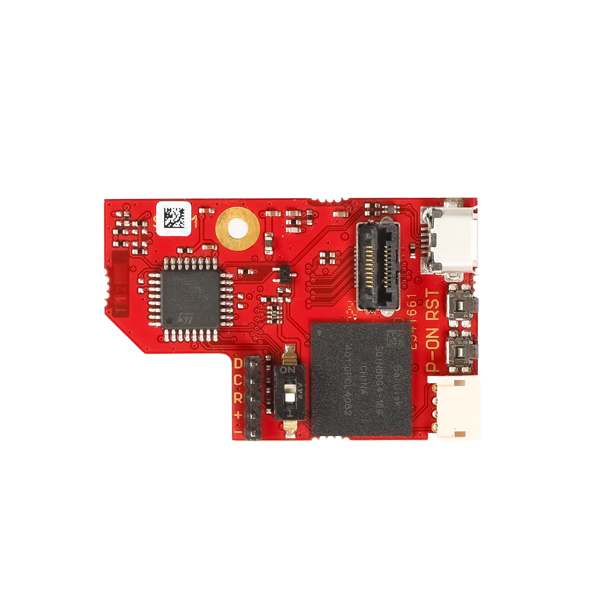
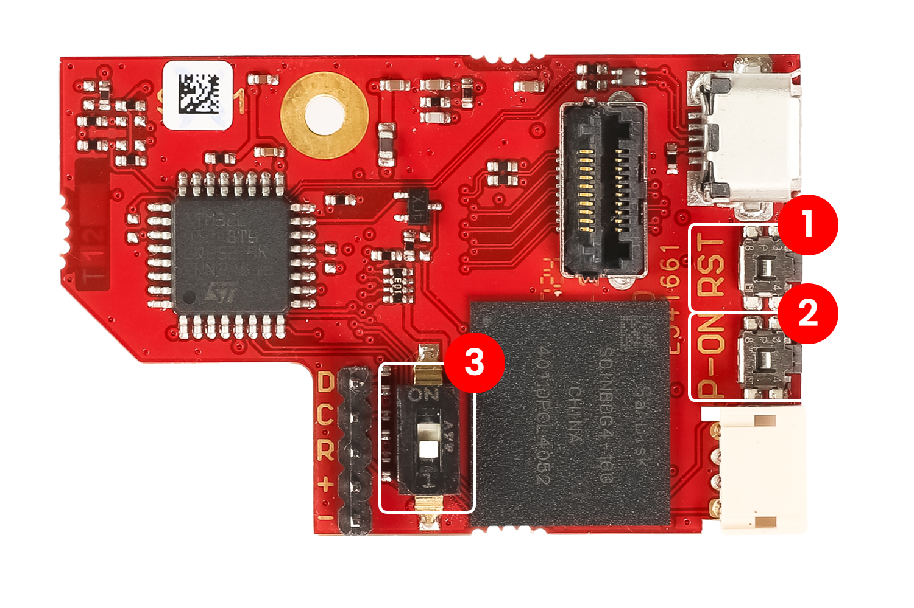
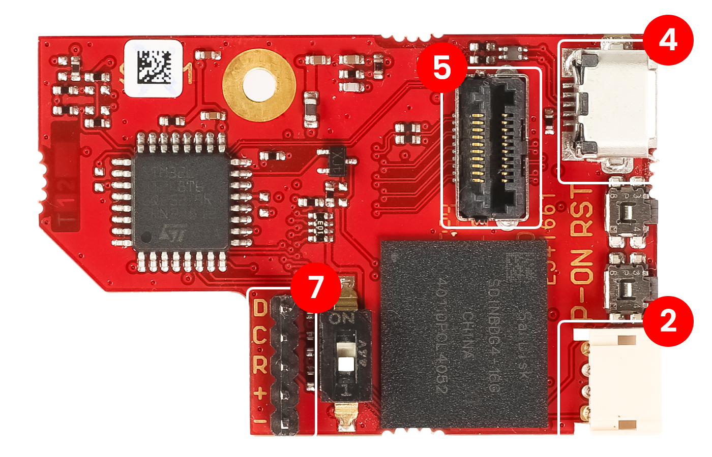
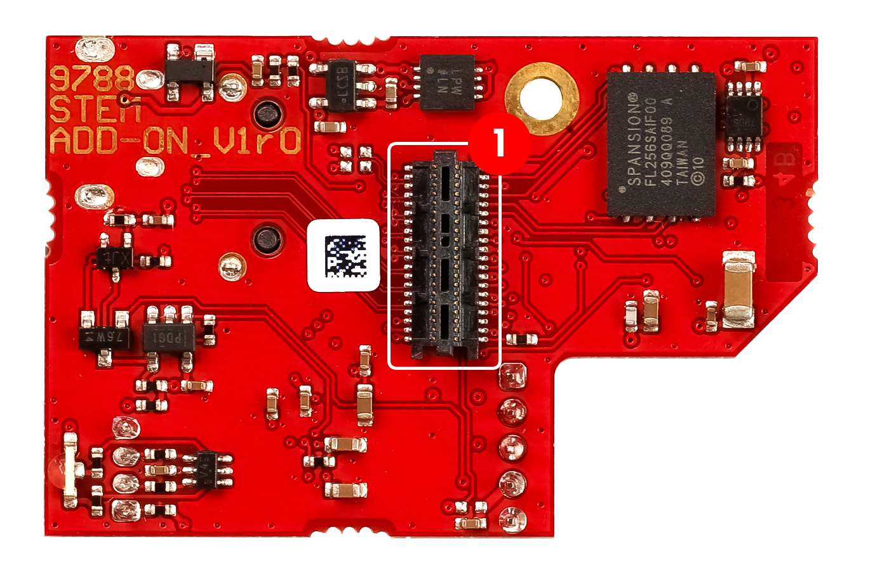

.. _E3_QSPI_eMMC_module_HW:

QSPI eMMC 模块 - 硬件
#############################

QSPI eMMC 模块为 Red Pitaya 提供安全可靠的启动和关机选项。

|e3_top| |e3_bottom|

.. |e3_bottom| image:: img/QSPI_eMMC_module_Gen2_bottom.png
   :width: 600

.. contents:: Table of Contents
    :local:
    :backlinks: none

|

功能特性
========

* 单按钮开启/关闭 Red Pitaya 板卡电源。
* QSPI 和 eMMC 启动选项。
* 板载 STM 微控制器提供以下功能：

    * Red Pitaya 上电。
    * 安全关闭 Red Pitaya。
    * 看门狗定时器功能。
    * 启动介质选择（SD 卡/eMMC）。

* 采用开源代码的 Arduino（C++）固件。
* 用于 8 对高速差分信号的连接器，直接连接到 Zynq 7020 FPGA（16 个 GPIO）。

QSPI eMMC 模块由 Red Pitaya 板卡供电，因此无需额外电源。

|

硬件要求
======================

QSPI eMMC 模块兼容以下 Red Pitaya 板卡型号：

* STEMlab 125-14 Pro Gen 2.
* STEMlab 125-14 Pro Z7020 Gen 2.

.. note::

    高速差分对仅受 STEMlab 125-14 Pro Z7020 Gen 2 板卡型号支持。

|

安装 QSPI eMMC 模块
================================

QSPI eMMC 模块安装说明请参阅 :ref:`E3 QSPI eMMC 模块安装指南 <QSPI_eMMC_board>`。

|

.. _eMMC_switch:

按钮和开关
=====================

QSPI eMMC 模块配有两个按钮和一个开关：

1. **P-ON** - 电源按钮。长按可开启或关闭 Red Pitaya 板卡电源。按钮功能由微控制器固件定义。
2. **RST** - 复位按钮。按下可复位微控制器和 eMMC。
3. **eMMC 开关** - 在 ON 位置时将 SDIO_SEL 引脚拉低，并强制 Red Pitaya 板卡从 eMMC 启动。

|

连接器
==========

本节介绍 QSPI eMMC 模块上的连接器。有关功能和连接器料号的更多详细信息，请参阅 QSPI eMMC 模块原理图。

CN1
---

**类型：** 40 引脚、2 排、0.5 mm 间距连接器

用于将 QSPI eMMC 模块连接到 Red Pitaya 板卡。它包含以下引脚：

    * QSPI 引脚。
    * eMMC 引脚。
    * I2C.
    * 8 对 LVDS 差分线路（16 个 GPIO）（仅用于 :ref:`STEMlab 125-14 Pro Z7020 Gen 2 <top_125_14_pro_z7020_gen2>`）。
    * 电源和控制信号。

.. list-table::
    :widths: 5 36 17 24 16 16 24 17 36 5
    :header-rows: 1

    * - 引脚
      - 描述
      - FPGA 引脚编号
      - FPGA 引脚描述
      - 电压电平
      - 电压电平
      - FPGA 引脚描述
      - FPGA 引脚编号
      - 描述
      - 引脚
    * - 1
      - I2C0_SCL
      - 
      - 
      - 3V3
      - 3V3
      - PS_MIO0_500
      - E6
      - E3_SHDN
      - 2
    * - 3
      - PS_POR#
      - C7
      - PS_POR_B_500
      - 3V3
      - 3V3
      - PS_MIO7_500
      - D8
      - E3_WDT_KICK
      - 4
    * - 5
      - PWR_ON
      - 
      - 
      - 3V3
      - 3V3
      - PS_MIO46_501
      - D16
      - SDIO_SEL [#f2]_
      - 6
    * - 7
      - DIO17_P
      - T5
      - IO_L19P_T3_13
      - LVDS
      - 3V3
      - 
      - 
      - I2C0_SDA
      - 8
    * - 9
      - DIO17_N
      - U5
      - IO_L19N_T3_VREF_13
      - LVDS
      - 3V3
      - PS_MIO41_501
      - C17
      - EMMC_CMD
      - 10
    * - 11
      - DIO11_P
      - U7
      - IO_L11P_T1_SRCC_13
      - LVDS
      - 3V3
      - PS_MIO45_501
      - B15
      - EMMC_DAT3
      - 12
    * - 13
      - DIO11_N
      - V7
      - IO_L11N_T1_SRCC_13
      - LVDS
      - 3V3
      - PS_MIO44_501
      - F13
      - EMMC_DAT2
      - 14
    * - 15
      - DIO13_P
      - V8
      - IO_L15P_T2_DQS_13
      - LVDS
      - 
      - 
      - 
      - GND
      - 16
    * - 17
      - DIO13_N
      - W8
      - IO_L15N_T2_DQS_13
      - LVDS
      - 3V3
      - PS_MIO43_501
      - A9
      - EMMC_DAT1
      - 18
    * - 19
      - DIO15_P
      - U9
      - IO_L17P_T2_13
      - LVDS
      - 3V3
      - PS_MIO42_501
      - E12
      - EMMC_DAT0
      - 20
    * - 21
      - DIO15_N
      - U8
      - IO_L17N_T2_13
      - LVDS
      - 
      - 
      - 
      - GND
      - 22
    * - 23
      - DIO14_P
      - W10
      - IO_L16P_T2_13
      - LVDS
      - 3V3
      - PS_MIO40_501
      - D14
      - EMMC_CLK
      - 24
    * - 25
      - DIO14_N
      - W9
      - IO_L16N_T2_13
      - LVDS
      - 
      - 
      - 
      - GND
      - 26
    * - 27
      - DIO16_P
      - W11
      - IO_L18P_T2_13
      - LVDS
      - 3V3
      - PS_MIO5_500
      - A6
      - SFSPI_IO3
      - 28
    * - 29
      - DIO16_N
      - Y11
      - IO_L18N_T2_13
      - LVDS
      - 3V3
      - PS_MIO4_500
      - B7
      - SFSPI_IO2
      - 30
    * - 31
      - DIO18_P
      - V11
      - IO_L21P_T3_DQS_13
      - LVDS
      - 3V3
      - PS_MIO3_500
      - D6
      - SFSPI_IO1
      - 32
    * - 33
      - DIO18_N
      - V10
      - IO_L21N_T3_DQS_13
      - LVDS
      - 3V3
      - PS_MIO2_500
      - B8
      - SFSPI_IO0
      - 34
    * - 35
      - DIO12_P (I2C1_SCL/UART_TX) [#f1]_
      - T9
      - IO_L12P_T1_MRCC_13
      - LVDS
      - 3V3
      - PS_MIO1_500
      - A7
      - SFSPI_CS#
      - 36
    * - 37
      - DIO12_N (I2C1_SDA/UART_RX) [#f1]_
      - U10
      - IO_L12N_T1_MRCC_13
      - LVDS
      - 3V3
      - PS_MIO6_500
      - A5
      - SFSPI_SCK
      - 38
    * - 39
      - +5V
      - 
      - 
      - 
      - 
      - 
      - 
      - +5V
      - 40

更改 DIO12 差分对的功能
~~~~~~~~~~~~~~~~~~~~~~~~~~~~~~~~~~~~~~~~~~~~~~~~~~~~~~

通过配置 QSPI eMMC 模块上的电阻，可以将 DIO12 差分对的功能更改为 I2C1 或 UART。

**I2C1**

1. 将电阻 R5 和 R6 移至 R3 和 R4 位置。

    .. TODO add picture

**UART**

1. 将电阻 R5 和 R6 移至 R3 和 R4 位置。

    .. TODO add picture

#. 安装 0R0 电阻 R17 和 R18。

    .. TODO add picture

#. 移除 10k0 电阻 R19 和 R21，以及 2k2 电阻 R1 和 R2。

    .. TODO add picture

CN2
---

**类型：** 4 引脚、1 排、1.5 mm 间距连接器

CN2 连接器支持从外部控制状态 LED 和电源引脚（PWR_ON_CN）。微控制器代码接收来自 PWR_ON_CN 引脚或 P_ON 按钮的信号，并在代码中对两者执行逻辑与运算。

.. list-table::
    :widths: 5 17
    :header-rows: 1

    * - 引脚
      - 描述
    * - 1
      - PWR_ON_CN
    * - 2
      - LED GREEN
    * - 3
      - LED RED
    * - 4
      - GND

CN4
---

**类型：** micro USB 连接器

连接器 CN4 用于对 QSPI eMMC 模块上的 STM 微控制器进行编程。它提供到 STM 微控制器的 USB 连接。

.. list-table::
    :widths: 5 17
    :header-rows: 1

    * - 引脚
      - 描述
    * - 1
      - VCC
    * - 2
      - D-
    * - 3
      - D+
    * - 4
      - ID
    * - 5
      - GND
    * - 6
      - SHIELD

CN5
---

* **类型：** 20 引脚、2 排、0.5 mm 间距连接器。
* **示例线缆：** `HLCD-10-06.00-TR-TR-1 <https://www.digikey.com/en/products/detail/samtec-inc/HLCD-10-06-00-TR-TR-1/13683996>`_

CN5 连接器直接连接到 Zynq FPGA 上的 8 对高速差分信号，可用于连接外部设备。

.. list-table::
    :widths: 5 17 17 5
    :header-rows: 1

    * - 引脚
      - 描述
      - 描述
      - 引脚
    * - 1
      - DIO15_P
      - DIO17_P
      - 2
    * - 3
      - DIO15_N
      - DIO17_N
      - 4
    * - 5
      - DIO14_P
      - DIO11_P
      - 6
    * - 7
      - DIO14_N
      - DIO11_N
      - 8
    * - 9
      - DIO16_P
      - DIO13_P
      - 10
    * - 11
      - DIO16_N
      - DIO13_N
      - 12
    * - 13
      - DIO18_P
      - GND
      - 14
    * - 15
      - DIO18_N
      - GND
      - 16
    * - 17
      - DIO12_P
      - GND
      - 18
    * - 19
      - DIO12_N
      - GND
      - 20

屏蔽引脚连接到 QSPI eMMC 模块的接地平面。

CN7
---

**类型：** 5 引脚、1 排、2.00 mm 间距连接器

用于对 STM 微控制器进行编程的串行线调试连接器。

.. list-table::
    :widths: 5 14 17
    :header-rows: 1

    * - 引脚
      - 标签
      - 描述
    * - 1
      - D
      - SWDIO
    * - 2
      - C
      - SWCLK
    * - 3
      - R
      - SWD_RES
    * - 4
      - 正极 (+)
      - VCC
    * - 5
      - 负极 (-)
      - GND

|

组件
==========

QSPI eMMC 模块配备以下组件：

* `STM32L412K8T6 <https://www.st.com/en/microcontrollers-microprocessors/stm32l412k8.html>`_
* `eMMC <https://shop.sandisk.com/en-sg/products/embedded-flash/industrial-inand-emmc-drives?sku=SDINBDG4-16G-XI2>`_ - 16 GB eMMC 存储器。
* `QSPI <https://www.infineon.com/part/S25FL256SAGNFI001>`_

|

原理图
==============

.. TODO add schematics

|

机械规格和 3D 模型
=========================================

.. TODO add mechanical specifications and 3D models

|

软件规格
=======================

有关软件规格，请参阅 :ref:`E3 软件文档 <E3_QSPI_eMMC_module_SW>`。

使用示例
===============

.. TODO Link to software configuration and installation guide

.. rubric:: 脚注

.. [#f1] 默认连接 DIO12 差分引脚对。通过更改 QSPI eMMC 模块上电阻的位置，可以连接 I2C1 和 UART 引脚。

.. [#f2] FPGA 中使用负逻辑。

.. substitutions
