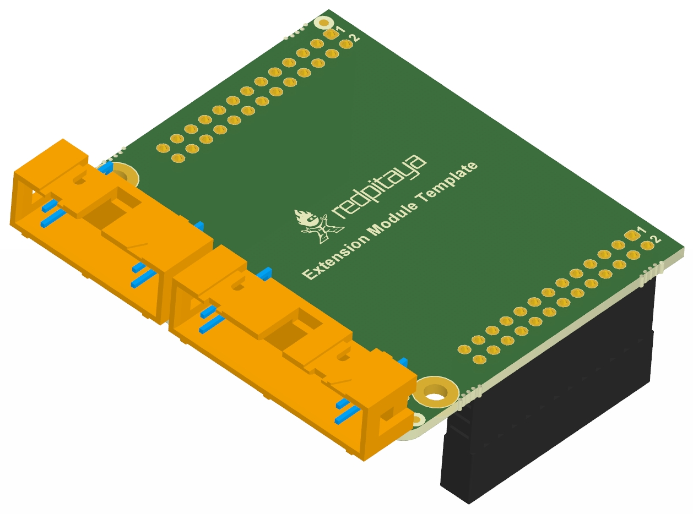
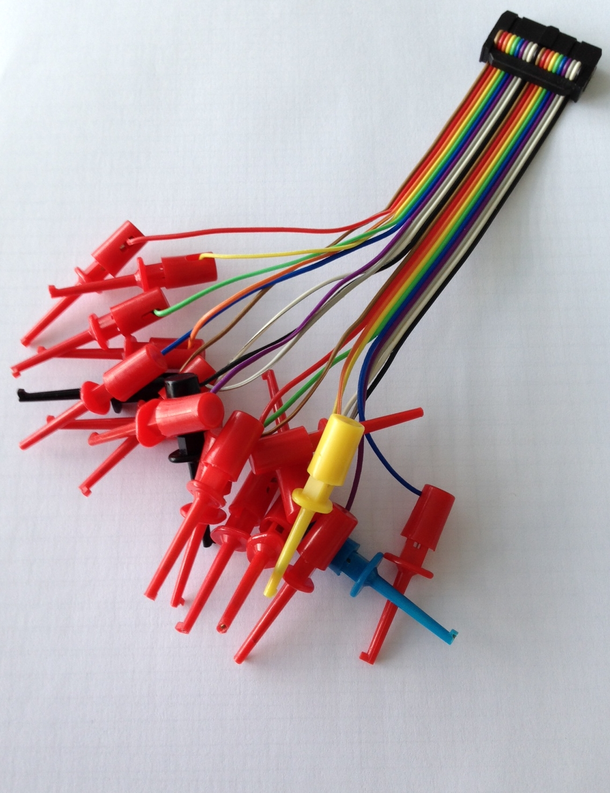
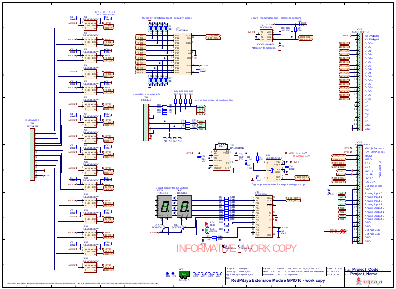
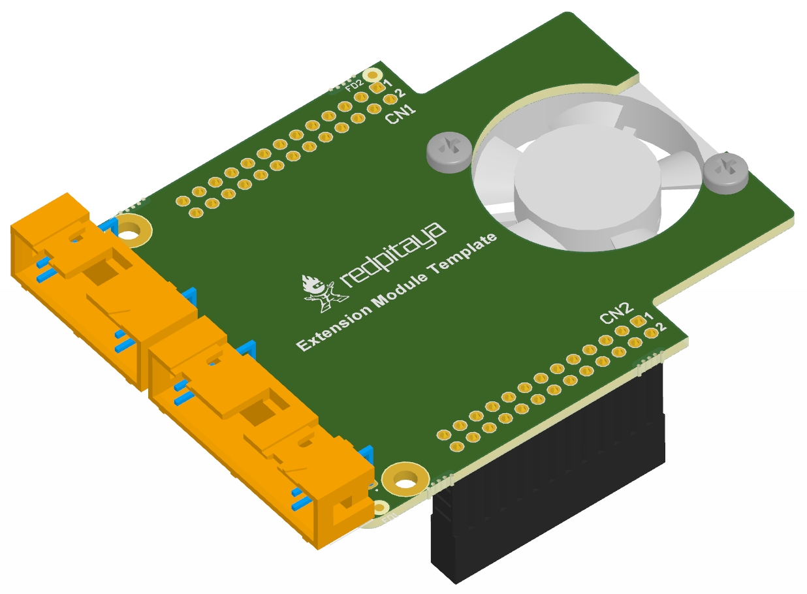

.. _ext_module_template:

=========================
扩展模块模板
=========================

Red Pitaya 软硬件模块可实现对辅助数字和模拟信号的访问与控制。

**初步设计规格：**

- 16 条双向数字 I/O 线，每条均支持独立方向控制和三态输出，便于灵活地采集和生成数字信号
- 最高 420 Mbps（取决于电压电平）
- 16k 采样缓冲区
- 用于序列采集的高级触发方案
- 集成电平转换功能，支持 1.2 V、1.5 V、1.8 V、2.5 V、3.3 V 和 5 V
- FPGA ESD 保护
- 额外的模拟信号滤波
- 通用七段数字显示器和开关（用于设置参考电压）
- 协议分析器功能（待定义）
- 集成到图形用户界面
- 4 路模拟输入和 4 路模拟输出；将 Red Pitaya 的模拟引脚扩展到扩展模块

    图：硬件扩展模块模板建议方案。

|

    图：连接选项——20 引脚。

|

    图：部分功能的一种可能实现（`初步版本 <https://downloads.redpitaya.com/doc/Extension/Schematic_GPIO16_A_InformativeOnly.pdf>`_）。

|

    图：选项——强制风冷。

|

外部链接：

  - `PDF 3D 模型 <https://downloads.redpitaya.com/doc/Extension/RPEM_Template1_3Dmodel.pdf>`_
  - `3D STEP 模型 <https://downloads.redpitaya.com/doc/Extension/RPEM_Template1_A_3D.step>`_
  - `Red Pitaya 扩展模块尺寸 <https://downloads.redpitaya.com/doc/Extension/RPEM_Template1_Dimensions.pdf>`_
  - `PCB 3D 图像 <https://downloads.redpitaya.com/doc/Extension/RPEM_Template1_Pcb3D.jpg>`_
  - `PCB 顶部 3D 图像 <https://downloads.redpitaya.com/doc/Extension/RPEM_Template1_PcbTop.jpg>`_
  - `GPIO16_A_Informative 原理图 <https://downloads.redpitaya.com/doc/Extension/Schematic_GPIO16_A_InformativeOnly.pdf>`_
  - `PCB 选项——强制风冷 3D 图像 <https://downloads.redpitaya.com/doc/Extension/RPEM_Template2_Pcb3D.jpg>`_
  - `3D STEP 选项——强制风冷模型 <https://downloads.redpitaya.com/doc/Extension/RPEM_Template2_A_3D.step>`_
  - `Altium 项目 <https://downloads.redpitaya.com/doc/Extension/RPEM_Template.zip>`_
