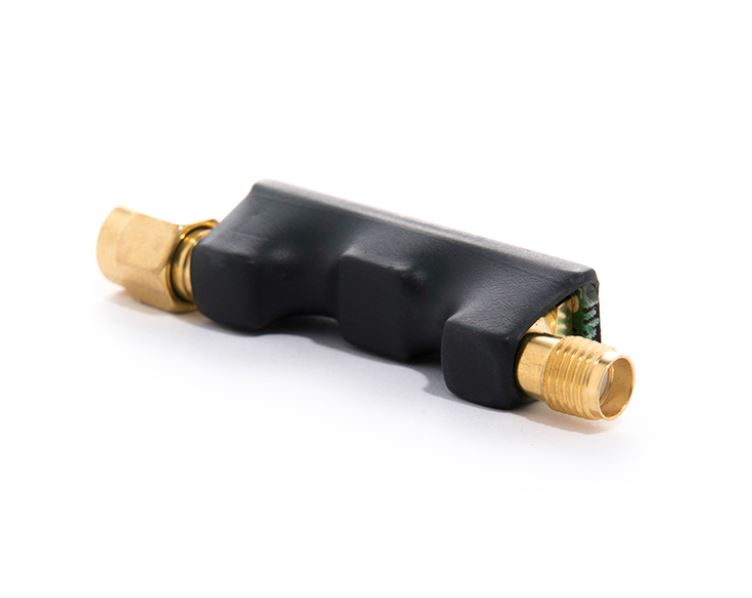
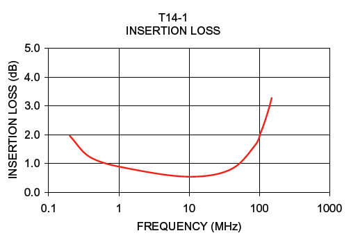
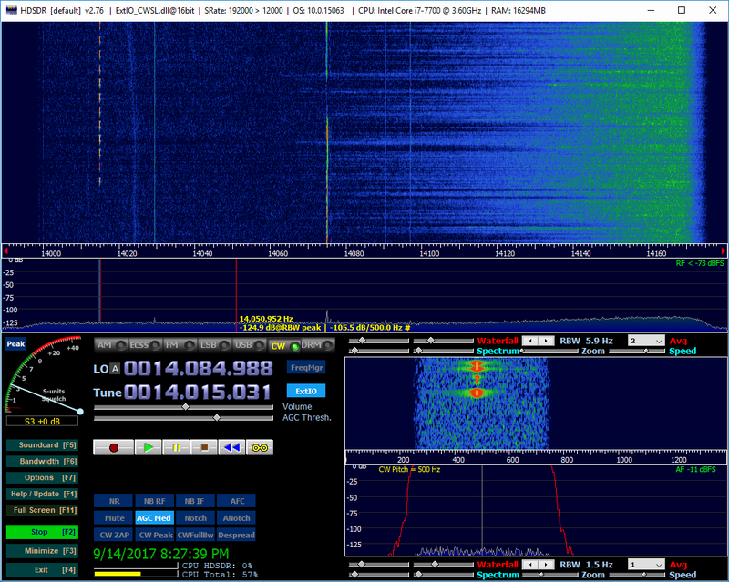
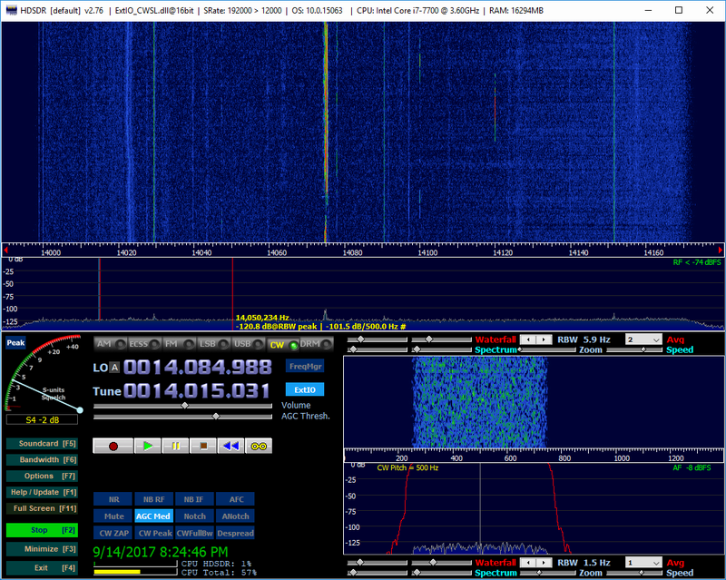

.. _impedance_transformer_external_module:

#######################
阻抗变换器
#######################

Red Pitaya 14:1 阻抗变换器专为将 50-Ω HF 天线和前置放大器连接到 Red Pitaya 高阻抗输入而优化。它可提升灵敏度和整体接收性能。

硬件兼容性
========================

阻抗变换器兼容以下 Red Pitaya 板卡：

* 所有 STEMlab 125-14 板卡型号。
* STEMlab 125-10（已停产）。

特性
==========

* 14:1 阻抗变换器。
* 将 50-ohm 天线和前置放大器升阻抗后连接到高阻抗输入。
* 提升灵敏度和性能。在 2-50 MHz 范围内插入损耗小于 1 dB。
* 体积小巧，两个天线输入各可安装一个。
* 热缩套管绝缘。
* 镀金 SMA 公头和母头连接器。

阻抗变换器模块采用 `MiniCircuits® T14-1 <https://www.minicircuits.com/pdfs/T14-1+.pdf>`_ 宽带升压 RF 变压器，具有以下特性。
    

    MiniCircuits® T14-1 变压器的插入损耗。

设置
==========

1. 将阻抗变换器连接到一个快速模拟输入。
#. 调整跳线引脚的位置。在引脚 2 和 5 之间插入跳线以旁路内部衰减器，然后连接变换器。

    .. figure:: img/RedPitayaBypassJumper.jpg
        :width: 400

        旁路 Red Pitaya 板卡上的输入衰减器。

    .. note::

        另一个跳线应单独存放，不要跨接其他引脚，以免误以为跳线处于 HV 或 LV 位置而在未来损坏板卡；此时跳线实际上正在旁路输入衰减器。衰减器旁路时，输入的绝对最大电压为 ±0.5 V。

使用示例
===============

在 N6TV，将无源天线（VE3DO 环形天线）与 Clifton Labs Z10042 11 dB Norton 放大器直接连接到 Red Pitaya 后，可以清楚看到来自附近两个 92.3 和 106.5 MHz FM 广播电台的强互调（106.5 - 92.3 = 14.2 MHz）。

|

在前置放大器和 Red Pitaya 之间插入 14:1 变压器后，互调显著降低，大气频段噪声（宽带灵敏度）改善约 4 dB。

|
