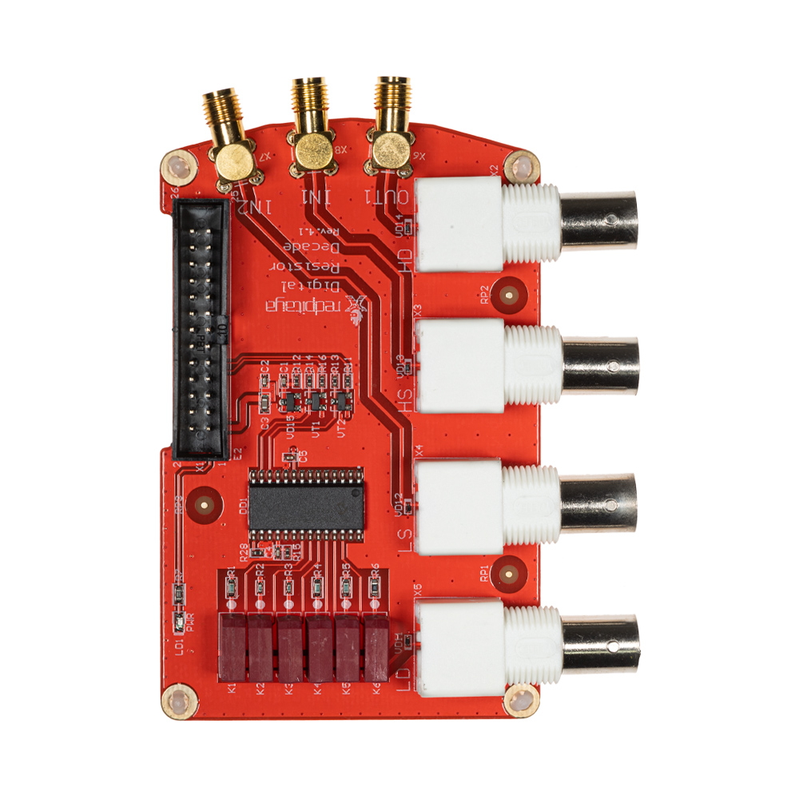
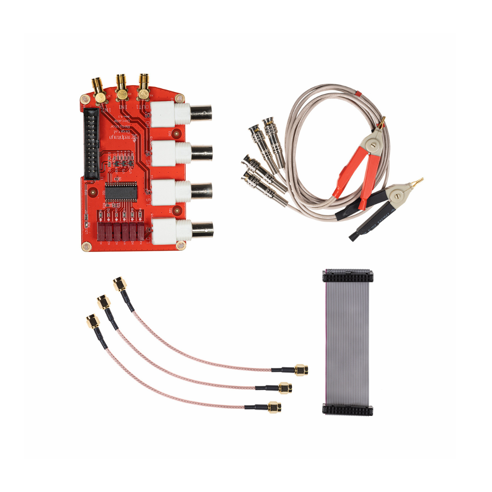

.. _lcr_extension_module:

###########################
LCR 测量仪扩展模块
###########################

    LCR 测量仪扩展模块。

|

包装盒内包含什么？
=====================

    LCR 测量仪扩展模块配件。

* 1 个 Red Pitaya LCR 测量仪扩展模块。
* 3 根 SMA 电缆。
* 2 个测试夹（红色和黑色鳄鱼夹）。
* 1 个 26 针排线连接器。

说明
=============

**即将推出**

适用应用
========================

LCR 测量仪扩展模块可与以下应用配合使用：

* :ref:`LCR 测量仪应用 <lrc_app>`
* :ref:`阻抗分析仪 <impedance_app>`

代码示例
===============

使用 LCR 测量仪扩展模块执行测量的示例代码见此处：

* :ref:`LCR 示例 <examples_lcr>`
