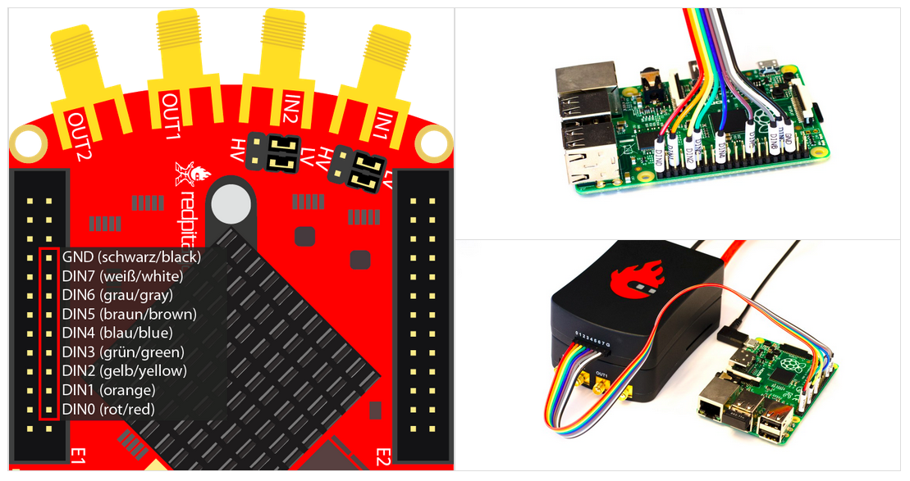

.. _logic_extension_module:

################################
逻辑分析仪扩展模块
################################

描述
=============

逻辑分析仪扩展模块扩展了逻辑分析仪应用所用八个数字引脚（DIO0_P - DIO7_P）的输入电压电平范围，并为数字引脚增加过压和过载保护。
扩展模块直接插入 E1 和 E2 扩展连接器。

What is in the box?
====================

扩展模块套件包括

* 集成在铝制外壳中的逻辑分析仪板
* 8 通道逻辑分析仪线缆
* 8 个可拆卸探头

.. figure:: img/LA_components.png
	:width: 1000

硬件连接
====================

将逻辑分析仪扩展模块连接器直接插入 E1 和 E2 扩展连接器，并连接探头线缆。
将线缆连接到所需的测量点。

确认 GND 引脚已连接。若 GND 引脚未连接，可能导致测量结果无法读取。

标准 LA 与扩展连接器的比较
=========================================================

.. list-table::
    :widths: 25 22 22
    :header-rows: 1

    * - 
      - 直接 E1 连接
      - LA 扩展模块
    * - 通道数
      - 8
      - 8
    * - 采样率（最大）
      - 125 Msps
      - 125 Msps
    * - 最大输入频率
      - 50 MHz
      - 50 MHz
    * - 支持的总线协议
      - I2C, SPI, UART, CAN
      - I2C, SPI, UART, CAN
    * - 输入电压
      - 3.3 V
      - 2.5 ... 5.5 V
    * - DIO 过载保护
      - N/A
      - 集成
    * - 电平阈值
      - 0.8V (low) |br| 2.0V (high)
      - 0.8V (low) |br| 2.0V (high)
    * - 输入阻抗
      - 100 kΩ, 3 pF
      - 100 kΩ, 3 pF
    * - 触发类型
      - 电平、边沿、模式
      - 电平、边沿、模式
    * - 存储深度
      - 1 MS（典型值）
      - 1 MS（典型值）
    * - 采样间隔
      - 8 ns
      - 8 ns
    * - 最小脉冲持续时间
      - 10 ns
      - 10 ns

有关逻辑分析仪的更多信息，请参阅 :ref:`逻辑分析仪应用 <la_app>`。

逻辑分析仪问答
===================

没有扩展连接器时可以使用逻辑分析仪应用吗？
--------------------------------------------------------------------------

可以。若不使用扩展模块，连接逻辑分析仪探头到 Red Pitaya 板上的 :ref:`E1 <E1_orig_gen>` 时必须谨慎，因为仅支持 **3V3 逻辑电平**。
逻辑分析仪板所用引脚如下图所示。
    

.. note::

    在某些 Red Pitaya 板卡型号上（SDRlab 122-16、STEMlab 125-14 4-Input 等），DIO8_P 引脚（上图中标记为 GND）可用作标准 GPIO 引脚。此时，请使用 Red Pitaya 板上的任意 GND 引脚连接逻辑分析仪的 GND 引脚。

哪些 Red Pitaya 板卡型号兼容直接 LA 连接？
------------------------------------------------------------------------------

直接使用 Red Pitaya 板的 GPIO :ref:`E1 <E1_orig_gen>` 引脚适用于所有 Red Pitaya 板卡型号。上图展示了连接示例。
