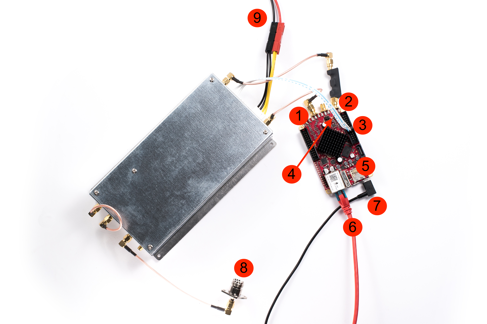
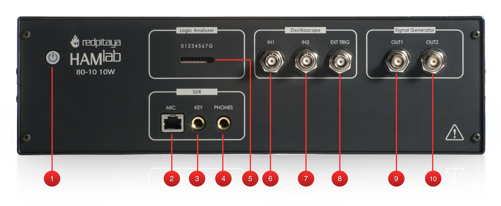
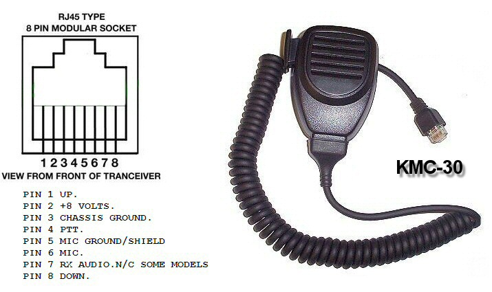
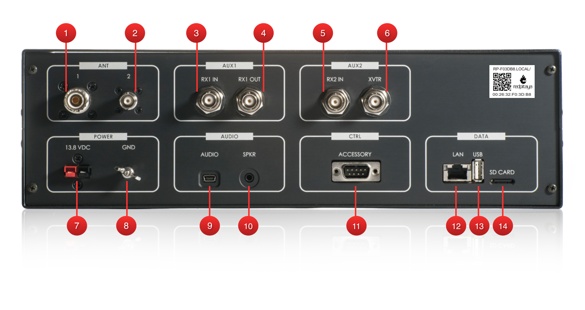
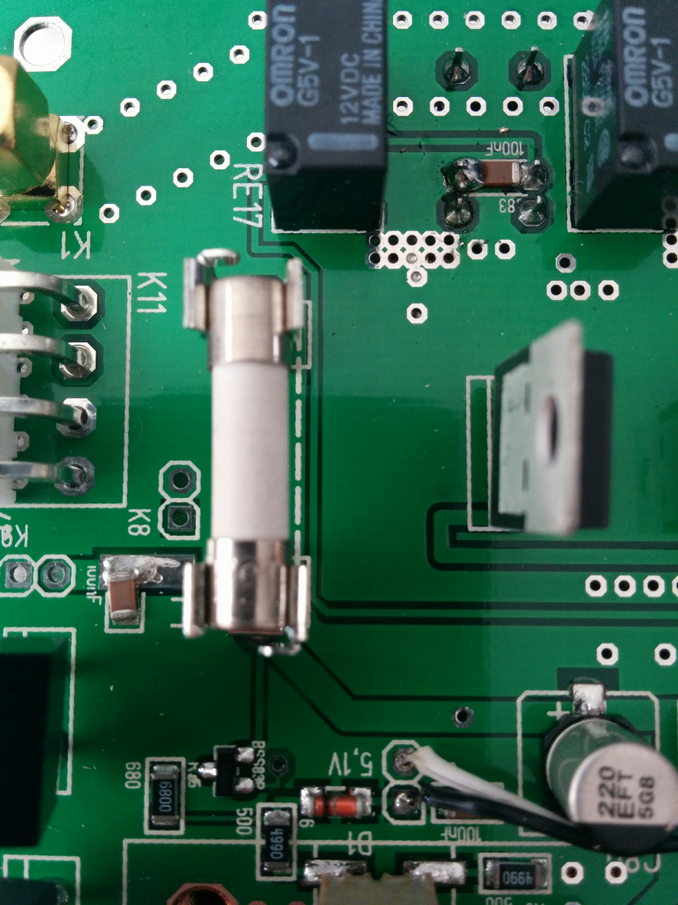
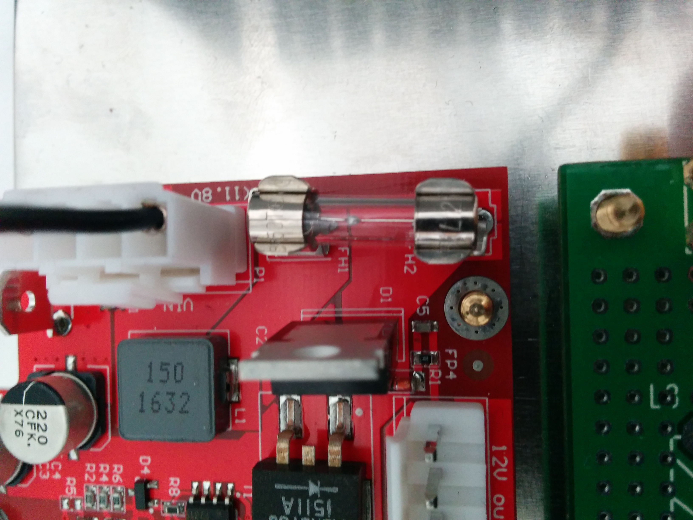

.. _sdr_module:

SDR 模块与 HAMlab（已停用）
################################

.. note::

	Red Pitaya SDR 模块及其配套 HAMlab 软件均已 **停用**。此处信息仅供参考。
	
要正常运行 Red Pitaya SDR 模块，需要使用特定的 HAMlab 程序；该程序包含在 2017 年 4 月至 2019 年 2 月发布的旧版 HAMlab Red Pitaya OS 镜像中。
当前 OS 镜像不再提供操作 SDR 模块所需的 HAMlab 程序。旧版 OS 镜像可从 |red_pitaya_archive| 获取。Red Pitaya SDR 模块仅支持 *STEMlab 125-14* 板卡型号。

.. |red_pitaya_archive| raw:: html

   <a href="https://downloads.redpitaya.com/hamlab/" target="_blank">Red Pitaya 归档</a>

HAMlab 文档
=====================

.. note::

	HAMlab 文档可在此查看：|hamlab_docs|。

.. |hamlab_docs| raw:: html

   <a href="https://hamlabdoc.readthedocs.io/en/latest/index.html" target="_blank">HAMlab 文档</a>

包装内容
===================

您的 Red Pitaya SDR 收发器模块包含以下配件和材料。

	- SDR 收发器模块 160-10 10W
	- 带 Anderson Power Pole™ 连接器的直流电源线
	- 4 根 SMA 电缆，用于将 C25 模块连接到 STEMlab 125-14 和天线
	- 阻抗变换器板

.. _Hercules: https://www.hercules.com/en/products/

其他额外要求
==============================

除 Red Pitaya SDR 收发器套件附带的配件、软件和电缆外，还需要以下物品：

	- 带 BNC 的 **HF 天线** 或假负载
	- 良好的 RF **接地**
	- 稳压直流 13.8 VDC、3 A **电源**

SDR 应用要求

	- 一台运行 Windows 7 或更高版本的个人电脑（PC）。支持 32-bit 和 64-bit 操作系统。

开始将 Red Pitaya 用作无线电台——SDR 收发器
============================================================

连接电缆
---------------------

.. note::

	将 Red Pitaya 连接到 SDR 收发器模块之前，请拔下电源线关闭 Red Pitaya。

1. 将 SDR 收发器模块的 TX 连接到 Red Pitaya 的 OUT1 连接器。
#. 将 SDR 收发器模块的 RX 连接到 Red Pitaya IN1（请注意，此电缆带有变压器）。
#. 将 SDR 收发器的控制电缆连接到 Red Pitaya。

	.. figure:: img/18_RedPitaya_Close.jpg
		:align: center
		:width: 1200

		找到箭头标记的引脚，并按上图所示连接电缆。

#. 检查跳线是否按上图所示配置。
#. 检查 SD 卡是否仍已插入。
#. 检查以太网电缆是否仍已连接。
#. 重新连接电源（5 V、2 A）以重启 Red Pitaya。
#. 连接天线。
#. 将 SDR 收发器连接到 13.8 V、3 A 电源。

	.. note::

		Red Pitaya SDR 收发器模块应使用能够持续提供至少 3 A 电流的直流 13.8 V 电源供电。
		使用直流电源线和 Anderson Power PoleTM 连接器 **(9)** 将电源连接到模块之前，请确保电源已关闭。
		红线为正极（+），黑线为负极（-）。请确保颜色和极性没有接反！

#. 打开 13.8 V 电源。

PowerSDR 安装与 SDR 配置
=============================================

.. _here: https://downloads.redpitaya.com/downloads/Clients/powersdr/Setup_PowerSDR_Charly_25_HAMlab_STEMlab_Edition.exe

点击 `此处 <here_>`_ 下载 PowerSDR 安装包。

1. 双击 *Setup_PowerSDR_STEMlab_HAMlab_Edition.exe* 文件开始安装。

	.. image:: img/SDR_software/PowerSDRinstallation1.png
		:align: center

#. 如果安装期间要求更高的用户权限，请单击 **Yes!**。也可以管理员权限运行安装程序。

	.. image:: img/SDR_software/PowerSDRinstallation2.png
   		:align: center
		:width: 400

	在 Windows 10 上，可能会收到未知发布者警告。单击 **More Info**，然后单击 **Run anyway** 即可继续安装。

	.. figure:: img/SDR_software/PowerSDRinstallation3.png
   		:align: center
		:width: 600

	.. figure:: img/SDR_software/PowerSDRinstallation4.png
		:align: center
		:width: 600

#. 按照安装程序的指示操作，并在要求时接受许可协议。

	.. figure:: img/SDR_software/Capture1.png
		:align: center
		:width: 600

	.. figure:: img/SDR_software/Capture2.png
		:align: center
		:width: 800

	.. figure:: img/SDR_software/Capture3.png
		:align: center
		:width: 800

	.. figure:: img/SDR_software/Capture4.png
		:align: center
		:width: 800

	.. figure:: img/SDR_software/Capture5.png
		:align: center
		:width: 800

	.. figure:: img/SDR_software/Capture6.png
		:align: center
		:width: 800

	.. figure:: img/SDR_software/Capture7.png
		:align: center
		:width: 800

	.. figure:: img/SDR_software/Capture8.png
		:align: center
		:width: 800

#. 安装结束时，系统会询问是否立即运行 PowerSDR 软件；此项可选。

	.. figure:: img/SDR_software/Capture9.png
		:align: center
		:width: 800

5. PowerSDR 软件将开始计算 FFT wisdom 文件；根据计算机的 CPU 性能，**这可能需要一段时间**。此过程只会执行一次，即使以后升级到新版软件也不例外：

	.. figure:: img/SDR_software/Capture10.png
		:align: center
		:width: 800

6. 启动 PowerSDR 软件后，PowerSDR 专用设置向导将引导您配置软件，以便与 Red Pitaya 配合使用。请选择 HAMlab/RedPitaya 无线电型号。

	.. figure:: img/SDR_software/Capture11.png
		:align: center
		:width: 800

7. 选择您将使用 Red Pitaya 的地区。世界各国允许发射的频率范围不同，因此此选择非常重要：

	.. figure:: img/SDR_software/Capture12.png
		:align: center
		:width: 800

8. 初始设置已完成。单击 **Finish**。

	.. figure:: img/SDR_software/Capture13.png
		:align: center
		:width: 800

9. 单击 Power 将 Power SDR 连接到 Red Pitaya。屏幕上应出现输入信号。

	.. figure:: img/SDR_software/Capture20.png
		:align: center
		:width: 1200

规格
==============

.. list-table::
    :widths: 31 109
    :header-rows: 1

    * - **亮点**
      - 
    * - 架构：
      - 直接采样／内置高性能 14-bit A/D 和 D/A 125 Msps 转换器（无需声卡）
    * - 频段覆盖：
      - 全频段接收器和 160-6 m 发射器
    * - 发射功率：
      - 最高 10 W
    * - 宽带频率覆盖：
      - 25 kHz - 62.25 MHz
    * - 连接 PC：
      - 1 Gbit 以太网或 Wi-Fi 连接
    * - 软件：
      - Power SDR HAMlab 版
    * - 耳机与 MIC 连接：
      - 位于前面板
    * - 辅助 Rx 和 Tx 通道：
      - 通过后面板 BNC 连接器（RX2 IN、XVTX）提供
    * - CW 电键与手键输入：
      - 通过前面板插孔连接器提供

|

	.. figure:: img/SDRBlockDiagram.png
		:align: center
		:width: 1200

|

.. list-table::
    :widths: 40 60
    :header-rows: 1

    * - **通用规格**
      -
    * - 天线连接器：
      - ANT1 和 ANT2 采用 SMA 连接器；附带一根 SMA 转 SO-239 UHF 电缆。
    * - 天线阻抗：
      - 50 Ohm 非平衡
    * - RF 输出功率：
      - 13.8 V 输入时，CW 和 SSB 最高 10 W（最大 15 V）
    * - 以太网互连电缆最大长度：
      - 100 米（328 英尺）Category 5 电缆
    * - 电源连接器：
      - PowerPole

.. list-table::
    :widths: 31 49
    :header-rows: 1

    * - **接收器规格**
      - 
    * - 架构：
      - 直接数字采样
    * - ADC 采样率：
      - 125 Msps
    * - ADC 分辨率：
      - 14 位
    * - 宽带频率覆盖：
      - 25 kHz - 62.25 MHz
    * - MDS（最小可检测信号）：
      - 500 Hz BW 时的 MDS（典型值）
    * - 14 MHz 时预放大器关闭
      - -113 dBm
    * - 14 MHz 时预放大器增益 +15 dB
      - -130 dBm
    * - 50 MHz 时预放大器增益 +30 dB
      - -135 dBm
    * - 
      - 更多 MDS 测量结果。
    * - 预选器：
      - 不可用
    * - 
      - 用户也可连接自己的预选器／滤波器

.. list-table::
    :widths: 31 86
    :header-rows: 1

    * - **发射器规格**
      - 
    * - 架构：
      - 直接数字上变频
    * - TX DAC 采样率：
      - 125 Msps
    * - TX DAC 分辨率：
      - 14 位
    * - RF 输出功率：
      - 13.8 V 输入电压时，CW 和 SSB 最高 10 W（最大 15 V）
    * - 发射器频率范围：
      - 160 - 10 m（仅业余频段）*
    * - PA 低通滤波器频段：
      - 160 m / 80 m / 40 m / 30 m / 20 m / 17 m / 15 m / 12 m / 10 m / 6 m
    * - 
      - （可更改为 1.8 - 50 MHz 内的任意范围）
    * - 发射模式类型：
      - A1A (CWU, CWL), J3E (USB, LSB), A3E (AM), F3E (FM), DIGITAL (DIGU, DIGL)
    * - 
      - DIGITAL (DIGU, DIGL)
    * - 谐波辐射：
      - 优于 -45 dB
    * - 三阶 IMD：
      - 14.2 MHz、10 W PEP 时，低于 PEP 至少 35 dB
    * - 冷却：
      - 铜质均热板

.. note::

	C25 也支持 6 m 工作，并配备 6 m 所需的全部输出滤波器。但是，STEMlab 125-14 输出信号的纯净度不足以满足 6 m 频段的谐波法规。

.. list-table::
    :widths: 23 72
    :header-rows: 1

    * - **通用电气规格**
      -
    * - 电源要求：
      - 标称 +13.8 V DC ± 15 %（发射器输出按 13.8 V DC 规定）
    * - 功耗：
      - 2 A

.. list-table::
    :widths: 27 16
    :header-rows: 1

    * - **机械规格**
      -
    * - 高度：
      - 100 mm
    * - 宽度：
      - 340 mm
    * - 深度：
      - 215 mm
    * - 重量：
      - 5 kg
    * - 工作温度：
      - -10*C 至 +50*C

测量仪器规格
======================================

.. list-table::
    :widths: 31 23
    :header-rows: 1

    * - **示波器**
      - 
    * - 输入通道
      - 2
    * - 输入通道连接器
      - BNC
    * - 带宽
      - 50 MHz
    * - 分辨率
      - 14 位
    * - 存储深度
      - 最多 16384 个采样点
    * - 采样率
      - 125 MS/s
    * - 输入范围
      - ±1 V 或 ±20 V
    * - 输入耦合
      - AC/DC
    * - 最小电压灵敏度
      - ±0.244 mV / ±2.44 mV
    * - 外部触发连接器
      - BNC
    * - 输入耦合
      - AC/DC

.. list-table::
    :widths: 31 23
    :header-rows: 1

    * - **信号发生器**
      - 
    * - 输出通道
      - 2
    * - 输出通道连接器
      - BNC
    * - 带宽
      - 50 MHz
    * - 分辨率
      - 14 位
    * - 信号缓冲区
      - 最多 16384 个采样点
    * - 采样率
      - 125 MS/s
    * - 输出范围
      - ± 1 V
    * - 频率范围
      - 0 - 50 MHz
    * - 输出阻抗
      - 50 Ω
    * - 外部触发连接器
      - BNC

.. list-table::
    :widths: 31 23
    :header-rows: 1

    * - **信号发生器**
      - 
    * - 输入通道
      - 2
    * - 输入通道连接器
      - BNC
    * - 带宽
      - 0 - 62 MHz
    * - 动态范围
      - -80 dBm
    * - 输入噪声电平
      - < -119 dBm/Hz
    * - 输入范围
      - ± 1 V
    * - 频率范围
      - 0 - 50 MHz
    * - 输入阻抗
      - 1 MΩ / 10 pF
    * - 杂散频率分量
      - -90 dBFS 典型值

.. list-table::
    :widths: 31 24
    :header-rows: 1

    * - **逻辑分析仪**
      - 
    * - 输入通道
      - 8
    * - 最大采样率
      - 125 MS/s
    * - 最高输入信号频率
      - 50 MHz
    * - 支持的协议
      - I2C, SPI, UART
    * - 输入电压电平
      - 2.5 V - 5.5 V
    * - 阈值
      - 0.8 V 对应逻辑低电平 |br| 2.0 V 对应逻辑高电平
    * - 输入阻抗
      - 100 kΩ 3 pF
    * - 采样深度
      - 1 MS（典型值*）
    * - 触发分辨率
      - 8 ns
    * - 最小可检测脉冲宽度
      - 10 ns

.. note::

 	采集的数据会被压缩，因此可捕获的数据量取决于 LA 输入上的信号活动度。
	对于 I2C、SPI 和 UART 信号，典型采样深度为 1 MS。
	所有仪器应用都基于 Web，无需安装任何本地软件。
	用户可使用智能手机、平板电脑，或运行任何常见操作系统（MAC、Linux、Windows、Android 和 iOS）的 PC，通过浏览器访问这些应用。

.. _front:

前面板控件与连接
======================================

电源按钮
------------

短按电源按钮 **(1)** 即可打开 HAMlab。从按下按钮到 HAMlab 可用通常需要 30 s。HAMlab 开机后，按住电源按钮可使设备正常关机。电源按钮上的蓝色 LED 表示设备已开机。

.. note::

	如果系统停止响应，可按住电源按钮数秒，直到蓝色 LED 熄灭，从而关闭设备。

SDR
---

麦克风连接器（RJ45）
+++++++++++++++++++++++++++

HAMlab 80-10 10W 前面板麦克风连接器 **(2)** 支持 Kenwood KMC 30 驻极体麦克风或兼容型号。

	前面板视图中的麦克风引脚定义

.. list-table::
    :widths: 5 10
    :header-rows: 1

    * - 引脚
      - 功能
    * - 1
      - NC
    * - 2
      - 8V DC
    * - 3
      - 接地
    * - 4
      - PTT
    * - 5
      - 接地
    * - 6
      - MIC
    * - 7
      - NC
    * - 8
      - NC

CW 电键／手键插孔
++++++++++++++++++++

CW 电键／手键插孔 **(3)** 使用 1/4 inch TRS 电话插头。

- 尖端——DOT
- 环端——DASH
- 公共端连接套筒端。

.. note::
 	
	最大输入 3.3 V。

对于双桨手键，尖端连接点键，环端连接划键，套筒端连接公共端。对于直键或电键器输出，请连接尖端并使环端悬空。公共端连接套筒端。

.. note::

 	当前软件尚不支持电键器。后续某个软件更新将提供支持。

耳机
++++++++++++++++++++

HAMlab 80-10 10W 支持使用 ¼ inch TRS 耳机插头 **(4)** 的立体声耳麦。请勿使用会将连接器“环端”接地的单声道或 TS 连接器！

逻辑分析仪
++++++++++++++++++++

- 0-7 为逻辑分析仪输入。
- G——公共地。

.. note::

	逻辑分析仪输入 **(5)** 仅能在 Logic Analyzer Web 应用运行时使用。

示波器
++++++++++++++++++++

- **(6)** - IN1
- **(7)** - IN2
- **(8)** - EXT. TRIG.

IN1、IN2 和 EXT. TRIG. 是示波器输入。

.. note::

 	这些输入仅在 Oscilloscope+Signal generator Web 应用运行时启用并可用。

信号发生器
++++++++++++++++++++

- **(9)** - OUT1
- **(10)** - OUT2

OUT1 和 OUT2 是信号发生器输出。

.. note::

 	这两个输出仅在 Oscilloscope+Signal generator Web 应用运行时启用并可控。

.. note::

 	为使信号发生器输出预期信号，输出端必须使用 50 Ohm 终端。

.. _back:

后面板控件与连接
=====================================

|

ANT——收发器天线端口 [1,2]
---------------------------------------

ANT1 **(1)** 为 SO-239 50 Ohm 连接器，ANT2 **(2)** 为 BNC 50 Ohm 连接器。

用户可在机箱内将 SMA 电缆正确连接到其中一个 ANT 连接器，从而将发射器输出连接到 ANT1 或 ANT2。HAMlab 80-10 10W 版本不支持通过软件切换 ANT1 和 ANT2。

.. danger::

 	本设备会产生射频（RF）能量。请谨慎操作，并针对系统配置遵守正确的安全规范。连接天线后，本无线电设备可产生 RF 电磁场；必须按照所在国家的法律进行评估，并针对人体暴露采取必要的隔离或保护措施！

.. danger::

 	切勿在发射模式下连接或断开天线。否则可能导致触电、皮肤 RF 灼伤，以及设备损坏。

AUX1
----

- RX1 IN——直接馈入第一级接收器前置放大器和衰减器。
- RX1 OUT——来自天线馈电的输出。

默认情况下，HAMlab 80-10 10W 附带一根从 RX1 IN 连接到 RX1 OUT 的环回电缆。用户也可使用这两个连接器接入外部滤波器或前置放大器。

.. note::

 	此输入没有任何 ESD 电路保护。因此，如果连接的设备没有足够的 ESD 保护电路，连接到 RX1 OUT 输出的设备可能会因 EMP 事件产生的 ESD 而损坏。

.. warning::

 	请注意，Preamp1 和 Preamp2 都是宽带放大器，覆盖完整的 55 MHz 带宽。
	不建议在未连接预选器时将前置放大器用于大型天线（否则业余无线电频段外的强广播信号会导致过载和互调）！

AUX2
----

- RX2 IN——辅助 50 Ohm 接收器输入，可在 Power SDR 软件中用作第二个频谱显示器，或用作预失真的反馈信号（Pure Signal 工具）。
- XVTR (TX2 OUT)——辅助发射器，可用于驱动外部 PA。最大输出功率约为 10 dBm @ 50 Ohm。

但 HPSDR 不支持第二路 TX 输出。

电源与保险丝
----------------

HAMlab 80-10 10W 设计为使用标称 13.8 V 直流电源工作，需要至少 4 A 电流。

.. danger::

    本设备只能使用本手册中说明的电源运行。切勿将 +13.8 VDC 电源连接器直接连接到交流插座，否则可能导致火灾、人身伤害或触电。

HAMlab 80-10 10W 要以最大功率发射，需要在无线电设备端测得 13.8 VDC @ 4 A。电源与 HAMlab 80-10 10W 之间存在多个电源线连接、电源稳压不良、电源线规格过小或电源线过长，都会导致压降，尤其是在负载下。任何偏离 13.8 VDC 的电压都会使输出功率低于 10 W 标称规格。

为获得最佳效果，请选择稳压良好且不会产生内部射频噪声的线性或开关电源。滤波不良的电源产生的“鸟啼”干扰常会在 Power SDR Panadapter 显示中表现为信号。

Anderson Powerpole™ 连接器采用 45 Amp 引脚，以尽量减小发射时的压降。红色连接端应连接电源正极（+）导线，黑色连接端应连接电源负极（-）导线。

如果选择使用自己的 Powerpole 电缆，请确保电线和 Powerpole 连接器的规格合适，以尽量减小发射时的压降。压降过大可能会降低发射输出功率。

HAMlab 内部有两个保险丝：一个保护整个系统，另一个仅保护收发器。如需更换内部保险丝，请拆下顶盖和电源板屏蔽罩。

.. danger::

 	保险丝额定电流应超过 3.15 A！未正确使用此安全器件可能损坏无线电设备或电源，或造成火灾风险。

机箱接地
---------------

这是用于将保护地连接到无线电设备机箱的手拧螺钉。接地是可为无线电台实施的最重要安全增强措施。务必使用尽可能短的高质量导线，将 HAMlab 连接到电台 RF 接地。
编织线被认为是接地应用的最佳选择。电台接地应为所有接地汇聚的公共点。您可能还会使用 PC 和直流电源，因此也应确保这些设备共同接地。

音频
-------

- Audio USB 连接器
- 必须使用 USB 2.0 A 型公头至 Mini-B 电缆将 HAMlab 音频声卡连接到 PC，才能使用耳机、MIC 和扬声器连接器进行语音通信。

.. note::

 	USB 连接器仅在 HAMlab 80-10 10W 型号上提供。新型号使用音频编解码器，音频通过以太网传输。
 
- 扬声器连接器——1/8” TRS 立体声连接器可用于连接有源立体声电脑扬声器。

.. note::

    请勿使用会将连接器“环端”接地的单声道或 TS 连接器。

CTRL
-----

- DB9 连接器用于控制外部设备。
- PTT OUT 继电器连接在引脚 6 和 7 之间。

.. note::

 	其他引脚目前未使用，应保持未连接状态。

DATA
-----

- LAN——HAMlab 的网络连接。这是一个自动感知的 100 megabit 或 1 gigabit 以太网端口，可将 HAMlab 连接到本地网络或直接连接到 PC。
- USB——用户希望无线连接 HAMlab 时，此 USB 端口用于连接 Wi-Fi 适配器。

.. note::

 	建议使用 Edimax EW7811Un Wi-Fi USB 适配器。通常，所有使用 RTL8188CUS 芯片组的 Wi-Fi USB 适配器都应可用。

- SD 卡——HAMlab 软件从 SD 卡运行。

.. note::

 	HAMlab 附带预装 HAMlab OS 的 SD 卡。可通过 HAMlab 应用菜单中的 OS 升级应用完成升级，无需取出 SD 卡。因此，只有在系统损坏，或因 SD 卡故障而停止工作时，用户才应取出 SD 卡并重新安装 SD 卡软件。在这种情况下，为确保正常运行，SD 卡上只应安装官方 HAMlab OS。
