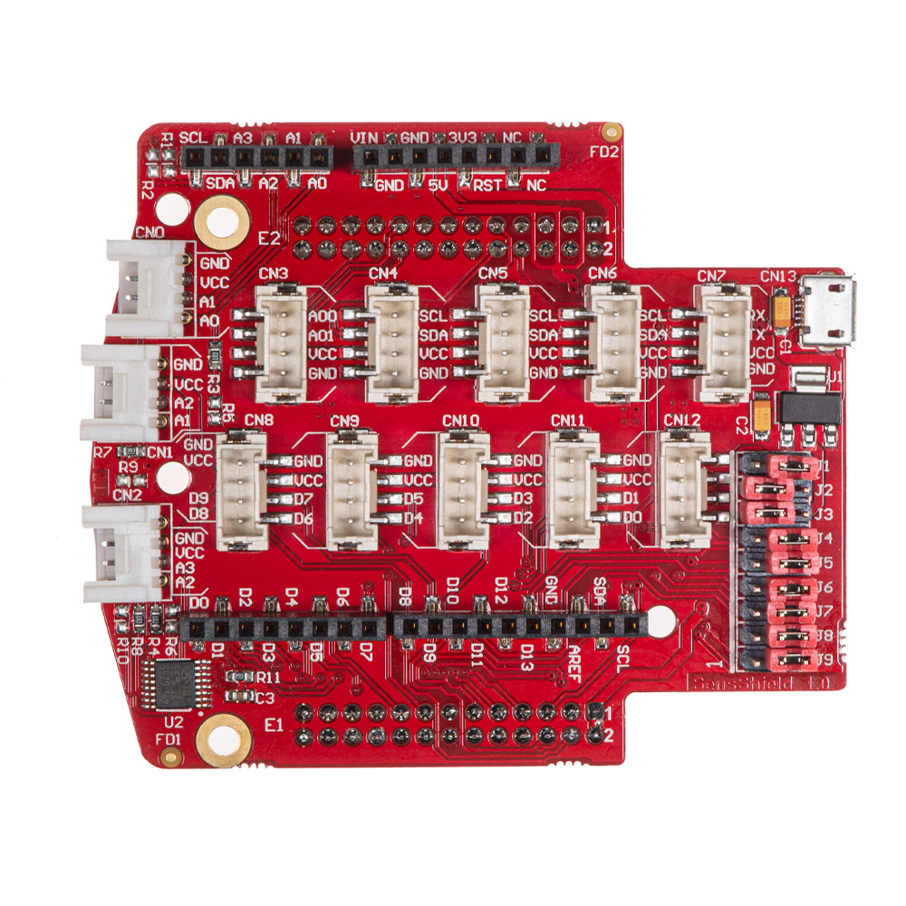
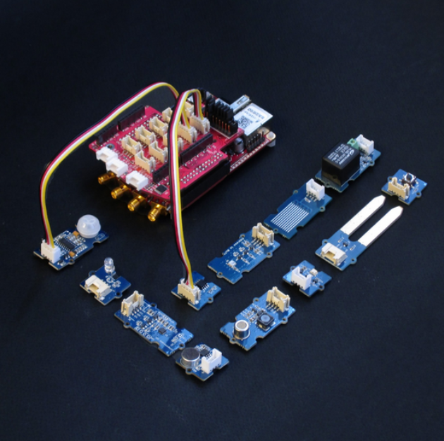

.. _sensor_extension_module:

#########################
传感器扩展模块
#########################

描述
=============

传感器扩展板重新引出 Red Pitaya 的数字和模拟引脚，便于连接 Grove 传感器。它还采用与 Arduino 扩展板相同的引脚排列。

|

每个 Grove 连接器都连接电源（3V3）、地以及两个数字或模拟引脚。由于 Red Pitaya 只有四路模拟输入，部分引脚会重叠。通过读取数字或模拟引脚的数据，即可控制连接器引脚及所连接的传感器。

控制数字和模拟输入输出的代码示例请参见 :ref:`此处 <examples>`。

拥有大量可直接使用的传感器后，电子项目的入门会更加有趣、更具吸引力。无论您想测量温度、振动、运动等，
我们都有与 |Seeed-Grove| 的 **Grove** 模块兼容的扩展模块。您只需选定所需模块、找到正确的连接器，即可开始项目。

|

想使用 Arduino Uno 扩展板？可以将其直接插入传感器扩展板。扩展模块也可以使用 micro USB 线缆由外部电源供电。

九个跳线可将扩展模块的部分连接器重新连接到不同的 :ref:`E1 <E1_orig_gen>` 或 :ref:`E2 <E2_orig_gen>` 引脚，或更改电源设置。
例如，使用 J1 和 J3 可以将扩展板电源（VCC）设置为外部电源，或从 Red Pitaya 取电。
下方提供了扩展模块的完整原理图。

.. note::

    可从 Red Pitaya |redpitaya-store| 购买该扩展模块。

连接器与跳线
=========================

两侧的黑色连接器与 Arduino 兼容，正面的白色连接器提供模拟输入，中部两排米色连接器提供数字 I/O、UART、I2C 或模拟输出。底部设有连接 Red Pitaya 板卡的连接器。

Grove 模块连接器
--------------------------

这些是与 `Grove 模块 <https://wiki.seeedstudio.com/Grove_System/>`_ 兼容的专用连接器。

共有六种连接器类型：

* **AI** 模拟输入（0 - 3.3 V）
* **AO** 模拟输出
* **I2C** (3.3 V)
* **UART** (3.3 V)
* **DIO** 数字输入/输出（3.3 V，不耐受 5 V）

.. list-table::
    :widths: 21 11 11 11 11 11 11 11 11 11 11 11 11 11
    :header-rows: 2

    * - **连接器**
      - CN0
      - CN1
      - CN2
      - CN3
      - CN4
      - CN5
      - CN6
      - CN7
      - CN8
      - CN9
      - CN10
      - CN11
      - CN12
    * - **Grove 引脚\类型**
      - AI
      - AI
      - AI
      - AO
      - I2C
      - I2C
      - I2C
      - UART
      - DIO
      - DIO
      - DIO
      - DIO
      - DIO
    * - ``1``
      - AI0
      - AI1
      - AI2
      - AO0
      - SCL
      - SCL
      - SCL
      - RX
      - IO8
      - IO6
      - IO4
      - IO2
      - IO0
    * - ``2``
      - AI1
      - AI2
      - AI3
      - AO1
      - SDA
      - SDA
      - SDA
      - TX
      - IO9
      - IO7
      - IO5
      - IO3
      - IO1
    * - ``3``
      - VCC
      - VCC
      - VCC
      - VCC
      - VCC
      - VCC
      - VCC
      - VCC
      - VCC
      - VCC
      - VCC
      - VCC
      - VCC
    * - ``4``
      - GND
      - GND
      - GND
      - GND
      - GND
      - GND
      - GND
      - GND
      - GND
      - GND
      - GND
      - GND
      - GND

|

Arduino 扩展板兼容连接器
--------------------------------------

这组连接器与 Arduino 扩展板连接器部分兼容。

.. list-table::
    :widths: 14 11 19
    :header-rows: 1

    * - **功能**
      - **Pin**
      - **备注**
    * - IO0
      - 1
      - D[0]
    * - IO1
      - 2
      - D[1]
    * - IO2
      - 3
      - D[2]
    * - IO3
      - 4
      - D[3]
    * - IO4
      - 5
      - D[4]
    * - IO5
      - 6
      - D[5]
    * - IO6
      - 7
      - D[6]
    * - IO7
      - 8
      - D[7]

|

.. list-table::
    :widths: 14 11 19
    :header-rows: 1

    * - **功能**
      - **Pin**
      - **备注**
    * - IO8
      - 1
      - D[8]
    * - IO9
      - 2
      - D[9]
    * - IO10
      - 3
      - D[10]
    * - IO11
      - 4
      - D[11]
    * - IO12
      - 5
      - D[12]
    * - IO13
      - 6
      - D[13]
    * - GND
      - 7
      - 
    * - AREF
      - 8
      - NC
    * - SDA
      - 9
      - I2C_SDA
    * - SCL
      - 0
      - I2C_SCL

|

.. list-table::
    :widths: 14 11 19
    :header-rows: 1

    * - **功能**
      - **Pin**
      - **备注**
    * - A6
      - 1
      - NC
    * - A7
      - 2
      - NC
    * - Reset
      - 3
      - NC
    * - +3.3 V
      - 4
      - 
    * - +5.0 V
      - 5
      - 
    * - GND
      - 6
      - 
    * - GND
      - 7
      - 
    * - +VIN
      - 8
      - NC

|

跳线
---------

.. list-table::
    :widths: 16 18 21 20
    :header-rows: 1

    * - **Jumper Num**
      - **输出引脚**
      - **位置 1**
      - **位置 2**
    * - J1
      - +5V_SEL
      - +5V_EXT
      - +5V (Red Pitaya)
    * - J2
      - VCC
      - +3V3_SEL
      - +5V_SEL
    * - J3
      - +3V3_SEL
      - +3V3 (Red Pitaya)
      - +3V3_LDO
    * - J4
      - IO13
      - SPI_SCK
      - DIO5_N
    * - J5
      - IO12
      - SPI_MISO
      - DIO4_N
    * - J6
      - IO11
      - SPI_MOSI
      - DIO3_N
    * - J7
      - IO6
      - SPI_CS
      - DIO2_N
    * - J8
      - IO1
      - UART_TX
      - DIO1_P
    * - J9
      - IO0
      - UART_RX
      - DIO0_P

|

原理图
============

* `Schematics_Sensor_Shield.pdf <https://downloads.redpitaya.com/doc/Schematics/Schematics_Sensor_Shield.pdf>`_.

Grove 传感器示例
==========================

传感器
---------

.. list-table::
    :header-rows: 1

    * - 传感器信息
      - 连接器
    * - **模拟** |Seeed-temp|
      - AI
    * - |Seeed-motion|
      - DIO
    * - |Seeed-touch|
      - DIO
    * - |Seeed-button|
      - DIO
    * - |Seeed-switch|
      - DIO
    * - **数字** |Seeed-tilt|
      - DIO
    * - |Seeed-potentiometer|
      - AI
    * - `光照传感器 <http://wiki.seeed.cc/Grove-Light_Sensor>`_
      - AI
    * - `空气质量传感器 <https://wiki.seeedstudio.com/Grove-Air_Quality_Sensor_v1.3>`_
      - AI
    * - `振动传感器 <https://wiki.seeedstudio.com/Grove-Piezo_Vibration_Sensor>`_
      - AI
    * - `湿度传感器 <https://wiki.seeedstudio.com/Grove-Moisture_Sensor>`_
      - AI
    * - `水传感器 <https://wiki.seeedstudio.com/Grove-Water_Sensor>`_
      - AI
    * - `酒精传感器 <https://wiki.seeedstudio.com/Grove-Alcohol_Sensor>`_
      - AI
    * - 气压计 ``当前暂不支持``
      - I2C
    * - `声音传感器 <http://wiki.seeed.cc/Grove-Sound_Sensor>`_
      - AI
    * - `UV 传感器 <https://wiki.seeedstudio.com/Grove-UV_Sensor>`_
      - AI
    * - 加速度计 ``当前暂不支持``
      - I2C

|

.. list-table::
    :header-rows: 1

    * - 执行器
      - 连接器
    * - `继电器 <https://wiki.seeedstudio.com/Grove-Relay>`_
      - DIO

|

.. list-table::
    :header-rows: 1

    * - 指示器
      - 连接器
    * - `蜂鸣器 <https://wiki.seeedstudio.com/Grove-Buzzer>`_
      - DIO
    * - `LED <https://www.seeedstudio.com/grove-led-p-767.html?cPath=156_157>`_
      - DIO
    * - |seven_segment_display|
      - 数字引脚
    * - `LED 灯条 <https://wiki.seeedstudio.com/Grove-LED_Bar>`_
      - 数字引脚
    * - `Grove LCD <https://wiki.seeedstudio.com/Grove-LCD_RGB_Backlight>`_
      - 数字引脚
    * - LCD
      - 数字引脚

.. |seven_segment_display| replace:: `七段显示器 <https://www.seeedstudio.com/Grove-0-54-Red-Dual-Alphanumeric-Display-p-4031.html?queryID=817e144e20d72ab54938d8288d8f4155&objectID=4031&indexName=bazaar_retailer_products>`__

代码示例
===============

传感器控制示例代码请参见：

- :ref:`传感器代码示例 <examples>`
