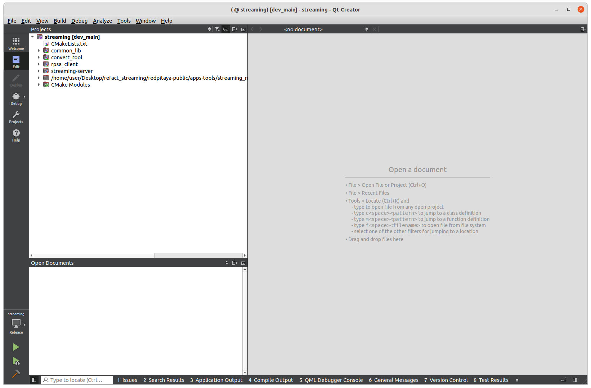
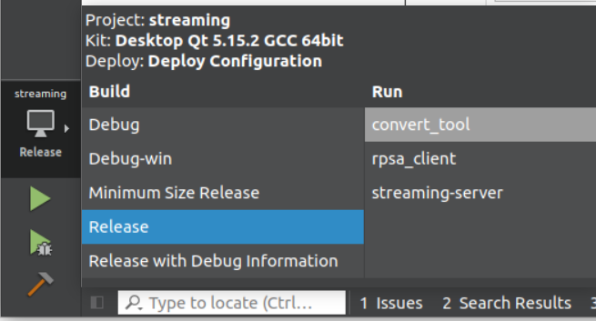
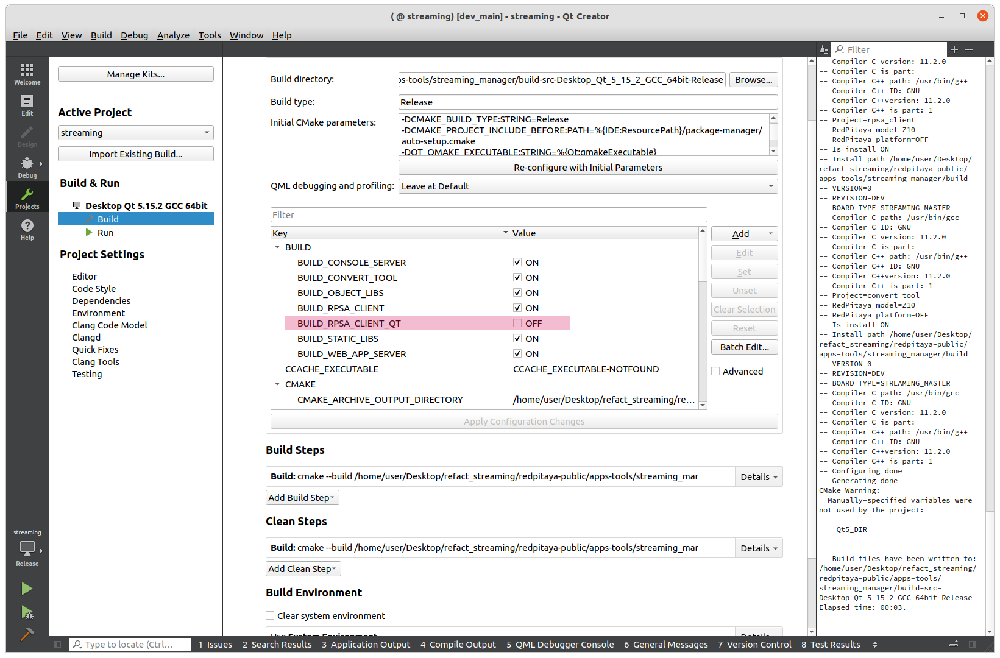
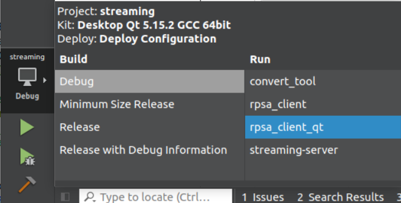

.. _SW_comp_Streaming:

###############################################
编译 Streaming 客户端应用
###############################################

Red Pitaya 的 Streaming 应用支持两类客户端：

- **控制台客户端** - 用于流数据的命令行界面
- **桌面客户端** - 用于流数据的图形用户界面（基于 Qt）

每个固件版本都提供预构建的客户端应用。不过，你可以根据需求定制并重新构建这些客户端。

本指南介绍如何使用 Qt Creator 构建两类客户端。

|

前置条件
==============

构建 Streaming 客户端前，请确保已安装以下组件：

- CMake 3.18 或更高版本
- Qt 5.15.2 with QtCharts module
- GCC 9 或更高版本
- 操作系统： Windows or Ubuntu

.. note::

    从 `Qt 官方网站 <https://www.qt.io/download-dev>`_. 
    安装过程中，请选择 QtCharts 模块作为附加软件包。

|

使用 Qt Creator 构建
=========================

Qt Creator 提供用于构建和修改 Streaming 客户端的集成开发环境。

打开项目
---------------------

1. 启动 Qt Creator
2. 将 CMakeLists.txt 文件作为项目打开
3. 导航至： ``./apps-tools/streaming_manager/src/CMakeLists.txt``

打开项目后，默认只能构建服务器和控制台客户端。

|

启用桌面客户端构建
------------------------------------

桌面客户端（Qt GUI 应用）默认禁用。启用方法：

1. 在 Qt Creator 中打开项目设置
2. 找到 CMake 配置选项
3. 勾选： **BUILD_RPSA_CLIENT_QT**

启用后，桌面客户端将作为构建目标可用。

|

构建客户端
----------------------

配置构建选项后：

1. 选择所需的构建目标（控制台客户端或桌面客户端）
2. 点击 Qt Creator 中的构建按钮
3. 编译后的二进制文件位于构建输出目录
