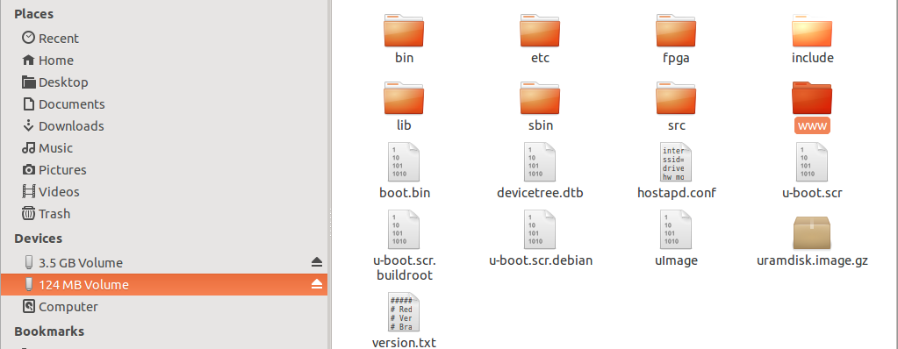
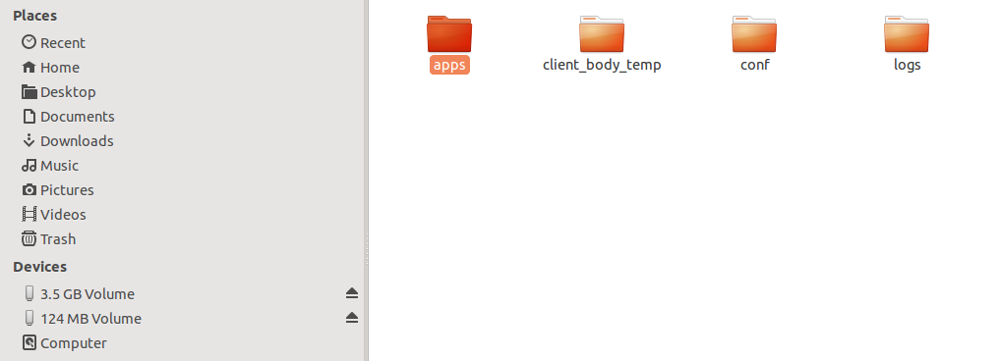

.. _manual_app_install:

########################################
手动安装应用
########################################

出于开发和测试目的，可以通过直接将 Web 应用复制到 SD 卡文件系统来手动安装。本方法适用于不使用 Red Pitaya Web 界面测试应用，或将自定义应用部署到多个设备的场景。

.. contents:: 目录
    :local:
    :depth: 1
    :backlinks: top

|

安装方法
=====================

方法 1：直接访问 SD 卡
---------------------------------

当可以实际访问 SD 卡时，这是安装应用最简单的方法。

步骤 1：访问 SD 卡
^^^^^^^^^^^^^^^^^^^^^^^^^^^^

1. 从 Red Pitaya 板卡中取出 SD 卡
2. 将 SD 卡插入计算机读卡器
3. 进入 SD 卡根目录

步骤 2：定位应用文件夹
^^^^^^^^^^^^^^^^^^^^^^^^^^^^^^^^^^^^^^^^

浏览 SD 卡上的 `www` 文件夹：

目录路径应为：

.. code-block:: text

    <SD_CARD_DRIVE>/www/

步骤 3：复制应用
^^^^^^^^^^^^^^^^^^^^^^^^^^^^^^^

进入 `apps` 子文件夹，并将应用文件夹复制到此处：

完整路径应为：

.. code-block:: text

    <SD_CARD_DRIVE>/www/apps/<your_app_name>/

.. important::

    复制完整的应用文件夹，包括所有子文件夹（js、css、info、src 等）。

步骤 4：安全弹出并重启
^^^^^^^^^^^^^^^^^^^^^^^^^^^^^^^^^^

1. 从计算机安全弹出 SD 卡
2. 将 SD 卡重新插入 Red Pitaya
3. 启动或重启 Red Pitaya
4. 应用应出现在应用列表中

|

方法 2：SCP 文件传输
-----------------------------

如果希望将 SD 卡保留在 Red Pitaya 中，可以通过 SCP 传输文件。

使用 SCP 命令
^^^^^^^^^^^^^^^^^^

在计算机上，传输应用文件夹：

.. code-block:: shell-session

    $ scp -r /path/to/your_app_folder root@rp-xxxxxx.local:/opt/redpitaya/www/apps/

或使用 IP 地址：

.. code-block:: shell-session

    $ scp -r /path/to/your_app_folder root@192.168.0.100:/opt/redpitaya/www/apps/

将 `rp-xxxxxx` 替换为 Red Pitaya 的 MAC 地址后缀，并将源路径调整为应用所在位置。

使用 WinSCP（Windows）
^^^^^^^^^^^^^^^^^^^^^^^

1. 打开 WinSCP 并连接到 Red Pitaya
2. 进入 `/opt/redpitaya/www/apps/`
3. 将计算机上的应用文件夹拖放到远程目录

|

验证
=============

安装后验证应用：

1. 打开 Web 浏览器
2. 进入 Red Pitaya 的 IP 地址或 `rp-xxxxxx.local`
3. 应用应出现在主应用菜单中
4. 点击应用图标启动应用

如果应用未出现，请检查：

* 应用文件夹名称（必须唯一且不能包含空格）
* `info/info.json` 文件存在且为有效 JSON
* `info/icon.png` 文件存在
* 文件权限正确（应与其他应用一致）

|

故障排除
================

应用未出现在菜单中
----------------------------------------

**检查应用结构：**

确保文件夹至少包含：

.. code-block:: text

    your_app/
    ├── index.html
    ├── info/
    │   ├── info.json
    │   └── icon.png
    └── Makefile

**验证 info.json 格式：**

该文件必须是有效 JSON：

.. code-block:: json

    {
        "name": "Application Name",
        "version": "1.0",
        "revision": "1",
        "description": "Application description"
    }

|

应用出现但无法加载
---------------------------------------

**编译后端：**

如果应用包含 C/C++ 后端代码，则必须在 Red Pitaya 上编译：

.. code-block:: shell-session

    $ ssh root@rp-xxxxxx.local
    $ cd /opt/redpitaya/www/apps/your_app
    $ make INSTALL_DIR=/opt/redpitaya

**检查文件权限：**

确保文件可读：

.. code-block:: shell-session

    $ chmod -R 755 /opt/redpitaya/www/apps/your_app

|

后端无法加载
----------------------

检查 Nginx 日志中的错误：

.. code-block:: shell-session

    $ tail -f /var/log/nginx/error.log

常见问题：

* 缺少库依赖
* 控制器代码中的函数签名不正确
* FPGA 镜像未正确加载

|

最佳实践
===============

开发工作流
---------------------

1. **先进行本地测试** - 如果可能，在部署前测试应用结构
2. **使用版本控制** - 将应用保存在 Git 中以跟踪更改
3. **备份** - 进行重大更改前保留可正常工作的应用副本
4. **记录依赖项** - 记录所需的特殊库或 FPGA 镜像

部署检查清单
---------------------

部署到多个设备之前：

* 先在开发用 Red Pitaya 上测试
* 验证所有文件均已包含
* 检查应用在重启后是否正常工作
* 记录 OS 版本要求
* 如适用，使用不同浏览器测试

|
