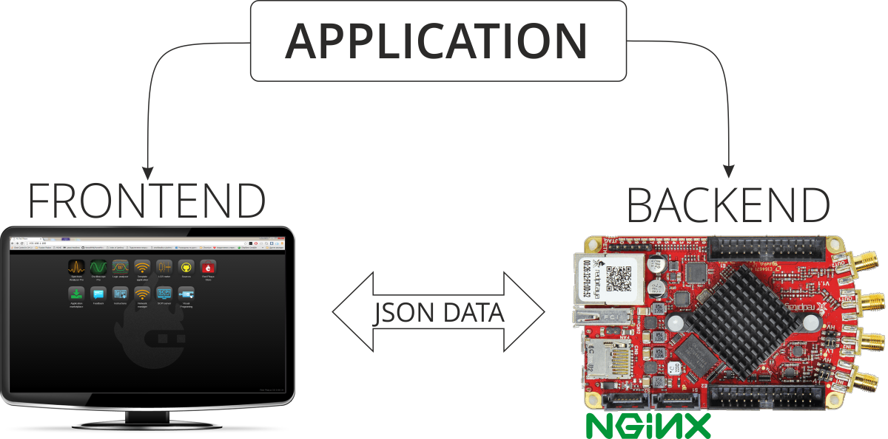
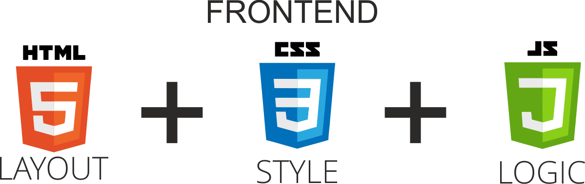
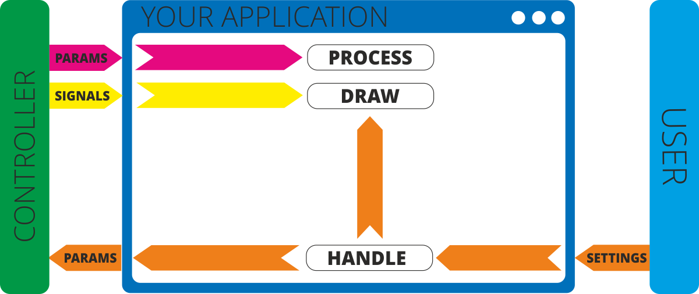
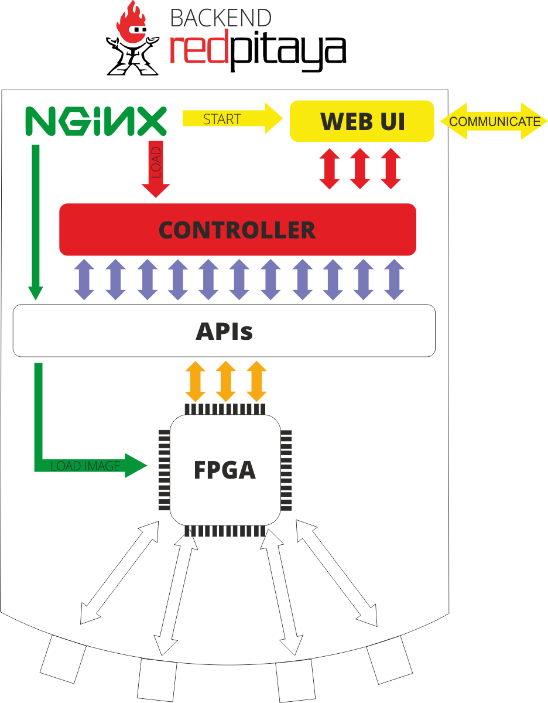

.. _webApp_sysOver:

###############
系统概览
###############

Red Pitaya Web 应用采用客户端-服务器架构，由两个不同组件组成：前端和后端。 
理解此架构对于开发自定义应用至关重要。

.. contents:: Table of Contents
    :local:
    :depth: 1
    :backlinks: top

|

架构概览
======================

|

Red Pitaya 应用由以下部分组成：

**Frontend (Client)**

    运行在浏览器中的 Web 用户界面，负责可视化、用户输入和表示逻辑。

**Backend (Server)**

    运行在 Red Pitaya 硬件上的 C/C++ 控制器，负责硬件控制、信号处理和设备状态。

These components communicate via WebSocket connections using Red Pitaya's network APIs, which handle all data transfer 
automatically. 只需遵循以下引用中描述的 API 结构： :ref:`Add a button to control LED <ABCLED>`.

|

前端组件
===================

前端是用户直接交互的基于浏览器的界面，使用现代 Web 技术：

* **HTML5** ——应用结构和布局
* **CSS3** ——视觉样式与响应式设计
* **JavaScript** ——应用逻辑与交互

|

设计理念
------------------

前端应专注于可视化和用户交互。繁重计算及硬件控制应放在后端，使前端保持轻量并能快速响应。

|

应用工作流
---------------------

|

**Typical user interaction flow:**

1. **用户输入** - 用户在 Web 界面中修改设置
2. **本地更新** - UI 可立即应用视觉变化
3. **后端通信** - UI 通过 WebSocket 向控制器发送参数变化
4. **后端处理** - Controller:
   
   * 更新内部变量
   * 修改设备状态
   * 根据算法执行计算
   * 生成新参数或信号

5. **响应** - 控制器以 JSON 格式将结果发送回 UI
6. **可视化** - UI 接收数据并更新显示

|

后端组件
==================

后端是作为应用控制器的 Linux 共享库（`.so` 文件），负责管理硬件交互并实现应用的核心逻辑。

|

后端功能
---------------------

控制器通过以下方式与 Red Pitaya 硬件交互：

**Parameters**

    维护应用状态和设置的变量

**Signals**

    用于收集和传输测量数据数组的数据容器

**Hardware access**

    直接控制：
    
    * 数字 I/O 引脚
    * 板载 LED
    * 快速模拟输入/输出
    * FPGA 配置

.. note::

    参数和信号是可选的。仅使用应用所需的部分。

|

Nginx 集成
==================

Red Pitaya 使用 Nginx 作为 Web 应用平台，提供快速可靠的应用托管。

应用生命周期
----------------------

**When you launch an application:**

1. **Web 服务器** - Nginx 提供应用的 HTML/CSS/JavaScript 文件
2. **FPGA 加载** - 系统加载指定 FPGA 镜像（未指定时保留当前镜像）
3. **控制器加载** - 应用的 `.so` 库加载到内存中
4. **WebSocket 初始化** - 控制器建立 WebSocket 连接
5. **前端通知** - JavaScript 接收建立客户端 WebSocket 的确认
6. **数据交换** - 前端和后端通过 WebSocket 上的 JSON 消息通信
7. **硬件交互** - 控制器按需从 Red Pitaya API 请求数据
8. **FPGA 操作** - API 在 FPGA 内处理数据

.. warning::

    **单模块限制：** Nginx 一次只能加载一个控制器模块。加载新模块会 
    自动卸载之前的模块。如果控制器发生内部错误，Nginx 不会自动重新加载；错误处理由开发者负责。

.. note::

    开发应用程序时，请始终确认使用了正确的 FPGA 镜像。FPGA 配置必须符合控制器的要求。

|

其他资源
=====================

创建 Web 应用的分步教程位于 :rp-github:`Web Tutorial Example <RedPitaya-Examples/tree/dev/web-tutorial>` repository.
