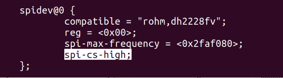

#########################
SPI 接口
#########################

无需特定 FPGA 代码即可在 :ref:`E2 <E2_orig_gen>` 连接器上使用 SPI 接口。

默认情况下，所有 RedPitaya 板卡的 SPI CS 状态均为 HIGH（非活动）。

若要将默认值设为 LOW（非活动），需要重新构建设备树；此操作可直接在 Red Pitaya 上完成。
首先，在控制台中使用以下命令打开设备树描述文件。

.. code-block:: console

   root@rp-f01c3d:~# rw
   root@rp-f01c3d:~# nano /opt/redpitaya/dts/$(monitor -f)/dtraw.dts

在文件中找到 SPI 设备：spidev@0
并向该设备添加 *spi-cs-high* 行；

   SPI 配置示例

之后重新构建设备树并重启板卡

.. code-block:: console

   root@rp-f01c3d:~# cd /opt/redpitaya/dts/$(monitor -f)/
   root@rp-f01c3d:~# dtc -I dts -O dtb ./dtraw.dts -o devicetree.dtb
   root@rp-f01c3d:~# reboot

.. note::

   设置仅在设备树加载后生效。 板卡启动时 CS 值处于 HIGH 状态，但启动完成后会变为 LOW。

.. note::

   也可以通过设置切换驱动模式。参见以下命令： :ref:`hw api <command_list>`:

   * rp_SPI_GetCSMode
   * rp_SPI_SetCSMode
