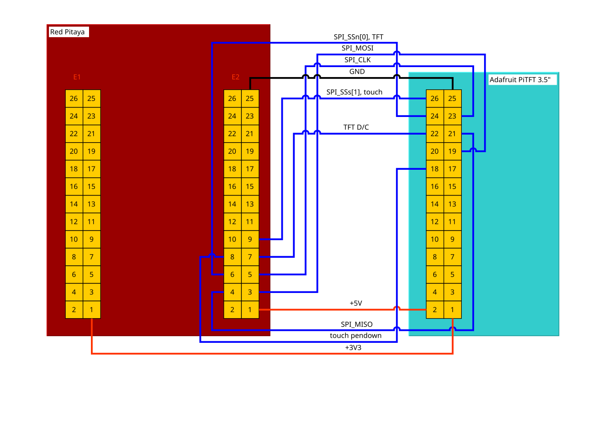
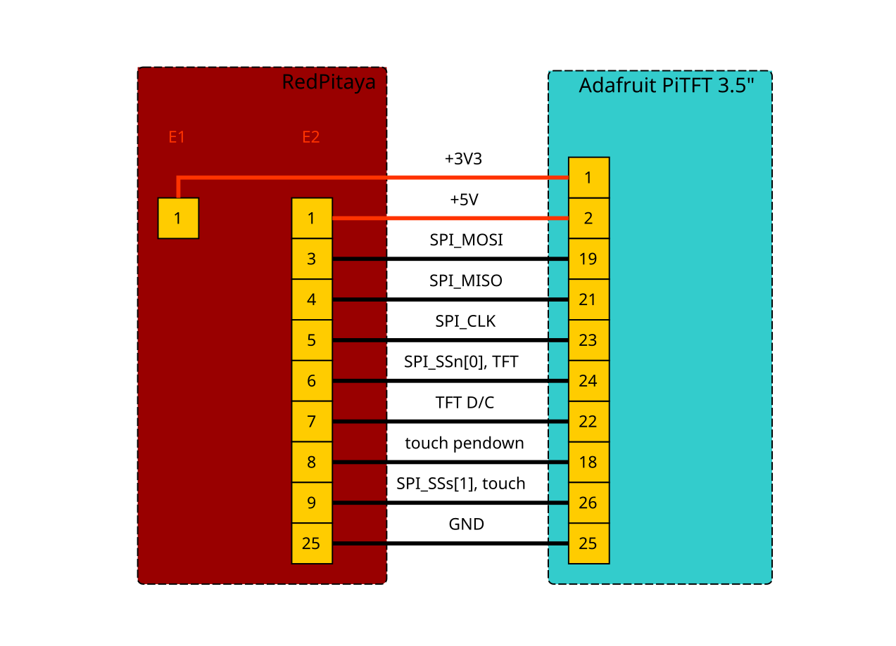
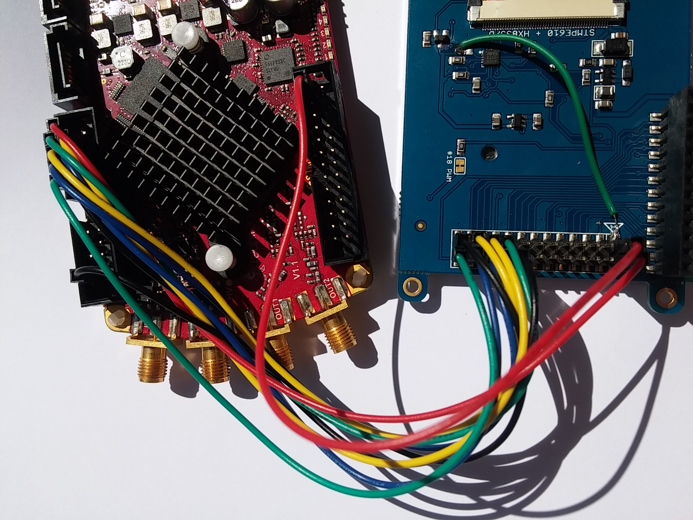

.. _tft_displays:

#######################################
连接带触摸功能的 SPI TFT 显示屏
#######################################

.. note::

   **说明适用于 OS 0.97 和 0.98 版本！** （也可能适用于 OS 1.04 版本，但未经测试）

   本节中的所有链接都指向 |2022.2 GitHub branch| （release 1.04-28）和 |RedPitaya-FPGA|，相关文件位于其中。

.. |2022.2 GitHub branch| replace:: :rp-github:`2022.2 GitHub branch <RedPitaya/tree/release-2022.2>`

.. |RedPitaya-FPGA| replace:: :rp-github:`Red Pitaya FPGA repository <RedPitaya-FPGA/tree/master>`

本文介绍如何将带触摸功能的 SPI 接口 TFT 显示屏连接到 :ref:`E2 <E2_orig_gen>` 连接器，无需专用 FPGA 代码。
该设置既有优点，也有缺点。

**优点：**

* 仅使用 ``MIO`` 信号，因此可与任何 FPGA 镜像配合使用。
* 只使用扩展连接器 :ref:`E2 <E2_orig_gen>`。
* SPI 不经过 FPGA 布线，因此可以使用最高时钟速度。

**缺点：**

* 与 SPI、I2C 和 UART 共享的 MIO 信号会被占用，因此这些接口不能用于其他用途。
* 无法访问板载 I2C EEPROM，这可能导致在 EEPROM 中存储校准数据的程序出现问题。
* 不支持背光控制。

|

*****************
硬件设置
*****************

pinctrl
===========

可以使用 ``pinctrl`` 内核驱动重新配置 **Zynq** MIO 信号。
本 TFT 显示屏设置利用这一功能，将 :ref:`E2 <E2_orig_gen>` 连接器上的 SPI、I2C 和 UART 信号重新用作 TFT 显示接口所需的 SPI 和 GPIO 信号。

.. !!!! TODO Update to 2.00 !!!!!

通过包含 |tft-E2| 执行重新配置。

- :download: |tft-E2|

.. |tft-E2| replace:: :rp-github:`tft-E2 device tree <RedPitaya-FPGA/blob/master/dts/tft/tft-E2.dtsi>`

+-----------------+-----+----------+--------+--------+----------+-----+-------------------+
| SPI TFT+touch   | MIO | function |    pin |  pin   | function | MIO | SPI TFT+touch     |
+=================+=====+==========+========+========+==========+=====+===================+
|                 |     | GND      | ``26`` | ``25`` | GND      |     | GND               |
+-----------------+-----+----------+--------+--------+----------+-----+-------------------+
|                 |     | ADC_CLK- | ``24`` | ``23`` | ADC_CLK+ |     |                   |
+-----------------+-----+----------+--------+--------+----------+-----+-------------------+
|                 |     | GND      | ``22`` | ``21`` | GND      |     |                   |
+-----------------+-----+----------+--------+--------+----------+-----+-------------------+
|                 |     | AO[3]    | ``20`` | ``19`` | AO[2]    |     |                   |
+-----------------+-----+----------+--------+--------+----------+-----+-------------------+
|                 |     | AO[1]    | ``18`` | ``17`` | AO[0]    |     |                   |
+-----------------+-----+----------+--------+--------+----------+-----+-------------------+
|                 |     | AI[3]    | ``16`` | ``15`` | AI[2]    |     |                   |
+-----------------+-----+----------+--------+--------+----------+-----+-------------------+
|                 |     | AI[1]    | ``14`` | ``13`` | AI[0]    |     |                   |
+-----------------+-----+----------+--------+--------+----------+-----+-------------------+
|                 |     | I2C_GND  | ``12`` | ``11`` | common   |     |                   |
+-----------------+-----+----------+--------+--------+----------+-----+-------------------+
| TFT RESETn      | 51  | I2C SDA  | ``10`` |  ``9`` | I2C_SCK  | 50  | SPI_SSs[1], touch |
+-----------------+-----+----------+--------+--------+----------+-----+-------------------+
| touch pendown   | 9   | UART_RX  |  ``8`` |  ``7`` | UART_TX  | 8   | TFT D/C           |
+-----------------+-----+----------+--------+--------+----------+-----+-------------------+
| SPI_SSn[0], TFT | 13  | SPI_CS   |  ``6`` |  ``5`` | SPI_CLK  | 12  | SPI_SCLK          |
+-----------------+-----+----------+--------+--------+----------+-----+-------------------+
| SPI_MISO        | 11  | SPI_MISO |  ``4`` |  ``3`` | SPI_MOSI | 10  | SPI_MOSI          |
+-----------------+-----+----------+--------+--------+----------+-----+-------------------+
|                 |     | -4V      |  ``2`` |  ``1`` | +5V      |     | +5V               |
+-----------------+-----+----------+--------+--------+----------+-----+-------------------+

|

由于部分信号共享已连接 EEPROM 的 I2C 总线，可能会发生功能冲突。
尽管 I2C EEPROM 进入活动状态的概率很低，但 I2C 设备只有在总线上出现 I2C 启动条件后才会响应。
启动条件要求 SDA 和 SCL 信号同时为低电平。这里假设 TFT 显示屏的 RESETn（低电平有效）不会与触摸控制器的 SPI SSn（低电平有效）同时生效。

尝试访问 I2C EEPROM 不会干扰显示屏，但会返回超时。
这可能（而且很可能）导致使用 I2C EEPROM 的应用出现问题，例如 *Oscilloscope* 应用访问校准数据时。

没有剩余的 MIO 引脚可用于背光控制，最简单的解决方案是将显示屏背光引脚直接连接到 VCC。

SPI 时钟速度
==================

根据驱动 SPI 控制器的时钟，只能设置有限的一组 SPI 时钟速度。
SPI 控制器本身只提供 2 的幂次时钟分频选项。
详情请参见 `Zynq TRM <https://www.xilinx.com/support/documentation/user_guides/ug585-Zynq-7000-TRM.pdf>`_（*B.30 SPI Controller (SPI)* 章节中的 ``BAUD_RATE_DIV`` 寄存器）。

下表列出了两种 SPI 控制器时钟设置下的可用频率。
该 SPI 控制器的最大时钟速度为 50 MHz。

+----------------------+------+------+------+------+-------+-------+-------+
| SPI controller clock | f/4  | f/8  | f/16 | f/32 | f/64  | f/128 | f/256 |
+======================+======+======+======+======+=======+=======+=======+
|            166.6 MHz | 41.6 | 20.8 | 10.4 | 5.21 | 2.60  | 1.30  | 0.63  |
+----------------------+------+------+------+------+-------+-------+-------+
|            166.6 MHz | 41.6 | 20.8 | 10.4 | 5.21 | 2.60  | 1.30  | 0.63  |
+----------------------+------+------+------+------+-------+-------+-------+
|            200.0 MHz | 50.0 | 25.0 | 12.5 | 6.25 | 3.125 | 1.56  | 0.781 |
+----------------------+------+------+------+------+-------+-------+-------+

|

****************
软件设置
****************

.. !!!! TODO Update to 2.00 !!!!!

- :download: |tft.sh|

.. |tft.sh| raw:: html

    <a href="https://github.com/RedPitaya/RedPitaya/blob/release-2022.2/OS/debian/tft.sh" target="_blank">tft.sh</a>

以下是用于在 TFT 显示屏上启动 XFCE 的说明。
GitHub 上提供了可生成完整支持镜像的脚本 tft.sh。

应安装以下 Ubuntu/Debian 软件包：

.. code-block:: shell-session

   apt-get -y install \
     python3 python3-numpy build-essential libfftw3-dev python3-scipy \
     xfonts-base tightvncserver xfce4-panel xfce4-session xfwm4 xfdesktop4 \
     xfce4-terminal thunar gnome-icon-theme \
     xserver-xorg xinit xserver-xorg-video-fbdev

.. !!!! TODO Update to 2.00 !!!!!

- :download: |99-fbdev.conf|

.. |99-fbdev.conf| raw:: html

    <a href="https://github.com/RedPitaya/RedPitaya/blob/release-2022.2/OS/debian/overlay/usr/share/X11/xorg.conf.d/99-fbdev.conf" target="_blank">99-fbdev.conf</a>

应将 X11 配置文件 99-fbdev.conf 添加到系统中。

通过 SSH 启动 X 服务器：

.. code-block:: shell-session

   startx

|

**************************
已测试/支持的设备
**************************

下表列出支持的设备及对应设备树文件；每个文件支持的显示屏取决于所使用的 TFT 和触摸驱动。

+---------------+-------------------------------+-----------------------------------+-------------------------+
|               | specifications                | technical details                 | device tree             |
|               +------+------------+-----------+----------------+------------------+                         |
| screen name   | size | resolution | touch     | TFT controller | touch controller |                         |
+===============+======+============+===========+================+==================+=========================+
| |MI0283QT-2|  | 2.8" | 240x320    |           | |ILI9341|      | |ADS7846|        | |tft-ili9341-ads7846|   |
+---------------+------+------------+-----------+----------------+------------------+-------------------------+
| |PiTFT-35|    | 3.5" | 480x320    | resistive | |HX8357D|      | |STMPE610|       | |tft-hx8357d-stmpe601|  |
+---------------+------+------------+-----------+----------------+------------------+-------------------------+

.. !!!! TODO Update to 2.00 !!!!!

.. |MI0283QT-2| raw:: html

    <a href="https://github.com/watterott/MI0283QT-Adapter" target="_blank">MI0283QT Adapter Rev 1.5</a>

.. |ILI9341| raw:: html

    <a href="https://cdn-shop.adafruit.com/datasheets/ILI9341.pdf" target="_blank">ILI9341</a>

.. |ADS7846| raw:: html

    <a href="http://www.ti.com/lit/ds/symlink/ads7846.pdf" target="_blank">ADS7846</a>

.. |tft-ili9341-ads7846| raw:: html

    <a href="https://github.com/RedPitaya/RedPitaya-FPGA/blob/master/dts/tft/tft-ili9341-ads7846.dtsi" target="_blank">tft-ili9341-ads7846.dtsi</a>

|

MI0283QT Adapter Rev 1.5
========================

设备由 **+5V** 供电，并通过板载 LDO 生成 3.3V。
因此所有 IO 均为 3.3V，不会产生冲突。

连接器引脚排列基于 |MI0283QT-2| 的
`原理图 <https://github.com/watterott/MI0283QT-Adapter/blob/master/hardware/MI0283QT_v15.pdf>`_。

+-------------------+-----------+--------+--------+-----------+-------------------+
| SPI TFT+touch     |           |    pin |  pin   |           | SPI TFT+touch     |
+===================+===========+========+========+===========+===================+
|                   | ADS_VREF  | ``16`` | ``15`` | ADS_VBAT  |                   |
+-------------------+-----------+--------+--------+-----------+-------------------+
|                   | ADS_AUX   | ``14`` | ``13`` | ADS_IRQ   | touch pendown     |
+-------------------+-----------+--------+--------+-----------+-------------------+
| TFT D/C           | BUSY-RS   | ``12`` | ``11`` | A-ADS_CS  | SPI_SSs[1], touch |
+-------------------+-----------+--------+--------+-----------+-------------------+
| SPI_SCLK          | A-SCL     | ``10`` |  ``9`` | SDO       | SPI_MISO          |
+-------------------+-----------+--------+--------+-----------+-------------------+
| SPI_MOSI          | A-SDI     |  ``8`` |  ``7`` | A-LCD_CS  | SPI_SSn[0], TFT   |
+-------------------+-----------+--------+--------+-----------+-------------------+
| TFT RESETn        | A-LCD_RST |  ``6`` |  ``5`` | LCD_LED   | backlight         |
+-------------------+-----------+--------+--------+-----------+-------------------+
| +5V               | VCC       |  ``4`` |  ``3`` | VCC       |                   |
+-------------------+-----------+--------+--------+-----------+-------------------+
| GND               | GND       |  ``2`` |  ``1`` | GND       |                   |
+-------------------+-----------+--------+--------+-----------+-------------------+

|

:ref:`E2 <E2_orig_gen>` 连接器不提供背光控制。
简单的解决方案是将 **LCD_LED** 信号连接到 +5V VCC，
可以使用跳线连接显示连接器上的两个引脚来实现。
也可以重新利用 Red Pitaya 上的一个 LED。

.. !!!! TODO Update to 2.00 !!!!!

- :download:|95-ads7846.rules|

.. |95-ads7846.rules| raw:: html

    <a href="https://github.com/RedPitaya/RedPitaya/blob/release-2022.2/OS/debian/overlay/etc/udev/rules.d/95-ads7846.rules" target="_blank">95-ads7846.rules</a>

95-ads7846.rules UDEV 规则会创建符号链接 ``/dev/input/touchscreen``。

|

Adafruit PiTFT 3.5"
===================

.. |PiTFT-35| raw:: html

    <a href="https://learn.adafruit.com/adafruit-pitft-3-dot-5-touch-screen-for-raspberry-pi" target="_blank">Adafruit PiTFT 3.5" Touch Screen for Raspberry Pi</a>

.. |PiTFTa-35| raw:: html

    <a href="https://www.adafruit.com/product/2097" target="_blank">PiTFT - Assembled 480x320 3.5" TFT+Touchscreen for Raspberry Pi</a>

.. _PiTFTa-35-img: https://cdn-learn.adafruit.com/assets/assets/000/019/744/original/adafruit_products_2097_quarter_ORIG.jpg

.. |PiTFTp-35| raw:: html

    <a href="https://www.adafruit.com/product/2441" target="_blank">PiTFT Plus 480x320 3.5" TFT+Touchscreen for Raspberry Pi</a>

.. _PiTFTp-35-img: https://cdn-shop.adafruit.com/970x728/2441-11.jpg

.. |HX8357D| raw:: html

    <a href="https://cdn-shop.adafruit.com/datasheets/HX8357-D_DS_April2012.pdf" target="_blank">HX8357D</a>

.. |STMPE610| raw:: html

    <a href="https://cdn-shop.adafruit.com/datasheets/STMPE610.pdf" target="_blank"STMPE610</a>

.. !!!! TODO Update to 2.00 !!!!!

.. |tft-hx8357d-stmpe601| raw:: html

    <a href="https://github.com/RedPitaya/RedPitaya-FPGA/blob/master/dts/tft/tft-hx8357d-stmpe601.dtsi" target="_blank">tft-hx8357d-stmpe601.dtsi</a>

该显示屏有两个版本：较旧的 **Assembled**（有时称为 **Original**）和较新的 **Plus**。

* |PiTFTa-35| (`high resolution image <PiTFTa-35-img_>`_)
* |PiTFTp-35| (`high resolution image <PiTFTp-35-img_>`_)

较新的 **Plus** 版本开箱即可使用，而较旧的 **Assembled** 需要进行硬件修改，详情请参见下文 `see below <assembled_hw_mods>`。

设备由 **+5V**（用于背光 LED）以及供 TFT 和触摸控制器使用的 **+3.3V** 供电（应从 Red Pitaya 的 E1 连接器获取）。因此所有 IO 均为 3.3V，不会产生冲突。

公头连接器引脚排列基于 |PiTFT-35| 的
`原理图 <https://cdn-learn.adafruit.com/assets/assets/000/019/763/original/adafruit_products_schem.png?1411058465>`__。

+-------------------+--------+--------+-------------------+
| SPI TFT+touch     |    pin |  pin   | SPI TFT+touch     |
+===================+========+========+===================+
| SPI_SSs[1], touch | ``26`` | ``25`` | GND               |
+-------------------+--------+--------+-------------------+
| SPI_SSn[0], TFT   | ``24`` | ``23`` | SPI_SCLK          |
+-------------------+--------+--------+-------------------+
| TFT D/C           | ``22`` | ``21`` | SPI_MISO          |
+-------------------+--------+--------+-------------------+
| GND               | ``20`` | ``19`` | SPI_MOSI          |
+-------------------+--------+--------+-------------------+
| touch pendown     | ``18`` | ``17`` |                   |
+-------------------+--------+--------+-------------------+
|                   | ``16`` | ``15`` |                   |
+-------------------+--------+--------+-------------------+
| GND               | ``14`` | ``13`` |                   |
+-------------------+--------+--------+-------------------+
|                   | ``12`` | ``11`` |                   |
+-------------------+--------+--------+-------------------+
|                   | ``10`` |  ``9`` | GND               |
+-------------------+--------+--------+-------------------+
|                   |  ``8`` |  ``7`` |                   |
+-------------------+--------+--------+-------------------+
| GND               |  ``6`` |  ``5`` |                   |
+-------------------+--------+--------+-------------------+
|                   |  ``4`` |  ``3`` |                   |
+-------------------+--------+--------+-------------------+
| +5V               |  ``2`` |  ``1`` | +3.3V             |
+-------------------+--------+--------+-------------------+

|

.. !!!! TODO Update to 2.00 !!!!!

- :download:|95-stmpe.rules|
- :download:|99-calibration.conf|

95-stmpe.rules UDEV 规则会创建符号链接 ``/dev/input/touchscreen``。

应将校准文件 99-calibration.conf 添加到系统中。

.. |95-stmpe.rules| raw:: html

    <a href="https://github.com/RedPitaya/RedPitaya/blob/release-2022.2/OS/debian/overlay/etc/udev/rules.d/95-stmpe.rules" target="_blank">95-stmpe.rules</a>

.. |99-calibration.conf| raw:: html

    <a href="https://github.com/RedPitaya/RedPitaya/blob/release-2022.2/OS/debian/overlay/etc/X11/xorg.conf.d/99-calibration.conf" target="_blank">99-calibration.conf</a>

|

框图
--------------

   Red Pitaya :ref:`E2 <E2_orig_gen>` 连接器与 Adafruit PiTFT 3.5" 的连接示意图。

   Red Pitaya :ref:`E2 <E2_orig_gen>` 连接器与 Adafruit PiTFT 3.5" 的简化连接示意图。引脚位置请参见上图。

|

.. _assembled_hw_mods:

Assembled 版本硬件修改
----------------------------------------

说明
~~~~~~~~~~~

设备仅由一路 **+5V** 电源供电，并通过板载 LDO 生成 3.3V。
因此，Red Pitaya 与显示屏之间的 3.3V 接口两侧使用不同的电源。
由于两个电源不会同时启动，触摸控制器的 SPI 接口配置在上电复位期间会出现竞争条件。
TFT 板上的 LDO 比 Red Pitaya 上的开关电源启动更快。

|STMPE610| 触摸控制器数据手册（第 5.2 节）说明了 CPOL/CPHA SPI 配置选项如何取决于一对配置引脚的上电复位状态。

+------------------------------+------+---------------------------------+------+
| CPOL_N (I2C data/SPI CS pin) | CPOL | CPHA (I2C address/SPI MISO pin) | Mode |
+==============================+======+=================================+======+
| 1                            | 0    | 0                               | 0    |
+------------------------------+------+---------------------------------+------+
| 1                            | 0    | 1                               | 1    |
+------------------------------+------+---------------------------------+------+
| 0                            | 1    | 0                               | 2    |
+------------------------------+------+---------------------------------+------+
| 0                            | 1    | 1                               | 3    |
+------------------------------+------+---------------------------------+------+

在原始设置中（应用 ``pinctrl`` 设备树之前），E2 连接器的触摸芯片 SPI CS 信号被用作 I2C_SCK。
SPI MISO 引脚不受 ``pinctrl`` 更改影响。

以下两者之间似乎存在竞争条件：

1. 由直接来自 +3.3V LDO（5V USB 电源连接器）的 STMPE610 电源决定时序的配置读取事件
2. Red Pitaya 上 3.3V 电源的启动，该电源为 I2C 引脚的上拉电阻和 E2 连接器上 SPI MISO 引脚的 FPGA 上拉供电

大多数情况下，TFT 板上的 LDO 会先于 Red Pitaya 上的开关电源启动，因此 ``CPOL_N`` 会被检测为 ``0``，从而反转 SPI 时钟极性。
作为不可靠的修复方案，可以在 |tft-hx8357d-stmpe601| 设备树中提供 ``spi-cpol`` 属性。

.. note::

   尚未确认电源竞争条件是否导致某些设置下触摸功能失效，可能需要进一步测试。

提供的示波器图像显示了 3.3V 上电序列及其与 SPI 配置信号的关系。
可以看出配置信号是稳定的。

通道：

1. `CPHA` （上电期间信号为低电平），
2. `CPOL_N` （通过上拉连接到 3.3V，并同步上升），
3. 3.3V（从 0V 上升到 3.3V 约需 1.5 ms）。

.. figure:: img/POR_SPI_config.png
   :align: center

修改
~~~~~~~~~~~~~

为避免电源竞争条件，可以禁用 **Assembled** TFT 板上的 LDO，改用 Red Pitaya 提供的 +3.3V。
这样可使 **Assembled** 的电源方案与 **Plus** 版本相似。

需要进行以下修改：

1. 移除 +3.3V LDO，或至少抬高板上的电源输出引脚。
2. 将 JP1 连接器的引脚 1 连接到 +3.3V 电源线。

下图显示了一个抬高 LDO 电源输出、并将 JP1 连接器引脚 1 连接到未安装电阻焊盘的 TFT 板。

|

***************************
调试/故障排除
***************************

``pinctrl``, GPIO and interrupts
================================

查看当前 ``pinctrl`` 设置：

.. code-block:: shell-session

   $ cat /sys/kernel/debug/pinctrl/pinctrl-maps

查看 GPIO 信号状态：

.. code-block:: shell-session

   $ cat /sys/kernel/debug/gpio

查看中断状态：

.. code-block:: shell-session

   $ cat /proc/interrupts

|

触摸
=====

可以使用 ``evtest`` 查看低级触摸事件（以及键盘/鼠标事件）：

.. code-block:: shell-session

   sudo apt-get install -y evtest

|
