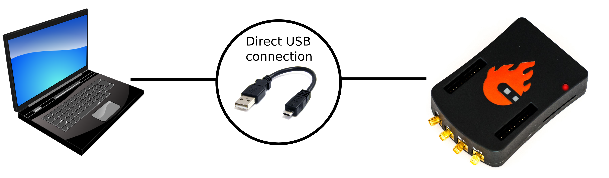
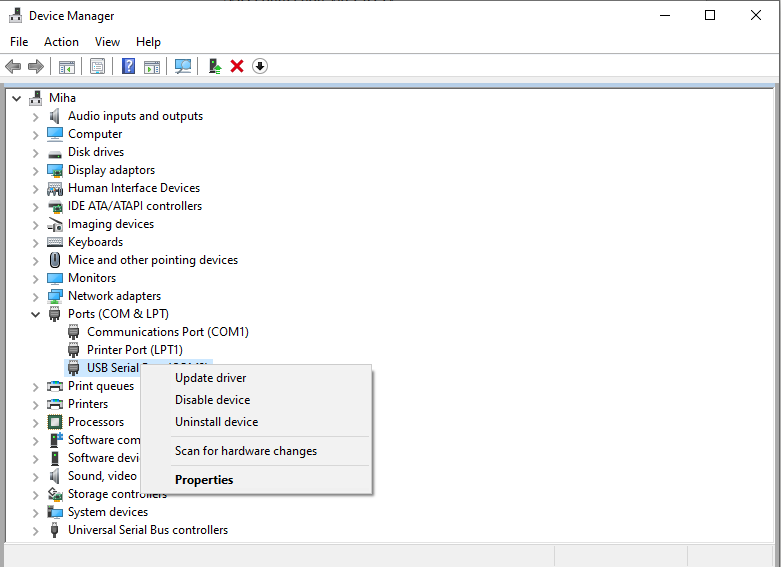
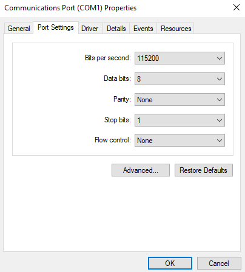
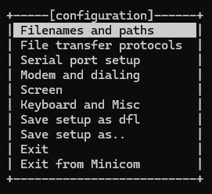
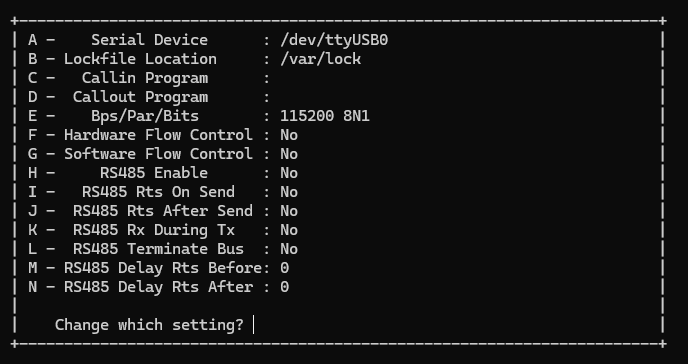

.. _console:

###############################
设置串行控制台
###############################

.. contents:: 目录
    :local:
    :backlinks: top
    :depth: 2

什么是串行控制台？
==========================

串行控制台是一种基于文本的接口，用户可以通过串行连接与 Red Pitaya 板卡交互。它提供了一种可靠的方式来访问和管理 Red Pitaya 板卡，尤其适用于网络连接不可用或排查问题时。通过串行控制台，用户可以监视启动过程、查看系统日志，并直接在 Red Pitaya 板卡上执行命令。

可以使用串行控制台跟踪启动过程：

1.  **FSBL** （如果启用了调试模式）

    串行控制台也可用于查看其他裸机应用的输出，例如内存测试。

2.  **U-Boot**

    在启动过程中，U-Boot 会显示状态和调试信息。

    FSBL 启动 U-Boot 后，U-Boot 启动 Linux 内核前会延迟 3 秒。如果在此期间按下按键，U-boot 将停止启动过程，并让用户进入其 shell。

3.  **Linux 控制台**

    在启动过程中，Linux 会显示状态和调试信息。启动完成后，用户将自动以 root 用户登录，并可访问 Linux shell。随后即可通过串行控制台执行命令和管理 Red Pitaya 板卡。

硬件设置
==============

设置串行控制台还需要以下硬件：

- **所有 Gen 2 和 TI 型号** - USB 转 USB-C 线缆
- **所有 STEMlab 125-14 和 SDRlab 122-16 型号** - USB 转 micro USB 线缆。
- **SIGNALlab 250-12** - USB 转 USB-C 线缆
- **STEMlab 125-10** - 串行转 USB 适配器（必须先将引脚焊接到板卡上）

.. note::

    串行控制台线缆必须是数据线。电源线未连接所需的通信线路。

使用指定线缆连接 Red Pitaya 的 ``CON`` 端口与 PC，并按照对应操作系统的说明操作。

.. tabs::

    .. group-tab:: Gen 2 和 TI 板卡

        串行控制台的 USB-C 连接器位于 Ethernet 连接器正下方。

        .. figure:: img/Console_Gen2_TI_top.png
            :width: 500

        .. figure:: img/Console_Gen2_TI_bot.png
            :width: 500

    .. group-tab:: STEMlab 125-14 和 SDRlab 122-16

        串行控制台的 micro USB 连接器位于 SD 卡插槽下方（靠近板卡中央）。

        .. figure:: img/Console_STEMlab_125-14.jpg
            :width: 500

    .. group-tab:: SIGNALlab 250-12

        串行控制台的 USB-C 连接器位于板卡最边缘、SD 卡座旁边。

        .. figure:: img/Console_SIGNALlab.jpg
            :width: 500

    .. group-tab:: STEMlab 125-10

        串行控制台端口位于 USB-A 连接器与 SD 卡座之间。连接串行转 USB 适配器前，必须先将引脚焊接到板卡上。

        .. figure:: img/Console_STEMlab_125-10.jpg
            :width: 500

.. note::

    PC 上并非所有 USB 端口都支持串行控制台连接。如果连接遇到问题，请尝试使用 PC 上的其他 USB 端口。

软件要求
======================

此时假定 Red Pitaya 状态 LED 显示正常，表明 Red Pitaya 已通电并正在运行。如果情况并非如此，请参阅 :ref:`故障排除指南 <troubleshooting_guide>`。故障排除指南还会说明 Red Pitaya 状态 LED 的预期行为。

Windows
--------

在 PC 上下载并安装 |FTDI-driver|。安装后，设备管理器中会出现一个新的 COM 端口，可在 Hyperterminal 或其他终端工具中使用它连接 Red Pitaya。
将 Red Pitaya 连接到板卡上的 micro USB 端口。在终端工具中填写串行端口名称，并将**速度设置为 115200**。

要调整串行通信的连接设置，请右键单击 COM 端口并选择 Properties。

必须通过 ``Minicom`` 或类似的串行控制台应用查看启动参考信息。

**使用适用于 Linux 的 Windows 子系统（WSL）**

对于 Windows 用户，建议使用 WSL 配合 ``minicom`` 访问串行控制台。WSL 在 Windows 上提供 Linux 环境，允许将 USB 设备连接到 Linux 工具。

如果尚未设置 WSL，请先按照 :ref:`WSL 设置指南 <wsl_setup>` 操作。

设置好 WSL 后，按以下步骤连接 Red Pitaya 串行控制台：

1.  打开 *Windows PowerShell* 或 *Windows Terminal* （下文称为 Windows 终端）。
#.  在另一个窗口中以管理员身份打开 *Windows Terminal*，用于管理 USB 设备。
#.  在管理员 Windows 终端中列出所有可用 USB 设备，并找到 Red Pitaya 控制台的“bus-id”（显示为 *USB Serial Converter*）：

    .. code-block:: bash

        usbipd list

#.  将 Red Pitaya 控制台绑定到 WSL：

    .. code-block:: bash

        usbipd bind --busid <bus-id>   

#.  将 USB 串行转换器附加到 WSL：

    .. code-block:: bash

        usbipd attach --wsl --busid <bus-id>

    到目前为止的命令如下图所示：

    .. figure:: img/windows_terminal_commands.png
        :width: 1000

#.  在第一个 Windows 终端中启动 WSL：

    .. code-block:: bash

        wsl

#.  在 WSL 终端中确认 Red Pitaya 控制台已连接（应显示为 *ttyUSB0*）：

    .. code-block:: bash

        lsusb

    .. figure:: img/wsl_lsusb.png
        :width: 1000

#.  继续阅读下方的 *建立串行控制台连接* 部分。
#.  完成后，在管理员 Windows 终端中使用以下命令断开 Red Pitaya 控制台与 WSL 的连接：

    .. code-block:: bash

        usbipd detach --busid <bus-id>

Linux 和 Mac
--------------

Linux 内核广泛支持 USB 转串行转换器，因此大多数情况下，插入转换器后很快就会被检测到。

- |minicom|、|screen| 或类似的远程串行控制台设置程序。

建立串行控制台连接
=======================================

此时，Red Pitaya 应已通过 USB 转串行转换器连接到 PC，并且可以通过 WSL 或直接在 Linux 中访问 Linux 终端。

使用 ``dmesg`` 检查内核日志中的驱动输出：

.. code-block:: none
    :emphasize-lines: 11

    $ dmesg
    ...
    [95074.784075] usb 1-2.4.3: new full-speed USB device number 20 using ehci-pci
    [95074.885386] usb 1-2.4.3: New USB device found, idVendor=0403, idProduct=6015
    [95074.885399] usb 1-2.4.3: New USB device strings: Mfr=1, Product=2, SerialNumber=3
    [95074.885406] usb 1-2.4.3: Product: FT231X USB UART
    [95074.885411] usb 1-2.4.3: Manufacturer: FTDI
    [95074.885416] usb 1-2.4.3: SerialNumber: DN003P0Q
    [95074.890105] ftdi_sio 1-2.4.3:1.0: FTDI USB Serial Device converter detected
    [95074.890228] usb 1-2.4.3: Detected FT-X
    [95074.891157] usb 1-2.4.3: FTDI USB Serial Device converter now attached to ttyUSB0

连接到 PC 的第一块 Red Pitaya 板卡会创建名为 ``/dev/ttyUSB0`` 的设备。如果连接了 **N** 个 USB 或串行设备，它们将显示为 ``/dev/ttyUSBn``，其中 **n** 为 **{0, 1, ..., N-1}**。访问这些设备时，程序应使用 ``sudo`` 运行。

必须使用 Minicom 或类似的串行控制台应用查看启动参考日志。

``minicom``
------------

Minicom 是一种基于文本的调制解调器控制和终端仿真程序，通常用于设置远程串行控制台。

使用 ``-s`` 选项配置 ``minicom``。

.. code-block:: shell-session

    sudo minicom -s

随后会打开配置菜单。

进入 ``Serial Port Setup``，按 **Enter**，然后设置以下选项：

- Serial Device: ``/dev/ttyUSB0`` （设备索引为 ``0`` 或更大的数字）
- Bps/Par/Bits: ``115200 8N1`` （波特率、字节长度、奇偶校验和停止位）
- Hardware/Software Flow Control: No（应禁用流控制）

``Minicom`` 需要使用特殊的 ``Control+A`` 按键序列进行操作。最常用的命令如下：

    - 按 ``Control+A`` 后按 ``X`` 退出 Minicom
    - 按 ``Control+A`` 后按 ``Z`` 打开帮助菜单

详情请参阅 |minicom| 手册。

配置完成后退出设置。此时 Minicom 应已连接到 Red Pitaya：

.. figure:: img/minicom_connected.png
    :width: 1000

如果系统要求登录 Red Pitaya，请使用以下凭据：

    - **用户名：** ``root``
    - **密码：** ``root``

保持 Minicom 打开，拔掉 Red Pitaya 的电源。重新插入电源后，应能看到 Red Pitaya 的启动序列。

在启动序列开始时，可以按任意键停止自动启动过程并进入 Zynq U-Boot shell。这对于调试和修改启动参数很有用。

.. figure:: img/minicom_zynq_boot.png
    :width: 1000

如果看不到启动序列，请检查 Red Pitaya 与 PC 之间的连接以及 Minicom 中的设置。

``screen``
------------

GNU ``screen`` 通常是一个终端复用器。它也支持连接串行控制台，并提供配置串行连接波特率、字节长度、奇偶校验和流控制的语法。

与 ``Minicom`` 相比，它提供更好的字体，并支持调整终端窗口大小。

.. code-block:: shell-session

    $ sudo screen /dev/ttyUSB1 115200 cs8

与 ``Minicom`` 类似，``screen`` 需要使用特殊的 ``Control+A`` 按键序列进行操作。
详情请参阅 |screen| 手册。

配置方式与 ``Minicom`` 相同。详情请参阅上一节。

参考启动序列
=======================

可以将这些参考启动序列与自己的启动序列进行比较。

U-Boot
------

.. tabs::

    .. tab:: OS 2.00

        .. code-block::

            U-Boot 2022.01 (Nov 27 2024 - 05:10:38 +0000), Build: jenkins-RED_PITAYA_UNIFY-Kernel-212

            CPU:   Zynq 7z010
            Silicon: v3.1
            DRAM:  ECC disabled 512 MiB
            Flash: 0 Bytes
            NAND:  0 MiB
            MMC:   mmc@e0100000: 0
            Loading Environment from nowhere... OK
            In:    serial@e0000000
            Out:   serial@e0000000
            Err:   serial@e0000000
            Net:   
            ZYNQ GEM: e000b000, mdio bus e000b000, phyaddr 1, interface rgmii-id
            eth0: ethernet@e000b000
            Hit any key to stop autoboot:  3    2    1     0 
            Running script from SD...
            Device: mmc@e0100000
            Manufacturer ID: 3
            OEM: 5344
            Name: SB16G 
            Bus Speed: 50000000
            Mode: SD High Speed (50MHz)
            Rd Block Len: 512
            SD version 3.0
            High Capacity: Yes
            Capacity: 14.8 GiB
            Bus Width: 4-bit
            Erase Group Size: 512 Bytes
            5097 bytes read in 14 ms (355.5 KiB/s)
            ## Executing script at 02000000
            Setting bus to 0

            EEPROM @0x50 read: addr 0x00000000  off 0x1804  count 1024 ... done
            202704 bytes read in 54 ms (3.6 MiB/s)
            design filename = "red_pitaya_top;UserID=0XFFFFFFFF;COMPRESS=TRUE;Version=2020.1"
            part number = "7z010clg400"
            date = "2024/11/27"
            time = "00:07:47"
            bytes in bitstream = 202580
            zynq_align_dma_buffer: Align buffer at 1000007c to 10000040(swap 1)
            INFO:post config was not run, please run manually if needed
            Set devicetree and ramdisk high loading address to 0x20000000
            Loading from SD card (FAT file system) to memory
            Device: mmc@e0100000
            Manufacturer ID: 3
            OEM: 5344
            Name: SB16G 
            Bus Speed: 50000000
            Mode: SD High Speed (50MHz)
            Rd Block Len: 512
            SD version 3.0
            High Capacity: Yes
            Capacity: 14.8 GiB
            Bus Width: 4-bit
            Erase Group Size: 512 Bytes
            Load uImage
            6429880 bytes read in 364 ms (16.8 MiB/s)
            Load dts/z10_125/devicetree.dtb
            18180 bytes read in 33 ms (537.1 KiB/s)
            Booting Linux kernel with ramdisk and devicetree
            ## Booting kernel from Legacy Image at 02004000 ...
                Image Name:   Linux-5.15.0-xilinx
                Image Type:   ARM Linux Kernel Image (uncompressed)
                Data Size:    6429816 Bytes = 6.1 MiB
                Load Address: 00008000
                Entry Point:  00008000
                Verifying Checksum ... OK
            ## Flattened Device Tree blob at 04000000
                Booting using the fdt blob at 0x4000000
                Loading Kernel Image
                Loading Device Tree to 1ead7000, end 1eade703 ... OK

            Starting kernel ...

            Booting Linux on physical CPU 0x0
            Linux version 5.15.0-xilinx (jenkins@instance-1) (arm-linux-gnueabihf-gcc (GCC) 8.2.0, GNU ld (Linaro_Binutils-) 2.31) #1 SMP PREEMPT Wed Nov 27 05:12:29 UTC 2024
            CPU: ARMv7 Processor [413fc090] revision 0 (ARMv7), cr=18c5387d
            CPU: PIPT / VIPT nonaliasing data cache, VIPT aliasing instruction cache
            OF: fdt: Machine model: xlnx,zynq-7000
            Memory policy: Data cache writealloc
            OF: reserved mem: OVERLAP DETECTED!
            buffer@1000000 (0x01000000--0x03000000) overlaps with labuf@1000000 (0x01000000--0x03000000)
            Reserved memory: created CMA memory pool at 0x1f000000, size 16 MiB
            OF: reserved mem: initialized node linux,cma, compatible id shared-dma-pool
            Zone ranges:
            Normal   [mem 0x0000000000000000-0x000000001fffffff]
            HighMem  empty
            Movable zone start for each node
            Early memory node ranges
            node   0: [mem 0x0000000000000000-0x000000001fffffff]
            Initmem setup node 0 [mem 0x0000000000000000-0x000000001fffffff]
            percpu: Embedded 12 pages/cpu s18572 r8192 d22388 u49152
            Built 1 zonelists, mobility grouping on.  Total pages: 129920
            Kernel command line: console=ttyPS0,115200 root=/dev/mmcblk0p2 ro rootfstype=ext4 earlyprintk rootwait uio_pdrv_genirq.of_id=generic-uio
            Unknown command line parameters: earlyprintk
            Dentry cache hash table entries: 65536 (order: 6, 262144 bytes, linear)
            Inode-cache hash table entries: 32768 (order: 5, 131072 bytes, linear)
            mem auto-init: stack:off, heap alloc:off, heap free:off
            Memory: 455572K/524288K available (9216K kernel code, 373K rwdata, 2740K rodata, 1024K init, 142K bss, 52332K reserved, 16384K cma-reserved, 0K highmem)
            rcu: Preemptible hierarchical RCU implementation.
            rcu: 	RCU event tracing is enabled.
            rcu: 	RCU restricting CPUs from NR_CPUS=4 to nr_cpu_ids=2.
                Trampoline variant of Tasks RCU enabled.
                Tracing variant of Tasks RCU enabled.
            rcu: RCU calculated value of scheduler-enlistment delay is 10 jiffies.
            rcu: Adjusting geometry for rcu_fanout_leaf=16, nr_cpu_ids=2
            NR_IRQS: 16, nr_irqs: 16, preallocated irqs: 16
            efuse mapped to (ptrval)
            slcr mapped to (ptrval)
            GIC physical location is 0xf8f01000
            L2C: platform modifies aux control register: 0x72360000 -> 0x72760000
            L2C: DT/platform modifies aux control register: 0x72360000 -> 0x72760000
            L2C-310 erratum 769419 enabled
            L2C-310 enabling early BRESP for Cortex-A9
            L2C-310 full line of zeros enabled for Cortex-A9
            L2C-310 ID prefetch enabled, offset 1 lines
            L2C-310 dynamic clock gating enabled, standby mode enabled
            L2C-310 cache controller enabled, 8 ways, 512 kB
            L2C-310: CACHE_ID 0x410000c8, AUX_CTRL 0x76760001
            random: get_random_bytes called from start_kernel+0x36c/0x5f8 with crng_init=0
            zynq_clock_init: clkc starts at (ptrval)
            Zynq clock init
            sched_clock: 64 bits at 166MHz, resolution 6ns, wraps every 4398046511103ns
            clocksource: arm_global_timer: mask: 0xffffffffffffffff max_cycles: 0x26703d7dd8, max_idle_ns: 440795208065 ns
            Switching to timer-based delay loop, resolution 6ns
            Console: colour dummy device 80x30
            Calibrating delay loop (skipped), value calculated using timer frequency.. 333.33 BogoMIPS (lpj=1666666)
            pid_max: default: 32768 minimum: 301
            Mount-cache hash table entries: 1024 (order: 0, 4096 bytes, linear)
            Mountpoint-cache hash table entries: 1024 (order: 0, 4096 bytes, linear)
            CPU: Testing write buffer coherency: ok
            CPU0: Spectre v2: using BPIALL workaround
            CPU0: thread -1, cpu 0, socket 0, mpidr 80000000
            Setting up static identity map for 0x100000 - 0x100060
            rcu: Hierarchical SRCU implementation.
            smp: Bringing up secondary CPUs ...
            CPU1: thread -1, cpu 1, socket 0, mpidr 80000001
            CPU1: Spectre v2: using BPIALL workaround
            smp: Brought up 1 node, 2 CPUs
            SMP: Total of 2 processors activated (666.66 BogoMIPS).
            CPU: All CPU(s) started in SVC mode.
            devtmpfs: initialized
            VFP support v0.3: implementor 41 architecture 3 part 30 variant 9 rev 4
            clocksource: jiffies: mask: 0xffffffff max_cycles: 0xffffffff, max_idle_ns: 19112604462750000 ns
            futex hash table entries: 512 (order: 3, 32768 bytes, linear)
            pinctrl core: initialized pinctrl subsystem
            NET: Registered PF_NETLINK/PF_ROUTE protocol family
            DMA: preallocated 256 KiB pool for atomic coherent allocations
            thermal_sys: Registered thermal governor 'step_wise'
            cpuidle: using governor menu
            amba f8801000.etb: Fixing up cyclic dependency with replicator
            amba f8803000.tpiu: Fixing up cyclic dependency with replicator
            amba f8804000.funnel: Fixing up cyclic dependency with replicator
            amba f889c000.ptm: Fixing up cyclic dependency with f8804000.funnel
            amba f889d000.ptm: Fixing up cyclic dependency with f8804000.funnel
            hw-breakpoint: found 5 (+1 reserved) breakpoint and 1 watchpoint registers.
            hw-breakpoint: maximum watchpoint size is 4 bytes.
            e0000000.serial: ttyPS0 at MMIO 0xe0000000 (irq = 33, base_baud = 6249999) is a xuartps
            printk: console [ttyPS0] enabled
            e0001000.serial: ttyPS1 at MMIO 0xe0001000 (irq = 34, base_baud = 6249999) is a xuartps
            raid6: int32x8  gen()   121 MB/s
            raid6: int32x8  xor()    83 MB/s
            raid6: int32x4  gen()   134 MB/s
            raid6: int32x4  xor()    90 MB/s
            raid6: int32x2  gen()   205 MB/s
            raid6: int32x2  xor()   129 MB/s
            raid6: int32x1  gen()   171 MB/s
            raid6: int32x1  xor()   110 MB/s
            raid6: using algorithm int32x2 gen() 205 MB/s
            raid6: .... xor() 129 MB/s, rmw enabled
            raid6: using intx1 recovery algorithm
            vgaarb: loaded
            SCSI subsystem initialized
            usbcore: registered new interface driver usbfs
            usbcore: registered new interface driver hub
            usbcore: registered new device driver usb
            pps_core: LinuxPPS API ver. 1 registered
            pps_core: Software ver. 5.3.6 - Copyright 2005-2007 Rodolfo Giometti <giometti@linux.it>
            PTP clock support registered
            EDAC MC: Ver: 3.0.0
            FPGA manager framework
            Advanced Linux Sound Architecture Driver Initialized.
            clocksource: Switched to clocksource arm_global_timer
            NET: Registered PF_INET protocol family
            IP idents hash table entries: 8192 (order: 4, 65536 bytes, linear)
            tcp_listen_portaddr_hash hash table entries: 512 (order: 0, 6144 bytes, linear)
            TCP established hash table entries: 4096 (order: 2, 16384 bytes, linear)
            TCP bind hash table entries: 4096 (order: 3, 32768 bytes, linear)
            TCP: Hash tables configured (established 4096 bind 4096)
            UDP hash table entries: 256 (order: 1, 8192 bytes, linear)
            UDP-Lite hash table entries: 256 (order: 1, 8192 bytes, linear)
            NET: Registered PF_UNIX/PF_LOCAL protocol family
            RPC: Registered named UNIX socket transport module.
            RPC: Registered udp transport module.
            RPC: Registered tcp transport module.
            RPC: Registered tcp NFSv4.1 backchannel transport module.
            PCI: CLS 0 bytes, default 64
            armv7-pmu f8891000.pmu: hw perfevents: no interrupt-affinity property, guessing.
            hw perfevents: enabled with armv7_cortex_a9 PMU driver, 7 counters available
            Initialise system trusted keyrings
            workingset: timestamp_bits=14 max_order=17 bucket_order=3
            jffs2: version 2.2. (NAND) (SUMMARY)  � 2001-2006 Red Hat, Inc.
            xor: measuring software checksum speed
                arm4regs        :  1059 MB/sec
                8regs           :   808 MB/sec
                32regs          :   806 MB/sec
            xor: using function: arm4regs (1059 MB/sec)
            Key type asymmetric registered
            Asymmetric key parser 'x509' registered
            io scheduler mq-deadline registered
            io scheduler kyber registered
            zynq-pinctrl 700.pinctrl: zynq pinctrl initialized
            dma-pl330 f8003000.dmac: Loaded driver for PL330 DMAC-241330
            dma-pl330 f8003000.dmac: 	DBUFF-128x8bytes Num_Chans-8 Num_Peri-4 Num_Events-16
            brd: module loaded
            loop: module loaded
            libphy: Fixed MDIO Bus: probed
            CAN device driver interface
            libphy: MACB_mii_bus: probed
            macb e000b000.ethernet eth0: Cadence GEM rev 0x00020118 at 0xe000b000 irq 37 (00:26:32:f0:a2:35)
            e1000e: Intel(R) PRO/1000 Network Driver
            e1000e: Copyright(c) 1999 - 2015 Intel Corporation.
            usbcore: registered new interface driver brcmfmac
            usbcore: registered new interface driver rt2800usb
            ehci_hcd: USB 2.0 'Enhanced' Host Controller (EHCI) Driver
            ehci-pci: EHCI PCI platform driver
            usbcore: registered new interface driver cdc_acm
            cdc_acm: USB Abstract Control Model driver for USB modems and ISDN adapters
            usbcore: registered new interface driver usb-storage
            usbcore: registered new interface driver usbserial_generic
            usbserial: USB Serial support registered for generic
            usbcore: registered new interface driver ch341
            usbserial: USB Serial support registered for ch341-uart
            usbcore: registered new interface driver cp210x
            usbserial: USB Serial support registered for cp210x
            usbcore: registered new interface driver ftdi_sio
            usbserial: USB Serial support registered for FTDI USB Serial Device
            usbcore: registered new interface driver pl2303
            usbserial: USB Serial support registered for pl2303
            usbcore: registered new interface driver usb_serial_simple
            usbserial: USB Serial support registered for carelink
            usbserial: USB Serial support registered for zio
            usbserial: USB Serial support registered for funsoft
            usbserial: USB Serial support registered for flashloader
            usbserial: USB Serial support registered for google
            usbserial: USB Serial support registered for libtransistor
            usbserial: USB Serial support registered for vivopay
            usbserial: USB Serial support registered for moto_modem
            usbserial: USB Serial support registered for motorola_tetra
            usbserial: USB Serial support registered for novatel_gps
            usbserial: USB Serial support registered for hp4x
            usbserial: USB Serial support registered for suunto
            usbserial: USB Serial support registered for siemens_mpi
            ULPI transceiver vendor/product ID 0x0424/0x0007
            Found SMSC USB3320 ULPI transceiver.
            ULPI integrity check: passed.
            ci_hdrc ci_hdrc.0: EHCI Host Controller
            ci_hdrc ci_hdrc.0: new USB bus registered, assigned bus number 1
            ci_hdrc ci_hdrc.0: USB 2.0 started, EHCI 1.00
            hub 1-0:1.0: USB hub found
            hub 1-0:1.0: 1 port detected
            i2c_dev: i2c /dev entries driver
            at24 0-0050: supply vcc not found, using dummy regulator
            at24 0-0050: 8192 byte 24c64 EEPROM, writable, 32 bytes/write
            at24 0-0051: supply vcc not found, using dummy regulator
            cdns-i2c e0004000.i2c: 400 kHz mmio e0004000 irq 30
            Driver for 1-wire Dallas network protocol.
            cdns-wdt f8005000.watchdog: Xilinx Watchdog Timer with timeout 10s
            EDAC MC: ECC not enabled
            Xilinx Zynq CpuIdle Driver started
            sdhci: Secure Digital Host Controller Interface driver
            sdhci: Copyright(c) Pierre Ossman
            sdhci-pltfm: SDHCI platform and OF driver helper
            ledtrig-cpu: registered to indicate activity on CPUs
            clocksource: ttc_clocksource: mask: 0xffff max_cycles: 0xffff, max_idle_ns: 537538477 ns
            timer #0 at (ptrval), irq=50
            usbcore: registered new interface driver usbhid
            usbhid: USB HID core driver
            fpga_manager fpga0: Xilinx Zynq FPGA Manager registered
            mmc0: SDHCI controller on e0100000.mmc [e0100000.mmc] using ADMA
            NET: Registered PF_INET6 protocol family
            Segment Routing with IPv6
            In-situ OAM (IOAM) with IPv6
            sit: IPv6, IPv4 and MPLS over IPv4 tunneling driver
            NET: Registered PF_PACKET protocol family
            can: controller area network core
            NET: Registered PF_CAN protocol family
            can: raw protocol
            can: broadcast manager protocol
            can: netlink gateway - max_hops=1
            zynq_pm_remap_ocm: no compatible node found for 'mmio-sram'
            mmc0: new high speed SDHC card at address aaaa
            zynq_pm_suspend_init: Unable to map OCM.
            mmcblk0: mmc0:aaaa SB16G 14.8 GiB 
            Registering SWP/SWPB emulation handler
            Loading compiled-in X.509 certificates
            mmcblk0: p1 p2
            Btrfs loaded, crc32c=crc32c-generic, zoned=no, fsverity=no
            of-fpga-region fpga-full: FPGA Region probed
            of_cfs_init
            of_cfs_init: OK
            cfg80211: Loading compiled-in X.509 certificates for regulatory database
            cfg80211: Loaded X.509 cert 'sforshee: 00b28ddf47aef9cea7'
            platform regulatory.0: Direct firmware load for regulatory.db failed with error -2
            ALSA device list:
            cfg80211: failed to load regulatory.db
            No soundcards found.
            EXT4-fs (mmcblk0p2): INFO: recovery required on readonly filesystem
            EXT4-fs (mmcblk0p2): write access will be enabled during recovery
            random: fast init done
            EXT4-fs (mmcblk0p2): recovery complete
            EXT4-fs (mmcblk0p2): mounted filesystem with ordered data mode. Opts: (null). Quota mode: disabled.
            VFS: Mounted root (ext4 filesystem) readonly on device 179:2.
            devtmpfs: mounted
            Freeing unused kernel image (initmem) memory: 1024K
            Run /sbin/init as init process
            systemd[1]: System time before build time, advancing clock.
            systemd[1]: Failed to find module 'autofs4'
            systemd[1]: systemd 249.11-0ubuntu3.12 running in system mode (+PAM +AUDIT +SELINUX +APPARMOR +IMA +SMACK +SECCOMP +GCRYPT +GNUTLS +OPENSSL +ACL +BLKID +CURL +ELFUTILS +FIDO2 +IDN2 -IDN +IPTC +KMOD +LIBCRYPTSETUP +LIBFDISK +PCRE2 -PWQUALITY -P11KIT -QRENCODE +BZIP2 +LZ4 +XZ +ZLIB +ZSTD -XKBCOMMON +UTMP +SYSVINIT default-hierarchy=unified)
            systemd[1]: Detected architecture arm.

            Welcome to Ubuntu 22.04.5 LTS!

            systemd[1]: Hostname set to <rp-f0a235>.
            systemd[1]: Using hardware watchdog 'cdns_wdt watchdog', version 0, device /dev/watchdog
            systemd[1]: Set hardware watchdog to 5s.
            systemd[1]: /etc/systemd/system/jupyter.service:8: Standard output type syslog is obsolete, automatically updating to journal. Please update your unit file, and consider removing the setting altogether.
            systemd[1]: /etc/systemd/system/jupyter.service:9: Standard output type syslog is obsolete, automatically updating to journal. Please update your unit file, and consider removing the setting altogether.
            systemd[1]: /etc/systemd/system/jupyter.service:16: PIDFile= references a path below legacy directory /var/run/, updating /var/run/jupyter.pid � /run/jupyter.pid; please update the unit file accordingly.
            random: systemd: uninitialized urandom read (16 bytes read)
            systemd[1]: Queued start job for default target Multi-User System.
            random: systemd: uninitialized urandom read (16 bytes read)
            systemd[1]: Created slice Slice /system/modprobe.
            [  OK  ] Created slice Slice /system/modprobe.
            random: systemd: uninitialized urandom read (16 bytes read)
            systemd[1]: Created slice Slice /system/serial-getty.
            [  OK  ] Created slice Slice /system/serial-getty.
            systemd[1]: Created slice Slice /system/systemd-fsck.
            [  OK  ] Created slice Slice /system/systemd-fsck.
            systemd[1]: Created slice User and Session Slice.
            [  OK  ] Created slice User and Session Slice.
            systemd[1]: Started ntp-systemd-netif.path.
            [  OK  ] Started ntp-systemd-netif.path.
            systemd[1]: Started Dispatch Password Requests to Console Directory Watch.
            [  OK  ] Started Dispatch Password �ts to Console Directory Watch.
            systemd[1]: Started Forward Password Requests to Wall Directory Watch.
            [  OK  ] Started Forward Password R�uests to Wall Directory Watch.
            systemd[1]: Condition check resulted in Arbitrary Executable File Formats File System Automount Point being skipped.
            systemd[1]: Reached target Local Encrypted Volumes.
            [  OK  ] Reached target Local Encrypted Volumes.
            systemd[1]: Reached target Path Units.
            [  OK  ] Reached target Path Units.
            systemd[1]: Reached target Remote File Systems.
            [  OK  ] Reached target Remote File Systems.
            systemd[1]: Reached target Slice Units.
            [  OK  ] Reached target Slice Units.
            systemd[1]: Reached target Swaps.
            [  OK  ] Reached target Swaps.
            systemd[1]: Reached target Local Verity Protected Volumes.
            [  OK  ] Reached target Local Verity Protected Volumes.
            systemd[1]: Listening on fsck to fsckd communication Socket.
            [  OK  ] Listening on fsck to fsckd communication Socket.
            systemd[1]: Listening on initctl Compatibility Named Pipe.
            [  OK  ] Listening on initctl Compatibility Named Pipe.
            systemd[1]: Condition check resulted in Journal Audit Socket being skipped.
            systemd[1]: Listening on Journal Socket (/dev/log).
            [  OK  ] Listening on Journal Socket (/dev/log).
            systemd[1]: Listening on Journal Socket.
            [  OK  ] Listening on Journal Socket.
            systemd[1]: Listening on Network Service Netlink Socket.
            [  OK  ] Listening on Network Service Netlink Socket.
            systemd[1]: Listening on udev Control Socket.
            [  OK  ] Listening on udev Control Socket.
            systemd[1]: Listening on udev Kernel Socket.
            [  OK  ] Listening on udev Kernel Socket.
            systemd[1]: Condition check resulted in Huge Pages File System being skipped.
            systemd[1]: Mounting POSIX Message Queue File System...
                    Mounting POSIX Message Queue File System...
            systemd[1]: Mounting Kernel Debug File System...
                    Mounting Kernel Debug File System...
            systemd[1]: Condition check resulted in Kernel Trace File System being skipped.
            systemd[1]: Starting Journal Service...
                    Starting Journal Service...
            systemd[1]: Starting Restore / save the current clock...
                    Starting Restore / save the current clock...
            systemd[1]: Starting Set the console keyboard layout...
                    Starting Set the console keyboard layout...
            systemd[1]: Condition check resulted in Create List of Static Device Nodes being skipped.
            systemd[1]: Starting Load Kernel Module configfs...
                    Starting Load Kernel Module configfs...
            systemd[1]: Starting Load Kernel Module drm...
                    Starting Load Kernel Module drm...
            systemd[1]: Starting Load Kernel Module efi_pstore...
                    Starting Load Kernel Module efi_pstore...
            systemd[1]: Starting Load Kernel Module fuse...
                    Starting Load Kernel Module fuse...
            systemd[1]: Starting File System Check on Root Device...
                    Starting File System Check on Root Device...
            systemd[1]: Starting Load Kernel Modules...
                    Starting Load Kernel Modules...
            systemd[1]: Starting Generate network units from Kernel command line...
                    Starting Generate network �ts from Kernel command line...
            systemd[1]: Starting Coldplug All udev Devices...
                    Starting Coldplug All udev Devices...
            systemd[1]: Started Journal Service.
            [  OK  ] Started Journal Service.
            [  OK  ] Mounted POSIX Message Queue File System.
            [  OK  ] Mounted Kernel Debug File System.
            [  OK  ] Finished Restore / save the current clock.
            [  OK  ] Finished Load Kernel Module configfs.
            [  OK  ] Finished Load Kernel Module drm.
            [  OK  ] Finished Load Kernel Module efi_pstore.
            [  OK  ] Finished Load Kernel Module fuse.
            [  OK  ] Finished Set the console keyboard layout.
            [  OK  ] Finished File System Check on Root Device.
            [  OK  ] Finished Load Kernel Modules.
            [  OK  ] Finished Generate network units from Kernel command line.
                    Mounting Kernel Configuration File System...
            [  OK  ] Started File System Check Daemon to report status.
                    Starting Remount Root and Kernel File Systems...
                    Starting Apply Kernel Variables...
            EXT4-fs (mmcblk0p2): re-mounted. Opts: errors=remount-ro. Quota mode: disabled.
            [  OK  ] Mounted Kernel Configuration File System.
            [  OK  ] Finished Remount Root and Kernel File Systems.
            [  OK  ] Finished Apply Kernel Variables.
                    Starting Load/Save Random Seed...
                    Starting Create System Users...
            [  OK  ] Finished Coldplug All udev Devices.
            [  OK  ] Finished Create System Users.
                    Starting Create Static Device Nodes in /dev...
            [  OK  ] Finished Create Static Device Nodes in /dev.
            [  OK  ] Reached target Preparation for Local File Systems.
                    Mounting /var/log...
                    Starting Rule-based Manage�for Device Events and Files...
            [  OK  ] Mounted /var/log.
                    Starting Flush Journal to Persistent Storage...
            [  OK  ] Finished Flush Journal to Persistent Storage.
            [  OK  ] Started Rule-based Manager for Device Events and Files.
            [  OK  ] Found device /dev/ttyPS0.
            [  OK  ] Found device /dev/mmcblk0p1.
                    Mounting /boot...
                    Starting File System Check on /dev/mmcblk0p1...
            [  OK  ] Mounted /boot.
            [  OK  ] Finished File System Check on /dev/mmcblk0p1.
                    Mounting /opt/redpitaya...
            [  OK  ] Mounted /opt/redpitaya.
            [  OK  ] Reached target Local File Systems.
                    Starting Set console font and keymap...
                    Starting Create Volatile Files and Directories...
            [  OK  ] Finished Set console font and keymap.
            [  OK  ] Finished Create Volatile Files and Directories.
                    Starting Load Kernel Module efi_pstore...
                    Starting Load Kernel Module fuse...
                    Starting Record System Boot/Shutdown in UTMP...
            [  OK  ] Finished Load Kernel Module efi_pstore.
            [  OK  ] Finished Load Kernel Module fuse.
            [  OK  ] Finished Record System Boot/Shutdown in UTMP.
            [  OK  ] Reached target System Initialization.
            [  OK  ] Started Daily apt download activities.
            [  OK  ] Started Daily apt upgrade and clean activities.
            [  OK  ] Started Daily dpkg database backup timer.
            [  OK  ] Started Periodic ext4 Onli�ata Check for All Filesystems.
            [  OK  ] Started Discard unused blocks once a week.
            [  OK  ] Started Message of the Day.
            [  OK  ] Started Daily Cleanup of Temporary Directories.
            [  OK  ] Reached target Timer Units.
            [  OK  ] Listening on Avahi mDNS/DNS-SD Stack Activation Socket.
            [  OK  ] Reached target Socket Units.
            [  OK  ] Reached target Basic System.
            [  OK  ] Listening on D-Bus System Message Bus Socket.
            [  OK  ] Started D-Bus System Message Bus.
                    Starting Remove Stale Onli�t4 Metadata Check Snapshots...
                    Starting Set hostname to redpitaya-[MAC]...
            [  OK  ] Reached target Preparation for Network.
                    Starting Service for startup wifi...
            [  OK  ] Started ntp-systemd-netif.service.
                    Starting Service for an ap�s connected to the E3 slot....
                    Starting sockproc enables Lua running shell scripts...
                    Starting User Login Management...
                    Starting WPA supplicant...
            [  OK  ] Started Service for an app� is connected to the E3 slot..
            [  OK  ] Started Service for startup wifi.
            [  OK  ] Started sockproc enables Lua running shell scripts.
            [  OK  ] Started WPA supplicant.
                    Starting Hostname Service...
            [  OK  ] Finished Load/Save Random Seed.
            [  OK  ] Started User Login Management.
            [  OK  ] Finished Remove Stale Onli�ext4 Metadata Check Snapshots.
            [  OK  ] Started Hostname Service.
            [  OK  ] Finished Set hostname to redpitaya-[MAC].
                    Starting Network Configuration...
            [  OK  ] Started Network Configuration.
                    Starting Wait for Network to be Configured...
                    Starting Network Name Resolution...
            [  OK  ] Started Network Name Resolution.
            [  OK  ] Reached target Network.
            [  OK  ] Reached target Host and Network Name Lookups.
                    Starting Avahi mDNS/DNS-SD Stack...
            [  OK  ] Started Jupyter notebook server.
                    Starting Network Time Service...
            [  OK  ] Started Service for startup script Red Pitaya.
                    Starting Customized Nginx �for Red Pitaya applications...
                    Starting OpenBSD Secure Shell server...
                    Starting Permit User Sessions...
            [  OK  ] Finished Permit User Sessions.
            [  OK  ] Started Avahi mDNS/DNS-SD Stack.
            [  OK  ] Started Serial Getty on ttyPS0.
                    Starting Set console scheme...
            [  OK  ] Finished Set console scheme.
            [  OK  ] Created slice Slice /system/getty.
            [  OK  ] Started Getty on tty1.
            [  OK  ] Reached target Login Prompts.
            [  OK  ] Started Network Time Service.
            [  OK  ] Finished Wait for Network to be Configured.
            [  OK  ] Started OpenBSD Secure Shell server.
            [  OK  ] Reached target Network is Online.
            [  OK  ] Started ntp-systemd-netif.service.
                    Starting LSB: Shell In A Box Daemon...
            [  OK  ] Started Customized Nginx w�r for Red Pitaya applications.
            [  OK  ] Started LSB: Shell In A Box Daemon.
            [  OK  ] Reached target Multi-User System.
                    Starting Record Runlevel Change in UTMP...
            [  OK  ] Finished Record Runlevel Change in UTMP.

            Ubuntu 22.04.5 LTS rp-f0a235 ttyPS0

            rp-f0a235 login: root (automatic login)

            Welcome to Ubuntu 22.04.5 LTS (GNU/Linux 5.15.0-xilinx armv7l)

            * Documentation:  https://help.ubuntu.com
            * Management:     https://landscape.canonical.com
            * Support:        https://ubuntu.com/pro

            This system has been minimized by removing packages and content that are
            not required on a system that users do not log into.

            To restore this content, you can run the 'unminimize' command.
            ##############################################################################
            # Red Pitaya GNU/Linux Ecosystem
            # Version: 2.06-6f943450b
            # Build: 425
            # Branch: 
            # Commit: 6f943450b2e4eebf9cf17d9df533fe3a03015b7c
            # U-Boot: "redpitaya-v2022.1"
            # Linux Kernel: "branch-redpitaya-v2024.1"
            # Pro Applications: ""
            ##############################################################################
            root@rp-f0a235:~# 

    .. tab:: OS version 1.04

        .. code-block:: none

            U-Boot 2016.01 (Nov 16 2016 - 12:23:28 +0100), Build: jenkins-redpitaya-master-156
            
            Model: Red Pitaya Board
            Board: Xilinx Zynq
            I2C:   ready
            DRAM:  ECC disabled 480 MiB
            I2C:EEPROM selection failed
            MMC:   sdhci@e0100000: 0
            In:    serial@e0000000
            Out:   serial@e0000000
            Err:   serial@e0000000
            Model: Red Pitaya Board
            Board: Xilinx Zynq
            Net:   ZYNQ GEM: e000b000, phyaddr 1, interface rgmii-id
            eth0: ethernet@e000b000
            Hit any key to stop autoboot:  0
            Running script from SD...
            Device: sdhci@e0100000
            Manufacturer ID: 19
            OEM: 4459
            Name: 00000
            Tran Speed: 25000000
            Rd Block Len: 512
            SD version 1.0   
            High Capacity: Yes
            Capacity: 3.7 GiB
            Bus Width: 4-bit 
            Erase Group Size: 512 Bytes
            reading u-boot.scr
            1203 bytes read in 17 ms (68.4 KiB/s)
            ## Executing script at 02000000
            Set devicetree and ramdisk high loading address to 0x20000000
            Loading from SD card (FAT file system) to memory
            Device: sdhci@e0100000
            Manufacturer ID: 19
            OEM: 4459
            Name: 00000
            Tran Speed: 25000000
            Rd Block Len: 512
            SD version 1.0   
            High Capacity: Yes
            Capacity: 3.7 GiB
            Bus Width: 4-bit 
            Erase Group Size: 512 Bytes
            reading u-boot.scr
            1203 bytes read in 17 ms (68.4 KiB/s)
            ## Executing script at 02000000
            Set devicetree and ramdisk high loading address to 0x20000000
            Loading from SD card (FAT file system) to memory
            Device: sdhci@e0100000
            Manufacturer ID: 19
            OEM: 4459
            Name: 00000
            Tran Speed: 25000000
            Rd Block Len: 512
            SD version 1.0   
            High Capacity: Yes
            Capacity: 3.7 GiB
            Bus Width: 4-bit 
            Erase Group Size: 512 Bytes
            reading uImage   
            4590664 bytes read in 404 ms (10.8 MiB/s)
            reading devicetree.dtb
            17342 bytes read in 19 ms (890.6 KiB/s)
            Booting Linux kernel with ramdisk and devicetree
            ## Booting kernel from Legacy Image at 02004000 ...
                Image Name:   Linux-4.4.0-xilinx
                Image Type:   ARM Linux Kernel Image (uncompressed)
                Data Size:    4590600 Bytes = 4.4 MiB
                Load Address: 00008000
                Entry Point:  00008000
                Verifying Checksum ... OK
            ## Flattened Device Tree blob at 04000000
                Booting using the fdt blob at 0x4000000
                Loading Kernel Image ... OK
                Loading Device Tree to 1d33c000, end 1d3433bd ... OK

FAQ
======

串行控制台上看不到启动序列
---------------------------------------------------------

1.  确保串行控制台连接到正确的端口，并且波特率设置为 115200。
2.  检查 Windows 的 FTDI 驱动是否正确安装。
3.  检查 Red Pitaya 上的状态 LED：

    - 如果**绿色和蓝色 LED 均亮起**，且其他状态 LED 工作正常，请拔掉电源后重新给板卡上电。如果问题仍然存在，请再次检查上面的串行控制台说明，或更换线缆。

    - 如果**绿色 LED 亮起**但看不到其他 LED，表示启动过程卡住：

        -   请检查 SD 卡上是否安装了 Red Pitaya OS。
        -   如果 OS 已正确安装但仍看不到启动日志，Zynq SoC 可能已损坏。此时请联系 Red Pitaya 支持（support@redpitaya.com）。如果板卡仍在保修期内，我们将为您更换。

    - 如果**绿色 LED 熄灭**，请检查电源是否已连接且工作正常。如果电源没有问题，则板卡可能已损坏。
