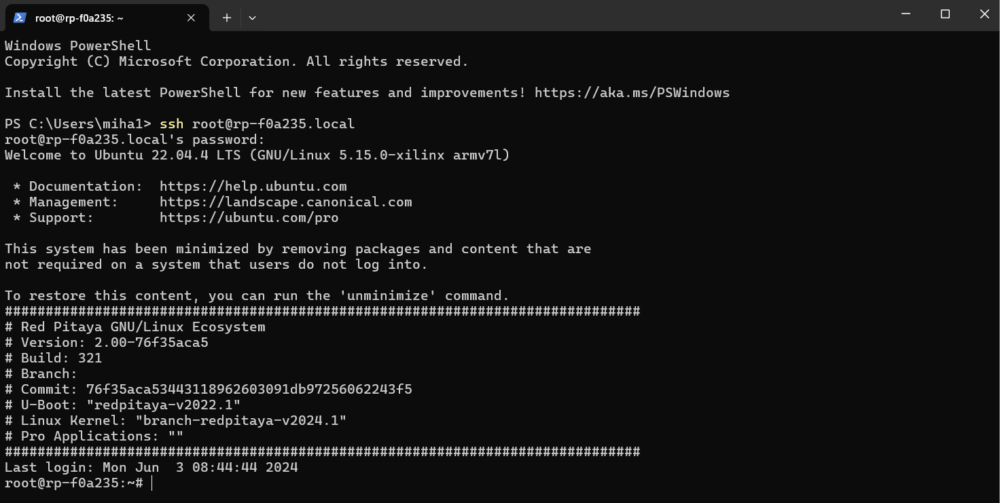
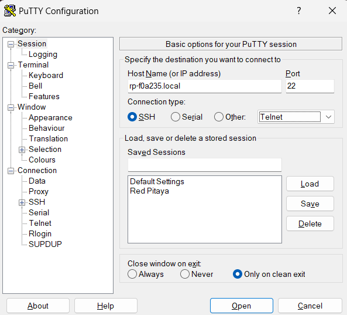
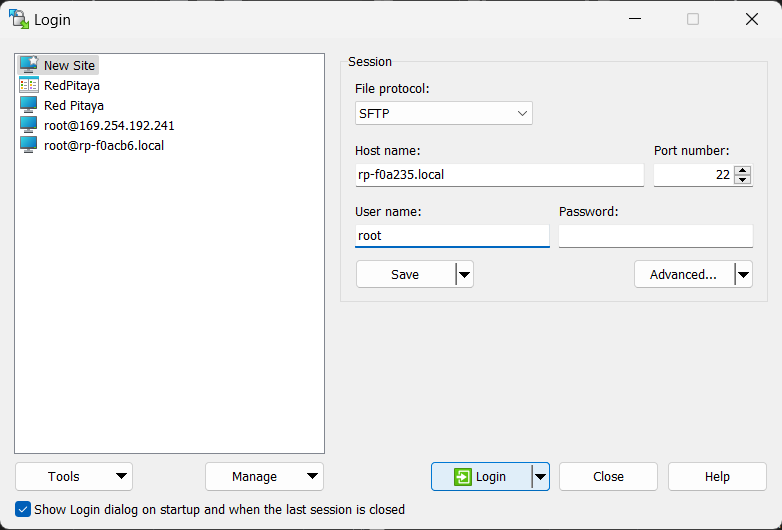
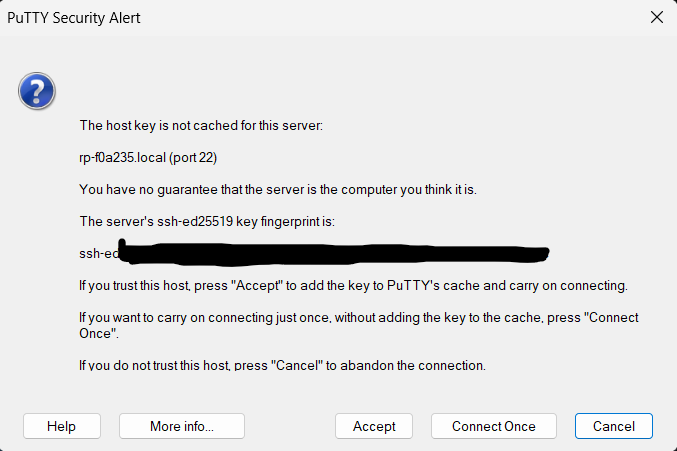
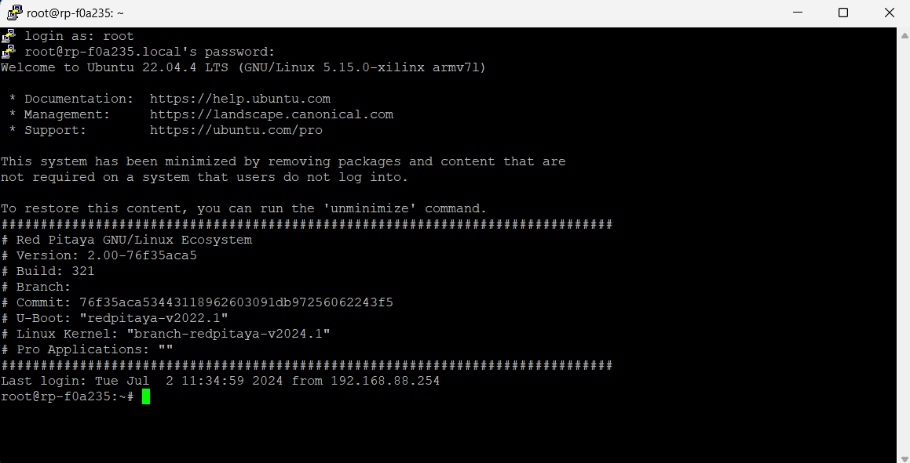
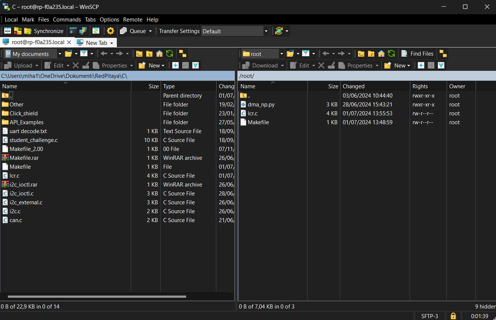
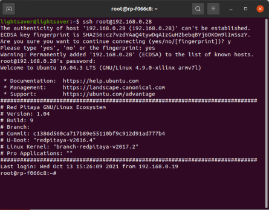

.. _ssh:

###############################
建立远程 SSH 连接
###############################

SSH 连接访问信息：

* **Username** - ``root``
* **Password** - ``root``

如果无法连接，请检查 Red Pitaya 是否已连接到您的 :ref:`本地网络 <faq_isConnected>`。

以下平台提供连接说明：

.. contents::
    :local:
    :backlinks: top
    :depth: 1

|

Windows
==========

在 Windows 上，您可以直接通过命令提示符建立 SSH 连接，也可以使用 |PuTTy| 或 |WinSCP| 等程序。下面将介绍这两种方式。

命令提示符
---------------

要通过命令提示符建立 SSH 连接，请先打开命令提示符控制台窗口（在 Windows 搜索中搜索“command prompt”）。

输入以下命令：

.. tabs::

    .. tab:: IP

        .. code-block:: console
        
            ssh root@<Red Pitaya IP address>

    .. tab:: 本地地址

        .. code-block:: console
        
            ssh root@rp-xxxxxx.local

如果这是您首次连接 Red Pitaya，将显示安全警告并要求确认连接（输入“yes”）。
此时，ssh-key 将添加到计算机的注册表中。

接下来，控制台会要求输入密码（``root``）。

输入密码后将显示登录文本。以下图片展示了完整的交互过程：

最后一行命令提示符/终端应显示为“root@rp-xxxxxx:~#”（Red Pitaya 的默认主目录为 /root）。

.. note::

    更新 OS 后，或距离上次 SSH 连接经过一段时间后，尝试建立 SSH 连接时可能会看到以下消息。

    .. code-block:: console

        @@@@@@@@@@@@@@@@@@@@@@@@@@@@@@@@@@@@@@@@@@@@@@@@@@@@@@@@@@@
        @    WARNING: REMOTE HOST IDENTIFICATION HAS CHANGED!     @
        @@@@@@@@@@@@@@@@@@@@@@@@@@@@@@@@@@@@@@@@@@@@@@@@@@@@@@@@@@@
        IT IS POSSIBLE THAT SOMEONE IS DOING SOMETHING NASTY!
        Someone could be eavesdropping on you right now (man-in-the-middle attack)!
        It is also possible that the RSA host key has just been changed.
        The fingerprint for the RSA key sent by the remote host is
        06:ea:f1:f8:db:75:5c:0c:af:15:d7:99:2d:ef:08:2a.
        Please contact your system administrator.
        Add correct host key in /home/user/.ssh/known_hosts to get rid of this message.
        Offending key in /home/user/.ssh/known_hosts:4
        RSA host key for domain.com has changed and you have requested strict checking.
        Host key verification failed.

    
    不必担心，Red Pitaya 本身没有问题。问题在于 Red Pitaya 的身份识别密钥已发生变化。请使用以下代码修复：

    .. code-block:: console

        ssh-keygen -R rp-xxxxxx.local

    然后再次尝试建立 SSH 连接。

    或者打开资源管理器，进入 **C:/Users/<your-username>/.ssh**，打开 **known_hosts** 文件，并删除所有包含 *rp-xxxxxx.local* 的行。

|

通过程序连接（PuTTy、WinSCP 等）
-----------------------------------------------

本例在 Windows 11 上使用 PuTTy 和 WinSCP 工具。
运行 PuTTy/WinSCP，并将 Red Pitaya 的 IP（或 .local）地址输入 **Host Name (or IP address)** 字段。

   PuTTy SSH 连接设置。

   WinSCP SSH 连接设置。

确保端口号设置为 22。在 WinSCP 中将“User name”填写为 ``root``，然后选择 **Open/Login**。

输入密码 ``root``。

如果这是您首次连接 Red Pitaya，将弹出安全警告并要求确认连接。
此时，ssh-key 将添加到计算机的注册表中。登录成功后会弹出命令提示符。

通过 SSH 连接到 RP 后，您会看到以下命令提示符界面：

   通过 PuTTy 建立 SSH 连接

   通过 WinSCP 建立 SSH 连接

最后一行命令提示符/终端应显示为“root@rp-xxxxxx:~#”（Red Pitaya 的默认主目录为 /root）。

|

Linux
=====

启动终端并输入（将 IP 地址替换为正确的地址）：

.. code-block:: shell-session

   user@ubuntu:~$ ssh root@192.168.1.100
   root@192.168.1.100's password: root
   Red Pitaya GNU/Linux/Ecosystem version 0.90-299
   redpitaya>

|

macOS
=====

运行终端 **Launchpad → Other → Terminal**，并输入（将 IP 地址替换为正确的地址）：

.. code-block:: shell-session
  
   localhost:~ user$ ssh root@192.168.1.100
   root@10.0.3.249's password: root
   Red Pitaya GNU/Linux/Ecosystem version 0.90-299
   redpitaya>

|
