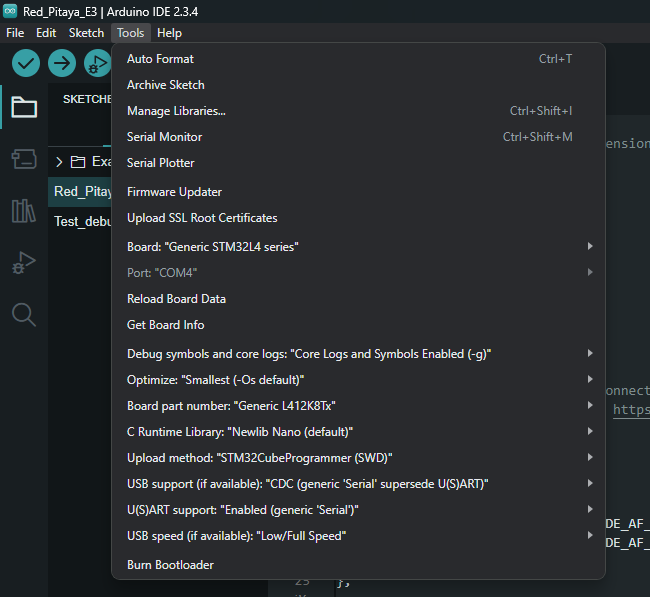
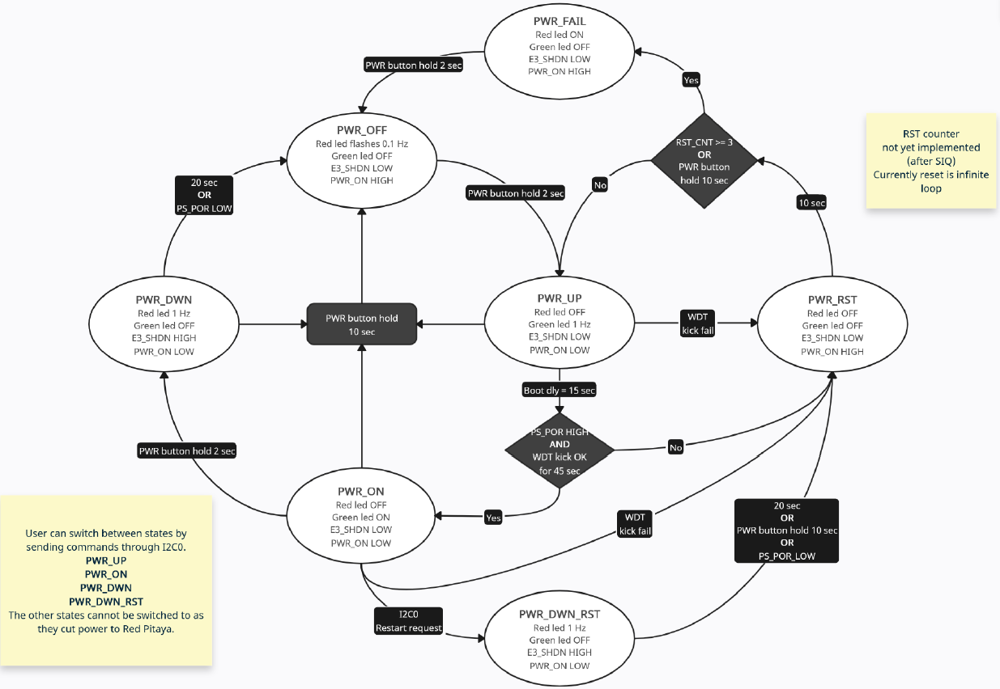

.. _E3_QSPI_eMMC_module_SW:

QSPI eMMC 模块 - 软件
##############################

QSPI eMMC 模块是一块为 Red Pitaya 板卡提供安全启动选项和电源管理的扩展板。本指南涵盖软件设置、板载 STM32 微控制器编程和固件配置。

|e3_top| |e3_bottom|

.. |e3_top| image:: img/QSPI_eMMC_module_Gen2_top.png
   :width: 600

.. |e3_bottom| image:: img/QSPI_eMMC_module_Gen2_bottom.png
   :width: 600

.. contents::
    :local:
    :depth: 1
    :backlinks: top

|

概述
========

模块功能
--------------------

* 单按钮开启/关闭 Red Pitaya 板卡电源
* QSPI 和 eMMC 启动选项
* STM32 微控制器提供：

    * Red Pitaya 电源控制
    * 安全关机管理
    * 看门狗定时器功能
    * 启动介质选择（SD 卡/eMMC）

* 采用开源代码的 Arduino C++ 固件
* 8 对直接连接到 Zynq FPGA 的高速差分对（16 个 GPIO）

有关硬件规格和引脚排列的详细信息，请参阅 :ref:`硬件章节 <E3_QSPI_eMMC_module_HW>`。

|

前置条件
=============

硬件要求
----------------------

**所需组件：**

* Red Pitaya STEMlab 125-14 Pro Gen 2 或 STEMlab 125-14 Pro Z7020 Gen 2 板卡
* QSPI eMMC 模块
* Red Pitaya 电源（模块通过 Red Pitaya 板卡供电）

**编程硬件（选择一种方式）：**

* **ST-Link/V2 编程器** （推荐）+ 5 线 2.54mm 转 2.0mm 间距线缆
* 用于 DFU 编程的 **USB 转 micro USB 线缆**
* **TTL 转 USB 串口转换线缆** （3.3V，例如 TTL-232R-3V3）- 当前不支持

推荐使用 ST-Link/V2 编程器，因为它能为 STM32 微控制器提供最可靠的编程体验。

.. note::

    QSPI eMMC 模块通过 E3 连接器连接到 Red Pitaya，该连接器控制电源和启动介质选择。
    编程期间，模块必须连接到已供电的 Red Pitaya 板卡。

兼容性
--------------

QSPI eMMC 模块兼容：

* :ref:`STEMlab 125-14 Pro Gen 2 <top_top_125_14_pro_gen2>`
* :ref:`STEMlab 125-14 Pro Z7020 Gen 2 <top_top_125_14_pro_z7020_gen2>`

.. note::

    高速差分对仅在 STEMlab 125-14 Pro Z7020 Gen 2 板卡上受支持。

软件要求
----------------------

STM32 微控制器（STM32L412K8T6）可使用多种开发环境编程：

* **Arduino IDE + STM32CubeProgrammer** （本指南涵盖）
* STM32CubeIDE
* Visual Studio Code + PlatformIO
* Visual Studio Code + STM32 库和插件

本指南使用 Arduino IDE 和 STM32CubeProgrammer，但你也可以使用任何偏好的 STM32 开发方式。

|

硬件设置
===============

连接方式
-------------------

ST-Link/V2 编程器（推荐）
^^^^^^^^^^^^^^^^^^^^^^^^^^^^^^^^^^^^^

1.  通过 USB 将 ST-Link/V2 连接到计算机。编程器上的红色 LED 应亮起。
2.  如果驱动程序未自动安装，请从 `ST 官方网站 <https://www.st.com/en/development-tools/stsw-link009.html>`_ 下载。
3.  使用 5 线跳线连接 QSPI eMMC 模块上的 CN7 连接器（2.0mm 间距）和 ST-Link/V2 编程器（2.54mm 间距）。

    .. figure:: img/ST-LinkV2_connections.png
        :alt: ST-Link/V2 编程器连接
        :align: center
        :width: 800px

USB 连接（DFU 模式）
^^^^^^^^^^^^^^^^^^^^^^^^^^

使用 USB 转 micro USB 线缆连接 QSPI eMMC 模块上的 CN4 连接器和计算机。

UART 连接（当前不支持）
^^^^^^^^^^^^^^^^^^^^^^^^^^^^^^^^^^^^^^^^^^^

1.  使用 TTL 转 USB 串口转换线缆连接 QSPI eMMC 模块上的 UART 端口和计算机。
确保 TX 和 RX 引脚连接正确。

    .. figure:: img/FTDI_serial_cable_pinout.png
        :alt: USB 转串口线缆
        :align: center
        :width: 800px

.. note::

    并非所有 USB 端口都能可靠工作。如果遇到连接问题，请尝试其他 USB 端口，或使用 ST-Link/V2 编程器连接测试验证线缆连接。

|

软件安装
======================

本节介绍安装 QSPI eMMC 模块编程所需的开发工具。

安装 Arduino IDE
------------------------

1.  从 Arduino 官方网站下载最新的 `Arduino IDE <https://www.arduino.cc/en/software>`_。
2.  打开 Arduino IDE 并转到 **File → Preferences**。
3.  在 **Additional Boards Manager URLs** 字段中添加：

    .. code-block:: text

        https://github.com/stm32duino/BoardManagerFiles/raw/main/package_stmicroelectronics_index.json

4.  点击 **OK** 关闭 Preferences 窗口。
5.  转到 **Tools → Board → Boards Manager**。
6.  在 Boards Manager 中搜索“STM32”。
7.  安装 STMicroelectronics 提供的最新版 **STM32 MCU based boards**。
8.  重新启动 Arduino IDE。

安装 STM32CubeProgrammer
--------------------------------

1.  从 ST 官方网站下载 `STM32CubeProgrammer <https://www.st.com/en/development-tools/stm32cubeprog.html>`_。
   
    .. note::
   
        需要创建 ST 账户才能下载该软件。

2.  运行安装程序，并确保安装过程中装好所有必要驱动程序。
3.  启动 STM32CubeProgrammer 以验证安装。

|

配置 Arduino IDE
=========================

板卡配置
--------------------

1.  打开 Arduino IDE 并转到 **Tools → Board**。
2.  选择 **STM32 MCU based boards → Generic STM32L4 series**。

    .. figure:: img/Arduino_IDE_board.png
        :alt: Arduino IDE 板卡选择
        :align: center
        :width: 1000px

3.  在 **Tools → Board Part Number** 下选择 **Generic L412K8Tx**。

    .. figure:: img/Arduino_IDE_board_part_num.png
        :alt: Arduino IDE 板卡部件编号选择
        :align: center
        :width: 800px

4.  在 **Tools → USB Support** 下选择 **CDC (generic 'Serial' supersede U(S)ART)**。
5.  在 **Tools → Upload Method** 下选择编程方式：
        
* **STM32CubeProgrammer (SWD)** - 用于 ST-Link V2 编程器
* **STM32CubeProgrammer (DFU)** - 用于 USB 转 micro USB 线缆
* **STM32CubeProgrammer (Serial)** - 用于 USB 转串口线缆（当前不支持）

**推荐的 Tools 设置：**

打开固件
---------------------

从 :github:`RedPitaya/RedPitaya-Examples/tree/dev/E3_module_code` 仓库下载 QSPI eMMC 模块固件，并在 Arduino IDE 中打开 Arduino 草图（.ino 文件）。

|

固件配置
=======================

QSPI eMMC 模块固件需要特定配置才能与 STM32L412K8T6 微控制器正常配合工作。设置 Arduino 项目时，请仔细执行以下步骤。

步骤 1：创建构建选项文件
-----------------------------------

在 Arduino 草图所在目录中创建名为 **build.opt** 的文件，内容如下：

.. code-block:: bash

    -HAL_I2C_MODULE_ENABLED
    -HAL_UART_MODULE_ENABLED
    -HAL_PCD_MODULE_ENABLED
    -HAL_HCD_MODULE_ENABLED

这些定义在 STM32 HAL 库中启用 I2C、UART 和 USB 外设支持。构建系统会在编译期间自动包含此文件。

|

步骤 2：包含所需库
------------------------------------

在 Arduino 草图开头添加以下库 include：

.. code-block:: c

    #include <PeripheralPins.h>  // Pin definitions for STM32L412K8T6
    #include <Wire.h>             // I2C communication functions

|

步骤 3：重新定义外设引脚映射
------------------------------------------

由于 STM32L412K8T6 封装并非所有引脚都可用，因此必须覆盖 STM32 库中的默认引脚映射。在草图开头添加以下引脚映射定义：

.. code-block:: c

    /* REDEFINE DEFAULT PINMAP */
    const PinMap PinMap_I2C_SDA[] = {
      { PB_4, I2C3, STM_PIN_DATA(STM_MODE_AF_OD, GPIO_NOPULL, GPIO_AF4_I2C3) },
      { PB_7, I2C1, STM_PIN_DATA(STM_MODE_AF_OD, GPIO_NOPULL, GPIO_AF4_I2C1) },
      { NC, NP, 0 }
    };

    const PinMap PinMap_I2C_SCL[] = {
      { PA_7, I2C3, STM_PIN_DATA(STM_MODE_AF_OD, GPIO_NOPULL, GPIO_AF4_I2C3) },
      { PB_6, I2C1, STM_PIN_DATA(STM_MODE_AF_OD, GPIO_NOPULL, GPIO_AF4_I2C1) },
      { NC, NP, 0 }
    };

    const PinMap PinMap_UART_TX[] = {
      { PA_2, USART2, STM_PIN_DATA(STM_MODE_AF_PP, GPIO_PULLUP, GPIO_AF7_USART2) },
      { NC, NP, 0 }
    };

    const PinMap PinMap_UART_RX[] = {
      { PA_3, USART2, STM_PIN_DATA(STM_MODE_AF_PP, GPIO_PULLUP, GPIO_AF7_USART2) },
      { NC, NP, 0 }
    };

    const PinMap PinMap_USB[] = {
      { PA_11, USB, STM_PIN_DATA(STM_MODE_AF_PP, GPIO_NOPULL, GPIO_AF10_USB_FS) },  // USB_DM
      { PA_12, USB, STM_PIN_DATA(STM_MODE_AF_PP, GPIO_NOPULL, GPIO_AF10_USB_FS) },  // USB_DP
      { NC, NP, 0 }
    };

.. warning::

    重新定义引脚对正常运行至关重要。省略这些定义会导致微控制器发生故障或无法正确初始化外设。

|

步骤 4：定义引脚名称
--------------------------

为 QSPI eMMC 模块使用的所有 I/O 引脚定义易读名称：

.. code-block:: c

    /* PIN DEFINITIONS */
    #define PWR_ON_CN_PIN (PA0)     // Power On signal from CN2 connector
    #define PWR_ON_PB_PIN (PA1)     // Power On signal from P-ON button
    #define UART_TX_PIN (PA2)       // UART TX (not connected - shares bus with I2C1)
    #define UART_RX_PIN (PA3)       // UART RX (populate R17, R18, R3, R4 for DIO12 connection)
    #define E3_WDT_KICK_PIN (PA4)   // Watchdog timer signal from Red Pitaya
    #define E3_SHDN_PIN (PA5)       // Shutdown signal to Red Pitaya
    #define PS_POR_PIN (PA6)        // Power-On Reset signal (read-only)
    #define PWR_ON_PIN (PB1)        // Power supply control output
    #define LED_RED_PIN (PA8)       // Red LED control
    #define LED_GREEN_PIN (PA9)     // Green LED control
    #define USB_N_PIN (PA11)        // USB D- data line
    #define USB_P_PIN (PA12)        // USB D+ data line
    #define UC_SWDIO_PIN (PA13)     // SWD data line for programming
    #define UC_SWCLK_PIN (PA14)     // SWD clock line for programming
    #define I2C0_SCL_PIN (PB6)      // I2C0 clock connected to Red Pitaya
    #define I2C0_SDA_PIN (PB7)      // I2C0 data connected to Red Pitaya
    #define I2C1_SCL_PIN (PA7)      // I2C1 clock (not connected - shares bus with UART)
    #define I2C1_SDA_PIN (PB4)      // I2C1 data (populate R3, R4 for DIO12 connection)

|

步骤 5：声明通信接口
------------------------------------------

在全局作用域中初始化 UART 和 I2C 接口：

.. code-block:: c

    // UART and I2C interface declarations
    HardwareSerial Serial1(UART_RX_PIN, UART_TX_PIN);
    TwoWire Wire0(I2C0_SDA_PIN, I2C0_SCL_PIN);  // I2C0 bus for Red Pitaya communication
    // TwoWire Wire1(I2C1_SDA_PIN, I2C1_SCL_PIN);  // I2C1 (not currently supported)

.. note::

    目前不支持 I2C1 和 UART 接口，因为 QSPI eMMC 模块上没有物理连接器。

|

步骤 6：在 setup() 中初始化引脚
------------------------------------

在 **setup()** 函数中配置所有 I/O 引脚：

.. code-block:: c

    void setup() {
        // Configure pin directions
        pinMode(PWR_ON_CN_PIN, INPUT);    // External power control input
        pinMode(PWR_ON_PB_PIN, INPUT);    // Button power control input
        pinMode(E3_WDT_KICK_PIN, INPUT);  // Watchdog signal from Red Pitaya
        pinMode(E3_SHDN_PIN, OUTPUT);     // Shutdown signal to Red Pitaya
        pinMode(PS_POR_PIN, INPUT);       // Power-on reset status from Red Pitaya
        pinMode(PWR_ON_PIN, OUTPUT);      // Power control output
        pinMode(LED_GREEN_PIN, OUTPUT);   // Green LED
        pinMode(LED_RED_PIN, OUTPUT);     // Red LED

        // Initialize LED states
        LED_off(LED_RED_PIN);
        LED_off(LED_GREEN_PIN);

        // Initialize communication interfaces
        Serial1.begin(115200);                  // UART at 115200 baud
        Wire0.begin(I2C_ADDR);                  // I2C0 as slave at I2C_ADDR
        Wire0.setClock(400000);                 // I2C speed: 400 kHz
        Wire0.onReceive(I2C0_receive_handler);  // Register I2C receive callback
        Wire0.onRequest(I2C0_request_handler);  // Register I2C request callback
        
        /*
        // I2C1 initialization (not currently implemented)
        Wire1.begin(I2C_ADDR);
        Wire1.setClock(400000);
        Wire1.onReceive(I2C1_receive_handler);
        Wire1.onRequest(I2C1_request_handler);
        */
    }

.. warning::

    上述所有配置步骤都是必需的。缺少任何步骤都会导致微控制器运行异常。

|

对模块编程
=======================

.. important::

    编程期间，QSPI eMMC 模块必须连接到已供电的 Red Pitaya 板卡。Red Pitaya 为模块供电。

使用 Arduino IDE
------------------

可以使用三种不同连接方式对模块编程。上传前，请在 Arduino IDE 中使用验证按钮（对勾图标）验证代码，确保没有编译错误。

方法 1：ST-Link/V2 编程器（SWD）
^^^^^^^^^^^^^^^^^^^^^^^^^^^^^^^^^^^^^^^

1. 将 ST-Link/V2 编程器连接到计算机和 QSPI eMMC 模块。
2. 在 Arduino IDE 中选择 **Tools → Upload Method → STM32CubeProgrammer (SWD)**。
3. 点击 Arduino IDE 中的上传按钮（右箭头图标）。

方法 2：USB 转 micro USB 线缆（DFU）
^^^^^^^^^^^^^^^^^^^^^^^^^^^^^^^^^^^^^^^^

1. 使用 USB 转 micro USB 线缆连接计算机和 QSPI eMMC 模块。
2. 在 Arduino IDE 中选择 **Tools → Upload Method → STM32CubeProgrammer (DFU)**。
3. 点击 Arduino IDE 中的上传按钮。

.. note::

    如果上传失败，请断开并重新连接 USB 线缆，然后重试。由于板卡在编程期间会复位，因此每次上传后都必须重新连接 USB 线缆。

方法 3：USB 转串口线缆（UART）- 当前不支持
^^^^^^^^^^^^^^^^^^^^^^^^^^^^^^^^^^^^^^^^^^^^^^^^^^^^^^^^^^^^^^^^

1. 使用 USB 转串口线缆连接计算机和 QSPI eMMC 模块。
2. 在 Arduino IDE 中选择 **Tools → Upload Method → STM32CubeProgrammer (Serial)**。
3. 点击 Arduino IDE 中的上传按钮。
4. 当 Arduino IDE 进入上传阶段时，按下 QSPI eMMC 模块上的复位按钮以进入
   bootloader 模式。

|

使用 STM32CubeProgrammer
---------------------------

STM32CubeProgrammer 可以通过上述三种连接方式中的任意一种将预编译二进制文件上传到模块。

步骤 1：从 Arduino IDE 导出已编译二进制文件
^^^^^^^^^^^^^^^^^^^^^^^^^^^^^^^^^^^^^^^^^^^^^^^^^

1. 在 Arduino IDE 中打开草图。
2. 转到 **Sketch → Export compiled Binary**。
3. 二进制文件将保存到草图文件夹中。

    .. figure:: img/Arduino_IDE_compiled_binary.png
        :alt: Arduino IDE 编译后的二进制文件
        :align: center
        :width: 600px

|

步骤 2：连接并编程
^^^^^^^^^^^^^^^^^^^^^^^^^^^^^

1.  打开 STM32CubeProgrammer。
2.  使用偏好的方式将 QSPI eMMC 模块连接到计算机。
3.  在 STM32CubeProgrammer 中选择适当的连接接口和 COM 端口。

    .. figure:: img/STM32_cube_select.png
        :alt: STM32CubeProgrammer 选择通信端口
        :align: center
        :width: 400

4.  点击 **Connect**。系统应自动检测到模块。

    .. figure:: img/STM32_cube_connected.png
        :alt: STM32CubeProgrammer 连接到 QSPI eMMC 模块
        :align: center
        :width: 1000

5.  打开左侧菜单中的 **Erasing & Programming** 选项卡。

    .. figure:: img/STM32_cube_menu.png
        :alt: STM32CubeProgrammer 擦除和编程选项卡
        :align: center
        :width: 400

6.  点击 **Browse**，选择从 Arduino IDE 导出的已编译二进制文件（.bin）。
7.  同时选中 **Verify programming** 和 **Run after programming** 复选框。
8.  点击 **Start Programming** 上传固件。

    .. figure:: img/STM32_cube_program.png
        :alt: STM32CubeProgrammer 对 QSPI eMMC 模块编程
        :align: center
        :width: 1000px

9.  编程完成后，在确认对话框中点击 **OK**。

|

固件运行
===================

状态机概述
-----------------------

QSPI eMMC 模块固件实现了一个状态机，根据用户输入和系统监控管理 Red Pitaya 电源控制。固件使用 Arduino C++ 编写，可在 `Red Pitaya GitHub 仓库 <https://github.com/RedPitaya/RedPitaya-Examples>`_ 中获取。

.. note::

    固件的直接链接即将提供。

|

电源状态
-------------

固件管理以下电源状态：

**上电**

    Red Pitaya 正在启动。达到设定的超时时间后，固件会监控电源和看门狗信号。如果未检测到信号，则转换到 Power Reset；否则转换到 Power On。

**电源开启**

    Red Pitaya 已完全运行。持续监控看门狗和电源信号。如果按住电源按钮一秒，则转换到 Power Down；如果信号丢失，则转换到 Power Reset。

**关机**

    启动正常关机。向 Red Pitaya 发送关机信号，然后等待超时，再转换到 Power Off。

**电源关闭**

    Red Pitaya 已断电。保持此状态，直到按下电源按钮，然后转换到 Power Up。

**关机复位**

    与 Power Down 类似，但转换到 Power Reset 而不是 Power Off，从而允许自动重启。

**电源复位**

    Red Pitaya 暂时断电。超时后自动转换到 Power Up。如果连续多次进入此状态，则转换到 Power Fail，以防止启动循环。

**电源故障**

    多次启动失败后进入的安全状态。需要人工干预（按下电源按钮）才能返回 Power Off 状态。

.. note::

    无论何时，按住电源按钮都会强制立即断电，覆盖当前状态。

|

状态图
--------------

固件具有清晰的代码结构和全面的注释，便于自定义。可以使用 E3 I2C 控制器从 Red Pitaya 控制状态转换。

|

.. _e3_i2c_controller_sw:

E3 I2C 控制器
==================

可以从 Red Pitaya 通过 I2C 命令控制 QSPI eMMC 模块，从而以编程方式控制电源状态和固件配置。

* :ref:`E3 I2C 控制器实用程序 <e3_i2c_controller_util>` - 用于从 Red Pitaya 向模块发送 I2C 命令的命令行工具。

|

硬件规格
========================

有关详细硬件规格、连接器引脚排列和原理图，请参阅 :ref:`E3 硬件文档 <E3_QSPI_eMMC_module_HW>`。

|

常见问题
===========================

**问：为什么模块无法连接到编程器？**

尝试计算机上的其他 USB 端口。确认线缆连接与图示一致。首先测试 ST-Link/V2 连接，因为这是最可靠的方式。

**问：固件已上传但无法正常工作，应检查什么？**

确认已正确完成全部六个固件配置步骤，尤其是引脚映射重新定义和 build.opt 文件。确保 Red Pitaya 板卡兼容（仅 Pro Gen 2 型号）。

**问：可以使用 I2C1 或 UART 接口吗？**

目前不支持这些接口，因为模块上没有物理连接器。硬件焊盘用于未来通过电阻修改进行扩展。

**问：如何修改 DIO12 差分对功能？**

有关通过电阻配置在 DIO12 引脚上启用 I2C1 或 UART 的说明，请参阅 :ref:`硬件文档 <E3_QSPI_eMMC_module_HW>`。

**问：如果 Red Pitaya 启动失败会怎样？**

固件会自动检测启动失败并进入 Power Reset 状态。多次尝试失败后，它会进入 Power Fail 状态，需要人工干预以防止持续启动循环。

|
