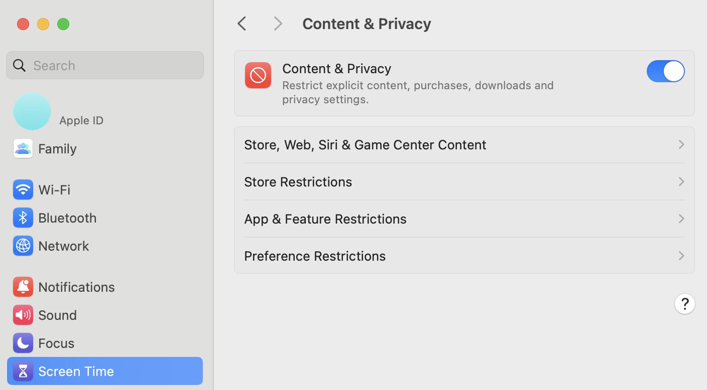

.. _known_sw_issues:

########################
已知软件问题
########################

本页列出 Red Pitaya 平台的已知软件问题。问题按状态和严重性组织。

.. contents:: 问题类别
   :local:
   :depth: 1

活动问题
=============

这些问题存在于当前 OS 版本中，需要采用变通方案，或将在未来版本中修复。

macOS 直接连接
---------------------------

* **受影响 OS**：2.00 及更高版本
* **受影响硬件**：所有型号
* **严重性**：轻微
* **变通方案**：可用

**症状**

macOS 计算机可能无法连接到 Red Pitaya Web 界面。连接尝试会超时或拒绝建立连接。

**根本原因**

macOS **Content and Privacy Settings（内容与隐私设置）** 默认阻止 WebSocket 连接。

**变通方案**

1. 打开 **System Preferences（系统偏好设置）** → **Screen Time（屏幕使用时间）** → **Content & Privacy（内容与隐私）**。
2. 禁用限制，或为 Red Pitaya 添加例外。
3. **注销并重新登录**，使更改生效。
4. 如果问题仍然存在，请完全禁用 **Content and Privacy** 设置。

|

Wi-Fi 信号强度报告
-----------------------------

* **受影响 OS**：2.00 至 2.07-51
* **受影响硬件**：所有配备 Wi-Fi dongle 的型号
* **严重性**：轻微
* **变通方案**：无

**Symptoms**

连接到 Red Pitaya 的 Wi-Fi dongle 在某些网络中显示错误的信号强度（5 格中为 0 格）。同一 dongle 连接到其他设备时会显示正确的信号强度。

**Root Cause**

旧版 Linux 内核驱动程序对某些 Wi-Fi 芯片组的信号强度报告存在兼容性问题。

**状态**

将在 OS 3.00 中通过更新 Linux 内核驱动程序并增加对新 Wi-Fi dongle 的支持来解决。

|

已解决问题
===============

这些问题已在特定 OS 版本中修复。升级到指定版本或更高版本即可解决。

JupyterLab Matplotlib NumPy 兼容性
------------------------------------------

* **受影响 OS**：2.07-48 至 2.07-51
* **修复版本**：OS 3.00 NB 697 或更高版本
* **受影响硬件**：所有型号
* **严重性**：严重
* **变通方案**：可用

**症状**

由于 NumPy 版本不兼容，在 JupyterLab 中导入 Matplotlib 会引发 ``ImportError``：

.. code-block:: python

    ImportError: numpy.core.multiarray failed to import
    
    A module that was compiled using NumPy 1.x cannot be run in
    NumPy 2.2.5 as it may crash. To support both 1.x and 2.x
    versions of NumPy, modules must be compiled with NumPy 2.0.

**根本原因**

针对 NumPy 1.x 编译的 Matplotlib 库与 NumPy 2.x 不兼容。

**解决方法**

-  **推荐：** 升级到 OS 3.00 NB 697 或更高版本（Matplotlib 已更新为兼容 NumPy 2.x 的版本）。
-  **旧 OS 的手动修复：** 需要 Linux Ubuntu 计算机，或需要使用 :ref:`带 WSL 的 Windows 计算机 <wsl_setup>`。

    .. note::
    
        虽然直接从 Red Pitaya Linux 终端更新 Matplotlib 更简单，但板卡有限的 RAM（512 MB 或 1 GB）不足以完成软件包升级过程。此变通脚本会将 SD 卡挂载到资源充足的计算机上执行更新。

    #. 下载 :download:`updatematplotlib.sh 脚本 <files/updatematplotlib.sh>`。
    #. 将 micro SD 卡插入计算机（必要时使用 USB 读卡器）。
    #. 在 Windows 上连接到 Windows Subsystem for Linux，并运行 USBIPD 将 SD 卡连接到 WSL（:ref:`WSL 安装说明 <wsl_setup>`）。Linux Ubuntu 用户跳过此步骤。
    #. 使用 “lsblk” 命令查找插入卡上的 Linux OS 分区。默认情况下为 /dev/sdd2，但也可能不同；它是插入卡上最大的分区。
    #. 如果分区不是 sdd2，请在脚本中修改分区路径。
    #. 使用 sudo 运行脚本。

    作为参考，可以查看运行脚本时的 :download:`预期输出 <files/updatematplotlib_reference_text.txt>`。

|

I2C 设备描述符耗尽
---------------------------------

* **受影响 OS**：2.00 至 2.07-43
* **修复版本**：OS 2.07-48 或更高版本
* **受影响硬件**：所有型号
* **严重性**：严重

**症状**

执行数百次 I2C 读/写操作后，SCPI 服务器或 C++/Python API 会挂起。错误消息：

.. code-block:: console

    9560,"*I2C:IOctl:Write:Buffer2 Failed write buffer to i2c: Failed to init I2C."

**根本原因**

I2C 驱动程序未能在每次操作后正确关闭设备文件描述符，导致描述符耗尽。

**解决方法**

已在 OS 2.07-48 中修复，修正后的 I2C 驱动程序会在操作后正确关闭设备。

|

Streaming 应用 EOL 错误
--------------------------------

* **受影响 OS**：2.05-37、2.07-43
* **修复版本**：OS 2.07-48 或更高版本
* **受影响硬件**：所有型号
* **严重性**：严重

**症状**

- :ref:`Streaming desktop application <stream_desktop_app>` reports EOL error within two minutes
- :ref:`Command line client <stream_command_client>` errors when using ``-t`` (time) parameter

**根本原因**

Streaming 应用（数据流控制）每分钟发送状态更新少于一次，导致浏览器超时并重新加载应用。

**解决方法**

已在 OS 2.07-48 中修复，通过提高更新频率避免浏览器超时。

|

STEMlab 125-10 内存不足
-----------------------------

* **受影响 OS**：2.00 至 2.07-43
* **修复版本**：OS 2.07-48 或更高版本
* **受影响硬件**：仅 STEMlab 125-10
* **严重性**：严重

**症状**

Logic Analyzer 应用启动时因 NGINX 内存不足错误而崩溃。

**根本原因**

STEMlab 125-10 具有 256 MB RAM（STEMlab 125-14 的 512 MB 的一半）。OS 2.00 应用比 1.04 OS 需要更多 RAM，超出了 STEMlab 125-10 的资源。

.. warning::

    STEMlab 125-10 的软件支持将结束生命周期（日期待定）。我们会提前通知所有用户，并在 EOL 前提供支持全部应用的最终 OS 版本。

**解决方法**

已在 OS 2.07-48 中通过优化应用内存使用量修复。

**旧 OS 版本的变通方案：**

向 SD 卡添加 1 GB SWAP 空间：

1. 使用 ``dd`` 命令备份 SD 卡。
2. 使用 ``parted`` 调整 OS 分区大小。
3. 按照 `此指南 <https://www.digitalocean.com/community/tutorials/how-to-add-swap-space-on-ubuntu-22-04>`_ 添加 SWAP 空间。

|

直接以太网连接时 Web 界面重新加载
---------------------------------------------------

* **受影响 OS**：2.00 至 2.05-23
* **修复版本**：OS 2.05-37 或更高版本
* **受影响硬件**：所有型号
* **严重性**：严重

**症状**

通过以太网电缆将 Red Pitaya 直接连接到计算机（不经过交换机/路由器）时，Web 界面会不断重新加载。

**解决方法**

已在 OS 2.05-37 中通过修正点对点以太网连接的网络配置解决。

|

本地网络可见性
-------------------------

* **受影响 OS**：2.00 至 2.05-23
* **修复版本**：OS 2.05-37 或更高版本
* **受影响硬件**：所有型号
* **严重性**：轻微

**症状**

Red Pitaya 启动时不会出现在 ARP 表中（``arp -a`` 不显示条目）。访问 ``rp-xxxxxx.local`` 后，设备仍可 ping 通并会出现在 ARP 表中。

**解决方法**

已在 OS 2.05-37 中通过改进 mDNS 和网络初始化时序解决。

|

SIGNALlab 250-12 输出电压范围
--------------------------------------

* **受影响 OS**：1.04 及更早版本
* **修复版本**：OS 2.00-23 或更高版本
* **受影响硬件**：仅 SIGNALlab 250-12
* **严重性**：重大

**症状**

Oscilloscope 应用无法正确设置输出电压范围（增益 x1 和 x5），也无法达到 ±10 V。此问题不影响 SCPI 或 API 命令。

**解决方法**

已在 OS 2.00-23 中通过修正示波器应用增益配置解决。

|
