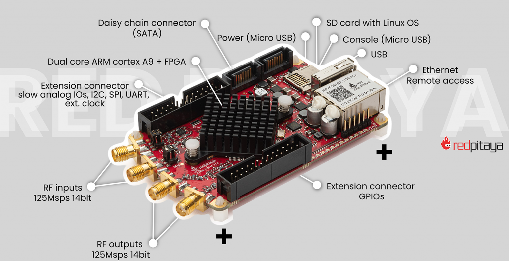

.. _intro:

什么是 Red Pitaya？
#####################

Red Pitaya 通过紧凑、开源的高速信号采集与处理板卡及相关服务加速工业创新，旨在帮助企业缩短产品上市时间，把精力集中在真正重要的事情上——更快地打造更好的产品。

它集软件定义多功能仪器、数字化仪和开源 FPGA 开发平台的功能于一体。开箱即可作为示波器、信号发生器、频谱分析仪等多种软件定义仪器使用；所有仪器均以应用程序形式通过 Web 界面访问。

Red Pitaya 的主要特性包括：

* 两路快速模拟输入和两路快速模拟输出，采样率为 125 MS/s、分辨率为 14 位；
* 输入电压范围为 ±1 V 或 ±20 V（取决于跳线设置），输出电压范围为 ±1 V；
* 低速模拟输入和输出；
* 数字 GPIO；
* I2C、SPI、UART 和 CAN 数字接口；
* 可编程 LED。

Red Pitaya 的核心是 AMD Xilinx Zynq 7010 SoC，其中集成了双核 ARM Cortex-A9 处理器。

Red Pitaya 运行 Ubuntu Linux 操作系统，该系统存储在 microSD 卡上。

由于板卡与计算机之间通过以太网传输数据，因此它兼容各种计算机操作系统（Windows、Linux、macOS）。

板卡可通过多种方式编程：

* 通过 SCPI 命令远程编程（Python、MATLAB 或 LabVIEW）；
* 直接在板卡上运行 C++ 和 Python 程序；
* 使用 AMD Xilinx Vivado IDE 编写可完全定制的 FPGA 固件。

Red Pitaya 的应用场景从 :rp-blog:`国际空间站 <red-pitaya-an-open-source-software-measurement-and-control-board-used-in-spacecraft-atmosphere-monitor-for-nasa>` 到 :rp-blog:`番茄分拣 <when-picking-and-sorting-tomatoes-become-a-matter-for-tech>`，因此我们称它为“工程师的瑞士军刀”。

**Red Pitaya 能为我提供哪些帮助？**

* **加快产品上市** — 通过可直接集成的解决方案缩短开发时间，让产品更快上市。
* **集成与可扩展性** — 从原型设计到生产，均可无缝融入工业应用。
* **高性价比创新** — 无需承担专有系统的高昂成本，也能获得强大的硬件能力。
* **开放且灵活** — 开源技术让工程师能够完全掌控并自由定制。

**资源**

* :ref:`连接 <quickstart_connect>`
* :ref:`应用程序 <all_apps>`
* :ref:`编程 <programming>`
* :ref:`FPGA <fpga_top>`
* :ref:`定制 <customization>`
* :rp-store:`Red Pitaya Store <>`

**GitHub 源代码：**

* :rp-github:`生态系统和应用程序 <RedPitaya>`
* :rp-github:`FPGA <RedPitaya-FPGA>`
* :rp-github:`示例 <RedPitaya-Examples>`

**使用案例：**

* :rp-web:`工业使用案例 <>`
* :rp-blog:`Red Pitaya 博客 <>`

**FPGA 课程和教程**

* :ref:`FPGA 章节 <fpga_top>`
