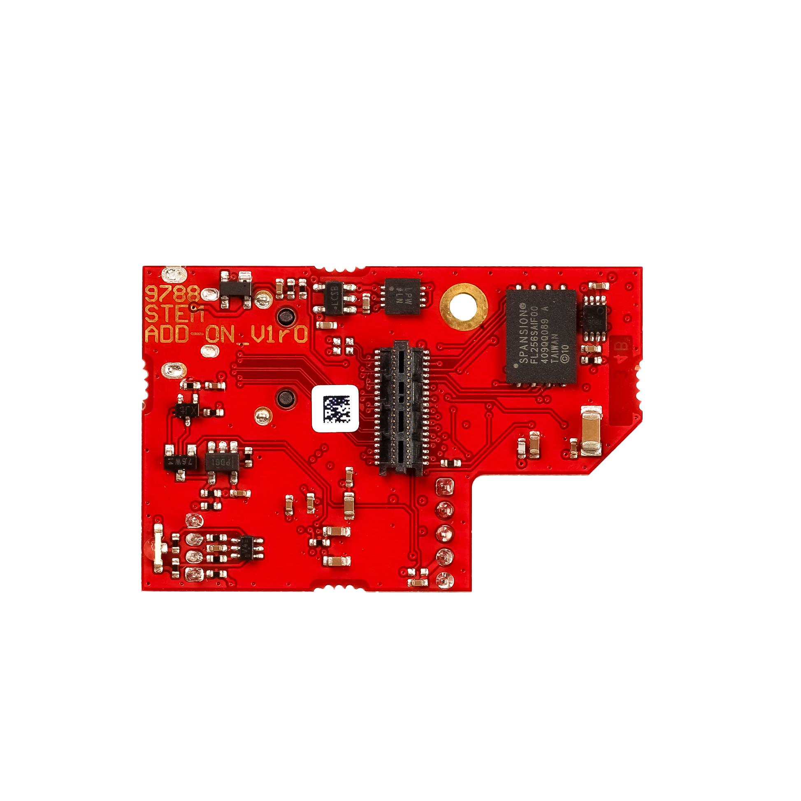

.. _QSPI_eMMC_board:

QSPI eMMC 板连接
###########################

QSPI eMMC 模块为 Red Pitaya 提供安全、可靠的启动和关机方式。

|e3_top| |e3_bottom|

.. |e3_top| image:: img/QSPI_eMMC_module_Gen2_top.png
   :width: 600

.. note::
        
    QSPI eMMC 板连接到 Red Pitaya 板卡后，Red Pitaya 不会自动启动。详细信息请查看 `使用 QSPI eMMC 板启动 Red Pitaya`_ 章节。

|

功能
========

* 通过单个按钮开启/关闭 Red Pitaya 板卡。
* QSPI 和 eMMC 启动选项。
* 板载 STM 微控制器提供以下功能：

    * Red Pitaya 上电。
    * Red Pitaya 安全关机。
    * 看门狗定时器功能。
    * 启动介质选择（SD 卡/eMMC）。

* 采用开源代码的 Arduino（C++）固件。
* 一个直接连接到 Zynq 7020 FPGA 的 8 对高速差分信号连接器（16 个 GPIO）。

QSPI eMMC 模块由 Red Pitaya 板卡供电，因此无需额外电源。

|

包装内容
===========

* QSPI eMMC 扩展板；
* M2 螺钉。

|

硬件要求
======================

QSPI eMMC 模块兼容以下 Red Pitaya 板卡型号：

* :ref:`STEMlab 125-14 PRO Gen 2 <top_125_14_pro_gen2>`.
* :ref:`STEMlab 125-14 PRO Z7020 Gen 2 <top_125_14_pro_z7020_gen2>`.

.. note::

    仅 STEMlab 125-14 PRO Z7020 Gen 2 板卡型号支持高速差分信号对。

|

安装 QSPI eMMC 板
================================

以下是 QSPI eMMC 板的快速安装指南：

1. 确保 Red Pitaya 板卡已关机并断开电源。

    .. figure:: img/E3_board_assembly_1.jpeg
        :align: center
        :width: 800

#. 通过 E3 连接器将 QSPI eMMC 板连接到 Red Pitaya 板卡。

    .. figure:: img/E3_board_assembly_2.jpeg
        :align: center
        :width: 800

#. 使用 M2 螺钉固定 QSPI eMMC 板。请勿过度拧紧螺钉，否则可能损坏板卡。

    .. figure:: img/E3_board_assembly_3.jpeg
        :align: center
        :width: 800

|

.. _QSPI_eMMC_board_boot:

使用 QSPI eMMC 板启动 Red Pitaya
========================================

将 QSPI eMMC 板连接到 Red Pitaya 板卡后，可以按下 QSPI eMMC 板上的 **P-ON** 按钮开启 Red Pitaya 板卡。Red Pitaya 板卡将从 SD 卡启动。若要从 eMMC 或 QSPI 启动，必须配置 Linux 设置。

1. 将电源和以太网线连接到 Red Pitaya 板卡。与正常操作不同，Red Pitaya 板卡 **不会自动上电**。Red Pitaya 板卡上的 **绿色电源 LED** 会闪烁一次，然后熄灭。
#. 要开始启动，请按住 QSPI eMMC 板上的 **P-ON** 按钮 1 秒。Red Pitaya 板卡上的 **绿色电源 LED** 将亮起，启动过程随即开始。QSPI eMMC 板上的 **绿色状态 LED** 会在 *启动过程中闪烁*，并在 *启动完成时常亮* （约 1 分钟）。
#. Red Pitaya 板卡启动后，QSPI eMMC 板将监控 Red Pitaya 板卡的看门狗定时器状态。如果 Red Pitaya 冻结或挂起，QSPI eMMC 板会自动重启 Red Pitaya 板卡。
#. 要关闭 Red Pitaya 板卡，请按住 QSPI eMMC 板上的 **P-ON** 按钮 1 秒。Red Pitaya 板卡将执行安全关机并断电。
#. 如果按住 **P-ON** 按钮超过 5 秒，QSPI eMMC 板会立即关闭 Red Pitaya 板卡电源。

|

QSPI 和 eMMC 启动选项
==========================

QSPI 和 eMMC 启动选项默认未启用，必须在 Linux 设置中配置。建议使用 OS 将操作系统从 SD 卡传输到 eMMC 或 QSPI。

要从 eMMC 启动板卡，请打开 QSPI eMMC 板上的开关。

.. note::

    QSPI 和 eMMC 未预装 Red Pitaya OS。

硬件和软件规格
==================================================

有关 E3 软件的完整信息，包括状态机图、工作模式和源代码，请参阅 :ref:`QSPI eMMC 板软件章节 <E3_QSPI_eMMC_module_SW>`。

有关 E3 硬件规格和原理图的完整信息，请参阅 :ref:`QSPI eMMC 板硬件章节 <E3_QSPI_eMMC_module_HW>`。
