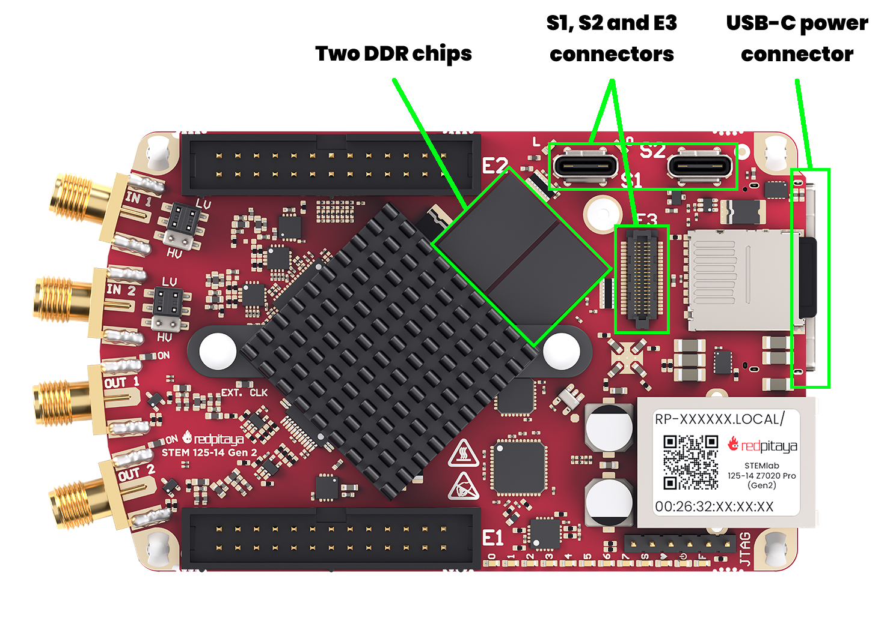
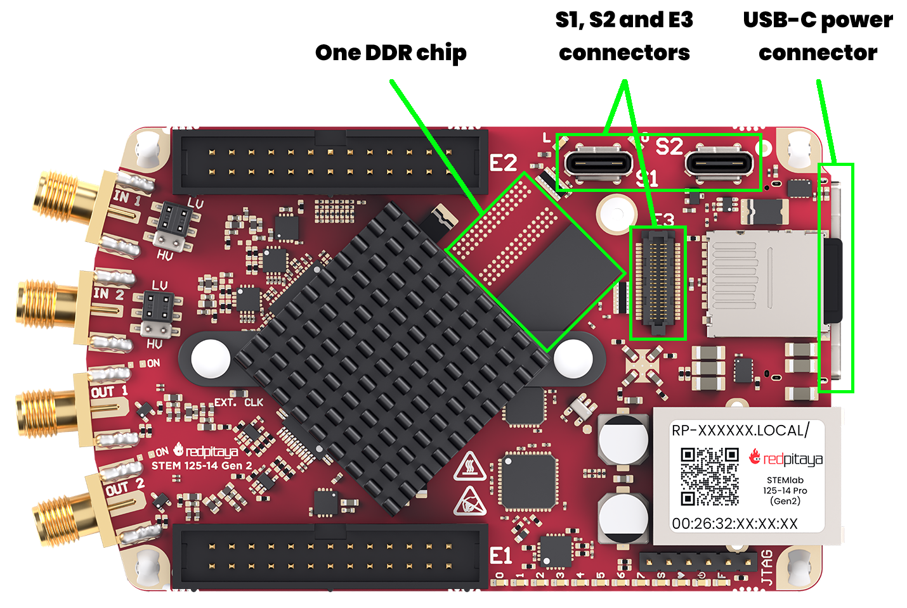
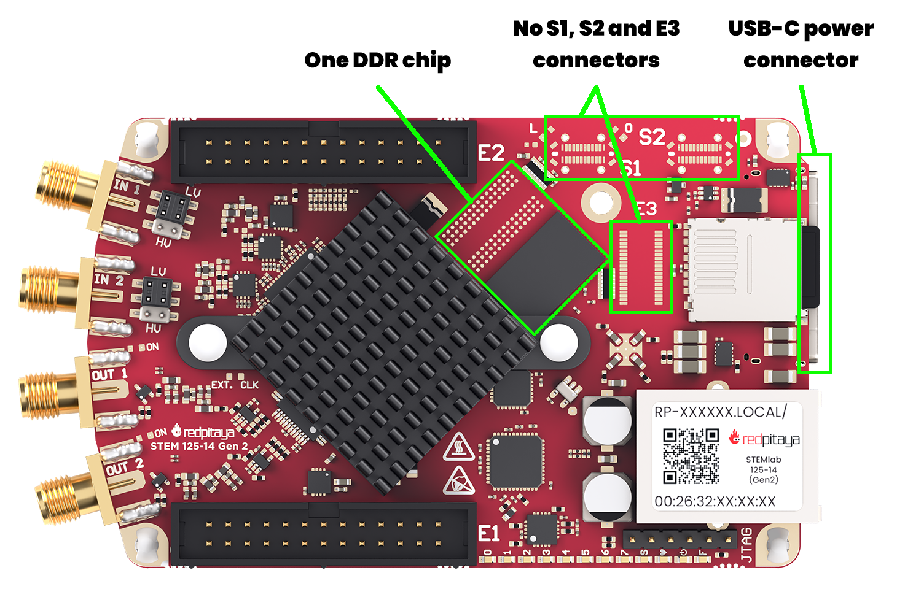
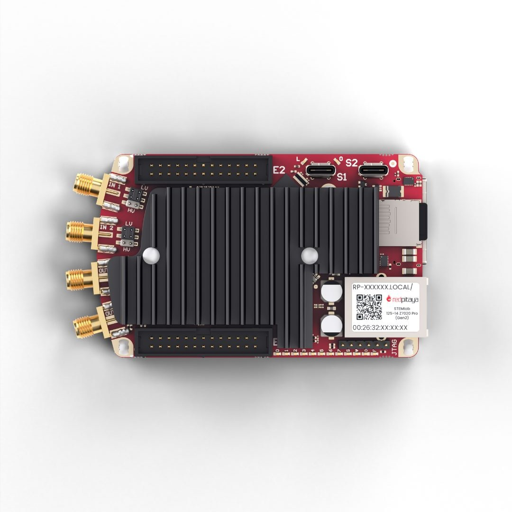
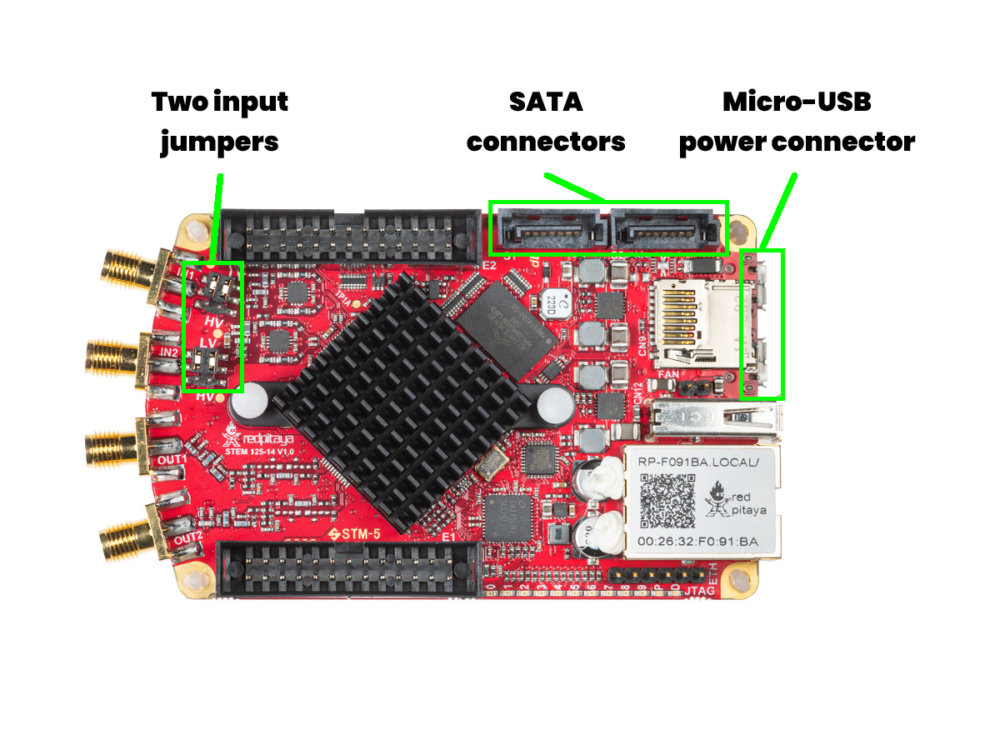
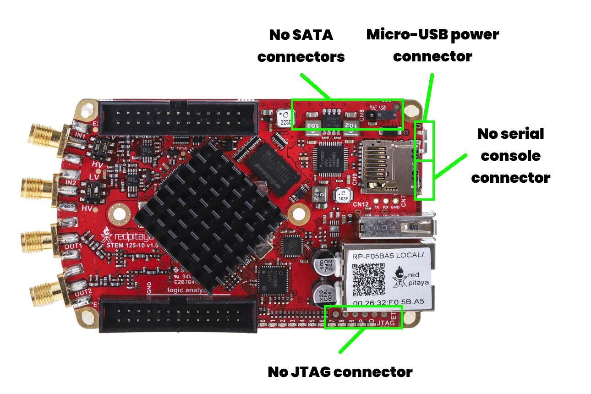
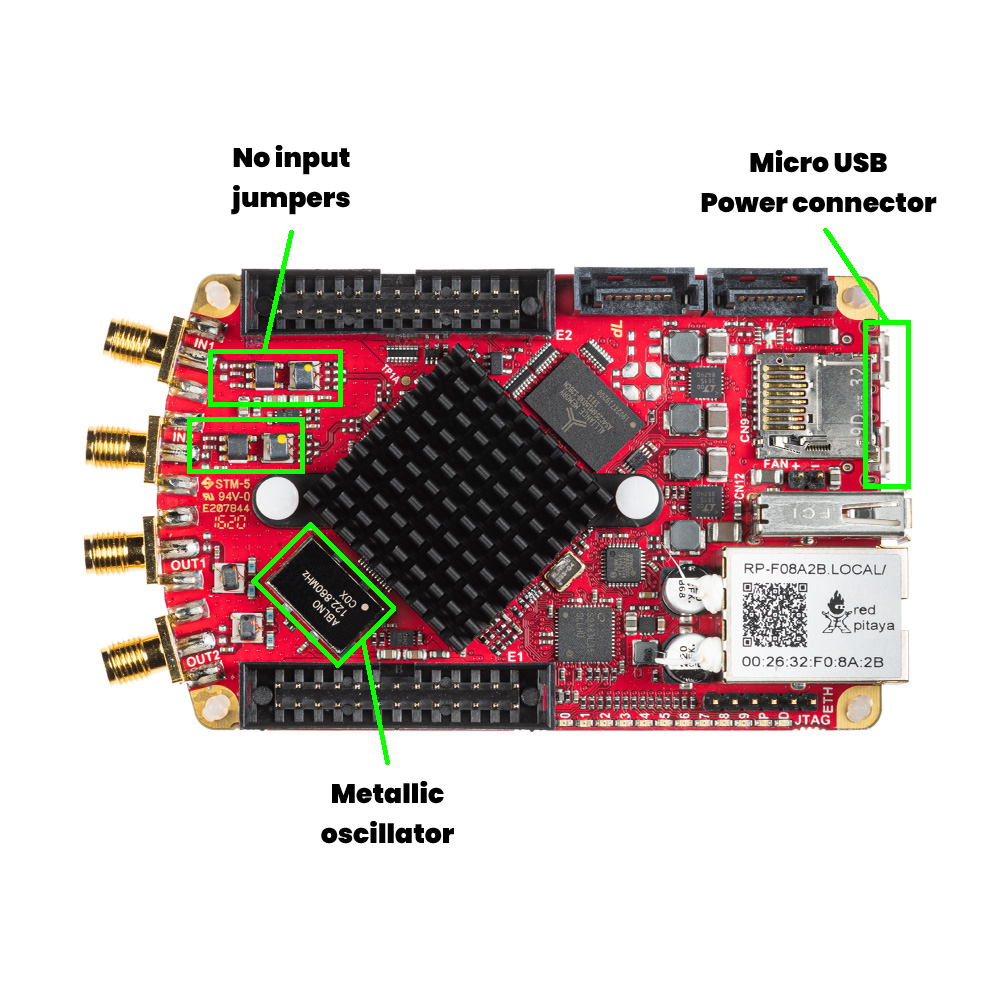
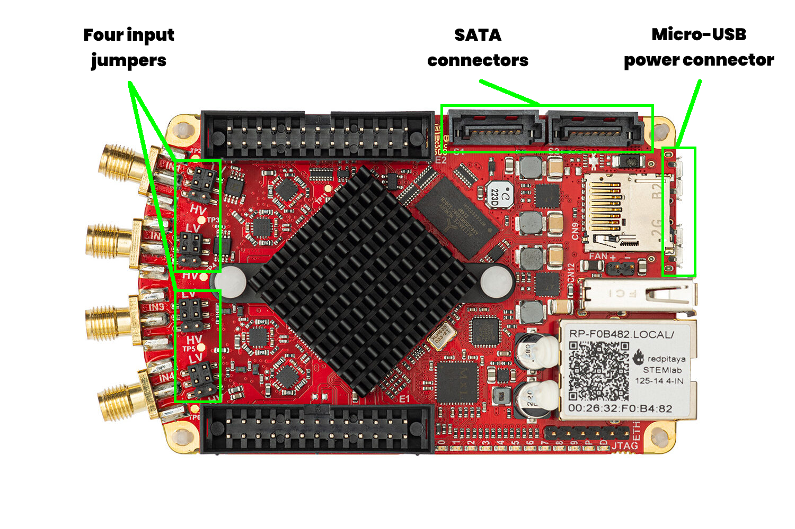
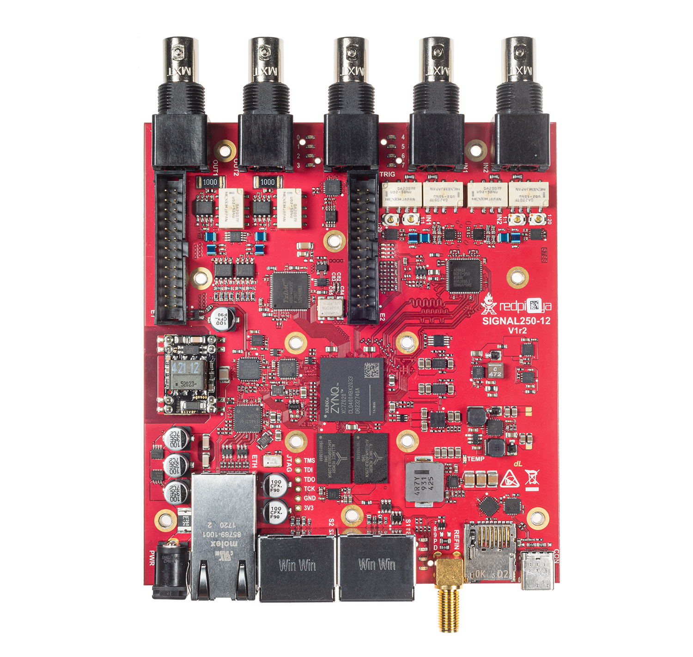
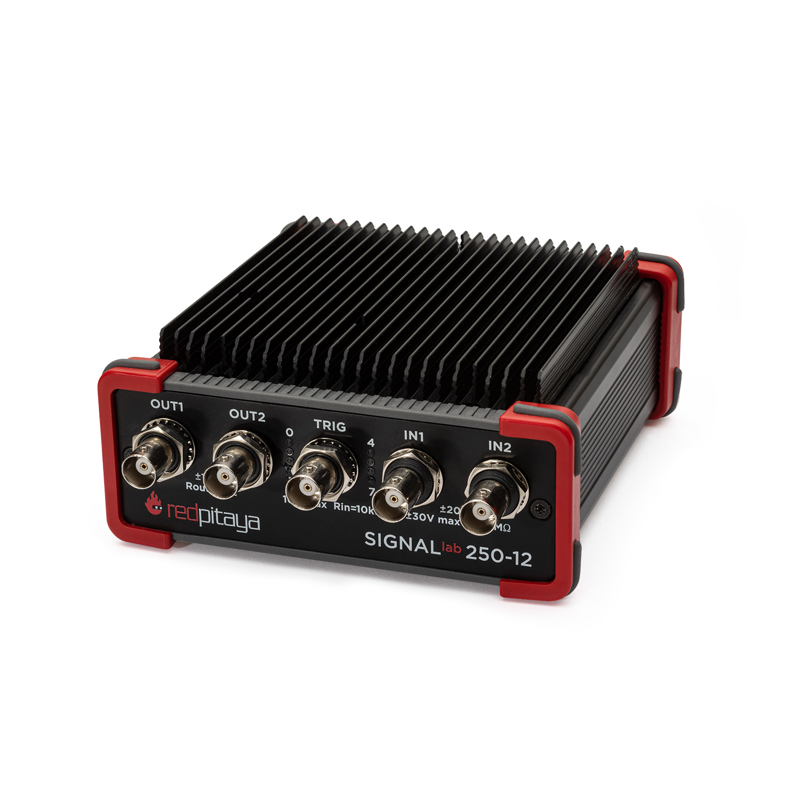

.. _ID_guide:

############################
识别板卡型号
############################

本指南将帮助你识别 Red Pitaya 板卡型号。无论是初次使用者还是经验丰富的开发者，了解板卡型号都是正确设置、配置和使用设备的基础。

.. contents:: 目录
    :local:
    :backlinks: top
    :depth: 2

|

Red Pitaya 板卡型号列表
=================================

Red Pitaya 提供多种板卡型号，每种型号都有各自的规格和特性。主要板卡型号分为两代：

**第二代板卡** （较新）：

    * STEMlab 125-14 Gen 2
    * STEMlab 125-14 PRO Gen 2
    * STEMlab 125-14 PRO Z7020 Gen 2
    * STEMlab 125-14 TI
    * STEMlab 65-16 TI

**初代板卡**：

    * STEMlab 125-14
    * STEMlab 125-10
    * SDRlab 122-16
    * SIGNALlab 250-12
    * STEMlab 125-14 4-Input

|

如何识别板卡型号
=================================

开始使用 Red Pitaya 板卡前，应先了解自己拥有的型号。识别板卡型号最简单的方法是查看板卡本身的物理特征和标签。

1.  **检查以太网接口上的贴纸：** 大多数 Red Pitaya 板卡的以太网端口上都有贴纸，标有板卡型号名称和 MAC 地址。

    .. figure:: img/Ethernet_sticker.png
        :width: 600
        :align: center

2.  **查找印在板卡上的型号名称：** 型号名称通常直接印在 PCB 中心附近或边缘位置。应同时检查 PCB 的正反两面。
    印刷的型号名称不一定与确切的商品名称完全一致，但通常包含 ``125-14``、``250-12`` 或 ``65-16`` 等关键标识，分别对应不同的 Red Pitaya 型号。

    .. figure:: img/Board_model_location.png
        :width: 600
        :align: center
        :alt: 板卡型号位置

3.  **外观对比：** 如果仍不确定，可以按照下面的外观对比指南，根据板卡布局和组件识别型号。

    不同板卡型号之间的主要外观差异包括：
    
        * 电源连接器类型
        * 是否配备外部连接器及其类型（例如 SMA、BNC）
        * 板卡尺寸
        * 是否配备跳线及跳线数量
        * 特定组件的位置和配置

    .. figure:: img/Visual_reference_guide.png
        :width: 800
        :align: center

|

外观识别指南
============================

某些板卡型号外观相似，因此本节提供详细指南帮助你加以区分。按照本指南操作后如果仍无法确定板卡型号，请联系 Red Pitaya 支持团队寻求帮助。

第二代板卡
-----------------

第二代 Red Pitaya 板卡采用更新的硬件，性能也有所提升。通过 USB-C 电源连接器可以轻松识别。以下列出各第二代板卡型号的外观识别特征。
主要对比基准型号为 **STEMlab 125-14 PRO Z7020 Gen 2**。

STEMlab 125-14 PRO Z7020 Gen 2
~~~~~~~~~~~~~~~~~~~~~~~~~~~~~~

* USB-C 电源和控制台连接器
* USB-C S1 和 S2 连接器
* E3 连接器
* 两颗 DDR 芯片均已装配

硬件文档请参阅 :ref:`STEMlab 125-14 PRO Z7020 Gen 2 硬件文档 <top_125_14_pro_z7020_gen2>`。

|

STEMlab 125-14 PRO Gen 2
~~~~~~~~~~~~~~~~~~~~~~~~~~

* USB-C 电源和控制台连接器
* USB-C S1 和 S2 连接器
* E3 连接器
* 仅装有一颗 DDR 芯片

硬件文档请参阅 :ref:`STEMlab 125-14 PRO Gen 2 硬件文档 <top_125_14_pro_gen2>`。

|

STEMlab 125-14 Gen 2
~~~~~~~~~~~~~~~~~~~~

* USB-C 电源和控制台连接器
* 无 USB-C S1 和 S2 连接器
* 无 E3 连接器
* 仅装有一颗 DDR 芯片

硬件文档请参阅 :ref:`STEMlab 125-14 Gen 2 硬件文档 <top_125_14_gen2>`。

|

STEMlab 125-14 TI
~~~~~~~~~~~~~~~~~~

* 大型散热器覆盖板卡的大部分区域
* USB-C 电源和控制台连接器
* 外观与 STEMlab 65-16 TI 板卡几乎无法区分，请检查以太网接口上的贴纸进行确认

硬件文档请参阅 :ref:`STEMlab 125-14 TI 硬件文档 <top_125_14_TI>`。

|

STEMlab 65-16 TI
~~~~~~~~~~~~~~~~~

.. figure:: img/ID_STEMlab_65-16_TI.png
    :width: 800
    :align: center

* 大型散热器覆盖板卡的大部分区域
* USB-C 电源和控制台连接器
* 外观与 STEMlab 125-14 TI 板卡几乎无法区分，请检查以太网接口上的贴纸进行确认

硬件文档请参阅 :ref:`STEMlab 65-16 TI 硬件文档 <top_65_16_TI>`。

|

初代板卡
---------------------

初代 Red Pitaya 板卡包含多种具有不同特性的型号，可以通过电源连接器和组件布局加以识别。
主要对比基准型号为 **STEMlab 125-14**。

STEMlab 125-14
~~~~~~~~~~~~~~~

* Micro USB 电源和控制台连接器
* USB-A 连接器
* SATA S1 和 S2 连接器
* 两个输入跳线

硬件文档请参阅 :ref:`STEMlab 125-14 硬件文档 <top_125_14>`。

STEMlab 125-14 还提供五种不同变体，仅凭外观极难区分：

    1. :ref:`STEMlab 125-14 <top_125_14>` — 标准版本
    2. :ref:`STEMlab 125-14 External Clock <top_125_14_EXT>`
    3. :ref:`STEMlab 125-14 Low Noise <top_125_14_LN>`
    4. :ref:`STEMlab 125-14 Z7020 Low Noise <top_125_14_Z7020_LN>`
    5. :ref:`STEMlab 125-14 LN Slave（X-channel 系统的一部分） <top_125_14_MULTI>`

建议检查以太网接口上的贴纸，以确认确切变体。通常板卡的 E1 连接器侧面也有一张贴纸。如果仍不确定，请联系 Red Pitaya 支持团队寻求帮助。

|

STEMlab 125-10
~~~~~~~~~~~~~~

* 仅有一个 Micro USB 电源连接器
* USB-A 连接器
* 无 SATA S1 和 S2 连接器
* 两个输入跳线

硬件文档请参阅 :ref:`STEMlab 125-10 硬件文档 <top_125_10>`。

|

SDRlab 122-16
~~~~~~~~~~~~~~~

* Micro USB 电源和控制台连接器
* USB-A 连接器
* SATA S1 和 S2 连接器
* 无输入跳线
* 板卡正面可见金属封装振荡器

硬件文档请参阅 :ref:`SDRlab 122-16 硬件文档 <top_122_16>`。

SDRlab 122-16 提供两种不同变体，仅凭外观极难区分：

    1. :ref:`标准版 SDRlab 122-16 <top_122_16>`
    2. :ref:`SDRlab 122-16 External Clock <top_122_16_EXT>`

建议检查以太网接口上的贴纸，以确认确切变体。如果仍不确定，请联系 Red Pitaya 支持团队寻求帮助。

|

STEMlab 125-14 4-Input
~~~~~~~~~~~~~~~~~~~~~~~~

* Micro USB 电源和控制台连接器
* USB-A 连接器
* SATA S1 和 S2 连接器
* 四个输入跳线

硬件文档请参阅 :ref:`STEMlab 125-14 4-Input 硬件文档 <top_125_14_4-IN>`。

|

SIGNALlab 250-12
~~~~~~~~~~~~~~~~~

|siglab_open| |siglab_enclosure|

* 板卡尺寸较大
* 输入/输出使用 BNC 连接器
* 配有外壳

硬件文档请参阅 :ref:`SIGNALlab 250-12 硬件文档 <top_250_12>`。

|
