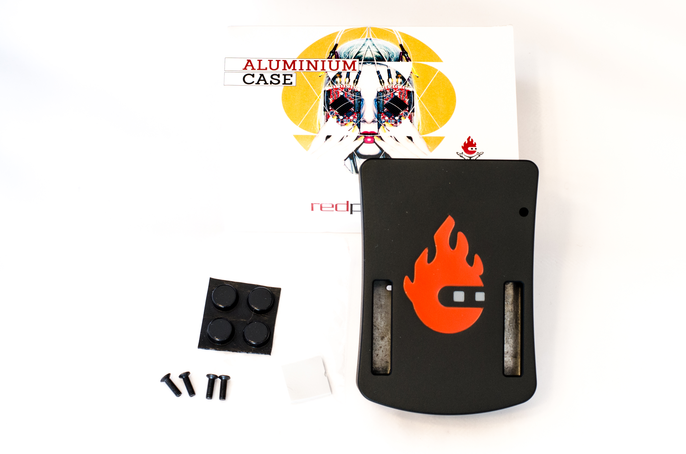
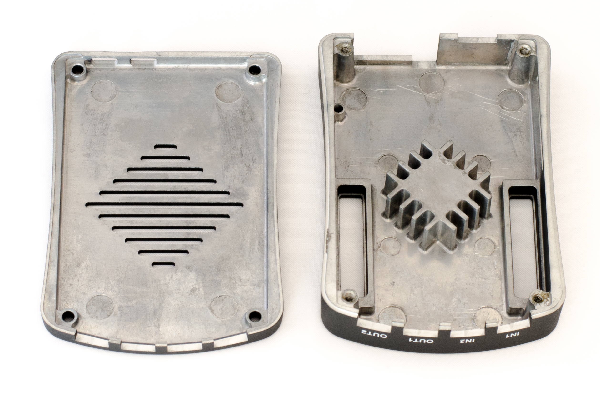
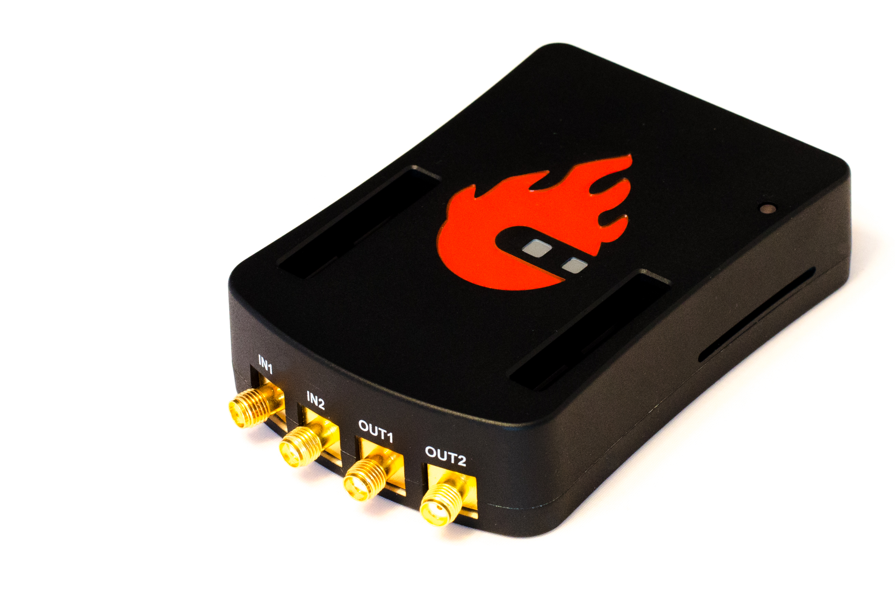
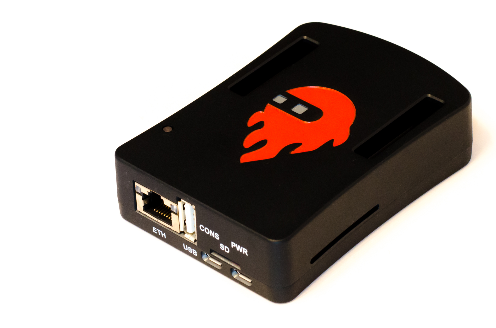
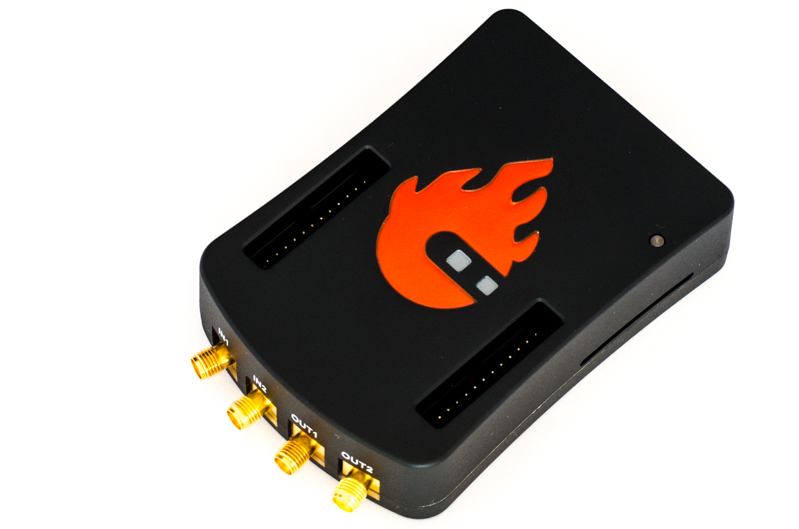

.. _alucase:

##################################
Red Pitaya 铝合金外壳组装
##################################

无论 Red Pitaya 铝合金外壳是随套件购买还是作为独立附件购买，都需要手动组装。

组件
============

    Red Pitaya 铝合金外壳的组件。
    
包装内容：

    * 4 颗用于闭合外壳并固定板卡的螺钉
    * 4 个橡胶脚垫，用于将外壳稳固放置在桌面上
    * 1 片导热垫（照片中几乎看不到）
    * 1 根透明塑料导光柱，用于将红色 LED（就绪/CPU 活动）的光引导至外壳顶部。

   Red Pitaya 铝合金外壳内部。
    
* 外壳上半部分内侧有一个将热量传导到外壳的凸台（上图右侧），因此整个外壳都可充当散热器。
* 外壳底部有若干通风开口（上图左侧）。
* 外壳开口露出扩展端口 :ref:`E1 <E1_orig_gen>` 和 :ref:`E2 <E2_orig_gen>` 的连接位置。

兼容性
==================

铝合金外壳兼容以下 Red Pitaya 板卡及其变体：

* STEMlab 125-14.
* SDRlab 122-16.
* STEMlab 125-14 4-Input.
* STEMlab 125-10.

|

组装说明
=======================

#. 使用小钳子按压顶部卡扣，同时向下推脚垫，拆下塑料小脚垫。
   
    .. figure:: img/rp_alucase_07.jpg
        :align: center
        :width: 600
      
        Red Pitaya 板卡底部的塑料脚垫。

#. 对带散热器的 STEMlab 125-14 重复类似操作：从底部夹紧卡扣，然后轻轻向上推动固定架。
   
#. STEMlab 125-10 的散热器粘在 FPGA 上。按下图所示轻轻转动散热器，直至其松脱。

    .. figure:: img/STEMlab_10_heatsink.png
        :align: center

    .. figure:: img/rp_alucase_08.jpg
        :align: center
        :width: 600
   
        拆下散热器后的 Red Pitaya 板卡顶部。

#. 清除剩余的导热材料。

#. 将导热垫贴到 CPU 上。

#. 将 Red Pitaya 板卡放入外壳下半部分。

#. 将外壳上半部分翻转，并把塑料导光柱放到位。

#. 用装有 Red Pitaya 板卡的外壳下半部分将其闭合。确保板卡与外壳上的孔位对齐。

#. 装回四颗螺钉。

#. 装回橡胶脚垫。

