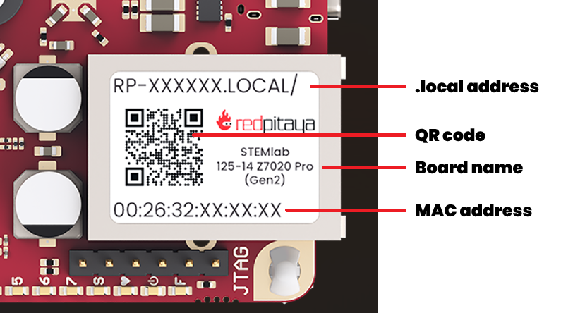
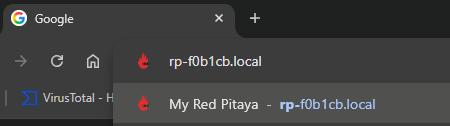
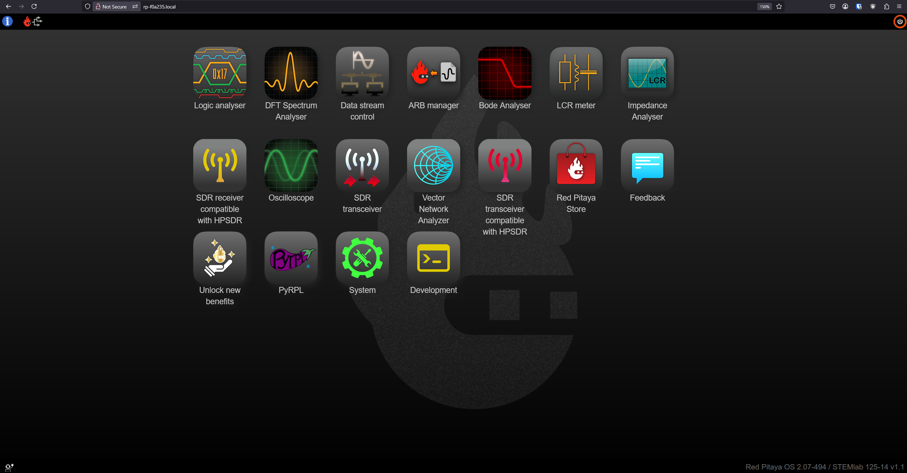

.. _quickstart_connect:

#####################
连接 Red Pitaya
#####################

本指南将通过几个简单步骤，帮助你连接 Red Pitaya 板卡并访问其 Web 界面。

.. contents:: 目录
    :local:
    :backlinks: top
    :depth: 2

|

***************************
识别板卡型号
***************************

在继续连接步骤之前，请参阅 :ref:`识别板卡型号指南 <ID_guide>`，确定你拥有的 Red Pitaya 板卡型号。

|

***********************
连接要求
***********************

连接 Red Pitaya 前，请确保具备以下物品：

* 安装了 Red Pitaya OS 的 **SD 卡** （参见 :ref:`准备 SD 卡指南 <prepareSD>`）
* **以太网线**
* **电源**：

    * 至少 5 V、3 A（第二代板卡）
    * 至少 5 V、2 A（大多数初代板卡型号）
    * 24 V、0.5 A（SIGNALlab 250-12）

* 启用了 DHCP 的 **路由器或网络交换机** （|wiki-dhcp|）
* 装有 Web 浏览器（Chrome、Firefox、Safari 或 Edge）的 **计算机**

.. note::

    **连接方式：**
    
    Red Pitaya 支持多种连接方式：
    
    * **局域网连接** （推荐，本指南介绍此方式）
    * 以太网线直连（PC 到 Red Pitaya）
    * Wi-Fi 连接
    
    其他连接方式请参阅 :ref:`网络管理器工具 <network_manager>` 章节。

***********************************
连接步骤（所有板卡型号）
***********************************

按照以下五个简单步骤连接 Red Pitaya：

1. 使用 |latestOS| **更新 SD 卡**。

#. 将 **SD 卡插入** Red Pitaya 板卡。

    .. figure:: img/125_sticker_2.png
        :width: 600
        :align: center

#. **连接网络** — 使用以太网线将 Red Pitaya 连接到路由器（或连接至路由器的网络插座）。

    .. figure:: img/125_router.png
        :width: 600
        :align: center
        
    *注意：SIGNALlab 250-12 请参见下图：*

    .. figure:: img/250_router.png
        :width: 600
        :align: center

#. 将 **电源连接** 到 Red Pitaya 板卡。

    .. warning::
    
        **仅适用于 QSPI eMMC 板用户：**
        
        如果连接了 QSPI eMMC 板，Red Pitaya **不会** 自动启动。接通电源后，必须按住 QSPI eMMC 板上的 **P-ON 按钮** 1 秒，以开启 Red Pitaya。
        
        更多信息请阅读 :ref:`QSPI eMMC 板章节 <QSPI_eMMC_board>`。

    **启动过程中的正常现象：**
    
    观察板卡上的 LED 亮灯顺序。正常顺序应如下所示：
    
    .. raw:: html

        

            <iframe src="https://www.youtube.com/embed/9xZCAkXAkw8" frameborder="0" allowfullscreen style="position: absolute; top: 0; left: 0; width: 100%; height: 100%;"></iframe>
        

    如果 LED 行为异常，请查看 :ref:`故障排除章节 <faq>`。

#. **打开 Web 浏览器** 并连接 Red Pitaya。

|

*************************************
查找 Red Pitaya 的 Web 地址
*************************************

有两种方式可访问 Red Pitaya：

方法 1：使用主机名（推荐）
===========================================

查看 Red Pitaya 的以太网接口，可以看到一张印有类似 **rp-xxxxxx** 代码的贴纸。

.. note:: 

    带外壳的板卡（如 SIGNALlab 250-12）会将贴纸贴在外壳底部。

在 Web 浏览器地址栏中输入该地址，并在末尾添加 ``.local/``：

.. code-block:: none

    rp-xxxxxx.local/

将 ``xxxxxx`` 替换为板卡贴纸上的六个字符。

    
在浏览器中输入地址的示例

|

方法 2：使用 IP 地址
===============================

如果主机名方式无效，可以按以下步骤查找 Red Pitaya 的 IP 地址：

1. 打开终端（macOS/Linux）或命令提示符（Windows）
2. 输入 ``arp -a`` 并按 Enter
3. 找到与 Red Pitaya 贴纸所示地址一致的 MAC 地址
4. 在浏览器中使用对应的 IP 地址

示例：

.. code-block:: none

    192.168.1.100

|

***************************
成功！已连接
***************************

完成上述步骤后，浏览器中应显示 Red Pitaya 主页面：

    Red Pitaya 主页面用户界面

**接下来做什么？**

下面是一段介绍如何使用 Red Pitaya Web 界面的简短视频教程：

.. raw:: html

    

        <iframe src="https://www.youtube.com/embed/I21xyTCiZ-8" frameborder="0" allowfullscreen style="position: absolute; top: 0; left: 0; width: 100%; height: 100%;"></iframe>
    

现在你可以：

* 探索内置应用程序（示波器、信号发生器、频谱分析仪等）
* 查看 :ref:`应用程序与功能 <appsFeatures>` 章节中的教程
* 如需了解其他连接方式（Wi-Fi、直连），请参阅 :ref:`网络管理器工具 <network_manager>` 章节

|

***************
故障排除
***************

如果连接遇到问题：

**无法访问 rp-xxxxxx.local：**

* 确认使用的是板卡贴纸上的正确 MAC 地址
* 尝试添加或去掉末尾斜杠：``rp-xxxxxx.local/`` 与 ``rp-xxxxxx.local``
* 确保计算机与 Red Pitaya 位于同一网络
* 改用方法 2（IP 地址）

**Red Pitaya 无法启动（LED 无反应）：**

* 检查电源（至少须为 5 V、2 A）
* 确认 SD 卡已正确插入
* 如果使用 QSPI eMMC 板，确认已经按下 P-ON 按钮

**LED 亮灯顺序异常：**

* 观看上方 :ref:`LED 启动顺序视频 <quickstart_connect>` 进行对比
* SD 卡可能已损坏，请尝试重新写入镜像

**获取更多帮助：**

查看完整的 :ref:`故障排除指南 <faq>`，或在 |redpitaya-forum| 上提问。

如需联系支持团队，请提供：

* **板卡型号** （例如 STEMlab 125-14 Gen 2、SIGNALlab 250-12）
* **板卡变体** （如有）：Low Noise、External Clock 等
* **OS 版本** （显示在 Web 界面右下角）
* 问题的 **详细说明**
* **已经尝试过的步骤**

.. substitutions

.. |latestOS| replace:: :ref:`最新版本 <prepareSD>`

.. _Wikipedia page with more information: https://en.wikipedia.org/wiki/Dynamic_Host_Configuration_Protocol

.. Note: Using global |redpitaya-forum| substitution instead of |forum|
