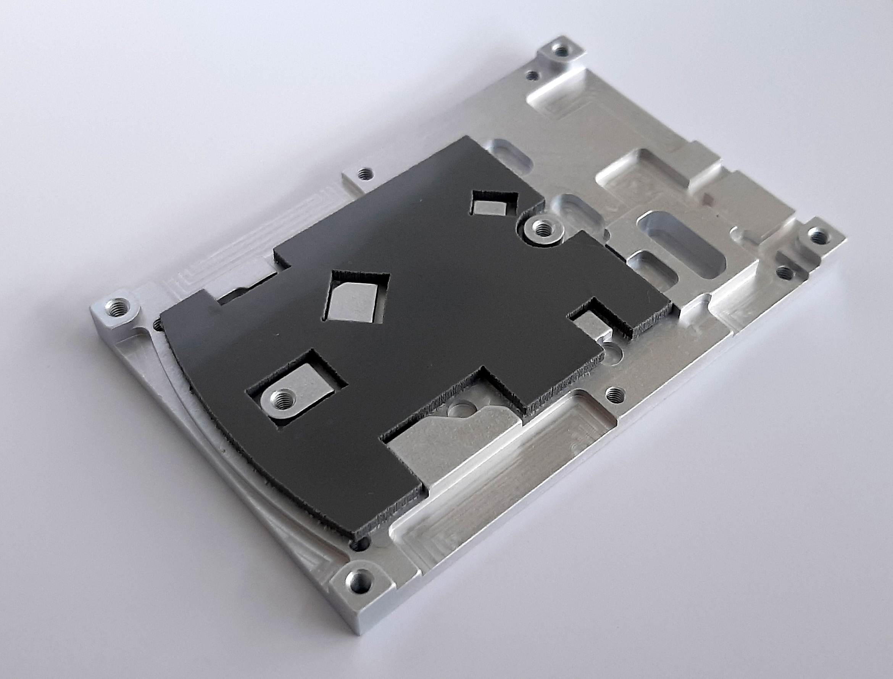
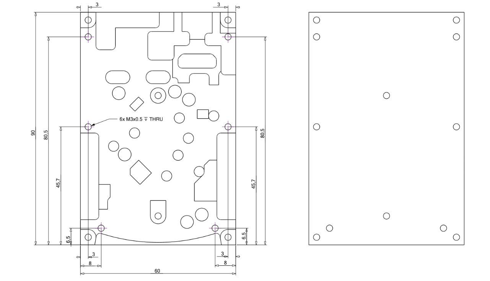

.. _heatsink:

####################################
Red Pitaya 散热器接口安装
####################################

散热器接口由铝材 CNC 加工而成，与 STEMlab 125-14 的外形相匹配。它安装在 STEMlab 125-14 底部，并带有额外孔位，可将固定在板卡上的接口连接到更大的散热器，以进一步改善散热效果。

散热器接口的优点：

    * 散热效果优于 STEMlab 125-14 的标准散热器（扩大 :ref:`工作温度范围 <board_operation_orig_gen>`）；
    * 安装简单；
    * 可配合任意外部散热器使用。

兼容性
===================

散热器接口兼容以下 Red Pitaya 型号：

    * STEMlab 125-14（也包括 Ext. Clk. 和 Low-Noise 版本）；
    * STEMlab 125-10.

.. note::

    请注意，STEMlab 125-14 4-Input 不兼容此散热器接口。

|

组件
============

    Red Pitaya 散热器接口组件
    
包装内容：

    * 散热器接口；
    * 深灰色导热垫。

不包含：

    * 4 颗 M3x0.5 螺钉，用于将 STEMlab 125-14 固定到散热器接口；
    * 6 颗 M3x0.5 螺钉，用于将散热器接口固定到外部散热表面；
    * 外部散热器。

散热器接口尺寸：

    散热器接口尺寸图

|

组装前准备
======================

开始安装前，请先考虑装有散热器接口的 Red Pitaya 将安装在何处。根据实际配置，可能需要额外准备，例如在用于固定组件的金属表面钻孔，或选择具有合适孔位的外部散热器。

如果拥有 Red Pitaya 铝合金外壳，可以将外壳上半部分与装有散热器接口的 Red Pitaya 连接。此时，连接散热器接口、Red Pitaya 板卡和铝合金外壳上半部分的四颗螺钉必须从下方安装，因此可能需要提前规划。若采用这种方式，请参阅文末的替代说明。

|

组装说明
======================

#. 使用小钳子按压顶部卡扣，同时向下推脚垫，拆下塑料小脚垫。
   
    .. figure:: img/rp_heatsink_remove_feet.jpg
        :align: center
        :width: 600
      
        Red Pitaya 板卡底部的塑料脚垫。

#. 对顶部散热器重复类似操作：从底部夹紧卡扣，然后轻轻向上推动支架。

    .. figure:: img/rp_heatsink_remove_heatsink.jpg
        :align: center
        :width: 600
   
        拆下散热器后的 Red Pitaya 板卡顶部。

#. 清除剩余的导热材料。
#. 将散热器接口放在面前。

    .. figure:: img/Heatsink_no_foam.png
        :align: center
        :width: 600

#. 取出深灰色导热垫。这是一种两面均带保护膜的专用导热垫。撕下朝向散热器接口一侧的保护膜，并将导热垫贴到散热器接口上。导热垫并不对称，请务必从正确的一面撕下保护膜。此时接口应如下图所示，导热垫顶面的保护膜仍保留在原位。

    .. figure:: img/Heatsink_thermal_foam.png
        :align: center
        :width: 600

#. 撕下导热垫顶面的保护膜。
#. 将 Red Pitaya 板卡底面朝下放入散热器接口。确保板卡与接口上的孔位对齐。

    .. figure:: img/Heatsink_stack.png
        :align: center
        :width: 600

    .. note::

        上图所示的外部散热器不包含在包装中，仅用于说明。散热器接口可以与任何具有平整表面、尺寸不小于 Red Pitaya 板卡的外部散热器配合使用。

    .. figure:: img/Heatsink_side_view2.jpg
        :align: center
        :width: 600

#. 安装四颗 M3 螺钉，将 Red Pitaya 与散热器接口连接。
#. 将整个组件翻转。

    .. figure:: img/Heatsink_side_view.jpg
        :align: center
        :width: 600

#. 安装外部散热器，并装入六颗 M3 螺钉，将散热器接口连接到外部散热器。

    .. figure:: img/Heatsink_bottom_view.jpg
        :align: center
        :width: 600
        
        使用散热器接口将 Red Pitaya 连接到外部散热器的示例。

    .. note::

        不同应用所需的外部散热器尺寸和形状各不相同，因此散热器接口不随附外部散热器。
        可以使用尺寸等于或大于 Red Pitaya 的任意外部散热器。散热器与散热器接口接触的一面应为平整表面。
        
        散热器接口也可以直接安装在容纳 Red Pitaya 的设备外壳上。在这种情况下，可以使用螺钉或导热胶将散热器接口固定到外壳。

.. warning::

    散热器接口的散热效果优于 STEMlab 125-14 的标准散热器。安装散热器接口时，需要拆下 Red Pitaya 顶部的散热器，并以散热器接口替代。
    未安装默认散热器或散热器接口时，请勿为板卡上电，否则可能造成温度过高，使板卡无法正常工作。
